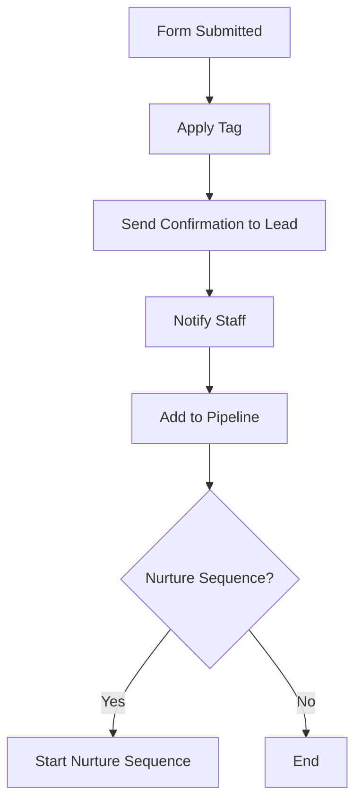
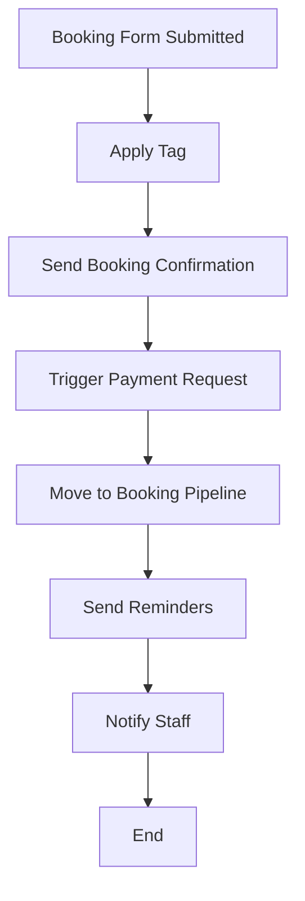
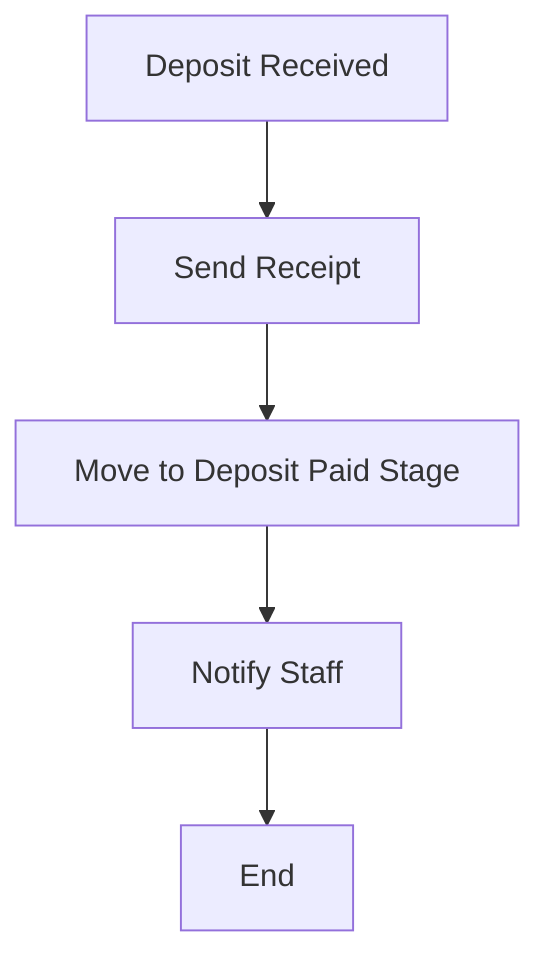

# GoHighLevel (GHL) Setup Guide for Beginners

This guide is designed to help you set up your GoHighLevel account from scratch, with detailed steps for forms, tags, custom fields, workflows, and pipelines. It is tailored for integrating custom website forms and automating your business processes.

---

## 1. Initial Account Setup

### a. Sign Up and Log In
- Visit [GoHighLevel](https://www.gohighlevel.com/) and create an account.
- Complete onboarding and verify your email if prompted.

### b. Set Up Your Business Profile
- Go to **Settings > Business Profile** in the sidebar.
- Enter your company info: name, address, phone, website, and time zone.
- Upload your logo and set branding colors if desired.

---

## 2. Add Users and Permissions
- Go to **Settings > My Staff**.
- Click **+ Add Employee** to invite team members.
- Assign roles (Admin, User, etc.) and set permissions as needed.

---

## 3. Configure Pipelines (Sales/Service Stages)

Effective pipeline management is crucial for visualizing and tracking client journeys, ensuring no lead is overlooked, and streamlining your operational workflow. Below are detailed pipeline structures tailored for Houston Mobile Notary Pros. These can be customized further to precisely match your evolving processes.

- **To Create/Edit:** In GHL, navigate to **Settings > Pipelines**. Click **+ Create New Pipeline** or select an existing one to modify.

### **A. Pipeline 1: Client Acquisition & Initial Contact**
   - **Pipeline Name:** `HMNP - Lead Engagement & Sales Funnel`
   - **Purpose:** This pipeline tracks all new inquiries and potential clients from their first contact through qualification and initial service discussion, or until they are determined not to be a fit.
   - **Stages:**
     1.  `New Inquiry Received` (Default entry for website contact forms, general call requests, direct emails, newsletter signups)
     2.  `Initial Contact Attempted` (System or staff has initiated first outreach - email sent, call logged)
     3.  `Needs Assessment & Qualification` (Communication established; gathering details about needs, timeframe, service type)
     4.  `Information / Quote Provided` (Client has received service details, pricing, or a specific quote)
     5.  `Follow-Up Scheduled` (If client isn't ready to book immediately, but is a viable lead)
     6.  `Ready for Booking / Transition to Service` (Lead confirmed interest and is ready to schedule/pay deposit - moves to Service Delivery Pipeline)
     7.  `Not a Fit / Opportunity Lost` (Lead unqualified, chose competitor, unresponsive after multiple attempts)
     8.  `Nurturing - Long Term` (Viable but not ready; moved to a long-term nurture sequence)

### **B. Pipeline 2: Service Booking & Delivery Management**
   - **Pipeline Name:** `HMNP - Service Booking & Execution`
   - **Purpose:** Manages the entire lifecycle of a confirmed service booking, from initial payment/confirmation through to service completion and post-service actions.
   - **Stages:**
     1.  `Booking Request Received` (Entry from website booking form, direct booking via API, or manual entry by staff)
     2.  `Awaiting Deposit Payment` (If a deposit is required and payment link has been sent)
     3.  `Deposit Paid / Booking Confirmed` (Deposit received, or full payment made if no deposit stage)
     4.  `Service Scheduled & Assigned` (Appointment locked in calendar, notary/staff assigned)
     5.  `Pre-Service Reminders Sent` (Automated email/SMS reminders have been dispatched)
     6.  `Day of Service / In Progress` (Optional: For tracking active appointments on the day)
     7.  `Service Completed Successfully`
     8.  `Feedback Request Sent` (Automated email/SMS for review/testimonial dispatched)
     9.  `Payment Finalized / Closed` (Full payment confirmed, all post-service actions complete)
     10. `Archived - Issue / Refund` (If service had issues leading to refund or special handling)

### **C. Pipeline 3: Client Support & Issue Resolution**
   - **Pipeline Name:** `HMNP - Client Support Tickets`
   - **Purpose:** Tracks and manages all client support requests, ensuring timely and effective resolution.
   - **Stages:**
     1.  `New Support Ticket Submitted` (Entry from website support form, email to support@, or manual staff entry)
     2.  `Ticket Acknowledged & Queued` (Automated confirmation sent to client, ticket in internal queue)
     3.  `Assigned to Support Staff`
     4.  `Investigation in Progress` (Staff actively working on the issue)
     5.  `Awaiting Client Response` (Staff has requested further information from the client)
     6.  `Resolution Proposed / Action Taken`
     7.  `Client Confirmed Resolution` (Or staff confirms based on outcome)
     8.  `Ticket Resolved & Closed`

### **D. Pipeline 4: Event & Webinar Registrations**
   - **Pipeline Name:** `HMNP - Event Registrations - [Specific Event Name]` (e.g., `HMNP - Event Registrations - Notary Basics Webinar June 2024`)
   - **Purpose:** Tracks registrations and engagement for specific events or webinars hosted by HMNP.
   - **Stages:**
     1.  `New Registration Received` (Entry from event registration form)
     2.  `Registration Confirmed & Info Sent` (Automated confirmation with event details, calendar invite)
     3.  `Pre-Event Reminder 1 Sent` (e.g., 1 week before)
     4.  `Pre-Event Reminder 2 Sent` (e.g., 1 day before)
     5.  `Pre-Event Reminder 3 Sent` (e.g., 1 hour before)
     6.  `Attended Event` (To be updated manually or via integration if possible post-event)
     7.  `Did Not Attend`
     8.  `Post-Event Follow-Up Sent` (Thank you, recording link, survey, etc.)

- **Save each pipeline** after defining its name and stages.
- Remember to configure your GHL Workflows (Section 6) to automatically move contacts/opportunities through these pipeline stages based on triggers and actions, ensuring a seamless and automated client journey where possible.

---

## 4. Forms Setup & Integration with GHL

Effective form integration is key to capturing leads and client data directly into GoHighLevel from your custom-built Houston Mobile Notary Pros website. Due to the detailed nature of setting up and integrating your various `.tsx` form components with GHL via API, a dedicated guide has been created.

Please refer to the [**GHL Forms Setup Guide (GHL_FORMS_SETUP_GUIDE.md)**](./GHL_FORMS_SETUP_GUIDE.md) for a comprehensive overview of:
-   Key custom website forms and their purposes.
-   The API-driven strategy for integrating these forms.
-   Best practices for field mapping, tagging, automation, testing, and compliance related to forms.
-   Guidance on tracking lead sources through form submissions.

Ensure you review that document thoroughly to understand how your website forms will populate data into GHL.

---

> **Tip:** You can have multiple pipelines for different services or workflows.

---

## 5. Calendars & Services Setup

### **A. Recommended Calendars Structure**
Set up a calendar for each major service type with distinct duration, price, or staff. This keeps booking simple and clear for clients.

| Calendar Name                       | Duration | Use For                                    | Client-Friendly Name Suggestion         |
|-------------------------------------|----------|---------------------------------------------|----------------------------------------|
| Essential Notary (Single Signer)    | 30 min   | Standard/basic notary service, 1 signer     | Essential Notary Appointment           |
| Essential Notary (Two Signers)      | 30 min   | Standard notary, 2 signers                  | Notary – Two Signers                   |
| Priority/Rush Notary                | 60 min   | Rush/priority bookings                      | Priority Notary Service                |
| Loan Signing Appointment            | 90 min   | Loan signings, more complex appointments    | Loan Signing Service                   |

- **Rename calendars** to be clear and client-friendly (see suggestions above).
- Archive or merge any redundant or unclear calendars (e.g., generic ones like "Houston Mobile Notary Pros Services").
- Add new calendars only for new, distinct services.

### **B. Payment & Deposits**
- **Stripe Integration:**
  - Connect Stripe in GHL under **Settings > Integrations**.
  - Enable payments for each calendar.
  - Set a required deposit of $25 for all services (configure in the calendar payment settings).
  - Clearly state deposit and refund policy in booking form and confirmation emails.

### **C. Best Practices for Calendars**
- Each calendar should map to a unique service type, not every minor variation.
- Use clear, descriptive names so clients know exactly what they’re booking.
- If you have different staff or locations, consider separate calendars as needed.
- Keep the booking process simple: less is more for conversions.

### **D. SOP Alignment**
- Review your service names and descriptions in both GHL and your [Standard Operating Procedures (sop.md)](sop.md) file to ensure consistency and clarity for both staff and clients.
- Update SOPs as you refine your service offerings and calendar structure.

---

## 6. Recommended Workflows & Automations

Set up these workflows in GHL to automate client communications, lead management, compliance, and payment flows. Each workflow can be started from scratch or built using GHL templates.

### **A. New Lead/Contact Workflow**
- **Trigger:** Contact submits Contact Form, Newsletter Signup, or Request a Call
- **Actions:**
  - Send confirmation email/SMS to lead
  - Notify staff by email/SMS
  - Apply relevant tags (e.g., Website Lead, Newsletter Signup)
  - Add to pipeline (e.g., New Lead stage)
  - Start nurture sequence (optional)

### **B. Booking/Appointment Workflow**
- **Trigger:** Contact submits Booking Form or appointment is created via API
- **Actions:**
  - Send booking confirmation with calendar details and deposit info
  - Apply tag (e.g., Booking Lead)
  - Move to Booking pipeline stage
  - Trigger payment request (if not already paid)
  - Send reminder(s) before appointment (SMS/email)
  - Notify staff/assigned notary
  - If deposit not received in X hours, send follow-up

### **C. Payment/Deposit Workflow**
- **Trigger:** Payment or deposit received (via Stripe integration)
- **Actions:**
  - Send payment confirmation/receipt
  - Move opportunity to "Deposit Paid" stage
  - Notify staff

### **D. No-Show/Reschedule/Cancellation Workflow**
- **Trigger:** Client cancels or requests reschedule, or is marked as no-show
- **Actions:**
  - Send reschedule/cancellation confirmation
  - Offer to rebook
  - Move to appropriate pipeline stage
  - Notify staff

### **E. Feedback/Testimonial Workflow**
- **Trigger:** Appointment marked completed or X days after service
- **Actions:**
  - Send feedback/testimonial request
  - Apply tag (e.g., Requested Feedback)
  - If feedback received, apply tag (e.g., Testimonial Submitted)

### **F. Lead Nurture/Newsletter Workflow**
- **Trigger:** Newsletter Signup or lead with no booking after X days
- **Actions:**
  - Add to nurture email/SMS sequence
  - Send periodic value-driven content
  - Promote services or offer discounts

### **G. Compliance & Consent Workflow**
- **Trigger:** Form submitted with consent fields (Terms Accepted, SMS Consent)
- **Actions:**
  - Store consent in custom field
  - Apply compliance tags
  - Send compliance confirmation (optional)

### **H. Referral Workflow**
- **Trigger:** Referral Form submitted
- **Actions:**
  - Thank/referral confirmation to referrer
  - Notify staff
  - Apply tag (Referral)
  - Add referred contact to pipeline

### **I. Support/Trouble Ticket Workflow**
- **Trigger:** Support/Trouble Ticket Form submitted
- **Actions:**
  - Send ticket confirmation to client
  - Notify support staff
  - Apply tag (Support Request)

> **Tips:**
> - Use tags and pipeline stages to track workflow progress.
> - Test each workflow with a real submission before going live.
> - Review and optimize automations regularly as your business grows.

---

## 7. Workflow Builder: Diagrams, Instructions & Recipes

### **A. Sample Workflow Diagrams**

#### **1. New Lead/Contact Workflow**

#### **2. Booking/Appointment Workflow**

#### **3. Payment/Deposit Workflow**

---

### **B. Step-by-Step: Building a Workflow in GHL**

1. **Go to Automation > Workflows** in GHL.
2. Click **+ Create Workflow**.
3. Choose **Start from Scratch** or select a template.
4. **Add a Trigger:**
   - Click **+ Add Trigger**.
   - Select the trigger event (e.g., Form Submitted, Tag Added, Appointment Booked, Payment Received).
   - Configure trigger details (select the specific form/tag/calendar).
5. **Add Actions:**
   - Click **+ Add Action** after the trigger.
   - Choose from actions like Send Email, Send SMS, Add Tag, Move to Pipeline, Notify User, Wait, If/Else, etc.
   - Configure each action (e.g., write message, select recipients, set delays).
   - Chain multiple actions as needed (drag to reorder).
6. **Add Conditions (Optional):**
   - Use **If/Else** branches to add logic (e.g., If Deposit Paid, If Tag Exists).
7. **Save and Name Your Workflow.**
8. **Test:**
   - Submit a test form or trigger event.
   - Check contact record, pipeline, and notifications.
9. **Activate the Workflow** when ready.

---

### **C. Automation Recipes for Common Scenarios**

#### **1. Abandoned Booking Follow-Up**
- **Trigger:** Booking form started but not completed (or deposit not received in 24 hours)
- **Actions:**
  - Send reminder email/SMS to client
  - Apply "Abandoned Booking" tag
  - Notify staff for manual follow-up

#### **2. Deposit Payment Confirmation**
- **Trigger:** Stripe payment received
- **Actions:**
  - Send payment confirmation/receipt
  - Move to "Deposit Paid" stage in pipeline
  - Remove "Awaiting Deposit" tag

#### **3. Feedback/Testimonial Request**
- **Trigger:** Appointment marked completed or 2 days after service
- **Actions:**
  - Send feedback/testimonial request email/SMS
  - Apply "Feedback Requested" tag

#### **4. Lead Nurture Sequence**
- **Trigger:** Newsletter signup or new lead with no booking after 7 days
- **Actions:**
  - Add to nurture email/SMS sequence
  - Send periodic educational content and offers

#### **5. Referral Thank You**
- **Trigger:** Referral form submitted
- **Actions:**
  - Send thank you email to referrer
  - Apply "Referral" tag
  - Notify staff

> **Tip:** Use GHL’s Workflow Builder drag-and-drop interface to visually map out these automations. Test each workflow with your own contact before going live.

---

## 8. Messaging Copy for Clients & Staff

Below are sample messages for use in your GHL workflows. These are written in the calm, reassuring, and professional tone established in your marketing strategy guide.

### **A. Client-Facing Messages**

**1. New Lead/Contact Confirmation**
> Thank you for reaching out to Houston Mobile Notary Pros. We don’t believe something this important should ever feel rushed or confusing. One of our team members will be in touch shortly to calmly guide you through the next steps.

**2. Booking Confirmation**
> Your appointment is confirmed. We protect your peace of mind from careless signings and vague instructions. Expect a reminder before your scheduled time, and please let us know if you have any questions or special requests.

**3. Deposit Payment Request**
> To secure your appointment, a $25 deposit is required. We’ll never surprise you with hidden fees, and your deposit is fully refundable according to our policy. If you have questions, we’re here to help.

**4. Deposit Payment Confirmation**
> We’ve received your deposit and your booking is secured. Thank you for trusting us with your important documents.

**5. Appointment Reminder**
> This is a friendly reminder of your upcoming appointment with Houston Mobile Notary Pros. We’re committed to making your experience calm and clear. If you need to reschedule, just let us know.

**6. Feedback/Testimonial Request**
> Thank you for choosing us. If you have a moment, we’d love to hear about your experience. Your feedback helps us continue to be calm in critical moments for our clients.

**7. Reschedule/Cancellation Confirmation**
> Your request has been received. We’re here to make this process as smooth as possible. If you need any further assistance, please reach out anytime.

**8. Abandoned Booking Follow-Up**
> We noticed you started booking an appointment but didn’t finish. If you have questions or need help, we’re here to calmly guide you through every step.

### **B. Staff/Assigned User Messages**

**1. New Lead Notification**
> New lead received: [Client Name], [Service Requested]. Please reach out promptly and reinforce our calm, professional approach.

**2. Booking Notification**
> New booking: [Client Name], [Service], [Date/Time]. Review the client’s notes and prepare to deliver a peaceful, organized experience.

**3. Deposit Received Notification**
> Deposit received for [Client Name]. Appointment is secured. Please confirm with the client and prepare for a smooth signing.

**4. Support Ticket/Referral Notification**
> New support request or referral: [Client Name]. Respond promptly and uphold our commitment to clarity and care.

---

## 4. Create Custom Fields (with Folders/Groups)

Custom fields are essential for capturing all specific information Houston Mobile Notary Pros needs beyond the standard GHL contact fields (like First Name, Last Name, Email, Phone). A well-organized custom field structure ensures data integrity, facilitates targeted marketing, and enables detailed reporting.

- **To Create/Edit:** In GHL, navigate to **Settings > Custom Fields**. Click **+ Add Field** to create a new custom field.
- **Naming Convention Recommendation:** For clarity and to avoid conflicts with future GHL standard fields, use a prefix like `cf_` followed by a descriptive name (e.g., `cf_service_address`).
- **Group/Folder Organization:** Grouping custom fields into folders within GHL (e.g., "Booking Details," "Compliance Records") is highly recommended for easier management.

### **A. Comprehensive Custom Field Master List**

This list details the GHL custom fields to be **created new** in your GoHighLevel account. For a clean and accurate setup aligned with your codebase and automation, create each field exactly as specified below. Pay close attention to:
- **GHL Custom Field Name:** This will be the unique key for the field (e.g., `cf_contact_inquiry_subject`). Use this exact name.
- **GHL Field Type:** Select the precise field type in GHL as indicated.
- **GHL Group/Folder:** Create these folders in your GHL custom field settings (for Contact objects) and assign each new field to its respective folder.
- **Dropdown Options:** For 'Dropdown (Single)' fields, define the suggested options within GHL when creating the field.
- **Checkbox Fields:** GHL 'Checkbox' type fields represent a single true/false state. 
  - You do not define 'Yes' and 'No' as separate choices like radio buttons. 
  - If GHL prompts for an **'Option Name'** when creating a checkbox field, this refers to the **label text that will appear next to the checkbox itself** (e.g., on GHL forms or when viewing the field on a contact record). 
  - For this 'Option Name' (label), use a concise, affirmative statement derived from the 'Your Form Field / Data Point' column in the table below (e.g., for `cf_consent_terms_conditions`, the Option Name/Label could be "I accept the General Terms & Conditions").
  - A checked box implies a 'true' or 'yes' value is captured (as noted in the 'Purpose/Notes' column), and your web app should send this value to GHL.

This list is designed to capture data from your website forms (Contact, Booking, Lead/Newsletter, Feedback, Support, Referral, Document Upload, Event Registration, Payment) and support your operational processes.

| Your Form Field / Data Point             | GHL Custom Field Name             | GHL Field Type        | GHL Group/Folder      | Purpose/Notes                                                                    |
|------------------------------------------|-----------------------------------|----------------|-----------------------|----------------------------------------------------------------------------------|
| **General Contact & Lead Information**   |                                   |                |                       |                                                                                  |
| Subject (Contact Form)                   | `cf_contact_inquiry_subject`      | Single Line Text      | Contact - Inquiry     | Subject line from general contact form submissions.                              |
| Message/Details (Contact Form)           | `cf_contact_inquiry_message`      | Multi-Line Text     | Contact - Inquiry     | Detailed message from general contact form.                                      |
| Preferred Call Time                      | `cf_preferred_call_time`          | Single Line Text      | Contact - Preferences | Client's stated preferred time for a callback.                                   |
| Call Request Reason/Notes                | `cf_call_request_notes`           | Multi-Line Text     | Contact - Preferences | Specific reason or notes provided when requesting a call.                        |
| Service of Interest (Lead/General)       | `cf_service_interest_general`     | Dropdown (Single)   | Lead Details          | Initial service interest indicated on a lead form or general inquiry. **Suggested Options:** "Essential Notary Services", "Loan Signing - Purchase", "Loan Signing - Refinance", "Loan Signing - Seller", "Loan Signing - HELOC", "Apostille Services", "I-9 Verification", "Other/Unsure". |
| How Did You Hear About Us?               | `cf_referral_source_description`  | Multi-Line Text     | Marketing             | Open text field for clients to describe their referral source.                   |
| **Booking & Appointment Specifics**      |                                   |                |                       |                                                                                  |
| Service Type (Selected for Booking)      | `cf_booking_service_type`         | Dropdown (Single)   | Booking - Details     | Specific service booked. **Suggested Options:** "Essential Notary Services", "Loan Signing - Purchase", "Loan Signing - Refinance", "Loan Signing - Seller", "Loan Signing - HELOC", "Apostille Services", "I-9 Verification", "Other". (Ensure this list aligns with your actual service offerings). |
| Appointment Date & Time                  | `cf_booking_appointment_datetime` | Date & Time Picker  | Booking - Details     | Confirmed date and time for the service.                                         |
| Number of Signers                        | `cf_booking_number_of_signers`    | Number (Integer)    | Booking - Details     | Number of individuals whose signatures will be notarized.                        |
| Full Address for Mobile Service          | `cf_booking_service_address`      | Multi-Line Text     | Booking - Details     | Complete street address, city, state, ZIP for mobile notary appointments.        |
| Specific Location Details (Gate Code, etc.)| `cf_booking_location_details`     | Single Line Text    | Booking - Details     | E.g., Gate code, suite number, specific instructions for finding the location.   |
| Special Instructions for Notary          | `cf_booking_special_instructions` | Multi-Line Text     | Booking - Details     | Any other specific requests or information for the assigned notary.            |
| **Feedback & Testimonial Form**        |                                   |                |                       |                                                                                  |
| Overall Service Rating (e.g., 1-5 Stars) | `cf_feedback_service_rating`      | Number (Integer)    | Feedback & Reviews    | Numerical rating provided by the client (e.g., 1, 2, 3, 4, 5).                   |
| Testimonial/Comments                     | `cf_feedback_testimonial_text`    | Multi-Line Text     | Feedback & Reviews    | Client's detailed feedback or testimonial statement.                             |
| Consent to Display Testimonial           | `cf_feedback_consent_display`     | Checkbox       | Compliance - Consent  | Client explicitly agrees (checkbox = Yes/True) that their testimonial can be used publicly. |
| **Support Ticket Information**           |                                   |                |                       |                                                                                  |
| Support Issue Category                   | `cf_support_issue_category`       | Dropdown (Single)   | Support Tickets       | Type of issue. **Suggested Options:** "Booking/Scheduling Issue", "Payment/Billing Question", "Technical Problem (Website/Portal)", "Service Question/Clarification", "Feedback/Complaint", "Document Upload Issue", "Other". |
| Detailed Description of Issue            | `cf_support_issue_description`    | Multi-Line Text     | Support Tickets       | Full description of the problem or query from the client.                        |
| Urgency Level (Client Indicated)         | `cf_support_client_urgency`       | Dropdown (Single)   | Support Tickets       | How urgent the client perceives the issue. **Suggested Options:** "Low - General Inquiry", "Medium - Needs Attention Soon", "High - Urgent/Service Impacted". |
| File Upload for Support (Optional)       | `cf_support_attached_file`        | File Upload    | Support Tickets       | Document/screenshot uploaded by client to illustrate the issue.                  |
| **Client Referral Program**              |                                   |                |                       |                                                                                  |
| Referrer's Full Name                     | `cf_referrer_full_name`           | Single Line Text    | Referrals             | Full name of the person who made the referral.                                   |
| Referrer's Email or Phone                | `cf_referrer_contact_info`        | Single Line Text    | Referrals             | Contact details of the referrer for acknowledgment or reward (can be Email or Phone). |
| Referred Person's Full Name              | `cf_referred_person_full_name`    | Single Line Text    | Referrals             | Full name of the individual being referred.                                      |
| Referred Person's Email or Phone         | `cf_referred_person_contact_info` | Single Line Text    | Referrals             | Contact details of the person who was referred (can be Email or Phone).          |
| Notes/Context for Referral               | `cf_referral_additional_notes`    | Multi-Line Text     | Referrals             | Any additional information or context provided with the referral.                |
| Referrer Confirmed Consent from Referred | `cf_referrer_consent_from_referred`| Checkbox       | Compliance - Consent  | Referrer confirms (checkbox = Yes/True) they have permission to share referred person's details. |
| **Secure Document Upload**               |                                   |                |                       |                                                                                  |
| Type of Document Being Uploaded          | `cf_docupload_document_type`      | Dropdown (Single)   | Documents - Uploads   | Description of the document. **Suggested Options:** "Valid Photo ID (Driver's License)", "Valid Photo ID (Passport)", "Signed Contract/Agreement", "Loan Document Package", "Business Document (e.g., Articles of Inc)", "Personal Legal Document (e.g., Will, POA)", "Other". |
| Uploaded Document File                   | `cf_docupload_file_secure`        | File Upload    | Documents - Uploads   | The actual file uploaded by the client.                                          |
| Consent for Document Handling            | `cf_docupload_handling_consent`   | Checkbox       | Compliance - Consent  | Client acknowledges (checkbox = Yes/True) terms for uploading and HMNP handling the document. |
| **Event & Webinar Registrations**        |                                   |                |                       |                                                                                  |
| Registered Event Name/ID                 | `cf_event_registered_name_id`     | Single Line Text    | Events                | Identifier for the specific event or webinar.                                    |
| Number of Attendees                      | `cf_event_attendee_count`         | Number (Integer)    | Events                | How many individuals are covered by this registration.                           |
| Dietary Restrictions/Special Needs       | `cf_event_special_needs`          | Multi-Line Text     | Events                | Any dietary or accessibility needs for event attendees.                          |
| Consent for Event Communications         | `cf_event_communications_consent` | Checkbox       | Compliance - Consent  | Consent (checkbox = Yes/True) to receive emails specifically about the registered event. |
| **Payment & Billing Information**        |                                   |                |                       |                                                                                  |
| Invoice Number Being Paid                | `cf_payment_invoice_number`       | Single Line Text    | Billing - Payments    | Specific invoice number this payment applies to.                                 |
| Service Description for Payment          | `cf_payment_service_description`  | Single Line Text    | Billing - Payments    | Brief description of the service the payment is for.                             |
| Payment Amount                           | `cf_payment_amount_paid`          | Monetary          | Billing - Payments    | The monetary amount paid.                                                        |
| Billing Address (Street, City, State, Zip, Country) | Multiple (See Notes) | Single Line Text (for each component) | Billing - Payments    | **Create 5 separate 'Single Line Text' fields for the billing address components, all in the 'Billing - Payments' group:**   1. **Street Address:** Field Name: `Billing Street`, Key: `cf_billing_address_street`   2. **City:** Field Name: `Billing City`, Key: `cf_billing_address_city`   3. **State/Province:** Field Name: `Billing State/Province`, Key: `cf_billing_address_state`   4. **ZIP/Postal Code:** Field Name: `Billing ZIP Code`, Key: `cf_billing_address_zip`   5. **Country:** Field Name: `Billing Country`, Key: `cf_billing_address_country`   Assign placeholder text as appropriate for each (e.g., 'Street address and P.O. box' for Street). |
| Consent to Payment & Refund Policy       | `cf_payment_terms_agree_policy`   | Checkbox       | Compliance - Consent  | Client confirms (checkbox = Yes/True) they have read and agreed to payment/refund policies. |
| **Marketing & Compliance (General)**     |                                   |                |                       |                                                                                  |
| General Terms & Conditions Accepted      | `cf_consent_terms_conditions`     | Checkbox       | Compliance - Consent  | General website/service T&Cs acceptance (checkbox = Yes/True).                   |
| SMS Communications Opt-In                | `cf_consent_sms_communications`   | Checkbox       | Compliance - Consent  | Explicit opt-in (checkbox = Yes/True) for SMS messages. Differentiate Marketing vs. Transactional use via tags/workflows. |
| Email Marketing Opt-In                   | `cf_consent_email_marketing`      | Checkbox       | Compliance - Consent  | Explicit opt-in (checkbox = Yes/True) for receiving marketing emails.            |
| UTM Source                               | `cf_utm_source`                   | Single Line Text    | Marketing - Tracking  | Marketing campaign source (e.g., google, facebook, newsletter).                  |
| UTM Medium                               | `cf_utm_medium`                   | Single Line Text    | Marketing - Tracking  | Marketing campaign medium (e.g., cpc, email, social_post).                       |
| UTM Campaign                             | `cf_utm_campaign`                 | Single Line Text    | Marketing - Tracking  | Specific marketing campaign name.                                                |
| UTM Term                                 | `cf_utm_term`                     | Single Line Text    | Marketing - Tracking  | Keywords used for paid search campaigns.                                         |
| UTM Content                              | `cf_utm_content`                  | Single Line Text    | Marketing - Tracking  | Ad content variation or specific link that drove the lead.                       |

*Standard GHL Fields:* Remember that GHL has built-in standard fields for First Name, Last Name, Email, Phone, Company Name, Address (a standard address block), Date of Birth, Website, etc. Utilize these first and only create custom fields for information not covered by standard GHL capabilities.

> **Best Practices for Custom Fields Implementation:**
> - **Thorough Planning:** Before creating fields in GHL, ensure this list comprehensively covers all data points from all your forms and required for your processes.
> - **Use GHL's Standard Fields First:** Don't duplicate standard GHL fields (e.g., 'Email') with a custom one unless absolutely necessary for a specific reason.
> - **Dropdown Options:** For all `Dropdown` type fields, define the list of options within GHL meticulously. This ensures data consistency for reporting and segmentation (e.g., for `cf_booking_service_type`, list all your distinct services).
> - **Required vs. Optional:** Mark fields as 'Required' in GHL if they are essential for a process to proceed or for basic data integrity.
> - **Placeholder Text (Optional but Recommended for GHL Forms/Manual Entry):** For `Single Line Text` and `Multi-Line Text` fields, consider setting informative placeholder text within GHL's custom field settings (e.g., for `cf_booking_service_address`, a placeholder like "Enter full service address including street, city, state, and ZIP"). While your website forms will have their own placeholders, defining them in GHL is beneficial if these fields are ever used on GHL-native forms or if your team manually enters data directly into contact records.
> - **Default/Prefill Values:** Generally, you do **not** need to set default or prefill values in GHL for custom fields that will be populated by your website forms, as the web app will send the specific data entered by the user. If a field needs a default value upon contact creation or form submission (e.g., setting an initial status), this is usually better and more flexibly managed through GHL Workflows.
> - **File Upload Fields:** For 'File Upload' type fields, note that GHL primarily acts as storage. Restrictions on file types (e.g., PDF, JPG), maximum file size, and the number of files allowed per submission instance should be managed and validated by your web application *before* the file is sent to GHL. Your web app is the first line of defense for ensuring appropriate files are uploaded.
> - **Regular Audits:** Periodically review your custom fields. Identify and archive (or carefully delete if no longer holding critical data) any fields that become obsolete due to process changes or form updates. This keeps your GHL environment organized and efficient.

---

## 5. Set Up Tags (Comprehensive List)
- Go to **Contacts > Tags**.
- Click **+ Add Tag**.
- Use the following categories to create a robust tagging system. Tags can be automatically applied via forms or workflows.

**Recommended Tag Categories & Examples:**

### Source/Acquisition Tags
- Website Lead
- Newsletter Signup
- Requested Call
- Booking Lead
- Referral
- Event Registration
- Social Media Lead (e.g., Facebook Lead, Instagram Lead)
- Paid Ad Lead (e.g., Google Ads, Meta Ads)
- Walk-In

### Lifecycle/Status Tags
- New Lead
- Contacted
- Qualified
- Unqualified
- Follow-Up Needed
- No Response
- Converted
- Lost Lead

### Service/Product Interest Tags
- Interested: Notary
- Interested: Loan Signing
- Interested: Reverse Mortgage
- Interested: Specialty Service
- Interested: Newsletter Only

### Engagement/Behavior Tags
- Opened Email
- Clicked Link
- Attended Webinar
- Missed Appointment
- Requested Reschedule
- Submitted Feedback

## 5. Define and Apply Tags

Tags in GoHighLevel are versatile labels that you can apply to contacts to segment, organize, trigger automations, and track interactions. A well-thought-out tagging strategy is crucial for maximizing GHL's capabilities.

- **To Create/Manage Tags:** In GHL, tags can often be created directly when applying them to a contact or within specific automation actions. You can also manage your master list of tags by navigating to **Settings > Tags**.
- **Naming Convention Recommendation:** Use a consistent naming convention to keep tags organized and understandable. A good practice is `Category:Specific_Descriptor` (e.g., `Source:Website_Contact_Form`, `Status:Deposit_Paid`, `Interest:Loan_Signing_Purchase`). Using underscores for spaces can improve readability in some GHL views.

### **A. Comprehensive Tag Master List**

This list provides a foundational set of tags. You will likely expand this list as your marketing and operational processes evolve. Tags should be applied automatically via workflows whenever possible, or manually when specific ad-hoc segmentation is needed.

**Important Note on Creating Tags in GoHighLevel:**

The "GHL Tag Name Suggestion" column below provides the exact string you should use when creating a tag in GoHighLevel. 

- **For tags with placeholders** (e.g., `[CampaignName]`, `[Platform]`, `[EventName]`, enclosed in square brackets `[]`): You will **not** create a tag with the literal square brackets and placeholder text. Instead, you will create **specific instances** of these tags by replacing the placeholder with the actual, relevant value. For example:
    - For `Source:Paid_Ads_[Platform]_[Campaign]`, you might create actual tags like `Source:Paid_Ads_Google_SummerPromo` or `Source:Paid_Ads_Facebook_LeadGenQ3`.
    - For `Interest:Event_[EventName]`, an actual tag could be `Interest:Event_FirstTimeHomebuyerWebinar`.
    - For `Consent:Contract_Signed_[ContractType]`, an actual tag could be `Consent:Contract_Signed_ServiceAgreement`.
- This placeholder approach allows for dynamic and precise tagging based on specific campaigns, events, or other variables. The "Purpose & Typical Application" column often provides examples or further clarifies what the placeholder represents.

| Tag Category                  | GHL Tag Name Suggestion                      | Purpose & Typical Application                                                                 |
|-------------------------------|----------------------------------------------|-----------------------------------------------------------------------------------------------|
| **1. Source/Acquisition**     |                                              | Tracking where leads and clients originate.                                                   |
|                               | `Source:Website_Contact_Form`                | Applied when a contact submits the general contact form.                                      |
|                               | `Source:Website_Booking_Form`                | Applied when a contact submits the booking/appointment form.                                  |
|                               | `Source:Website_Request_Call_Form`           | Applied when a contact submits the request a call form.                                       |
|                               | `Source:Website_Newsletter_Signup`           | Applied when a contact signs up for the newsletter via website form.                          |
|                               | `Source:Website_Feedback_Form`               | Applied when a contact submits the feedback form.                                             |
|                               | `Source:Website_Support_Ticket_Form`         | Applied when a contact submits a support ticket form.                                         |
|                               | `Source:Website_Referral_Form`               | Applied when a contact is submitted via the referral form.                                    |
|                               | `Source:Website_Doc_Upload_Form`             | Applied when a contact uses the document upload form.                                         |
|                               | `Source:Website_Event_Reg_Form`              | Applied when a contact registers for an event/webinar.                                        |
|                               | `Source:Website_Payment_Form`                | Applied when a contact makes a payment or initiates payment via the payment form.             |
|                               | `Source:GMB_Listing`                         | Lead originated from Google My Business profile.                                              |
|                               | `Source:Facebook_Lead`                       | Lead from Facebook (organic post, ad, or direct message).                                     |
|                               | `Source:Organic_Search`                      | Lead found HMNP via non-paid search engine results.                                           |
|                               | `Source:Paid_Ads_[Platform]_[Campaign]`      | E.g., `Source:Paid_Ads_Google_NotaryServices`, `Source:Paid_Ads_Meta_LoanSigningQ3`.          |
|                               | `Source:Referral_[ReferrerName/Program]`     | Applied when a referral is confirmed. Can also tag referrer with `ClientAttribute:Referrer`.  |
|                               | `Source:Direct_Inquiry_Phone`                | Contact made initial inquiry via phone call.                                                  |
|                               | `Source:Direct_Inquiry_Email`                | Contact made initial inquiry via direct email (not website form).                             |
|                               | `Source:Manual_Entry`                        | For contacts added manually by staff.                                                         |
|                               | `Source:Import_[Date/Campaign]`              | For contacts imported in bulk (e.g., `Source:Import_202408_Networking_Event`).                |
| **2. Lifecycle/Status**       |                                              | Tracking where a contact is in your engagement and sales funnel.                              |
|                               | `Status:New_Lead`                            | A new, uncontacted, or unqualified inquiry.                                                     |
|                               | `Status:Contact_Attempted`                   | Initial contact has been made or attempted.                                                   |
|                               | `Status:Follow_Up_Needed`                    | Actively needs a follow-up action.                                                            |
|                               | `Status:Needs_Assessment_Done`               | Qualification or needs assessment call/meeting completed.                                       |
|                               | `Status:Proposal_Sent`                       | A quote or proposal has been delivered.                                                       |
|                               | `Status:Awaiting_Deposit`                    | Service agreed, waiting for deposit payment.                                                  |
|                               | `Status:Deposit_Paid`                        | Deposit confirmed, booking secured.                                                           |
|                               | `Status:Service_Scheduled`                   | Service/appointment is officially on the calendar.                                            |
|                               | `Status:Service_In_Progress`                 | For longer services, indicates currently active.                                              |
|                               | `Status:Service_Completed`                   | The booked service has been successfully delivered.                                           |
|                               | `Status:Service_Cancelled_Client`            | Client cancelled the scheduled service.                                                         |
|                               | `Status:Service_Cancelled_HMNP`              | HMNP had to cancel/reschedule service.                                                        |
|                               | `Status:Payment_Complete`                    | Full payment for services rendered has been received.                                         |
|                               | `Status:Payment_Pending_Webhook`             | Payment initiated, waiting for confirmation from gateway.                                     |
|                               | `Status:Payment_Failed`                      | Payment attempt was unsuccessful.                                                             |
|                               | `Status:Active_Client`                       | Currently receiving ongoing services or in an active project.                                 |
|                               | `Status:Past_Client`                         | Completed all services and no current active engagement.                                      |
|                               | `Status:Lost_Lead`                           | Lead decided not to proceed.                                                                  |
|                               | `Status:Unresponsive`                        | Multiple contact attempts made with no response.                                              |
|                               | `Status:Support_Ticket_Open`                 | Client has an active, unresolved support ticket.                                              |
|                               | `Status:Support_Ticket_Resolved`             | Client's support issue has been addressed.                                                    |
|                               | `Status:Feedback_Request_Sent`               | A request for feedback has been sent post-service.                                            |
|                               | `Status:Newsletter_Subscriber_Active`        | Actively subscribed to and receiving the newsletter.                                          |
| **3. Service/Product Interest** |                                              | Segmenting contacts by specific services they've inquired about or purchased.                 |
|                               | `Interest:Essential_Notary`                  | General notary services.                                                                      |
|                               | `Interest:Loan_Signing_Purchase`             | Loan signings for property purchases.                                                         |
|                               | `Interest:Loan_Signing_Refinance`            | Loan signings for refinancing.                                                                |
|                               | `Interest:Loan_Signing_HELOC`                | Loan signings for Home Equity Lines of Credit.                                                |
|                               | `Interest:Remote_Online_Notarization`        | RON services.                                                                                 |
|                               | `Interest:Apostille_Services`                | Apostille and document authentication services.                                               |
|                               | `Interest:Mobile_Fingerprinting`             | (Add specific primary services as per your offerings)                                         |
|                               | `Interest:Specialty_Service_[Name]`          | E.g., `Interest:Specialty_Service_I9_Verification`.                                           |
|                               | `Interest:Event_[EventName]`                 | For registrants of specific events, e.g., `Interest:Event_FirstTimeHomebuyerWebinar`.         |
|                               | `Interest:Newsletter_Only`                   | Primarily interested in newsletter content, not immediate services.                           |
| **4. Engagement/Behavior**    |                                              | Tracking how contacts interact with your communications and content.                          |
|                               | `Engaged:Email_Opened_[CampaignName]`        | Opened a specific marketing or automated email.                                               |
|                               | `Engaged:Email_Clicked_[CampaignName]`       | Clicked a link in a specific email.                                                           |
|                               | `Engaged:SMS_Replied`                        | Replied to an SMS message.                                                                    |
|                               | `Engaged:Attended_Event_[EventName]`         | Marked as attended for a specific event.                                                      |
|                               | `Engaged:Missed_Event_[EventName]`           | Registered but did not attend.                                                                |
|                               | `Engaged:No_Show_Appointment`                | Contact did not show up for a scheduled appointment.                                          |
|                               | `Engaged:Submitted_Feedback`                 | Contact submitted a feedback form.                                                            |
|                               | `Engaged:Offer_Claimed_[OfferName]`          | Claimed a specific promotional offer.                                                         |
| **5. Automation/Workflow Control** |                                          | Tags used to manage workflow progression or exclusion.                                        |
|                               | `Workflow:In_New_Lead_Nurture`               | Actively in the new lead follow-up sequence.                                                  |
|                               | `Workflow:In_Booking_Reminder_Sequence`      | Receiving appointment reminders.                                                              |
|                               | `Workflow:In_Feedback_Request_Sequence`      | Part of the post-service feedback collection flow.                                            |
|                               | `Workflow:In_Payment_Followup_Sequence`      | Actively in a sequence for following up on unpaid deposits/invoices.                          |
|                               | `Workflow:STOP_ALL_MARKETING`                | A hard stop for all promotional communications (use with caution).                            |
|                               | `Workflow:STOP_Specific_Sequence_[Name]`     | Exclude from a particular workflow, e.g., `Workflow:STOP_Specific_Sequence_NurtureQ3`.        |
| **6. Compliance/Consent**     |                                              | Tracking consents and preferences.                                                            |
|                               | `Consent:SMS_Opt_In`                         | Explicitly opted-in for SMS communication.                                                    |
|                               | `Consent:Email_Marketing_Opt_In`             | Explicitly opted-in for marketing emails.                                                     |
|                               | `Consent:Terms_Agreed_General`               | Agreed to general terms and conditions.                                                       |
|                               | `Consent:Testimonial_Display_Approved`       | Consented to their testimonial being used publicly.                                           |
|                               | `Consent:Payment_Policy_Agreed`              | Agreed to payment and refund policy.                                                          |
|                               | `Consent:Contract_Signed_[ContractType]`     | E.g., `Consent:Contract_Signed_ServiceAgreement`.                                             |
|                               | `Compliance:Records_Archived_PerPolicy`      | Indicates records are archived according to retention policy.                                 |
| **7. Client Type/Attributes** |                                              | Describing the nature or specific attributes of a client.                                     |
|                               | `ClientType:Corporate`                       | Client is a business entity.                                                                  |
|                               | `ClientType:Individual`                      | Client is an individual person.                                                               |
|                               | `ClientAttribute:Repeat_Customer`            | Has used HMNP services multiple times.                                                        |
|                               | `ClientAttribute:VIP`                        | High-value or priority client.                                                                |
|                               | `ClientAttribute:Referrer`                   | This contact has referred new clients.                                                        |
|                               | `ClientAttribute:Service_Area_Primary`       | Typically requires service in your primary defined area.                                      |
|                               | `ClientAttribute:Service_Area_Extended`      | Typically requires service in your extended service area (may involve travel fees).           |
|                               | `ClientAttribute:Staff_At_Corporate_[ClientName]` | Identifies a contact as staff at a specific corporate client (use sparingly, can be verbose). |
| **8. Document/Verification Status** |                                        | Tracking status of important documents or verifications.                                      |
|                               | `DocStatus:EO_Insurance_Verified`            | Errors & Omissions insurance has been verified (e.g., for a partner or corporate client).   |
|                               | `DocStatus:TitleCompany_Relationship_Verified` | Relationship/verification with a title company is confirmed.                                |
|                               | `DocStatus:KYC_Docs_Received`                | Know Your Customer documents have been received.                                              |
|                               | `DocStatus:Document_Pending_Review_[DocType]`| A specific document type has been uploaded and awaits review.                               |
| **9. Service Modifiers/Preferences** |                                      | Client preferences or common service modifications (use if these define a client *segment*).  |
|                               | `ServicePreference:Weekend_Booking`          | Client typically requires or prefers weekend bookings.                                        |
|                               | `ServicePreference:After_Hours_Booking`      | Client typically requires or prefers after-hours bookings.                                    |
|                               | `ServicePreference:Emergency_Service_User`   | Client has previously used or often requests emergency/rush services.                       |
|                               | `ServicePreference:Multi_Signer_Deals`       | Client frequently has bookings with multiple signers.                                       |

> **Best Practices for Tagging:**
> - **Be Specific but Concise:** Tags should be descriptive enough to be useful but not overly long or complex.
> - **Automate Tagging:** Leverage GHL workflows to automatically add and remove tags based on triggers (e.g., form submissions, email opens, pipeline stage changes).
> - **Strategic Removal:** Just as important as adding tags is removing them when they are no longer relevant (e.g., remove `Status:Awaiting_Deposit` when `Status:Deposit_Paid` is added).
> - **Use for Segmentation:** Regularly use tags to create smart lists for targeted email campaigns, reporting, and audience analysis.
> - **Regular Audits:** Periodically review your tag list in **Settings > Tags**. Delete outdated or unused tags to keep your system clean. Merge redundant tags if necessary.
> - **Document Your Tags:** Keep this master list (or a similar internal document) updated so your team understands the purpose and application of each tag.
> - **Don't Over-Tag:** While tags are powerful, avoid applying an excessive number of slightly different tags to a single contact if a few, well-defined tags can achieve the same segmentation. Aim for clarity and utility.

---

## 6. Build Workflows (Automations)

Workflows are the engine of your GHL automation, enabling you to streamline repetitive tasks, nurture leads, manage client interactions, and ensure consistent follow-up. Houston Mobile Notary Pros will rely heavily on well-designed workflows.

- **Access:** Navigate to **Automation > Workflows** in your GHL account.
- **Creation:** Click **+ Create Workflow**. You can **Start from Scratch** (recommended for custom needs) or adapt a pre-built GHL recipe if suitable.
- **Key Components of a Workflow Step:**
    - **Name:** Give each workflow and each step within it a clear, descriptive name (e.g., "Action: Send Booking Confirmed Email", "Condition: Deposit Paid?").
    - **Trigger:** The event that starts the workflow (e.g., Form Submitted, Tag Added, Pipeline Stage Changed, Stripe Payment Received).
    - **Actions:** What GHL does in response to the trigger (e.g., Send Email, Send SMS, Add/Remove Tag, Update Opportunity, Create/Update Contact Field, Notify User, Add to Google Calendar, Wait step).
    - **Conditions/Logic:** Use If/Else branches, Go To steps, and Wait steps to create sophisticated logic based on contact data, engagement, or time.

### General Tips for Building Workflows in GoHighLevel (Especially for New Users)

Building workflows can be complex, but following these tips will help ensure they are effective, manageable, and achieve your automation goals:

- **Plan Before You Build:**
    - **Clearly Define the Goal:** What specific outcome should this workflow achieve?
    - **Map it Out:** Sketch a simple flowchart or list the steps logically on paper first. Consider all possible paths (e.g., if X happens, then Y; if not, then Z).
- **Navigating GHL Workflows:**
    - **Access:** Typically found under **Automation > Workflows**.
    - **Creation:** Click **+ Create Workflow**. Starting **From Scratch** gives you the most control.
- **Naming Conventions are Key:**
    - **Workflow Name:** Use a clear, consistent naming convention that indicates its purpose (e.g., `HMNP - WF - Category - SpecificPurpose` as used in this guide).
    - **Step Names:** Name each action step within the workflow descriptively (e.g., "Action: Send Booking Confirmed Email," "Condition: Deposit Paid?"). This makes troubleshooting much easier.
- **Understand Core Components:**
    - **Triggers:** The event that starts the workflow (e.g., Form Submitted, Tag Added). Ensure it's the correct one.
    - **Actions:** The tasks GHL performs (Send Email, Add Tag, Wait, etc.).
    - **Conditions (If/Else):** Used for branching logic. Think through all conditions carefully.
    - **Wait Steps:** Crucial for timing emails, follow-ups, or allowing time for a contact to take an action. Don't make waits too short or unnecessarily long.
- **Leverage Templates & Custom Values:**
    - **Email/SMS Templates:** Create your communication templates (Section 10) first, then select them within workflow actions.
    - **Custom Values:** Use custom values (e.g., `{{contact.name}}`, `{{custom_fields.cf_booking_service_type}}`) to personalize communications and actions. Ensure the custom field keys are correct.
- **Workflow Settings:**
    - **Allow Re-entry:** Should a contact be able to go through this workflow more than once? (e.g., for a recurring service booking, yes; for a one-time welcome sequence, no).
    - **Stop on Response:** Useful for nurture sequences; if a contact replies to an email/SMS in the workflow, it can stop further automated messages.
- **Save and Test Thoroughly:**
    - **Save Often:** Especially with complex workflows.
    - **Test Each Path:** If you have If/Else conditions, test what happens for each branch.
    - **Use a Test Contact:** Create a dummy contact record (or a few with different characteristics) to run through your workflows. Check if tags are applied, emails sent, opportunities updated as expected.
    - **Check Workflow History:** GHL provides a history for each contact in a workflow, which is invaluable for troubleshooting.
- **Iterate and Refine:** Your first version might not be perfect. Monitor performance and make adjustments as needed.
- **Keep Documentation Updated:** If you make significant changes to a workflow, update your internal documentation (like this guide!).

### **Phased Workflow Implementation Strategy**

Building all the workflows outlined below at once can be a significant undertaking. To make this process more manageable and to get your core operations running smoothly as quickly as possible, we recommend a phased approach.

*   **Phase 1: Core Operations & Bookings:** Focus on these essential workflows first. They handle initial customer contact, service bookings, payments, and basic appointment management. The detailed "Workflow Recipes" for many of these are provided later in this guide.
*   **Phase 2: Engagement & Support:** Once Phase 1 is stable, implement these workflows to enhance customer engagement, gather feedback, and manage ongoing communication and support requests.
*   **Phase 3: Specialized & Long-Term Nurturing:** These workflows cover more specific scenarios like referral programs, long-term lead nurturing, and can be implemented as your business grows and refines its processes.

This phased approach allows you to build, test, and refine your GHL setup incrementally. Each "Workflow Recipe" detailed later in this guide will refer back to the workflow numbers listed here. Prioritize implementing the "Phase 1" recipes first.

---

### **A. Core Workflow Definitions for HMNP**

This section outlines the master list of all planned workflows. They are organized into phases to guide implementation. For detailed step-by-step recipes of many of these, please refer to Section 6.B: Workflow Recipes. Remember to link to specific communication templates (detailed in Section 10) within your GHL workflow actions. The suggested workflow names use a convention like `HMNP - WF - Category - Specific Purpose` for easier organization within GHL.

#### Phase 1: Core Operations & Bookings

**I. Lead Intake & Initial Contact Workflows:**

1.  **WF: New Lead - General Contact Form Submitted**
    *   **Workflow Name:** `HMNP - WF - LeadIntake - GeneralContactForm`
    *   **Trigger:** Form Submitted - "HMNP Website - General Contact Form" (or your GHL form name).
    *   **Objective:** Tag lead (`Source:Website_Contact_Form`), create/update contact, create opportunity in an initial stage (e.g., "New Lead"), notify relevant staff (e.g., sales/admin), send auto-reply email acknowledgment to the contact.

2.  **WF: New Lead - Request a Call Form Submitted**
    *   **Workflow Name:** `HMNP - WF - LeadIntake - RequestACall`
    *   **Trigger:** Form Submitted - "HMNP Website - Request a Call Form".
    *   **Objective:** Tag lead (`Source:Website_Request_Call_Form`), create/update contact, create opportunity (potentially with higher priority or in a specific "Call Request" stage), notify staff for prompt follow-up, send email acknowledgment.

**II. Booking, Service Delivery & Payment Workflows:**

6.  **WF: New Booking Request - Website Form**
    *   **Workflow Name:** `HMNP - WF - Booking - NewRequestWebsite`
    *   **Trigger:** Form Submitted - "HMNP Website - Booking/Appointment Form".
    *   **Objective:** Tag lead (`Source:Website_Booking_Form`), create/update contact, create opportunity in a "New Booking Request" or similar pipeline stage, notify admin/scheduler for review and confirmation, send an email acknowledging request receipt.

7.  **WF: Booking Confirmation & Reminders**
    *   **Workflow Name:** `HMNP - WF - Booking - ConfirmationAndReminders`
    *   **Trigger:** Opportunity stage changed to "Service Scheduled" (or similar) OR Tag `Status:Service_Scheduled` added manually/by another workflow.
    *   **Objective:** Send booking confirmation email/SMS (with all details: service, date, time, location, notary assigned if known, preparation notes), schedule reminder emails/SMS (e.g., 48 hours before, 24 hours before, 2 hours before). Include options to confirm/cancel/reschedule if feasible.

8.  **WF: Deposit Payment Process**
    *   **Workflow Name:** `HMNP - WF - Payment - DepositProcessing`
    *   **Trigger:** Payment Form submitted for "Deposit" purpose OR Stripe webhook event for successful deposit payment (if directly integrated with GHL).
    *   **Objective:** Add tag `Status:Deposit_Paid`, remove `Status:Awaiting_Deposit`. Update opportunity stage (e.g., to "Deposit Paid"). Send deposit confirmation email/receipt. If booking wasn't confirmed pending deposit, this could trigger the booking confirmation workflow or parts of it.

9.  **WF: Full Payment Process**
    *   **Workflow Name:** `HMNP - WF - Payment - FullPaymentProcessing`
    *   **Trigger:** Payment Form submitted for "Full Payment" OR Stripe webhook event for successful full payment.
    *   **Objective:** Add tag `Status:Payment_Complete`, remove `Status:Deposit_Paid` (if applicable). Update opportunity stage (e.g., "Payment Complete" or directly to "Service Completed" if payment is post-service). Send final payment confirmation email/receipt.

10. **WF: Failed Payment Follow-Up**
    *   **Workflow Name:** `HMNP - WF - Payment - FailedPaymentFollowUp`
    *   **Trigger:** Stripe webhook event for failed payment.
    *   **Objective:** Add tag `Status:Payment_Failed`. Notify admin/accounts team. Send automated email/SMS to the client with a secure link to update their payment method or retry payment.

11. **WF: Service Completed - Post-Service Actions**
    *   **Workflow Name:** `HMNP - WF - Service - PostCompletion`
    *   **Trigger:** Opportunity stage changed to "Service Completed" OR Tag `Status:Service_Completed` added (often done manually by the notary/admin after service delivery).
    *   **Objective:** Send "Thank You" email. Add tag `Workflow:In_Feedback_Request_Sequence` to initiate the feedback collection workflow. Consider adding `Status:Past_Client` if no further immediate services are expected.

12. **WF: Service Cancellation - Client Initiated**
    *   **Workflow Name:** `HMNP - WF - Service - CancellationByClient`
    *   **Trigger:** Manual addition of tag `Status:Service_Cancelled_Client` by admin (e.g., after phone call/email from client).
    *   **Objective:** Send cancellation confirmation email to client. Update opportunity stage to "Cancelled." Notify relevant staff. Consider refund policy implications/actions if a deposit was paid.

13. **WF: Service Cancellation - HMNP Initiated**
    *   **Workflow Name:** `HMNP - WF - Service - CancellationByHMNP`
    *   **Trigger:** Manual addition of tag `Status:Service_Cancelled_HMNP` by admin.
    *   **Objective:** Send empathetic cancellation & rescheduling options email to client. Update opportunity stage to "Cancelled." Notify relevant staff.

#### Phase 2: Engagement & Support

**I. Lead Intake & Initial Contact Workflows (Continued):**

3.  **WF: New Lead - Newsletter Signup**
    *   **Workflow Name:** `HMNP - WF - LeadIntake - NewsletterSignup`
    *   **Trigger:** Form Submitted - "HMNP Website - Newsletter Signup Form".
    *   **Objective:** Tag contact (`Source:Website_Newsletter_Signup`, `Status:Newsletter_Subscriber_Active`), add to a specific newsletter marketing list/campaign in GHL, send a welcome email (possibly with a double opt-in confirmation link, then first newsletter or a link to archive).

4.  **WF: New Lead - GMB Inquiry** (Requires GHL integration with Google My Business messages)
    *   **Workflow Name:** `HMNP - WF - LeadIntake - GMB`
    *   **Trigger:** New message/lead received from GMB integration.
    *   **Objective:** Create/update contact, create opportunity, tag `Source:GMB_Listing`, notify relevant staff.

5.  **WF: New Lead - Social Media Direct Message** (Requires platform integration with GHL, e.g., Facebook Messenger)
    *   **Workflow Name:** `HMNP - WF - LeadIntake - SocialMediaDM`
    *   **Trigger:** New direct message received from an integrated social media platform.
    *   **Objective:** Create/update contact, create opportunity, tag appropriately (e.g., `Source:Facebook_Lead`, `Source:Instagram_Lead`), notify relevant staff.

**III. Engagement, Nurturing & Retention Workflows:**

14. **WF: Welcome Sequence - General New Contacts**
    *   **Workflow Name:** `HMNP - WF - Nurture - GeneralWelcome`
    *   **Trigger:** New contact created and does *not* have specific source tags that trigger other welcome sequences (e.g., manual entry, import without specific campaign).
    *   **Objective:** Send a general welcome email series over a few days/weeks introducing HMNP, its services, values, and calls to action (e.g., visit website, follow on social media).

15. **WF: Feedback/Testimonial Collection**
    *   **Workflow Name:** `HMNP - WF - Engagement - FeedbackCollection`
    *   **Trigger:** Tag `Workflow:In_Feedback_Request_Sequence` added.
    *   **Objective:** Send an email requesting feedback with a direct link to the Feedback Form. If no submission after X days, send a reminder. If feedback submitted (detected by `Source:Website_Feedback_Form` tag being added), remove `Workflow:In_Feedback_Request_Sequence`. If positive feedback and `Consent:Testimonial_Display_Approved` is given (either on form or follow-up), notify marketing.

#### Phase 3: Specialized & Long-Term Nurturing

**III. Engagement, Nurturing & Retention Workflows (Continued):**

16. **WF: Referral Program - Thank Referrer**
    *   **Workflow Name:** `HMNP - WF - Engagement - ThankReferrer`
    *   **Trigger:** Tag `ClientAttribute:Referrer` added OR specific action indicating a successful referral made by this contact.
    *   **Objective:** Send "Thank You" email to the referrer. If applicable, include details about any referral reward they've earned.

17. **WF: Referral Program - Nurture Referred Lead**
    *   **Workflow Name:** `HMNP - WF - Nurture - ReferredLead`
    *   **Trigger:** New contact created with `Source:Referral_[ReferrerName/Program]` tag.
    *   **Objective:** Send an introductory email to the referred lead, mentioning who referred them (if consent given by referrer). Nurture with information relevant to their potential needs.

18. **WF: Long-Term Lead Nurture (Cold Leads)**
    *   **Workflow Name:** `HMNP - WF - Nurture - ColdLeadDrip`
    *   **Trigger:** Contact has `Status:New_Lead` or `Status:Follow_Up_Needed` for more than X days (e.g., 30-60 days) without converting OR `Status:Unresponsive`.
    *   **Objective:** Add to a slow-drip email campaign providing valuable content (notary tips, industry news, seasonal reminders) to stay top-of-mind. Include soft CTAs. Remove if they engage or request to be removed.

**IV. Support & Operational Workflows:**

19. **WF: New Support Ticket Submitted**
    *   **Workflow Name:** `HMNP - WF - Support - NewTicket`
    *   **Trigger:** Form Submitted - "HMNP Website - Support Ticket Form".
    *   **Objective:** Add tag `Source:Website_Support_Ticket_Form` and `Status:Support_Ticket_Open`. Create/update opportunity or use GHL's Conversations for tracking. Send acknowledgment email to client with ticket ID and expected response time. Notify support team/assigned staff.

20. **WF: Support Ticket Resolved**
    *   **Workflow Name:** `HMNP - WF - Support - TicketResolved`
    *   **Trigger:** Tag `Status:Support_Ticket_Resolved` added (manually by support staff).
    *   **Objective:** Remove `Status:Support_Ticket_Open`. Send resolution confirmation email to client. Optionally, after a short delay, send a brief survey about their support experience.

21. **WF: Document Upload Notification & Processing**
    *   **Workflow Name:** `HMNP - WF - Operations - DocumentUpload`
    *   **Trigger:** Form Submitted - "HMNP Website - Document Upload Form".
    *   **Objective:** Add tag `Source:Website_Doc_Upload_Form`. If a document type is specified or can be inferred, add `DocStatus:Document_Pending_Review_[DocType]`. Notify relevant staff/department about the new document. Provide a link to the document/contact record in GHL. (Actual file handling is external to GHL, but GHL can store link/notes).

**V. Event Management Workflows:**

22. **WF: Event Registration Confirmation & Reminders**
    *   **Workflow Name:** `HMNP - WF - Event - RegistrationAndReminders`
    *   **Trigger:** Form Submitted - "HMNP Website - Event Registration Form" for a specific event.
    *   **Objective:** Add tag `Source:Website_Event_Reg_Form` and `Interest:Event_[EventName]`. Send registration confirmation email with event details (date, time, location/link, agenda). Schedule reminder emails (e.g., 1 week before, 1 day before, 1 hour before).

23. **WF: Post-Event Follow-Up**
    *   **Workflow Name:** `HMNP - WF - Event - PostEventFollowUp`
    *   **Trigger:** X hours/days after the date of an event associated with tag `Interest:Event_[EventName]`.
    *   **Objective:** Based on attendance (if tracked, e.g., `Engaged:Attended_Event_[EventName]` vs. `Engaged:Missed_Event_[EventName]`): 
        *   Attendees: Send "Thank you for attending" email, share slides/recording if available, link to related resources or a special offer.
        *   No-shows: Send "Sorry we missed you" email, share slides/recording, invite to next event.
    *   **Actions:**
        1.  **If/Else Condition: Check Attendance Status**
            *   Purpose: Determine if the contact attended or missed the event to send the appropriate follow-up.
            *   Uses event-specific tags like `Engaged:Attended_Event_[EventName]` and `Engaged:Missed_Event_[EventName]`.
            *   **Branch A: Contact Attended Event**
                *   Condition: Contact has tag `Engaged:Attended_Event_[EventName]` (Verify exact tag used for tracking attendance for the specific event).
                *   **Steps:**
                    1.  **Send "Thank You for Attending" Email:**
                        *   Template: `HMNP - Email - Event Thank You Attended` (Ensure this template is created, possibly generic or per-event).
                        *   Content: 
                            *   Thank the contact for attending `{{event.name}}` (if event details are available in workflow context).
                            *   Share any promised materials (e.g., slides, recordings, links to resources).
                            *   Optionally, include a link to a feedback form or a special offer for attendees.
                    2.  **(Optional) Add Tag:** `FollowUp:Sent_Event_ThankYou_[EventName]`
                        *   Purpose: Tracks that this specific follow-up has been sent for this event.
            *   **Branch B: Contact Missed Event (No-Show)**
                *   Condition: Contact has tag `Engaged:Missed_Event_[EventName]` OR (if no specific 'missed' tag is applied) does NOT have tag `Engaged:Attended_Event_[EventName]` for the specific event.
                *   **Steps:**
                    1.  **Send "Sorry We Missed You" Email:**
                        *   Template: `HMNP - Email - Event Sorry We Missed You` (Ensure this template is created).
                        *   Content:
                            *   Express regret that the contact missed `{{event.name}}`.
                            *   Share any materials that are also relevant for those who missed (e.g., slides, recording links).
                            *   Optionally, invite to a future relevant event or provide a link to general resources.
                    2.  **(Optional) Add Tag:** `FollowUp:Sent_Event_MissedYou_[EventName]`
                        *   Purpose: Tracks that this specific follow-up has been sent for this event.
        2.  **(Optional) Add a Note to Contact Record:**
            *   Content: "Post-event follow-up sequence initiated/completed for `{{event.name}}`."
            *   Purpose: Internal record of workflow activity for this contact regarding the event.

---

### **Understanding the Workflow Sections**

**Note:** The GoHighLevel (GHL) workflows for Houston Mobile Notary Pros are presented in two main ways in this guide:

1.  **Section 6.A: Core Workflow Definitions for HMNP (The Master List):** This section (starting around line 726) provides a comprehensive overview of *all* 23+ workflows envisioned for the business. It acts as a master plan, outlining the trigger, objective, and a concise idea of actions for each. The naming convention here is typically `HMNP - WF - Category - Specific Purpose`.

2.  **Section 7.C onwards: Detailed Workflow Recipes (This Section):** Following this note, you will find detailed, step-by-step implementation guides for *selected, high-priority, or more complex workflows* from the master list. These "recipes" are designed to be beginner-friendly, offering "Getting Ready" prerequisites, clear action breakdowns ("What it does," "Why it's helpful," "How to do it in GHL"), and "Important Tips & How to Check Your Work." The numbering of these recipes (e.g., 2, 3, 4...) is sequential for the recipes themselves and does *not* directly 1:1 correspond to the numbering in the master list, although the GHL workflow name suggested within each recipe aims for consistency.

Not all workflows from the master list have a detailed recipe yet. The recipes provided offer examples that can be adapted for building other, simpler workflows. Additional recipes are being added to cover more key processes.

---

**2. Workflow Recipe: Handling New Service Bookings & Taking Deposits**

This workflow is a big one! It automates what happens when a client requests a service booking from your website. It handles tagging the client, creating a deal in your sales pipeline, sending a confirmation email with deposit information, and even sending reminders if the deposit isn't paid.

   - **Getting Ready: What You Need Before You Build This Workflow**

     Before you start creating this workflow in GHL, make sure you have these things set up. This will make building the workflow much smoother!

      - **1. Your Booking Form in GHL:** 
         - You need the form clients will use on your website, like "HMNP Website - Service Booking Form". Build this in GHL under **Sites > Forms**. 
         - *Why?* This form is what starts the whole process. The workflow needs to know which form submissions to watch for.
         - *Important:* Make sure the fields on your website form match the **Custom Fields** we list below. The workflow uses these to get the client's information.

      - **2. Tags for Organization:**
         - **Tags** are like labels that help you categorize contacts and see what's happening at a glance. Go to **Settings > Tags** in GHL and create these if they aren't already there:
           - `Source:Website_Booking_Form`: To know this client came from your booking form.
           - `Status:Awaiting_Deposit`: To see who still needs to pay their deposit.
           - `Interest:[ServiceType]` (e.g., `Interest:Essential_Notary`, `Interest:Loan_Signing`): These are specific tags for each service you offer. This helps you see what services people are interested in. You'll need one for each service type listed in your `cf_booking_service_type` custom field (see below).

      - **3. Custom Fields to Store Booking Details:**
         - **Custom Fields** store specific information about your contacts that GHL doesn't have by default. Go to **Settings > Custom Fields** to create these. 
         - *Critical:* When you create them, pay close attention to the **Field Key** (sometimes called 'Unique Key' or 'Placeholder Key'). It *must exactly match* the names below, including underscores and capitalization, because the workflow uses these keys to pull data from the form.
           - `cf_booking_service_type` (Use a 'Dropdown Select' type for this, listing your services)
           - `cf_booking_appointment_datetime` (Use a 'Date/Time Picker' type)
           - `cf_booking_number_of_signers` (Use a 'Number' type)
           - `cf_booking_service_address` (Use a 'Text' or 'Address' type)
           - `cf_booking_location_details` (Use a 'Text Area' for longer notes)
           - `cf_booking_special_instructions` (Use a 'Text Area' for longer notes)

      - **4. Sales Pipeline for Bookings:**
         - A **Pipeline** helps you track the progress of bookings. Go to **Settings > Pipelines**. 
         - Create a new pipeline called `HMNP - Service Booking & Execution`.
         - Inside this pipeline, add a **Stage** (a step in your pipeline) called `Booking Request Received (Awaiting Deposit)`. New booking requests will show up here.

      - **5. Email Template for Booking Confirmation & Deposit:**
         - You'll need an email to send to clients confirming their booking request and asking for the deposit. Go to **Marketing > Emails > Templates** and create one. 
         - Name it `HMNP - Email - Booking Request & Deposit Info`. 
         - (Section 10 of this guide has tips on what to write in this email).

      - **6. Way to Collect the Deposit:**
         - You need a method for clients to pay the $25 deposit. This could be a GHL **Payment Form** (usually linked to a Stripe account) or a direct payment link from Stripe.

   - **Important Tips & How to Check Your Work**

      - **Service Type Tagging:** If your booking form has a dropdown for 'Service Type' (using your `cf_booking_service_type` custom field), you'll want the workflow to add the correct `Interest:[ServiceType]` tag. You can do this in the workflow by adding an "If/Else" step: "IF `cf_booking_service_type` is 'Essential Notary', THEN add tag `Interest:Essential_Notary`." Make sure you have a branch for each service type!
      - **Opportunity Naming - Does it Look Right?** The workflow will create a deal (opportunity) with a name like `{{contact.name}} - {{custom_fields.cf_booking_service_type}} - {{custom_fields.cf_booking_appointment_datetime}}`. When you test, check that this name looks correct and pulls in the client's name, the service they chose, and the appointment time.
      - **Lead Value (Optional):** You can set a monetary value for each booking request. If you want this to change based on the service type, you'll need to add logic for that. Otherwise, you can set a standard value or leave it blank.
      - **Test That Payment Link!** Make sure the payment link in the confirmation email works perfectly. If you're trying to pre-fill the payment amount or service description on the payment form, double-check that this pre-filling works as expected.
      - **Deposit Policy Wording:** The email will mention your deposit policy. Make sure the text (which you can find in Section 7 of this guide) is accurate and easy for clients to understand.

      - **Let's Test It! Here’s how to make sure everything is working perfectly:** 
         1. Go to your website and fill out the "HMNP Website - Service Booking Form" yourself, using test information (like a test email address you can check).
         2. In GHL, go to **Contacts** and see if your test contact was created or updated.
         3. Check the test contact's details. Are all the tags applied correctly (`Source:Website_Booking_Form`, `Status:Awaiting_Deposit`, and the correct `Interest:` tag for the service you selected)?
         4. Are all the custom fields filled in with the information you entered on the form?
         5. Go to **Opportunities** (or **Pipelines**). Is there a new deal card in the `HMNP - Service Booking & Execution` pipeline, in the `Booking Request Received (Awaiting Deposit)` stage? Does the deal name, source, and value look right?
         6. Check your test email inbox. Did you receive the confirmation email? Does it show the correct booking details (pulled from the custom fields)? Does the deposit payment link work?
         7. Did your staff (or you, if you're testing) receive an internal notification email/SMS about the new booking request?

      - **What if They Don't Pay the Deposit?** This workflow starts the deposit request. You'll need to think about what happens if a client *doesn't* pay. You might want to create a separate workflow (or add to this one) to send follow-up reminders or notify staff if a deposit isn't paid after a certain number of days (e.g., by adding a tag like `Status:Deposit_FollowUp_Needed`).

   - **Workflow Name (in GHL):** `HMNP - WF - New Booking & Deposit Process`
     *(Using a clear naming system like this helps keep your workflows organized!)*

   - **How This Workflow Starts (The Trigger):** This workflow automatically begins when someone submits your **"HMNP Website - Service Booking Form"**.
     *(In GHL, when you create the workflow, click "Add New Workflow Trigger", search for and select "Form Submitted", then choose your "HMNP Website - Service Booking Form" from the dropdown.)*

   - **What The Workflow Does (The Actions):**

      1.  **Action: Add Tag `Source:Website_Booking_Form`**
          *   *What it does:* Attaches a label `Source:Website_Booking_Form` to the contact.
          *   *Why it's helpful:* So you can easily see this person came from your website booking form.
          *   *In GHL:* Click the `+` to add an action, choose **"Add Tag"**, and select or type `Source:Website_Booking_Form`.

      2.  **Action: Add Tag `Status:Awaiting_Deposit`**
          *   *What it does:* Attaches another label `Status:Awaiting_Deposit`.
          *   *Why it's helpful:* Marks this contact as needing to pay their deposit.
          *   *In GHL:* Add another **"Add Tag"** action for `Status:Awaiting_Deposit`.

      3.  **Action: Add `Interest:[Service Type]` Tag**
          *   *What it does:* Adds a specific tag based on the service the client selected in the `cf_booking_service_type` field on your form (e.g., `Interest:Essential_Notary`).
          *   *Why it's helpful:* Helps you understand what services are popular and tailor future communications.
          *   *In GHL:* This might need an **"If/Else"** action. For each service type: "IF `contact.custom_fields.cf_booking_service_type` IS 'Your Service Name', THEN **Add Tag** `Interest:YourServiceName`."

      4.  **Action: Update Contact's Information**
          *   *What it does:* Takes all the details the client entered on the booking form and saves them to the contact's record in GHL. This uses the custom fields you set up (e.g., `cf_booking_service_type`, `cf_booking_appointment_datetime`, `cf_booking_number_of_signers`, `cf_booking_service_address`, `cf_booking_location_details`, `cf_booking_special_instructions`).
          *   *Why it's important:* Keeps all client information organized and accessible in their GHL profile.
          *   *In GHL:* Add an action like **"Update Contact Field"** for each custom field you want to save from the form. You'll map the form field to the contact custom field.

      5.  **Action: Create or Update a Deal (Opportunity)**
          *   *What it does:* Automatically creates a "deal card" in your sales pipeline.
          *   *Pipeline:* `HMNP - Service Booking & Execution`
          *   *Stage:* "Booking Request Received (Awaiting Deposit)"
          *   *Opportunity Name (Suggestion):* `{{contact.name}} - {{custom_fields.cf_booking_service_type}} - {{custom_fields.cf_booking_appointment_datetime}}` (This pulls in the client's name, service, and appointment time automatically!)
          *   *Opportunity Source (Suggestion):* `Website Booking Form`
          *   *Lead Value (Optional):* You can set a default value, or try to calculate it based on the service type if you're feeling adventurous!
          *   *Why it's helpful:* Gives you a visual way to track booking requests through your sales process.
          *   *In GHL:* Choose the **"Create/Update Opportunity"** action and fill in the details above.

      6.  **Action: Send Email to Client (Booking Confirmation & Deposit Info)**
          *   *What it does:* Sends an email to the client.
          *   *Use Email Template:* `HMNP - Email - Booking Request & Deposit Info` (the one you created earlier).
          *   *Key Content for the Email:* 
              *   Confirm their booking details have been received.
              *   Clearly state the **$25 deposit requirement** to secure their spot.
              *   Provide a direct link to your GHL Payment Form or Stripe payment link. (Try to pre-fill the amount and a description like "Deposit for `{{custom_fields.cf_booking_service_type}}` booking on `{{custom_fields.cf_booking_appointment_datetime}}`" if your payment system allows!)
              *   Include your **Deposit Policy Text** (details about it being non-refundable, how it's applied to the final bill, etc. – see Section 7 of this guide for what to write).
          *   *Why it's important:* Confirms their request and tells them how to pay the deposit.
          *   *In GHL:* Choose the **"Send Email"** action, select your template, and make sure the sender and subject are set up.

      7.  **Action: Notify Your Team (Internal Notification)**
          *   *What it does:* Sends an email or SMS to your staff (e.g., Scheduling Team or Admin).
          *   *Subject/Message (Suggestion):* "New Booking Request (Awaiting Deposit): `{{contact.name}}` for `{{custom_fields.cf_booking_service_type}}`"
          *   *Content:* Include all the booking details from the form so your team knows what's up.
          *   *Why it's helpful:* Keeps your team informed about new booking requests.
          *   *In GHL:* Use the **"Send Internal Notification (Email or SMS)"** action.

      8.  **Action: Wait (Give Client Time to Pay)**
          *   *What it does:* The workflow pauses for a set amount of time (e.g., 24 hours).
          *   *Why:* You don't want to send a deposit reminder too soon! This gives the client a reasonable time to see the first email and make the payment.
          *   *In GHL:* Add a **"Wait"** action and set the duration (e.g., 1 day).

      9.  **Action: Check if Deposit Was Paid (If/Else Condition)**
          *   *What it does:* After the wait, the workflow checks: "Has the deposit been paid?" It can look for a tag like `Status:Deposit_Paid` (which might be added by another workflow when a payment is made – see Workflow #3) or if a Stripe payment trigger occurred for this contact.
          *   *Based on the answer, it does one of two things:*
              *   **Path A: If YES (Deposit IS Paid):** 
                  *   Great! The actions for what happens next are usually covered in the next workflow (Workflow #3: Payment Confirmation). So, this path in *this* workflow might just end, or maybe add a quick note to the contact's record like "Deposit paid, moving to confirmation workflow."
              *   **Path B: If NO (Deposit IS NOT Paid):** The workflow continues with the steps below to remind the client.
          *   *In GHL:* Add an **"If/Else"** action. Set the condition to check for the `Status:Deposit_Paid` tag or a payment trigger.

          *Following steps are only if the deposit was NOT paid (Path B from above):*

            1.  **Action: Send Deposit Reminder Email to Client**
                *   *Use Email Template:* `HMNP - Email - Deposit Reminder` (You'll need to create this template).
                *   *Content:* A gentle reminder about the $25 deposit needed to secure their booking. Include the payment link again!
                *   *In GHL:* Add a **"Send Email"** action.

            2.  **Optional Action: Add Tag `Status:Deposit_Reminder_Sent`**
                *   *Why it's helpful:* Lets you see who has received a reminder.
                *   *In GHL:* Add an **"Add Tag"** action.

            3.  **Action: Wait Again (Give More Time)**
                *   *What it does:* The workflow pauses again (e.g., for another 24-48 hours).
                *   *In GHL:* Add another **"Wait"** action.

            4.  **Action: Check AGAIN if Deposit Was Paid (Another If/Else Condition)**
                *   *What it does:* Same check as before – "Has the deposit been paid now?"
                *   *Path A: If YES (Deposit IS Paid):** The workflow ends for this client (as they've now paid).
                *   *Path B: If NO (Deposit IS STILL NOT Paid):** Uh oh, they still haven't paid. The workflow continues with the steps below.

                *Following steps are only if the deposit was STILL NOT paid after the reminder (Path B from this second If/Else):*

                  1.  **Action: Notify Your Team Again (Internal Notification)**
                      *   *Message (Suggestion):* "Booking for `{{contact.name}}` - Deposit not paid after reminder. Manual follow-up needed."
                      *   *Why it's important:* Lets your team know they might need to call or personally email the client.
                      *   *In GHL:* Use the **"Send Internal Notification"** action.

                  2.  **Action: Update the Deal Stage in Your Pipeline**
                      *   *What it does:* Moves the deal card for this booking in the `HMNP - Service Booking & Execution` pipeline to a stage like "Booking Hold - Deposit Overdue".
                      *   *Why it's helpful:* Clearly shows which bookings are stalled due to non-payment.
                      *   *In GHL:* Use the **"Create/Update Opportunity"** action again, but this time just change the stage.

                  3.  **Action: Add Tag `Status:Deposit_Overdue`**
                      *   *Why it's helpful:* Clearly marks contacts whose deposits are overdue.
                      *   *In GHL:* Add an **"Add Tag"** action.

**3. Workflow Recipe: Confirming Payments & Securing Bookings**
   - **GHL Workflow Name to Use:** `HMNP - WF - Payment Confirmation (Deposit)`

   - **Getting Ready: What You Need Before You Build This Workflow**
      *   **Stripe Account Integrated:**
          *   *What it is:* Your Stripe payment processing account.
          *   *Why it's needed:* This workflow mainly triggers when Stripe receives a payment.
          *   *In GHL:* You'll need to have Stripe connected. Go to **Settings > Integrations** and connect your Stripe account. You might also need to define a specific "Product" in Stripe if you want to filter for deposit payments.
      *   **Alternatively: GHL Payment Form (if not using direct Stripe trigger):**
          *   *What it is:* A payment form built within GHL (e.g., named `HMNP Website - Payment Form`).
          *   *Why it's needed:* If you prefer to use a GHL form for payments instead of relying solely on Stripe events.
          *   *In GHL:* Create this in **Marketing > Forms > Form Builder**. Ensure it collects necessary payment details and ideally includes custom fields like `cf_payment_amount_paid` and `cf_payment_service_description`.
      *   **Tags:**
          *   *What they are:* Labels to organize and track contacts.
          *   *Why they're needed:* To update the contact's status as they move through the payment process.
          *   *In GHL:* Create these tags in **Settings > Tags** (if they don't exist already):
              *   `Status:Awaiting_Deposit` (this tag will be *removed* by the workflow)
              *   `Status:Deposit_Reminder_Sent` (this tag will be *removed*, if you use it in a previous workflow for reminders)
              *   `Status:Deposit_Overdue` (this tag will be *removed*, if you use it in a previous workflow for overdue notices)
              *   `Status:Deposit_Paid` (this tag will be *added* by the workflow)
              *   `Consent:Payment_Policy_Agreed` (optional, *added* if your payment process includes this consent)
      *   **Opportunity Pipeline & Stage:**
          *   *What it is:* A visual way to track deals or bookings.
          *   *Why it's needed:* To move the booking to the "confirmed" stage once payment is made.
          *   *In GHL:* You need the `HMNP - Service Booking & Execution` pipeline set up (in **Automation > Pipelines**) with a stage named "Deposit Paid / Booking Confirmed".
      *   **Email Template:**
          *   *What it is:* A pre-written email for confirmations.
          *   *Why it's needed:* To automatically send a confirmation to the client.
          *   *In GHL:* Create an email template named `HMNP - Email - Deposit Confirmed & Booking Secured` in **Marketing > Emails > Templates**. It should confirm the $25 deposit, reiterate booking details (you can use custom values for this), and clearly state the service is now confirmed.
      *   **Custom Fields (referenced in notifications/emails):**
          *   *What they are:* Special fields to store specific contact information.
          *   *Why they're needed:* To personalize communications and provide necessary details.
          *   *In GHL:* Ensure custom fields like `cf_booking_service_type` (used in the internal notification example) and `cf_booking_appointment_datetime` (if you plan to use the optional Google Calendar step) exist. Create or check them in **Settings > Custom Fields**.
      *   **(Optional) Google Calendar Integration:**
          *   *What it is:* Connecting GHL to your Google Calendar.
          *   *Why it's helpful:* To automatically add confirmed bookings to a shared calendar, reducing manual entry.
          *   *In GHL:* Integrate your Google Calendar under **Settings > Integrations**.
      *   **(Optional) Users/Notaries in GHL:**
          *   *What they are:* Profiles for your team members within GHL.
          *   *Why it's helpful:* If you want to automatically assign a specific notary to the booking at this stage.
          *   *In GHL:* Users are managed under **Settings > My Staff**.

   - **How This Workflow Starts (The Trigger):**
      *   This workflow kicks off automatically when GHL detects that a payment has been successfully made. There are two main ways to set this up:
      *   **Primary Method - Stripe Payment:**
          *   *What it means:* The workflow starts when Stripe successfully processes a payment and GHL is notified.
          *   *In GHL:* When building your workflow, click **"Add New Workflow Trigger"**, then search for and select **"Payment Received"** (this is often the trigger used for Stripe, but double-check GHL's current naming). Some GHL versions might still list it as **"Stripe Payment Received"** or similar.
          *   *Important Filter:* After selecting the trigger, you MUST add filters to make sure it only runs for the correct payments. Click **"Add a filter"** and choose:
              *   "Payment Status" IS "succeeded" (or sometimes "paid" depending on GHL's specific wording for Stripe events).
              *   AND (to specify the deposit amount) "Order Total" IS **$25** (or the custom field you use if it's not a direct Stripe amount).
              *   AND/OR (if you have a specific Stripe Product for deposits) "Checkout Product Title" CONTAINS "Deposit" (or your specific product name in Stripe – the field name in GHL filters might vary, e.g., "Product Name").
      *   **Alternative Method - GHL Payment Form Submission:**
          *   *What it means:* If you're using a GHL-built form that processes payments (e.g., linked to Stripe via GHL's payment element).
          *   *In GHL:* Click **"Add New Workflow Trigger"**, select **"Form Submitted"**, and choose your payment form (e.g., `HMNP Website - Payment Form`).
          *   *Important Filters:* You'll need to add filters to ensure it's a successful deposit payment:
              *   `cf_payment_amount_paid` (your custom field for amount) IS **$25**.
              *   AND `cf_payment_service_description` (your custom field) CONTAINS "Deposit".
              *   You might also want a filter to check if the form submission itself indicates a successful payment, if GHL provides such a status for its payment forms.

   - **What The Workflow Does (The Actions):**

      1.  **Action: Remove Tag `Status:Awaiting_Deposit`**
          *   *What it does:* Takes off the `Status:Awaiting_Deposit` label from the contact.
          *   *Why it's helpful:* The client has now paid their deposit, so they are no longer "awaiting deposit." This keeps their status accurate and prevents confusion.
          *   *In GHL:* Click the `+` icon below your trigger (or the previous action) to add a new action. Search for and choose **"Remove Tag"**. In the settings for this action, select the `Status:Awaiting_Deposit` tag.

      2.  **Action: Remove Tag `Status:Deposit_Reminder_Sent` (If you use this tag)**
          *   *What it does:* Takes off the `Status:Deposit_Reminder_Sent` label.
          *   *Why it's helpful:* If you have a separate workflow that sends a deposit reminder and adds this tag, it's now outdated since the deposit has been paid. This step helps keep tags clean and relevant.
          *   *In GHL:* Add another **"Remove Tag"** action. Select the `Status:Deposit_Reminder_Sent` tag. *Only include this step if this tag is actually part of your overall process.*

      3.  **Action: Remove Tag `Status:Deposit_Overdue` (If you use this tag)**
          *   *What it does:* Takes off the `Status:Deposit_Overdue` label.
          *   *Why it's helpful:* Similar to the reminder tag, if a deposit was marked overdue by another process, this action updates the contact's status correctly now that payment is received.
          *   *In GHL:* Add another **"Remove Tag"** action. Select the `Status:Deposit_Overdue` tag. *Only include this step if this tag is part of your process.*

      4.  **Action: Add Tag `Status:Deposit_Paid`**
          *   *What it does:* Attaches the `Status:Deposit_Paid` label to the contact.
          *   *Why it's important:* This is a key status update. It clearly marks this client as having successfully paid their deposit. This tag can also be used to trigger other workflows (like the Appointment Reminders workflow you'll set up next).
          *   *In GHL:* Add an **"Add Tag"** action. Select the `Status:Deposit_Paid` tag.

      5.  **Action: Add Tag `Consent:Payment_Policy_Agreed` (Optional)**
          *   *What it does:* Attaches the `Consent:Payment_Policy_Agreed` label.
          *   *Why it's helpful:* If your payment form or process includes a checkbox or a clear statement where clients agree to your payment/cancellation policy, this tag serves as a record of that agreement.
          *   *In GHL:* Add an **"Add Tag"** action. Select the `Consent:Payment_Policy_Agreed` tag. *Only use this if it's applicable to your payment intake process.*

      6.  **Action: Update Opportunity Stage**
          *   *What it does:* Moves the client's booking (represented as an "Opportunity" in GHL) to the "Deposit Paid / Booking Confirmed" stage in your sales pipeline.
          *   *Why it's important:* This visually updates their progress in your booking management system. It helps you and your team see at a glance which bookings are confirmed and ready for the next steps (like scheduling reminders or assigning a notary).
          *   *In GHL:* Add an **"Update Opportunity"** action. 
              *   In the settings, select the correct **Pipeline**: `HMNP - Service Booking & Execution`.
              *   Then, select the **Stage**: "Deposit Paid / Booking Confirmed".

      7.  **Action: Send Email to Contact (Deposit Confirmation & Booking Secured)**
          *   *What it does:* Sends an automatic email to the client confirming their payment and booking.
          *   *Why it's important:* This provides immediate reassurance to the client that their payment was successful and their service is booked. It’s good customer service and reduces follow-up questions.
          *   *In GHL:* Add a **"Send Email"** action.
              *   Choose **"Select Template"** and pick your `HMNP - Email - Deposit Confirmed & Booking Secured` template.
              *   Ensure the "From Email" (e.g., your business email) and "From Name" (e.g., Houston Mobile Notary Pros) are correctly set up.

      8.  **Action: Internal Notification to Staff**
          *   *What it does:* Sends a message (either an email or an SMS) to you or your team members.
          *   *Why it's helpful:* Keeps your team informed in real-time about new confirmed bookings without everyone needing to constantly monitor the GHL dashboard.
          *   *In GHL:* Add a **"Send Internal Notification"** action.
              *   Choose the **Notification Type** (e.g., "Email" or "SMS").
              *   Select **To User Type** (e.g., "All Users" to notify everyone, "Particular User(s)" to select specific team members, or "Assign To" if the contact is assigned to someone).
              *   Craft your **Message Subject** (for email) and **Message Body**. You can use custom values here! For example: 
                  *   Subject: New Deposit Paid!
                  *   Body: "Deposit PAID for `{{contact.name}}` - Booking Confirmed for `{{contact.custom_fields.cf_booking_service_type}}`."

      9.  **Action: Add to Google Calendar (Optional)**
          *   *What it does:* Automatically creates an event on your connected Google Calendar for the scheduled appointment.
          *   *Why it's helpful:* Helps keep your master schedule organized and visible, especially if multiple team members need to see upcoming appointments. Reduces manual calendar entries.
          *   *In GHL:* Add an **"Add to Google Calendar"** action.
              *   Select the correct **Calendar** from the dropdown (this will show calendars from your integrated Google account).
              *   Map the fields:
                  *   **Event Title:** e.g., "`{{contact.name}}` - `{{contact.custom_fields.cf_booking_service_type}}`"
                  *   **Start Date/Time:** Map to `{{contact.custom_fields.cf_booking_appointment_datetime}}` (or the relevant custom field where appointment date/time is stored).
                  *   **End Date/Time:** Set an appropriate duration or map if you have an end time field.
                  *   **Event Description:** Can include more details like service address, number of signers, etc., using custom values.
              *   *Make sure the date/time format in your custom field is compatible with what GHL expects for calendar entries.*

      10. **Action: Assign User (Notary) (Optional)**
          *   *What it does:* Assigns a specific team member (e.g., a notary) to the contact or their opportunity.
          *   *Why it's helpful:* If you allocate specific notaries to bookings at this stage, this automates the assignment. The assigned user can then receive specific notifications or tasks related to this booking.
          *   *In GHL:* Add an **"Assign User"** action. 
              *   Select the user you want to assign from the dropdown. You could also use conditional logic here if assignments are based on certain criteria (though that's more advanced).

   - **Important Tips & How to Check Your Work:**
      *   **Testing with Stripe:** If you're using the direct Stripe trigger, Stripe typically offers a "test mode." Use Stripe's provided test card numbers to make a $25 payment for your 'Deposit' product (or however you've configured it). This should trigger the workflow in GHL. Refer to Stripe's documentation for using test mode.
      *   **Testing GHL Payment Form:** If you're using a GHL payment form, publish the page where the form is located, then fill it out as if you were a new client. Use test payment details if your payment gateway (connected to the GHL form) supports a test mode.
      *   **Find Your Test Contact:** After your test submission/payment, go to **Contacts** in GHL and find your test contact record.
          *   **Check Tags:** Look at the tags section. Are the old tags (like `Status:Awaiting_Deposit`) removed? Is the new `Status:Deposit_Paid` tag present? Is `Consent:Payment_Policy_Agreed` there if you expected it?
          *   **Check Opportunity:** Go to **Automation > Pipelines** and find the `HMNP - Service Booking & Execution` pipeline. Is the opportunity for your test contact now in the "Deposit Paid / Booking Confirmed" stage?
      *   **Check Communications:**
          *   **Client Email:** Did your test contact's email address receive the `HMNP - Email - Deposit Confirmed & Booking Secured` email? Check the inbox and spam/junk folder.
          *   **Internal Notification:** Did the designated staff members receive the internal notification (email or SMS)?
      *   **(Optional Steps Verification):**
          *   **Google Calendar:** If you included this action, check your Google Calendar. Is the event for the test appointment created correctly with the right details?
          *   **Assigned User:** If you assigned a user, is the test contact now shown as assigned to that user in their contact record?
      *   **Review Workflow History:** For any contact that has gone through a workflow, GHL provides a history. Go to the workflow (**Automation > Workflows**, select this workflow), and look for tabs like "Enrollment History" or "Execution Logs." Find your test contact. This will show you which steps ran, if they were successful, or if any errors occurred. This is invaluable for troubleshooting!

**4. Workflow Recipe: Sending Smart Appointment Reminders**
   - **GHL Workflow Name to Use:** `HMNP - WF - Appointment Reminders`

   - **Getting Ready: What You Need Before You Build This Workflow**
      *   **Triggering Conditions:**
          *   *What they are:* The events that will start this reminder sequence for a client.
          *   *Why they're needed:* To ensure reminders only go out to clients whose bookings are confirmed.
          *   *In GHL:* This workflow uses either:
              *   The tag `Status:Deposit_Paid` (created in **Settings > Tags** and applied by Workflow #3).
              *   OR the contact being moved to the "Deposit Paid / Booking Confirmed" stage in your `HMNP - Service Booking & Execution` pipeline (**Automation > Pipelines**).
      *   **Key Custom Field for Timing - Appointment Date/Time:**
          *   *What it is:* A custom field that stores the exact date and time of the client's scheduled appointment (e.g., `cf_booking_appointment_datetime`).
          *   *Why it's crucial:* All reminder timings (24 hours before, 2 hours before) are calculated based on this field.
          *   *In GHL:* Ensure this field exists in **Settings > Custom Fields** and is correctly populated when a booking is made (likely by Workflow #2).
      *   **Custom Field for Location (Optional but Recommended for Email):**
          *   *What it is:* A custom field storing the service location, like `cf_booking_service_address`.
          *   *Why it's helpful:* To include in the reminder email for the client's convenience.
          *   *In GHL:* Check this in **Settings > Custom Fields**.
      *   **Email Template (24-Hour Reminder):**
          *   *What it is:* A pre-written email.
          *   *Why it's needed:* To send a professional and informative 24-hour reminder.
          *   *In GHL:* Create an email template named `HMNP - Email - Appt Reminder 24hr` in **Marketing > Emails > Templates**. It should clearly state the appointment date/time, service type, location (using custom values like `{{contact.custom_fields.cf_booking_service_address}}`), and ideally include a link to your reschedule/cancellation policy.
      *   **SMS Templates (Optional):**
          *   *What they are:* Pre-written text messages.
          *   *Why they're helpful:* For quick, direct reminders if clients have opted-in for SMS.
          *   *In GHL:* Create SMS templates in **Marketing > SMS & Email Templates > SMS Templates** (or similar path depending on GHL version):
              *   `HMNP - SMS - Appt Reminder 24hr`
              *   `HMNP - SMS - Appt Reminder 2hr`
          *   These should be brief and include essential info like appointment time.
      *   **SMS Consent Tag (If sending SMS):**
          *   *What it is:* A tag like `Consent:SMS_Opt_In` indicating the client has agreed to receive text messages.
          *   *Why it's crucial:* To comply with regulations and respect client preferences. NEVER send SMS without explicit consent.
          *   *In GHL:* This tag should be applied when a client opts in (e.g., via a form checkbox in Workflow #2).

   - **How This Workflow Starts (The Trigger):**
      *   This workflow begins when a client's booking is officially confirmed (meaning their deposit is paid).
      *   *In GHL:* When creating the workflow, click **"Add New Workflow Trigger"**. You have two good options (you can use one OR the other, or even both if you want to be extra sure, though one is usually sufficient):
          *   **Option 1 (Tag Based):** Choose **"Tag Added"**. Then select the `Status:Deposit_Paid` tag.
              *   *What it means:* The workflow starts as soon as the `Status:Deposit_Paid` tag is applied to a contact (which happens in Workflow #3 after payment).
          *   **Option 2 (Pipeline Stage Based):** Choose **"Pipeline Stage Changed"**. 
              *   *In Pipeline:* Select your `HMNP - Service Booking & Execution` pipeline.
              *   *In Stage:* Select the "Deposit Paid / Booking Confirmed" stage.
              *   *Add a filter:* "Type" IS "Moved" (to ensure it triggers when they enter the stage, not if they are removed from it or the opportunity is archived from it).
              *   *What it means:* The workflow starts when the contact's opportunity is moved into this specific pipeline stage (also done by Workflow #3).

   - **What The Workflow Does (The Actions):**
      *All "Wait" actions in this workflow are relative to the date/time stored in the client's `cf_booking_appointment_datetime` custom field.*

      1.  **Action: Wait Until 24 Hours Before Appointment**
          *   *What it does:* Pauses the workflow until exactly 24 hours before the scheduled appointment time.
          *   *Why it's important:* This ensures the first reminder (email) is sent at the optimal time – not too early, not too late.
          *   *In GHL:* Click `+` to add an action. Choose **"Wait"**.
              *   Select **Event / Appointment Time** as the wait type.
              *   For **When**, choose **"Before"**.
              *   Enter **24** for the quantity and select **"Hour(s)"** for the unit.
              *   For **Custom Date Field**, select your `cf_booking_appointment_datetime` field.
              *   You can also set an "Advanced Window" if you only want reminders to send during certain hours (e.g., business hours), but for a 24-hour reminder, this is often not needed.

      2.  **Action: Send Email to Contact (24-Hour Reminder)**
          *   *What it does:* Sends the pre-written 24-hour reminder email.
          *   *Why it's helpful:* Provides a formal reminder with all necessary details, reducing no-shows and giving clients a chance to confirm or address issues.
          *   *In GHL:* Add a **"Send Email"** action.
              *   Choose **"Select Template"** and pick your `HMNP - Email - Appt Reminder 24hr` template.
              *   Verify "From Email" and "From Name".

      3.  **Action: Send SMS to Contact (24-Hour Reminder - Optional)**
          *   *What it does:* Sends a short 24-hour reminder text message.
          *   *Why it's helpful:* SMS messages have high open rates and can be a great secondary reminder.
          *   *In GHL:* First, add an **"If/Else"** condition to check for SMS consent.
              *   Click `+`, choose **"If/Else"**.
              *   In Branch A (let's call it "Has SMS Consent"), set the condition: **Contact Details > Tags > Includes `Consent:SMS_Opt_In`**.
              *   Under this "Has SMS Consent" branch, add a **"Send SMS"** action.
                  *   Choose **"Select SMS Template"** and pick `HMNP - SMS - Appt Reminder 24hr`.
          *   *If you don't add the If/Else check, you risk sending SMS to people who haven't opted in.*

      4.  **Action: Wait Until 2 Hours Before Appointment**
          *   *What it does:* Pauses the workflow again, this time until 2 hours before the appointment.
          *   *Why it's important:* Sets up the timing for a final, short-notice reminder.
          *   *In GHL:* Add another **"Wait"** action.
              *   Select **Event / Appointment Time**.
              *   **When:** **"Before"**.
              *   Quantity: **2**, Unit: **"Hour(s)"**.
              *   **Custom Date Field:** `cf_booking_appointment_datetime`.

      5.  **Action: Send SMS to Contact (2-Hour Reminder - Optional)**
          *   *What it does:* Sends a final, brief 2-hour reminder text message.
          *   *Why it's helpful:* A last-minute nudge that can be very effective in preventing forgotten appointments.
          *   *In GHL:* Similar to the 24-hour SMS, use an **"If/Else"** condition branch (or add to the existing one if structured carefully, though separate If/Else blocks for each SMS send are often clearer).
              *   Condition: **Contact Details > Tags > Includes `Consent:SMS_Opt_In`**.
              *   Under the consent branch, add a **"Send SMS"** action.
                  *   Choose **"Select SMS Template"** and pick `HMNP - SMS - Appt Reminder 2hr`.

   - **Important Tips & How to Check Your Work:**
      *   **The Magic is in the Custom Field:** This workflow *heavily* relies on the `cf_booking_appointment_datetime` custom field being accurate. If that field is empty or has the wrong date/time, the reminders will fail or go out at the wrong times.
      *   **Test with a Future Appointment:** The best way to test "Wait" steps based on appointment times is to create a test contact (or use an existing one) and manually set their `cf_booking_appointment_datetime` to a time in the near future (e.g., 25 hours from now to test the 24-hour sequence, then later adjust it to be 3 hours from now to test the 2-hour sequence). Then, manually trigger the workflow for this test contact (e.g., by adding the `Status:Deposit_Paid` tag).
      *   **Monitor Workflow Enrollment:** After triggering, go to the workflow (**Automation > Workflows**, select this workflow) and check the "Enrollment History" or "Execution Logs." You should see your test contact enrolled.
          *   Click on the contact's entry. You should see them paused at the first "Wait" step, with GHL showing when they are scheduled to proceed.
      *   **Check Communications (After the Wait):** Once the wait times pass:
          *   Did the test contact receive the 24-hour email? Check their inbox.
          *   If SMS consent was given, did they receive the 24-hour SMS?
          *   Later, did they receive the 2-hour SMS (if applicable)?
      *   **SMS Consent:** Double-check that your SMS messages *only* send if the `Consent:SMS_Opt_In` tag is present. Test this by having one test contact with the tag and one without.
      *   **Time Zone Settings:** Be aware of GHL's time zone settings (both for your account and potentially for the "Wait" action itself – some versions allow specifying a timezone). Ensure these are configured correctly so reminders go out based on the intended local time for the appointment.
      *   **Review Links and Content:** In the reminder email, make sure any links (like to a reschedule policy) are working correctly and all custom values (like appointment time, location) are populating as expected.

**5. Workflow Recipe: Managing No-Shows, Reschedules, & Cancellations**
   - **GHL Workflow Name to Use:** `HMNP - WF - Appointment Status Change (NoShow, Reschedule, Cancel)`

   - **Getting Ready: What You Need Before You Build This Workflow**
      *   **Triggering Tags (Primarily for Manual Initiation):**
          *   *What they are:* Specific labels you or your team will add to a contact to tell this workflow what happened.
          *   *Why they're needed:* To start the correct automated response for each situation.
          *   *In GHL:* Create these tags in **Settings > Tags**:
              *   `Engaged:No_Show_Appointment`
              *   `Status:Reschedule_Requested`
              *   `Status:Cancellation_Requested`
      *   **Triggering Opportunity Stages (Alternative Manual Initiation):**
          *   *What they are:* Specific stages in your sales pipeline that also signify these events.
          *   *Why they're needed:* If your team prefers to update the opportunity stage to trigger this, instead of (or in addition to) adding a tag.
          *   *In GHL:* Ensure these stages exist in your `HMNP - Service Booking & Execution` pipeline (**Automation > Pipelines**):
              *   "Service Not Completed - No Show"
              *   "Service Delivery - Reschedule Requested"
              *   "Service Delivery - Cancellation Requested"
      *   **Email Templates:**
          *   *What they are:* Pre-written emails for each scenario.
          *   *Why they're needed:* To send consistent, professional communication.
          *   *In GHL:* Create these in **Marketing > Emails > Templates**:
              *   `HMNP - Email - No Show Followup` (Express concern, remind of policy regarding deposit/rebooking fee, invite to rebook).
              *   `HMNP - Email - Reschedule Ack` (Acknowledge request, explain next steps e.g., staff will contact, link to policy).
              *   `HMNP - Email - Cancellation Ack` (Acknowledge request, reference deposit/cancellation policy, link to full policy).
      *   **Custom Fields (for dynamic content):**
          *   `cf_booking_appointment_datetime`: Used in the No-Show notification to staff.
      *   **(Optional) Google Calendar Integration:**
          *   *What it is:* Your GHL connected to Google Calendar.
          *   *Why it's helpful:* If you want to automatically remove cancelled appointments from the calendar.
          *   *In GHL:* Integrate under **Settings > Integrations**.

   - **How This Workflow Starts (The Trigger):**
      *   This workflow usually starts when a team member **manually updates** a contact's status after an appointment outcome (No-Show) or a client request (Reschedule, Cancellation).
      *   *In GHL:* Add **multiple triggers** to the workflow using an "OR" condition between them.
          *   Click **"Add New Workflow Trigger"**, choose **"Tag Added"**, select `Engaged:No_Show_Appointment`.
          *   Click **"Add New Workflow Trigger"** AGAIN, choose **"Tag Added"**, select `Status:Reschedule_Requested`.
          *   Click **"Add New Workflow Trigger"** AGAIN, choose **"Tag Added"**, select `Status:Cancellation_Requested`.
          *   *Alternatively, or in addition, you can add Pipeline Stage Changed triggers for the corresponding stages listed above.*
      *   **Important Note on Manual Triggers:** Since these are often manual, ensure your team knows which tag or stage change to use for each scenario to trigger the correct automation.

   - **What The Workflow Does (The Actions):**
      *This workflow uses an "If/Else" action to determine which set of actions to run based on the trigger.* 

      1.  **Action: If/Else Branching Logic**
          *   *What it does:* Directs the contact down a specific path (No-Show, Reschedule, or Cancellation) based on the tag that triggered the workflow.
          *   *Why it's crucial:* Ensures the right communications and internal processes happen for each distinct situation.
          *   *In GHL:* Add an **"If/Else"** action as the first step after your triggers.
              *   **Branch 1: "No-Show"**
                  *   Condition: **Contact Details > Tags > Includes `Engaged:No_Show_Appointment`**.
              *   **Branch 2: "Reschedule Requested"**
                  *   Condition: **Contact Details > Tags > Includes `Status:Reschedule_Requested`**.
              *   **Branch 3: "Cancellation Requested"** (This can be the "None" / Else branch if you only have these three triggers, or add another specific condition for `Status:Cancellation_Requested`).
                  *   Condition: **Contact Details > Tags > Includes `Status:Cancellation_Requested`**.

      --- 
      *Now, under each branch, add the following specific actions:* 
      --- 

      **Actions if "No-Show" Branch is True:**

      1.  **Action: Send Email to Contact (No-Show Follow-up)**
          *   *What it does:* Sends the `HMNP - Email - No Show Followup` email.
          *   *Why it's helpful:* Informs the client about the missed appointment, reiterates policy (e.g., non-refundable deposit, rebooking fee), and provides a way to get in touch if it was a misunderstanding or if they wish to rebook.
          *   *In GHL:* Under the "No-Show" branch, add a **"Send Email"** action. Select the `HMNP - Email - No Show Followup` template.

      2.  **Action: Internal Notification to Staff (No-Show Alert)**
          *   *What it does:* Alerts your team about the no-show.
          *   *Why it's helpful:* Keeps staff informed for record-keeping, follow-up, or potential re-engagement strategies.
          *   *In GHL:* Add a **"Send Internal Notification"** action (Email or SMS).
              *   Example Message: "No-Show Alert: `{{contact.name}}` missed their appointment scheduled for `{{contact.custom_fields.cf_booking_appointment_datetime}}`."

      3.  **Action: Update Opportunity Stage (No-Show)**
          *   *What it does:* Moves the client's opportunity to the "Service Not Completed - No Show" stage.
          *   *Why it's helpful:* Keeps your pipeline accurate, reflecting that the service was not delivered due to a no-show.
          *   *In GHL:* Add an **"Update Opportunity"** action. Select the `HMNP - Service Booking & Execution` pipeline and the "Service Not Completed - No Show" stage.

      --- 
      **Actions if "Reschedule Requested" Branch is True:**

      1.  **Action: Send Email to Contact (Reschedule Acknowledged)**
          *   *What it does:* Sends the `HMNP - Email - Reschedule Ack` email.
          *   *Why it's helpful:* Confirms to the client that their reschedule request has been received and informs them of the next steps (e.g., that staff will contact them to arrange a new time).
          *   *In GHL:* Under the "Reschedule Requested" branch, add a **"Send Email"** action. Select the `HMNP - Email - Reschedule Ack` template.

      2.  **Action: Internal Notification/Task to Staff (Handle Reschedule)**
          *   *What it does:* Alerts staff and can optionally create a task for them to follow up.
          *   *Why it's helpful:* Ensures the reschedule request is actioned promptly.
          *   *In GHL:* Add a **"Send Internal Notification"** action. 
              *   Example Message: "Reschedule Request: `{{contact.name}}`. Please contact them to arrange a new date/time for their service."
              *   Optionally, also add a **"Create/Update Task"** action assigned to the relevant staff member.

      3.  **Action: Update Opportunity Stage (Reschedule Requested)**
          *   *What it does:* Moves the opportunity to "Service Delivery - Reschedule Requested".
          *   *Why it's helpful:* Updates the pipeline to show the appointment is on hold pending rescheduling.
          *   *In GHL:* Add an **"Update Opportunity"** action. Select the `HMNP - Service Booking & Execution` pipeline and the "Service Delivery - Reschedule Requested" stage.

      --- 
      **Actions if "Cancellation Requested" Branch is True:**

      1.  **Action: Send Email to Contact (Cancellation Acknowledged)**
          *   *What it does:* Sends the `HMNP - Email - Cancellation Ack` email.
          *   *Why it's helpful:* Confirms receipt of the cancellation request and clearly communicates your policy regarding cancellations and deposits (e.g., deposit is non-refundable).
          *   *In GHL:* Under the "Cancellation Requested" branch, add a **"Send Email"** action. Select the `HMNP - Email - Cancellation Ack` template.

      2.  **Action: Internal Notification to Staff (Cancellation Alert)**
          *   *What it does:* Informs your team about the cancellation.
          *   *Why it's helpful:* For record-keeping and to free up the appointment slot.
          *   *In GHL:* Add a **"Send Internal Notification"** action.
              *   Example Message: "Cancellation Request: `{{contact.name}}` has cancelled their appointment."

      3.  **Action: Update Opportunity Stage (Cancelled)**
          *   *What it does:* Moves the opportunity to the "Service Not Completed - Cancelled by Client" stage.
          *   *Why it's helpful:* Keeps your pipeline accurate.
          *   *In GHL:* Add an **"Update Opportunity"** action. Select the `HMNP - Service Booking & Execution` pipeline and the "Service Not Completed - Cancelled by Client" stage.

      4.  **Action: Remove from Google Calendar (Optional)**
          *   *What it does:* If the appointment was on your Google Calendar, this action can remove it.
          *   *Why it's helpful:* Keeps your calendar up-to-date and avoids confusion about cancelled appointments.
          *   *In GHL:* Add an **"Remove from Google Calendar"** action. You'll need to identify the event. This can sometimes be tricky and might require storing the Google Calendar Event ID in a custom field when the event is first created by Workflow #3, then referencing that ID here. If that's too complex, this step might be better done manually by staff.

   - **Important Tips & How to Check Your Work:**
      *   **Manual Trigger Discipline:** This workflow relies heavily on your team consistently using the correct tags or moving opportunities to the correct pipeline stages. Create a clear internal process document for your team on how and when to do this.
      *   **Test Each Branch:** Create (or use) three different test contacts.
          *   For Test Contact 1: Manually add the `Engaged:No_Show_Appointment` tag. Check if they go down the No-Show branch: Did they receive the No-Show email? Did staff get the notification? Was the opportunity updated correctly?
          *   For Test Contact 2: Manually add the `Status:Reschedule_Requested` tag. Check the Reschedule branch communications and opportunity update.
          *   For Test Contact 3: Manually add the `Status:Cancellation_Requested` tag. Check the Cancellation branch communications, opportunity update, and (if configured) Google Calendar removal.
      *   **Verify Email Content:** For each scenario, ensure the emails sent have the correct tone, provide accurate policy information, and include any necessary links.
      *   **Opportunity Stage Accuracy:** Double-check that the opportunities are moved to the correct stages in your pipeline for each branch.
      *   **Review Workflow History:** As always, use the workflow's "Enrollment History" or "Execution Logs" to see which path your test contacts took and if any errors occurred.

**6. Workflow Recipe: Encouraging Client Feedback & Testimonials**
   - **GHL Workflow Name to Use:** `HMNP - WF - Post-Service Feedback Request`

   - **Getting Ready: What You Need Before You Build This Workflow**
      *   **Triggering Tag:**
          *   *What it is:* A label indicating the service for the client is finished.
          *   *Why it's needed:* To automatically start the feedback request process after a suitable delay.
          *   *In GHL:* Ensure the tag `Status:Service_Completed` exists in **Settings > Tags**. (This tag is typically applied manually by staff or by another workflow that confirms final service completion and payment.)
      *   **Triggering Opportunity Stage (Alternative):**
          *   *What it is:* A specific stage in your pipeline that means the service is done.
          *   *Why it's needed:* An alternative to tags if your team updates pipeline stages to mark service completion.
          *   *In GHL:* Ensure the stage "Service Completed - Awaiting Final Payment/Feedback" exists in your `HMNP - Service Booking & Execution` pipeline (**Automation > Pipelines**).
      *   **Email Templates:**
          *   *What they are:* Pre-written emails to ask for and remind about feedback.
          *   *Why they're needed:* For consistent and polite communication.
          *   *In GHL:* Create these in **Marketing > Emails > Templates**:
              *   `HMNP - Email - Feedback Request` (Thank client, request feedback, link to your feedback form, optionally link to Google/Yelp).
              *   `HMNP - Email - Feedback Reminder` (Gentle reminder if no feedback submitted after a few days).
      *   **Feedback Form:**
          *   *What it is:* The GHL Form where clients will submit their feedback (e.g., "HMNP Website - Feedback Form").
          *   *Why it's crucial:* The link to this form will be in your emails. The submission of this form is also the trigger for Workflow #7, which processes the feedback.
          *   *In GHL:* This form should already be created in **Sites > Forms**. You'll need its direct link.
      *   **Key Tag (Applied by Workflow #7, Checked by This Workflow):**
          *   *What it is:* `Engaged:Submitted_Feedback`.
          *   *Why it's important:* This workflow will check if this tag has been added to the contact. The tag gets added by Workflow #7 *after* the client submits your feedback form. This prevents this workflow from sending a reminder if feedback has already been given.
          *   *In GHL:* Ensure this tag exists in **Settings > Tags**. Workflow #7 (Feedback Form Submission) will be responsible for applying it.
      *   **SMS Template (for Reminder):**
          *   *What it is:* A pre-written SMS message to remind clients to provide feedback.
          *   *Why it's needed:* Offers a concise, mobile-friendly alternative or supplement to email reminders.
          *   *In GHL:* Create this in **Marketing > Templates > SMS Templates**. Example name: `HMNP - SMS - Feedback Reminder`. (Content idea: "Hi {{contact.first_name}}, just a friendly reminder to share your feedback about your recent service with Houston Mobile Notary Pros. Link: [Link to Feedback Form]. Thanks!")
      *   **Prerequisite Tag for SMS Path:**
          *   *What it is:* The `Consent:SMS_Opt_In` tag.
          *   *Why it's needed:* This workflow checks for this tag to determine if an SMS reminder can be sent. It's assumed this tag is applied via your contact intake forms/processes when clients give SMS consent.
          *   *In GHL:* Ensure this tag exists in **Settings > Tags**.
      *   **Tracking Tags (Applied by This Workflow for Reminders):**
          *   *What they are:* Tags to indicate which type of reminder was sent.
          *   *Why they're helpful:* For tracking and to prevent duplicate reminders from this sequence.
          *   *In GHL:* Create these tags in **Settings > Tags**:
              *   `Workflow:Feedback_Email_Reminder_Sent`
              *   `Workflow:Feedback_SMS_Reminder_Sent`
      *   **Optional: External Review Site Links:**
          *   *What they are:* Direct links to your Google Business Profile review page, Yelp page, etc.
          *   *Why they're helpful:* To make it easy for happy clients to leave public reviews.

   - **How This Workflow Starts (The Trigger):**
      *   This workflow kicks off after a client's service is marked as complete.
      *   *In GHL:* When creating the workflow, click **"Add New Workflow Trigger"**. You can use one or both of these with an "OR" condition:
          *   **Option 1 (Tag Based):** Choose **"Tag Added"**. Select the `Status:Service_Completed` tag.
          *   **Option 2 (Pipeline Stage Based):** Choose **"Pipeline Stage Changed"**. Select your `HMNP - Service Booking & Execution` pipeline and the "Service Completed - Awaiting Final Payment/Feedback" stage. Add a filter: "Type" IS "Moved".

   - **What The Workflow Does (The Actions):**

      1.  **Action: Wait (Post-Service Delay)**
          *   *What it does:* Pauses the workflow for a set period after service completion.
          *   *Why it's helpful:* Allows some time to pass before asking for feedback, so it's not immediate but still fresh in their mind.
          *   *In GHL:* Add a **"Wait"** action. Choose a duration, e.g., **24 to 48 hours**.

      2.  **Action: Send Email to Contact (Initial Feedback Request)**
          *   *What it does:* Sends the `HMNP - Email - Feedback Request` email.
          *   *Why it's helpful:* Politely asks the client for their valuable feedback and provides direct links to your feedback form and optionally to public review sites.
          *   *In GHL:* Add a **"Send Email"** action. Select your `HMNP - Email - Feedback Request` template.

      3.  **Action: Wait (For Feedback Submission)**
          *   *What it does:* Pauses the workflow again to give the client time to submit feedback.
          *   *Why it's helpful:* Avoids sending a reminder too quickly.
          *   *In GHL:* Add another **"Wait"** action. Choose a duration, e.g., **3 to 5 days**.

      4.  **Action: If/Else Condition (Check if Feedback Was Submitted)**
          *   *What it does:* Checks if the client has submitted the feedback form (which would have triggered Workflow #7 and added the `Engaged:Submitted_Feedback` tag).
          *   *Why it's crucial:* To avoid sending a reminder email to a client who has already provided feedback.
          *   *In GHL:* Add an **"If/Else"** action.
              *   **Branch A ("Feedback Submitted"):** Condition: **Contact Details > Tags > Includes `Engaged:Submitted_Feedback`**.
                  *   Under this branch, you typically just **End** the workflow, as Workflow #7 will handle thanking them. Alternatively, if Workflow #7 doesn't send a thank you, you could add a very brief one here.
              *   **Branch B ("No Feedback Yet" - this is the default "None" path if the tag isn't present):** Continue to the actions below.

      5.  **Action (Under "No Feedback Yet" Branch): If/Else Condition (Check SMS Consent for Reminder)**
          *   *What it does:* Checks if the client has consented to SMS communications.
          *   *Why it's crucial:* To respect client preferences and comply with communication regulations before sending an SMS.
          *   *In GHL:* Add an **"If/Else"** action.
              *   **Branch A ("SMS Consent Given"):** Condition: **Contact Details > Tags > Includes `Consent:SMS_Opt_In`**.
                  *   **Action: Send SMS to Contact (Feedback Reminder)**
                      *   *What it does:* Sends the `HMNP - SMS - Feedback Reminder` text message.
                      *   *Why it's helpful:* A direct and often quickly seen reminder.
                      *   *In GHL:* Add a **"Send SMS"** action. Select your `HMNP - SMS - Feedback Reminder` template.
                  *   **Action: Add Tag (SMS Reminder Sent)**
                      *   *What it does:* Adds the `Workflow:Feedback_SMS_Reminder_Sent` tag.
                      *   *Why it's helpful:* Tracks that this client has received an SMS reminder.
                      *   *In GHL:* Add an **"Add Tag"** action and select `Workflow:Feedback_SMS_Reminder_Sent`.
              *   **Branch B ("No SMS Consent / Email Preferred" - this is the default "None" path):**
                  *   **Action: Send Email to Contact (Feedback Reminder)**
                      *   *What it does:* Sends the `HMNP - Email - Feedback Reminder`.
                      *   *Why it's helpful:* A gentle nudge for clients who may have forgotten or been busy.
                      *   *In GHL:* Add a **"Send Email"** action. Select your `HMNP - Email - Feedback Reminder` template.
                  *   **Action: Add Tag (Email Reminder Sent)**
                      *   *What it does:* Adds the `Workflow:Feedback_Email_Reminder_Sent` tag.
                      *   *Why it's helpful:* Tracks that this client has received an email reminder.
                      *   *In GHL:* Add an **"Add Tag"** action and select `Workflow:Feedback_Email_Reminder_Sent`.

   - **Important Tips & How to Check Your Work:**
      *   **Coordination with Workflow #7:** This workflow's effectiveness, especially the If/Else logic, depends on Workflow #7 ("Feedback Form Submission Workflow") correctly applying the `Engaged:Submitted_Feedback` tag when a form is submitted. Test both workflows together.
      *   **Triggering Correctly:** Ensure staff consistently apply the `Status:Service_Completed` tag or move the opportunity to the correct stage to trigger this workflow reliably.
      *   **Wait Times:** Adjust wait times based on your client interactions and desired follow-up cadence. You don't want to seem too pushy or wait too long.
      *   **Test the Full Reminder Sequence (Email & SMS Paths):**
          *   **Scenario 1: SMS Consent Given**
              *   Create a test contact. **Add the `Consent:SMS_Opt_In` tag** to this contact.
              *   Manually trigger this workflow for the contact (e.g., add `Status:Service_Completed` tag).
              *   Verify they receive the first feedback request email (Action 2) after the initial wait.
              *   **Do NOT submit the feedback form for this test contact yet.**
              *   Wait for the second delay (Action 3) to pass.
              *   Verify they receive the **SMS reminder** (Action 5, Branch A) and the `Workflow:Feedback_SMS_Reminder_Sent` tag is added. They should NOT receive an email reminder.
          *   **Scenario 2: NO SMS Consent Given**
              *   Create another test contact (or use the previous one after removing `Consent:SMS_Opt_In` and `Workflow:Feedback_SMS_Reminder_Sent` tags).
              *   Manually trigger this workflow for the contact.
              *   Verify they receive the first feedback request email.
              *   **Do NOT submit the feedback form.**
              *   Wait for the second delay to pass.
              *   Verify they receive the **Email reminder** (Action 5, Branch B) and the `Workflow:Feedback_Email_Reminder_Sent` tag is added. They should NOT receive an SMS reminder.
      *   **Test the "Feedback Submitted" Path (No Reminder Sent):**
          *   Create a test contact (can have SMS consent or not, it won't matter for this test path).
          *   Trigger this workflow for them.
          *   After they receive the *first* feedback request email, go and *manually add* the `Engaged:Submitted_Feedback` tag to this test contact (simulating them having submitted the form and Workflow #7 running).
          *   Wait for the second delay in *this* workflow (Action 3). Verify they do **NOT** receive any reminder (neither SMS nor Email).
      *   **Email Links:** Double-check all links in your emails (to the feedback form, review sites) are correct and working.

**7. Workflow Recipe: Processing Submitted Feedback Forms**
   - **GHL Workflow Name to Use:** `HMNP - WF - New Feedback Form Submission`

   - **Getting Ready: What You Need Before You Build This Workflow**
      *   **The Feedback Form Itself:**
          *   *What it is:* The specific GHL Form clients use to give feedback.
          *   *Why it's crucial:* The submission of this exact form is what starts this workflow.
          *   *In GHL:* This form, named "HMNP Website - Feedback Form", must exist in **Sites > Forms**. Crucially, its fields should be mapped to update specific contact custom fields upon submission (see next point).
      *   **Contact Custom Fields (to be updated by the form):**
          *   *What they are:* Fields on the contact record where the feedback data will be stored.
          *   *Why they're needed:* To store the client's rating, testimonial text, and consent for display directly on their contact record.
          *   *In GHL:* Ensure these custom fields exist in **Settings > Custom Fields** and that your "HMNP Website - Feedback Form" is configured to populate them:
              *   `cf_feedback_service_rating` (e.g., a number or star rating)
              *   `cf_feedback_testimonial_text` (e.g., a multi-line text field for their comments)
              *   `cf_feedback_consent_display` (e.g., a radio button or dropdown with "Yes"/"No" options for testimonial display consent)
      *   **Tags to be Applied:**
          *   *What they are:* Labels to categorize and track contacts who submit feedback.
          *   *Why they're helpful:* For segmentation, reporting, and triggering other processes (like Workflow #6 knowing feedback was given).
          *   *In GHL:* Create these in **Settings > Tags**:
              *   `Source:Website_Feedback_Form` (Identifies where this contact interaction came from)
              *   `Engaged:Submitted_Feedback` (**CRITICAL TAG:** This is what Workflow #6 looks for to stop sending reminders.)
              *   `Consent:Testimonial_Display_Yes` (Applied if client agrees their testimonial can be used publicly)
      *   **Email Template (Thank You):**
          *   *What it is:* A pre-written email to thank the client for their submission.
          *   *Why it's needed:* To acknowledge receipt of their feedback and show appreciation.
          *   *In GHL:* Create `HMNP - Email - Thank You For Feedback` in **Marketing > Emails > Templates**.

   - **How This Workflow Starts (The Trigger):**
      *   This workflow begins the moment a client successfully submits your designated feedback form.
      *   *In GHL:* When creating the workflow, click **"Add New Workflow Trigger"**. Choose **"Form Submitted"**. Then, select your "HMNP Website - Feedback Form" from the dropdown list.

   - **What The Workflow Does (The Actions):**

      1.  **Action: Add Tag (`Source:Website_Feedback_Form`)**
          *   *What it does:* Applies the `Source:Website_Feedback_Form` tag to the contact.
          *   *Why it's helpful:* Clearly marks that this contact submitted feedback via this specific form.
          *   *In GHL:* Add an **"Add Tag"** action and select `Source:Website_Feedback_Form`.

      2.  **Action: Add Tag (`Engaged:Submitted_Feedback`)**
          *   *What it does:* Applies the `Engaged:Submitted_Feedback` tag.
          *   *Why it's CRUCIAL:* This tag is the signal Workflow #6 (Post-Service Feedback & Testimonial Request) looks for. When Workflow #6 sees this tag, it knows the client *has* submitted feedback and will NOT send them a reminder email.
          *   *In GHL:* Add an **"Add Tag"** action and select `Engaged:Submitted_Feedback`.

      3.  **Action: Update Contact Fields (Implicit via Form Submission)**
          *   *What it does:* The act of submitting the form (if correctly mapped) automatically updates the contact's custom fields (`cf_feedback_service_rating`, `cf_feedback_testimonial_text`, `cf_feedback_consent_display`) with the data entered by the client.
          *   *Why it's important:* This is how the feedback data gets stored on the contact record.
          *   *In GHL:* This isn't a separate workflow action *if your form fields are correctly mapped to the contact custom fields*. When setting up your GHL Form, ensure each form field that collects feedback (rating, comments, consent) is set to update the corresponding custom field on the contact record. If this mapping isn't done in the form settings, you would need to add "Update Contact Field" actions here for each piece of data, but it's much cleaner to do it via form field mapping.

      4.  **Action: If/Else Condition (Check Testimonial Consent)**
          *   *What it does:* Checks the value of the `cf_feedback_consent_display` custom field (which should have been populated by the form submission).
          *   *Why it's important:* To only tag clients for testimonial display if they have explicitly agreed.
          *   *In GHL:* Add an **"If/Else"** action.
              *   **Branch A ("Consent Given"):** Condition: **Contact Details > Custom Fields > `cf_feedback_consent_display` IS "Yes"** (or whatever value your form uses for consent).
                  *   Under this branch, add the action below (Add `Consent:Testimonial_Display_Yes` Tag).
              *   **Branch B ("No Consent" or other value - this is the default "None" path):** No action needed here for this specific tag.

      5.  **Action (Under "Consent Given" Branch): Add Tag (`Consent:Testimonial_Display_Yes`)**
          *   *What it does:* If the client consented, this action applies the `Consent:Testimonial_Display_Yes` tag.
          *   *Why it's helpful:* Allows you to easily find contacts whose testimonials you have permission to share publicly.
          *   *In GHL:* Add an **"Add Tag"** action and select `Consent:Testimonial_Display_Yes`.

      6.  **Action: Send Internal Notification to Staff**
          *   *What it does:* Alerts your team (e.g., marketing or management) that new feedback has been submitted.
          *   *Why it's helpful:* Allows for prompt review of feedback, identification of very happy clients for further engagement, or addressing any concerns raised.
          *   *In GHL:* Add a **"Send Internal Notification"** action (Email or SMS).
              *   Example Subject/Message: "New Feedback Received from `{{contact.name}}` (Rating: `{{contact.custom_fields.cf_feedback_service_rating}}`)"
              *   The body of the notification can include other custom field values like `{{contact.custom_fields.cf_feedback_testimonial_text}}`.

      7.  **Action: Send Email to Contact (Thank You for Feedback)**
          *   *What it does:* Sends the `HMNP - Email - Thank You For Feedback` email to the client.
          *   *Why it's helpful:* Shows appreciation for their time and effort in providing feedback, closing the loop.
          *   *In GHL:* Add a **"Send Email"** action. Select your `HMNP - Email - Thank You For Feedback` template.

   - **Important Tips & How to Check Your Work:**
      *   **Form Field Mapping is KEY:** The most crucial part of this workflow working smoothly is ensuring your "HMNP Website - Feedback Form" fields correctly map to and update the contact custom fields (`cf_feedback_service_rating`, `cf_feedback_testimonial_text`, `cf_feedback_consent_display`). Test this by submitting the form as a test contact and immediately checking that contact's record in GHL to see if the custom fields were populated *before* even checking the workflow steps.
      *   **Test Form Submission:** Fill out and submit your "HMNP Website - Feedback Form" using a test contact email address.
          *   Verify that the test contact receives the `HMNP - Email - Thank You For Feedback`.
          *   Check the contact record: Are `Source:Website_Feedback_Form` and `Engaged:Submitted_Feedback` tags applied?
          *   Are the custom fields (`cf_feedback_service_rating`, etc.) updated with the information you submitted?
          *   If you selected "Yes" for testimonial consent on the form, is the `Consent:Testimonial_Display_Yes` tag applied?
          *   Did the internal notification get sent to the correct staff/email?
      *   **Interaction with Workflow #6:** After testing this workflow, ensure that if Workflow #6 was running for that same test contact, it now recognizes the `Engaged:Submitted_Feedback` tag and does *not* send a reminder.
      *   **Custom Field Values in Notifications/Emails:** Ensure any custom field merge codes used in the internal notification or the thank you email are populating correctly with the submitted data.

**8. Workflow Recipe: Processing New Client Referrals**
   - **GHL Workflow Name to Use:** `HMNP - WF - New Referral Submitted`

   - **Getting Ready: What You Need Before You Build This Workflow**
      *   **The Referral Form Itself ("HMNP Website - Referral Form")**:
          *   *What it is:* The GHL Form where existing clients or partners (Referrers) can submit details of individuals they are referring (Referred Persons).
          *   *Why it's crucial:* Its submission triggers this workflow. It *must* capture details for both the referrer and the person being referred.
          *   *In GHL:* Create/ensure this form exists in **Sites > Forms**. It needs fields like:
              *   **For the Referrer (person filling the form):** Standard fields like Full Name, Email, Phone (GHL uses these to associate the submission with the existing contact record of the referrer).
              *   **For the Referred Person (new lead):** Dedicated fields like `Referred_Person_Full_Name`, `Referred_Person_Email`, `Referred_Person_Phone`, `Referred_Person_Service_Interest`, `Referred_Person_Notes` etc. These will be used to create a *new* contact record.
      *   **Tags:**
          *   *What they are:* Labels for organization and tracking.
          *   *Why they're helpful:* To identify who made referrals and who was referred.
          *   *In GHL:* Create these in **Settings > Tags**:
              *   For the **Referrer**: `Status:Made_Referral`
              *   For the **Referred Person**: `Source:Referral`, `Status:New_Lead` (You might also use a more dynamic tag like `Source:Referral_From_{{contact.name}}` if GHL supports such dynamic tag creation in workflows, or a general `Source:Referral_ClientProgram` if it's part of a formal program).
      *   **Custom Fields (on the *Referred Person's* contact record):**
          *   *What they are:* Fields to store information about who referred this new lead.
          *   *Why they're needed:* For tracking referral sources and potentially for acknowledging the referrer if the lead converts.
          *   *In GHL:* Create these in **Settings > Custom Fields** (to be populated on the *Referred Person's* new contact record):
              *   `cf_referrer_full_name` (to store the name of the person who made the referral).
              *   `cf_referrer_contact_info` (e.g., email or phone of the referrer).
      *   **Email Template (for the Referrer):**
          *   *What it is:* A pre-written email to thank the client/partner for sending a referral.
          *   *Why it's needed:* To acknowledge their effort and maintain a good relationship.
          *   *In GHL:* Create `HMNP - Email - Referral Thank You` in **Marketing > Emails > Templates**.
      *   **Opportunity Pipeline (for the Referred Person):**
          *   *What it is:* Your sales pipeline, e.g., `HMNP - Sales Pipeline`.
          *   *Why it's needed:* To track the new referred lead as they move through your sales process.
          *   *In GHL:* Ensure your sales pipeline is set up in **Opportunities > Pipelines**.

   - **How This Workflow Starts (The Trigger):**
      *   This workflow begins when someone (the **Referrer**) submits the "HMNP Website - Referral Form".
      *   *In GHL:* Add a trigger: **"Form Submitted"** and select the "HMNP Website - Referral Form". The `contact` record associated with this trigger is the **Referrer**.

   - **What The Workflow Does (The Actions):**
      *   This workflow has two main parts: actions related to the person *making* the referral (the Referrer), and actions related to the person *being* referred (the new potential client, the Referred Person).

      **Part A: Actions Concerning the REFERRER (The Person Who Submitted the Form)**
      *These actions apply to the contact record of the person who filled out the referral form.* 

      1.  **Action: Add Tag to Referrer (`Status:Made_Referral`)**
          *   *What it does:* Applies the `Status:Made_Referral` tag to the contact record of the person who submitted the form.
          *   *Why it's helpful:* Marks this contact as someone who has actively participated in your referral process.
          *   *In GHL:* Add an **"Add Tag"** action. Select the `Status:Made_Referral` tag. (This applies to `{{contact.id}}` of the trigger).

      2.  **Action: Send Email to Referrer (`HMNP - Email - Referral Thank You`)**
          *   *What it does:* Sends a thank you email to the person who submitted the referral.
          *   *Why it's helpful:* Acknowledges their effort and provides information about any referral program benefits or next steps.
          *   *In GHL:* Add a **"Send Email"** action. Select the `HMNP - Email - Referral Thank You` template. (Sent to `{{contact.email}}` of the trigger).

      **Part B: Actions Concerning the REFERRED PERSON (The New Lead)**
      *IMPORTANT NOTE ON CREATING THE NEW CONTACT:* GHL typically creates a *new* contact if the email/phone provided for the Referred Person in the form doesn't match an existing contact. The actions below assume a *new contact is created* for the Referred Person based on the details entered in the form fields like `Referred_Person_Email`, etc. If your GHL setup or form doesn't automatically create this new contact, you might need an explicit "Create/Update Contact" step using the form submission data for the referred individual before these actions can target them. For these subsequent actions to correctly apply to the *newly created referred contact*, GHL often makes this new contact the 'active' contact for the subsequent steps in the workflow IF the form submission process creates them. If not, you may need to use custom webhooks or more advanced GHL features to pass the ID of the newly created contact. For simplicity, this guide assumes GHL's standard behavior of creating the new contact from form data and allowing subsequent actions to target it.*

      1.  **Action: Add Tag to Referred Person (`Source:Referral`)**
          *   *What it does:* Applies the `Source:Referral` tag to the *newly created contact record of the Referred Person*.
          *   *Why it's helpful:* Identifies this new lead's origin.
          *   *In GHL:* Add an **"Add Tag"** action. Select `Source:Referral`. (This should target the new contact created from the form data for the referred person).

      2.  **Action: Add Tag to Referred Person (`Status:New_Lead`)**
          *   *What it does:* Applies the `Status:New_Lead` tag to the *Referred Person*.
          *   *Why it's helpful:* Marks them as a fresh lead in your system.
          *   *In GHL:* Add an **"Add Tag"** action. Select `Status:New_Lead`.

      3.  **Action: Update Custom Fields on Referred Person's Record**
          *   *What it does:* Populates the custom fields (`cf_referrer_full_name`, `cf_referrer_contact_info`) on the *Referred Person's* contact record with the details of the **Referrer**.
          *   *Why it's important:* To link the new lead back to the person who referred them.
          *   *In GHL:* Add **"Update Contact Field"** actions for the *Referred Person's* record:
              *   Set `cf_referrer_full_name` to `{{contact.name}}` (This pulls the name of the Referrer, who triggered the workflow).
              *   Set `cf_referrer_contact_info` to `{{contact.email}}` or `{{contact.phone}}` (Pulls contact info of the Referrer).

      4.  **Action: Create/Update Opportunity for Referred Person**
          *   *What it does:* Creates a new opportunity in your sales pipeline for the *Referred Person*.
          *   *Why it's helpful:* Formalizes the new lead in your sales process.
          *   *In GHL:* Add a **"Create/Update Opportunity"** action.
              *   Select your `HMNP - Sales Pipeline`.
              *   Choose the initial stage (e.g., "New Lead" or "Referral Received").
              *   Set the Opportunity Name (e.g., "Referral - {{form.data.Referred_Person_Full_Name}}" or if the referred person is now the active contact, "Referral - {{contact.name}}").
              *   Set Opportunity Source to something like "Client Referral - {{workflow_trigger.contact.name}}" (to capture the original referrer's name).
              *   Populate other relevant fields like lead value if known.

      5.  **Action: Send Internal Notification to Staff about the New Referred Lead**
          *   *What it does:* Alerts your team about the new referral.
          *   *Why it's helpful:* Enables prompt follow-up with the new lead.
          *   *In GHL:* Add a **"Send Internal Notification"** action (Email or SMS).
              *   Example Message: "New Referral from `{{workflow_trigger.contact.name}}` (Referrer)! They referred: `{{form.data.Referred_Person_Full_Name}}` (Name), `{{form.data.Referred_Person_Email}}` (Email), `{{form.data.Referred_Person_Phone}}` (Phone). Service Interest: `{{form.data.Referred_Person_Service_Interest}}`. Please follow up."
              *   *(Note: The availability of `form.data.FIELD_NAME` for the referred person's details in the notification depends on GHL's merge field capabilities for form data within workflows. You might need to use custom values saved from earlier steps if direct form data isn't available here.)*

      6.  **Optional Action: Add Referred Person to New Lead Nurture Workflow**
          *   *What it does:* If you have a separate workflow for nurturing new leads, you can add the *Referred Person* to it.
          *   *Why it's helpful:* Automates initial communication and engagement with the new lead.
          *   *In GHL:* Add an **"Add to Workflow"** action and select your New Lead Nurture workflow.

   - **Important Tips & How to Check Your Work:**
      *   **Form Design is Critical:** Ensure your "HMNP Website - Referral Form" has clearly distinct fields for the *Referrer's* information (which GHL uses to identify them) AND for the *Referred Person's* information (which GHL uses to create the new contact).
      *   **Test Full Submission:** Fill out the referral form as a test contact (Referrer), providing details for a fictional Referred Person.
          *   **Referrer Checks:** Did the test Referrer get the `Status:Made_Referral` tag and the `HMNP - Email - Referral Thank You` email?
          *   **Referred Person Checks:** 
              *   Was a *new contact record* created for the Referred Person with the details you entered?
              *   Does this new contact have the `Source:Referral` and `Status:New_Lead` tags?
              *   Are the `cf_referrer_full_name` and `cf_referrer_contact_info` custom fields on the *Referred Person's* record correctly populated with the *Referrer's* details?
              *   Was an opportunity created for the Referred Person in the correct pipeline and stage, with the correct source information?
          *   **Notification Check:** Did the internal notification get sent and did it contain the correct details for both the Referrer and the Referred Person?
      *   **Merge Field Accuracy:** Double-check all merge fields (e.g., `{{contact.name}}`, `{{form.data.FIELD_NAME}}`, `{{workflow_trigger.contact.name}}`) in emails, notifications, and opportunity naming to ensure they pull the correct information for the right contact (Referrer vs. Referred Person).
      *   **Existing Referred Contacts:** Understand how GHL handles referrals if the Referred Person *already exists* as a contact. Does it update them? Does it still attribute the referral? You may need to adjust logic if this is a common scenario.
**9. Workflow Recipe: Managing Client Support Tickets**
   - **GHL Workflow Name to Use:** `HMNP - WF - New Support Ticket`

   - **Getting Ready: What You Need Before You Build This Workflow**
      *   **The Support Ticket Form Itself ("HMNP Website - Support Ticket Form")**:
          *   *What it is:* The GHL Form clients use to submit support requests.
          *   *Why it's crucial:* Its submission triggers this workflow and gathers all necessary information about the client's issue.
          *   *In GHL:* Create/ensure this form exists in **Sites > Forms**. It should include fields for:
              *   Client's contact details (Name, Email, Phone - standard GHL fields).
              *   `Support_Issue_Category` (e.g., dropdown: Billing, Technical, Service Question).
              *   `Support_Issue_Description` (text area for details).
              *   `Support_Client_Urgency` (e.g., dropdown: Low, Medium, High).
              *   `Support_Attached_File` (optional file upload for screenshots, documents).
      *   **Contact Custom Fields (to be updated by the form):**
          *   *What they are:* Fields on the contact record to store the specifics of the support ticket.
          *   *Why they're needed:* To have a consolidated view of the client's support history and issue details on their contact record.
          *   *In GHL:* Ensure these custom fields exist in **Settings > Custom Fields** and that your "HMNP Website - Support Ticket Form" fields are mapped to populate them:
              *   `cf_support_issue_category`
              *   `cf_support_issue_description`
              *   `cf_support_client_urgency`
              *   `cf_support_attached_file` (stores link/info of uploaded file)
      *   **Tags to be Applied:**
          *   *What they are:* Labels to categorize contacts with open support issues.
          *   *Why they're helpful:* For quick identification, segmentation, and tracking.
          *   *In GHL:* Create these in **Settings > Tags**:
              *   `Source:Website_Support_Ticket_Form`
              *   `Status:Support_Ticket_Open` (This tag should be removed or changed by a separate workflow/manual action when the ticket is resolved).
      *   **Opportunity Pipeline (for Support Tickets):**
          *   *What it is:* A dedicated pipeline to manage the lifecycle of support tickets.
          *   *Why it's needed:* Provides a visual way to track tickets from submission to resolution.
          *   *In GHL:* Create a pipeline named `HMNP - Client Support Tickets` in **Opportunities > Pipelines**, with stages like "New Support Ticket Submitted", "Pending Client Response", "In Progress", "Resolved", "Closed".
      *   **Email Template (Acknowledgement):**
          *   *What it is:* A pre-written email to confirm receipt of the support ticket.
          *   *Why it's needed:* To reassure the client their request has been received and is being processed.
          *   *In GHL:* Create `HMNP - Email - Support Ticket Ack` in **Marketing > Emails > Templates**.

   - **How This Workflow Starts (The Trigger):**
      *   This workflow begins the moment a client submits the "HMNP Website - Support Ticket Form".
      *   *In GHL:* Add a trigger: **"Form Submitted"** and select the "HMNP Website - Support Ticket Form".

   - **What The Workflow Does (The Actions):**

      1.  **Action: Add Tag (`Source:Website_Support_Ticket_Form`)**
          *   *What it does:* Applies the `Source:Website_Support_Ticket_Form` tag to the contact.
          *   *Why it's helpful:* Identifies that this contact submitted a support ticket via the website form.
          *   *In GHL:* Add an **"Add Tag"** action and select `Source:Website_Support_Ticket_Form`.

      2.  **Action: Add Tag (`Status:Support_Ticket_Open`)**
          *   *What it does:* Applies the `Status:Support_Ticket_Open` tag.
          *   *Why it's helpful:* Marks the contact as currently having an unresolved support issue.
          *   *In GHL:* Add an **"Add Tag"** action and select `Status:Support_Ticket_Open`.

      3.  **Action: Update Contact Fields (Implicit via Form Submission)**
          *   *What it does:* The form submission (if fields are correctly mapped) automatically updates the contact's custom fields (`cf_support_issue_category`, `cf_support_issue_description`, etc.) with the data entered by the client.
          *   *Why it's important:* Stores all issue details directly on the contact record.
          *   *In GHL:* This is best handled by ensuring your GHL Form fields are mapped to the corresponding contact custom fields in the form builder. If not, you'd add "Update Contact Field" actions here.

      4.  **Action: Create/Update Opportunity**
          *   *What it does:* Creates a new opportunity in the `HMNP - Client Support Tickets` pipeline.
          *   *Why it's helpful:* Allows your team to visually track and manage the support ticket through its lifecycle.
          *   *In GHL:* Add a **"Create/Update Opportunity"** action:
              *   Pipeline: `HMNP - Client Support Tickets`
              *   Stage: "New Support Ticket Submitted" (or your initial stage)
              *   Opportunity Name: Example: `{{contact.name}} - Support - {{contact.custom_fields.cf_support_issue_category}}`
              *   Opportunity Source: (Optional) "Website Support Form"
              *   Status: Open

      5.  **Action: Send Internal Notification (to Support Team)**
          *   *What it does:* Alerts your designated support staff or email address about the new ticket.
          *   *Why it's helpful:* Enables prompt attention and assignment of the support issue.
          *   *In GHL:* Add a **"Send Internal Notification"** action (Email or SMS).
              *   To: (Your support team's email/user(s))
              *   Subject/Message Example: "New Support Ticket: `{{contact.name}}` - Urgency: `{{contact.custom_fields.cf_support_client_urgency}}`"
              *   Body: Include key details from the form/custom fields like `{{contact.custom_fields.cf_support_issue_description}}`.

      6.  **Action: Send Email to Contact (`HMNP - Email - Support Ticket Ack`)**
          *   *What it does:* Sends an acknowledgement email to the client who submitted the ticket.
          *   *Why it's helpful:* Confirms receipt, can provide a ticket reference (if you use one), and set expectations for response time.
          *   *In GHL:* Add a **"Send Email"** action. Select the `HMNP - Email - Support Ticket Ack` template.

      7.  **Optional Action: Create Task for Support Agent**
          *   *What it does:* Creates a task in GHL and can assign it to a specific support team member or a round-robin assignment.
          *   *Why it's helpful:* Formalizes the assignment and ensures the ticket appears in an agent's task list.
          *   *In GHL:* Add a **"Create Task"** or **"Assign to User"** (if assigning the contact, which can then trigger task creation based on assignment) action. Configure task title, description (can include ticket details), due date, and assigned user.

   - **Important Tips & How to Check Your Work:**
      *   **Form Field Mapping:** Double-check that all fields in your "HMNP Website - Support Ticket Form" correctly map to the contact custom fields (`cf_support_issue_category`, etc.). This is crucial for data integrity.
      *   **Test Submission:** Submit a test support ticket through your website form.
          *   Verify tags (`Source:Website_Support_Ticket_Form`, `Status:Support_Ticket_Open`) are applied to the test contact.
          *   Confirm contact custom fields are populated with the submitted information.
          *   Check that an opportunity is created in the correct stage of the `HMNP - Client Support Tickets` pipeline with accurate details.
          *   Ensure the internal notification is received by the correct team/email with all necessary information.
          *   Verify the test contact receives the `HMNP - Email - Support Ticket Ack` email.
          *   If using the optional task creation, check that the task is created and assigned correctly.
      *   **Ticket Resolution Process:** This workflow only covers *submission*. Plan how `Status:Support_Ticket_Open` will be changed (e.g., to `Status:Support_Ticket_Closed`) and how the opportunity will be moved to a "Resolved" stage. This might be a manual process or part of another workflow triggered by support agent actions.
      *   **Urgency Handling:** Consider if different urgency levels (`cf_support_client_urgency`) should trigger different internal notification priorities or SLAs (Service Level Agreements), potentially by adding If/Else branches in the workflow for high urgency tickets.
**10. Workflow Recipe: Managing Event Registrations & Reminders**
   - **GHL Workflow Name to Use:** `HMNP - WF - Event Registration - [Specific Event Name]`
     *   **Note:** Replace `[Specific Event Name]` with a unique identifier for each event (e.g., `NotaryWorkshopSept2024`). This ensures your workflows, tags, and pipelines are distinct for each event.

   - **Getting Ready: What You Need Before You Build This Workflow**
      *   **The Event Registration Form ("HMNP Website - Event Registration Form")**:
          *   *What it is:* The GHL Form people use to sign up for your events.
          *   *Why it's crucial:* Its submission triggers this workflow and collects attendee information.
          *   *In GHL:* Create/ensure this form exists in **Sites > Forms**. It should include:
              *   Standard contact fields (Name, Email, Phone).
              *   A field for `Event_Identifier` (e.g., hidden field pre-filled with `[Specific Event Name]`, or a dropdown if the form is for multiple events).
              *   `Event_Attendee_Count` (e.g., number field).
              *   `Event_Special_Needs` (e.g., text area, optional).
              *   `Event_Communications_Consent` (e.g., checkbox for SMS/email updates specific to this event).
      *   **Contact Custom Fields:**
          *   *What they are:* Fields on the contact record to store event-specific data.
          *   *Why they're needed:* To personalize communications and manage event logistics.
          *   *In GHL:* Ensure these custom fields exist in **Settings > Custom Fields** and your form fields map to them:
              *   `cf_event_identifier` (Text type, stores the `[Specific Event Name]` for this registration).
              *   `cf_event_actual_date` (Date type, **CRUCIAL!** This stores the actual date of the event and is used for scheduling reminders).
              *   `cf_event_attendee_count` (Number type).
              *   `cf_event_special_needs` (Text type).
              *   `cf_event_communications_consent` (Checkbox/Text type).
      *   **Tags to be Applied (Use the `[Specific Event Name]` placeholder):**
          *   *What they are:* Labels to categorize contacts based on event registration.
          *   *Why they're helpful:* For tracking, segmentation, and triggering other event-related actions.
          *   *In GHL:* Create these in **Settings > Tags**, replacing `[EventName]` with your `[Specific Event Name]`:
              *   `Source:Website_Event_Reg_Form` (generic for all event forms)
              *   `Interest:Event_[Specific Event Name]` (e.g., `Interest:Event_NotaryWorkshopSept2024`)
              *   `Status:Event_Registered_[Specific Event Name]` (e.g., `Status:Event_Registered_NotaryWorkshopSept2024`)
      *   **Opportunity Pipeline (Specific to the Event):**
          *   *What it is:* A pipeline to track event registrations as deals or opportunities.
          *   *Why it's needed:* Provides a visual way to manage event attendance numbers and status.
          *   *In GHL:* Create a unique pipeline for each event in **Opportunities > Pipelines**, e.g., `HMNP - Event Registrations - NotaryWorkshopSept2024`. Stages could include "New Registration Received", "Attended", "No Show".
      *   **Email Templates (Specific to the Event):**
          *   *What they are:* Pre-written emails for confirmation and reminders.
          *   *Why they're needed:* Consistent and timely communication with registrants.
          *   *In GHL:* Create in **Marketing > Emails > Templates**, replacing `[EventName]` with your `[Specific Event Name]`:
              *   `HMNP - Email - Event Reg Confirmed - [Specific Event Name]`
              *   Reminder Email 1 - `[Specific Event Name]` (e.g., 1 week out)
              *   Reminder Email 2 - `[Specific Event Name]` (e.g., 1 day out)
      *   **SMS Templates (Optional, Specific to the Event):**
          *   *What they are:* Pre-written text messages for reminders.
          *   *Why they're needed:* High-visibility reminders if you have SMS consent.
          *   *In GHL:* Create in **Marketing > SMS & Email Templates > SMS Templates** if using.

   - **How This Workflow Starts (The Trigger):**
      *   This workflow kicks off when someone submits your "HMNP Website - Event Registration Form".
      *   *In GHL:* Add a trigger: **"Form Submitted"** and select the "HMNP Website - Event Registration Form".
          *   **Pro-Tip for Multiple Events, One Form:** If you use one generic form for multiple events, add a **Filter** to this trigger. Filter by the `Event_Identifier` field from the form submission to ensure this workflow only runs for registrations matching `[Specific Event Name]`.

   - **What The Workflow Does (The Actions):**

      1.  **Action: Add Tag (`Source:Website_Event_Reg_Form`)**
          *   *What it does:* Applies this general tag.
          *   *In GHL:* Add **"Add Tag"** action.

      2.  **Action: Add Tag (`Interest:Event_[Specific Event Name]`)**
          *   *What it does:* Applies the event-specific interest tag.
          *   *In GHL:* Add **"Add Tag"** action. Select the tag that matches your `[Specific Event Name]` (e.g., `Interest:Event_NotaryWorkshopSept2024`).

      3.  **Action: Add Tag (`Status:Event_Registered_[Specific Event Name]`)**
          *   *What it does:* Applies the event-specific registration status tag.
          *   *In GHL:* Add **"Add Tag"** action. Select the tag for your `[Specific Event Name]`.

      4.  **Action: Update Contact Fields (Primarily via Form Mapping)**
          *   *What it does:* Ensures event-specific custom fields are populated. `cf_event_attendee_count`, `cf_event_special_needs`, `cf_event_communications_consent`, and `cf_event_identifier` should be mapped directly from your form fields.
          *   **Crucially, ensure `cf_event_actual_date` is set.** This might be done via a hidden field on the event-specific form, or you might need an "Update Contact Field" step here to manually set it if the form is generic and this workflow is for a specific dated event.
          *   *Why it's important:* Stores all event details on the contact for personalization and reminder logic.
          *   *In GHL:* Verify form field mapping. Add **"Update Contact Field"** for `cf_event_actual_date` if it's not set by the form for this specific event.

      5.  **Action: Create/Update Opportunity**
          *   *What it does:* Creates an opportunity in the event-specific pipeline.
          *   *In GHL:* Add **"Create/Update Opportunity"** action:
              *   Pipeline: `HMNP - Event Registrations - [Specific Event Name]`
              *   Stage: "New Registration Received"
              *   Opportunity Name: Example: `{{contact.name}} - Event Reg - [Specific Event Name]` (or use `{{contact.custom_fields.cf_event_identifier}}`)
              *   Status: Open

      6.  **Action: Send Email to Contact (Event Registration Confirmation)**
          *   *What it does:* Sends the event-specific confirmation email.
          *   *In GHL:* Add **"Send Email"** action. Select the `HMNP - Email - Event Reg Confirmed - [Specific Event Name]` template.

      7.  **Action: Internal Notification to Staff (Event Coordinator)**
          *   *What it does:* Alerts your event coordinator about the new registration.
          *   *In GHL:* Add **"Send Internal Notification"** action (Email/SMS).
              *   Content Example: "New Registration for `{{contact.custom_fields.cf_event_identifier}}`: `{{contact.name}}`."

      8.  **Action: Wait Step & Send Pre-Event Reminders**
          *   *What it does:* Pauses the workflow until specific times before the event to send reminders.
          *   *Why it's helpful:* Increases attendance rates.
          *   *In GHL:* This often involves multiple steps:
              *   Add a **"Wait"** action. Select "Event/Appointment Time". For "Until", choose a period (e.g., 7 days) "Before" the `contact.custom_fields.cf_event_actual_date`.
              *   Add **"Send Email" / "Send SMS"** action for the first reminder (using your event-specific reminder template).
              *   Add another **"Wait"** action (e.g., until 1 day before `cf_event_actual_date`).
              *   Add **"Send Email" / "Send SMS"** for the final reminder.
              *   **Consent Check:** For SMS, add an **If/Else** condition before sending to check if `cf_event_communications_consent` is affirmative or if they have the general SMS consent tag.

      9.  **Note on Post-Event Follow-up:**
          *   *What it is:* Actions taken *after* the event (thank you emails, surveys, recordings).
          *   *Best Practice:* This is often best handled in a *separate workflow* triggered by the `Status:Event_Registered_[Specific Event Name]` tag AND the `cf_event_actual_date` having passed. This keeps the registration workflow focused.

   - **Important Tips & How to Check Your Work:**
      *   **`[Specific Event Name]` is Key:** Triple-check you've replaced `[Specific Event Name]` in the workflow name, tags, pipeline names, email/SMS template names, and any dynamic content within them. Consistency is vital.
      *   **`cf_event_actual_date` is CRITICAL:** This custom field *must* be a 'Date' type and *must* be populated correctly for each registrant for reminder Wait steps to function. Test this thoroughly.
      *   **`cf_event_identifier` for Dynamics:** Ensure this field is populated (e.g., via a hidden form field or a workflow step) and used in tags, opportunity names, etc., to keep everything event-specific.
      *   **Test Form & Trigger Filters:** If using one form for multiple events, rigorously test the trigger filters to ensure the correct workflow runs for the correct event registration.
      *   **Full Registration Test:**
          *   Submit a test registration for the specific event.
          *   Verify all event-specific tags are applied.
          *   Confirm custom fields (`cf_event_identifier`, `cf_event_actual_date`, etc.) are correct.
          *   Check the opportunity is in the right event pipeline with the correct name.
          *   Ensure the event-specific confirmation email and internal notification are sent with correct details.
      *   **Reminder Timing:** Temporarily set `cf_event_actual_date` to a near future date/time on a test contact to verify reminders are sent at the correct intervals (e.g., 1 day before, 1 hour before).
      *   **Post-Event Workflow Plan:** If you need post-event actions, start thinking about how you'll trigger that separate workflow (e.g., tag + date condition).
**11. Workflow Recipe: Managing General Contact Form Submissions**

This workflow automates the initial actions taken when a prospective client or interested party submits your general contact form on the website. It ensures prompt acknowledgment, internal notification, and basic lead organization.

   - **GHL Workflow Name to Use:** `HMNP - WF - LeadIntake - GeneralContactForm`
     *(This aligns with Workflow #1 from the "Core Workflow Definitions" list.)*

   - **Getting Ready: What You Need Before You Build This Workflow**

      - **1. Your General Contact Form in GHL:**
         - You need the specific form clients will use on your website, e.g., "HMNP Website - General Contact Form". Build this in GHL under **Sites > Forms > Form Builder**.
         - *Why?* This form submission is the trigger that starts this entire workflow.
         - *Important:* Ensure the form includes fields for at least Name, Email, Phone (optional), and Message. Map these to standard GHL contact fields.

      - **2. Tags for Organization:**
         - Go to **Settings > Tags** in GHL and create these if they don't exist:
           - `Source:Website_Contact_Form`: To identify leads originating from this form.
           - `Status:New_Lead`: To mark the contact as a fresh, uncontacted lead.

      - **3. Sales Pipeline for New Leads:**
         - You need a pipeline to track new inquiries. Ensure the `HMNP - Lead Engagement & Sales Funnel` pipeline (defined in Section 3.A) exists.
         - Go to **Settings > Pipelines**.
         - Within this pipeline, ensure a stage like `New Inquiry Received` is available. This is where new opportunities from the contact form will be placed.

      - **4. Email Template for Auto-Reply Acknowledgment:**
         - Create an email template to send to contacts immediately after they submit the form. Go to **Marketing > Emails > Templates**.
         - Name it `HMNP - Email - General Contact Form Ack`.
         - *Content Idea:* Thank them for their inquiry, mention you'll be in touch (e.g., "within 24 business hours"), and provide your business phone number (Houston Mobile Notary Pros: (832) 617-4285).

      - **5. Staff/User for Notifications:**
         - Identify which GHL user(s) or email address(es) should receive internal notifications about new contact form submissions.

   - **How This Workflow Starts (The Trigger):** This workflow automatically begins when someone submits your **"HMNP Website - General Contact Form"**.
     *(In GHL, when creating the workflow, click "Add New Workflow Trigger", search for and select "Form Submitted", then choose your "HMNP Website - General Contact Form" from the dropdown.)*

   - **What The Workflow Does (The Actions):**

      1.  **Action: Add Tag `Source:Website_Contact_Form`**
          *   *What it does:* Attaches the label `Source:Website_Contact_Form` to the contact.
          *   *Why it's helpful:* Clearly identifies the origin of the contact for tracking and reporting.
          *   *In GHL:* Click the `+` to add an action, choose **"Add Tag"**, and select or type `Source:Website_Contact_Form`.

      2.  **Action: Add Tag `Status:New_Lead`**
          *   *What it does:* Attaches the label `Status:New_Lead` to the contact.
          *   *Why it's helpful:* Marks the contact as a new lead requiring attention and follow-up.
          *   *In GHL:* Add another **"Add Tag"** action for `Status:New_Lead`.

      3.  **Action: Create or Update Contact Record**
          *   *What it does:* GHL automatically creates a new contact or updates an existing one based on the email submitted in the form. Fields like Name, Phone, and any custom message field from the form are populated.
          *   *Why it's important:* This ensures all submitted information is captured in the contact's GHL record.
          *   *In GHL:* This action is often implicit with the "Form Submitted" trigger if field mapping is correct in the form builder. You can add an explicit "Update Contact Field" action if needed for specific fields not automatically mapped.

      4.  **Action: Create or Update an Opportunity**
          *   *What it does:* Creates a new deal card in your sales pipeline for this lead.
          *   *Pipeline:* `HMNP - Lead Engagement & Sales Funnel`
          *   *Stage:* `New Inquiry Received`
          *   *Opportunity Name (Suggestion):* `{{contact.name}} - General Inquiry` (or `{{contact.name}} - Website Contact Form`)
          *   *Opportunity Source (Suggestion):* `Website Contact Form`
          *   *Lead Value (Optional):* You can leave this blank or set a nominal default value for initial inquiries.
          *   *Why it's helpful:* Provides a visual way to track the progress of this lead through your sales process.
          *   *In GHL:* Choose the **"Create/Update Opportunity"** action. Fill in the pipeline, stage, name, and source. Ensure "Allow duplicate opportunities" is set according to your preference (usually 'No' for this type of initial contact workflow).

      5.  **Action: Send Email to Contact (Acknowledgment)**
          *   *What it does:* Sends an automated acknowledgment email to the person who submitted the form.
          *   *Use Email Template:* `HMNP - Email - General Contact Form Ack`.
          *   *Why it's important:* Provides immediate confirmation that their message was received and manages expectations for response time.
          *   *In GHL:* Choose the **"Send Email"** action. Select your template. Ensure "From Email," "From Name," and "Subject Line" are configured.

      6.  **Action: Send Internal Notification to Staff**
          *   *What it does:* Alerts your team about the new contact form submission.
          *   *Type:* Email or SMS.
          *   *To User(s):* Select the specific GHL user(s) or enter an email address.
          *   *Subject/Message (Suggestion for Email):*
              *   Subject: "New Website Contact Form Submission: `{{contact.name}}`"
              *   Body: "A new contact form has been submitted. \nName: `{{contact.name}}`\nEmail: `{{contact.email}}`\nPhone: `{{contact.phone}}`\nMessage: `{{custom_values.message_field_from_form}}` \nView in GHL: `{{contact.contact_link_in_ghl_OR_opportunity_link}}`" (You'll need to find the correct GHL merge field for the direct link if available, or link to the contact/opportunity list).
          *   *Why it's helpful:* Enables prompt follow-up by your team.
          *   *In GHL:* Use the **"Send Internal Notification (Email or SMS)"** action.

   - **Important Tips & How to Check Your Work**

      - **Form Field Mapping:** Double-check in your GHL Form Builder that all fields on your "HMNP Website - General Contact Form" are correctly mapped to GHL contact fields (standard or custom). This is crucial for Action #3 (Update Contact Record) to work seamlessly. The `Message` or `Inquiry Details` field often maps to "Notes" or a custom field.
      - **Email Deliverability:** Send a test email from GHL (using your acknowledgment template) to an external email address you control (like Gmail, Outlook) to ensure it doesn't land in spam. Check SPF/DKIM/DMARC records for your sending domain if you encounter issues.
      - **Notification Content:** Ensure the internal notification provides enough information for your team to quickly understand the inquiry and who submitted it. Include key details from the form.
      - **Pipeline Stage Logic:** This workflow places leads in the initial "New Inquiry Received" stage. Subsequent actions (e.g., staff follow-up) will manually or via other automations move the opportunity through the `HMNP - Lead Engagement & Sales Funnel` pipeline.

      - **Let's Test It! Here’s how to ensure it works:**
         1. Go to your website page where the General Contact Form is embedded.
         2. Fill out the form with unique test information (e.g., a test name, an email address you can check, and a sample message).
         3. In GHL, go to **Contacts**. Verify your test contact was created and the `Source:Website_Contact_Form` and `Status:New_Lead` tags are applied.
         4. Check the contact's record. Are the name, email, phone, and message details from the form visible (e.g., in activity, notes, or custom fields)?
         5. Go to **Opportunities** (or **Pipelines**). Is there a new deal card in the `HMNP - Lead Engagement & Sales Funnel` pipeline, in the `New Inquiry Received` stage? Does the opportunity name and source look correct?
         6. Check your test email inbox. Did you receive the `HMNP - Email - General Contact Form Ack` email? Does it look professional and contain the correct information (response time, phone number)?
         7. Check the inbox of the staff member/email designated for internal notifications. Did they receive the alert with the submission details?

**12. Workflow Recipe: Handling 'Request a Call' Form Submissions**

This workflow is designed for submissions from your "Request a Call" form. These leads often have a higher intent, so the workflow prioritizes prompt notification and clear opportunity tracking.

   - **GHL Workflow Name to Use:** `HMNP - WF - LeadIntake - RequestACall`
     *(This aligns with Workflow #2 from the "Core Workflow Definitions" list.)*

   - **Getting Ready: What You Need Before You Build This Workflow**

      - **1. Your "Request a Call" Form in GHL:**
         - You need the specific form from your website, e.g., "HMNP Website - Request a Call Form". Build this in **Sites > Forms > Form Builder**.
         - *Why?* This form submission is the trigger.
         - *Important:* Include fields for Name, Email, Phone (likely mandatory here), Preferred Call Time (optional, could be a text field or dropdown), and Reason for Call (optional, text area).

      - **2. Tags for Organization:**
         - Go to **Settings > Tags** and create if they don't exist:
           - `Source:Website_Request_Call_Form`: Identifies leads from this specific form.
           - `Status:New_Lead_Hot`: Indicates a high-priority new lead.
           - `ActionNeeded:Schedule_Call`: Prompts staff to schedule the requested call.

      - **3. Custom Fields (Optional but Recommended):**
         - If your form collects preferred call times or reasons:
           - `cf_preferred_call_time` (Text or Dropdown)
           - `cf_call_request_reason` (Text Area)
         - Create these in **Settings > Custom Fields**.

      - **4. Sales Pipeline:**
         - Use the `HMNP - Lead Engagement & Sales Funnel` pipeline.
         - Ensure a stage like `New Inquiry Received` or a more specific `Call Request Received` stage exists.

      - **5. Email Template for Auto-Reply Acknowledgment:**
         - Create an email template: `HMNP - Email - RequestCall Form Ack` in **Marketing > Emails > Templates**.
         - *Content Idea:* "Thanks for requesting a call! We've received your information and will contact you shortly to confirm a time. Our team (Houston Mobile Notary Pros) will reach out from (832) 617-4285."

      - **6. Staff/User for Prioritized Notifications:**
         - Identify who needs immediate notification for these high-intent leads.

   - **How This Workflow Starts (The Trigger):** This workflow automatically begins when someone submits your **"HMNP Website - Request a Call Form"**.
     *(In GHL: Add New Workflow Trigger > Form Submitted > select "HMNP Website - Request a Call Form".)*

   - **What The Workflow Does (The Actions):**

      1.  **Action: Add Tag `Source:Website_Request_Call_Form`**
          *   *What it does:* Labels the contact's origin.
          *   *In GHL:* **Add Tag** > `Source:Website_Request_Call_Form`.

      2.  **Action: Add Tag `Status:New_Lead_Hot`**
          *   *What it does:* Marks as a high-priority lead.
          *   *In GHL:* **Add Tag** > `Status:New_Lead_Hot`.

      3.  **Action: Add Tag `ActionNeeded:Schedule_Call`**
          *   *What it does:* Flags that a call needs to be scheduled.
          *   *In GHL:* **Add Tag** > `ActionNeeded:Schedule_Call`.

      4.  **Action: Create or Update Contact Record (and Custom Fields)**
          *   *What it does:* Saves form data to the contact. If you used custom fields for preferred call time/reason, ensure these are updated.
          *   *In GHL:* Implicit with form submission if fields are mapped. Explicitly use **Update Contact Field** for `cf_preferred_call_time` and `cf_call_request_reason` if needed, mapping them from the form's trigger data (`trigger.form_submission.field_name_of_preferred_time`, etc.).

      5.  **Action: Create or Update an Opportunity**
          *   *Pipeline:* `HMNP - Lead Engagement & Sales Funnel`
          *   *Stage:* `Call Request Received` (or `New Inquiry Received` if you prefer fewer stages initially)
          *   *Opportunity Name (Suggestion):* `{{contact.name}} - Call Request`
          *   *Opportunity Source (Suggestion):* `Website Request a Call Form`
          *   *Why it's helpful:* Tracks these high-intent leads visually.
          *   *In GHL:* **Create/Update Opportunity** action. Consider setting a slightly higher default Lead Value if desired.

      6.  **Action: Send Email to Contact (Acknowledgment)**
          *   *Use Email Template:* `HMNP - Email - RequestCall Form Ack`.
          *   *Why it's important:* Confirms receipt and sets expectations.
          *   *In GHL:* **Send Email** action.

      7.  **Action: Send URGENT Internal Notification to Staff**
          *   *What it does:* Immediately alerts the designated team/person.
          *   *Type:* Email and/or SMS (consider SMS for urgency).
          *   *To User(s):* Select user(s) responsible for prompt call-backs.
          *   *Subject/Message (Suggestion for Email):*
              *   Subject: "URGENT Call Request: `{{contact.name}}`"
              *   Body: "HOT LEAD: Call requested!\nName: `{{contact.name}}`\nEmail: `{{contact.email}}`\nPhone: `{{contact.phone}}`\nPreferred Time: `{{contact.custom_fields.cf_preferred_call_time}}`\nReason: `{{contact.custom_fields.cf_call_request_reason}}`\nView in GHL: `{{contact.contact_link_in_ghl_OR_opportunity_link}}`"
          *   *Why it's critical:* Enables rapid response to interested prospects.
          *   *In GHL:* **Send Internal Notification** action.

      8.  **(Optional) Action: Create Task for Staff**
          *   *What it does:* Assigns a specific task in GHL to a user.
          *   *Task Title (Suggestion):* "Schedule Call with `{{contact.name}}` (Hot Lead)"
          *   *Assigned To:* Select the relevant user.
          *   *Due Date:* e.g., Same day or within a few business hours.
          *   *Description:* Include contact details and link to contact/opportunity.
          *   *Why it's helpful:* Ensures accountability for follow-up if notifications are missed.
          *   *In GHL:* **Create Task** action.

   - **Important Tips & How to Check Your Work**

      - **Form Design for Clarity:** Ensure your "Request a Call" form clearly states what information is required vs. optional. If asking for preferred times, make it clear if these are requests and not guaranteed slots.
      - **Internal Notification Speed:** Test how quickly internal notifications (especially SMS) are received. For hot leads, speed is key.
      - **Task Management:** If using the "Create Task" action, ensure your team has a process for managing and completing tasks in GHL.
      - **Pipeline Prioritization:** Your team should know that opportunities in the `Call Request Received` stage or tagged `Status:New_Lead_Hot` require faster attention.

      - **Let's Test It!**
         1. Submit your "HMNP Website - Request a Call Form" with test data.
         2. Verify contact creation, correct tags (`Source:Website_Request_Call_Form`, `Status:New_Lead_Hot`, `ActionNeeded:Schedule_Call`), and custom field population in GHL.
         3. Check the opportunity is created in the correct pipeline/stage with appropriate details.
         4. Confirm receipt of the acknowledgment email (`HMNP - Email - RequestCall Form Ack`).
         5. Ensure the URGENT internal notification (Email/SMS) is received promptly by the designated staff.
         6. If you added the "Create Task" step, verify the task appears in the assigned user's GHL task list.

**13. Workflow Recipe: Managing Newsletter Signups**

This workflow handles new subscribers who sign up for your newsletter, ensuring they are tagged correctly, receive a welcome confirmation, and are ready for future email campaigns.

   - **GHL Workflow Name to Use:** `HMNP - WF - LeadIntake - NewsletterSignup`
     *(This aligns with Workflow #11 from the "Core Workflow Definitions" list.)*

   - **Getting Ready: What You Need Before You Build This Workflow**

      - **1. Your Newsletter Signup Form in GHL:**
         - The specific form for newsletter signups, e.g., "HMNP Website - Newsletter Signup Form". Build this in **Sites > Forms > Form Builder**.
         - *Why?* This form submission is the trigger.
         - *Important:* Typically, this form only requires an Email field. You might also ask for First Name for personalization.

      - **2. Tags for Organization:**
         - Go to **Settings > Tags** and create if they don't exist:
           - `Source:Website_Newsletter_Signup`: Identifies leads from this form.
           - `Interest:Newsletter_Subscriber`: Marks the contact as a newsletter recipient.
           - `Status:Subscribed`: Indicates active subscription status.

      - **3. Email Template for Welcome/Confirmation Email:**
         - Create an email template: `HMNP - Email - Newsletter Welcome` in **Marketing > Emails > Templates**.
         - *Content Idea:* "Welcome to the Houston Mobile Notary Pros Newsletter! You're all signed up. Look out for our updates, tips, and special offers. You can unsubscribe at any time using the link at the bottom of our emails."
         - *Important:* Ensure this email (and all marketing emails) includes a clear unsubscribe link and your business contact information to comply with anti-spam laws.

      - **4. (Optional) Sales Pipeline Stage:**
         - While newsletter signups aren't direct sales leads, you *could* add them to a very early stage of a nurturing pipeline (e.g., `Nurturing - Newsletter Subscribers` in the `HMNP - Lead Engagement & Sales Funnel`) if you want to track them visually. This is often not necessary as tagging is usually sufficient.

   - **How This Workflow Starts (The Trigger):** This workflow automatically begins when someone submits your **"HMNP Website - Newsletter Signup Form"**.
     *(In GHL: Add New Workflow Trigger > Form Submitted > select "HMNP Website - Newsletter Signup Form".)*

   - **What The Workflow Does (The Actions):**

      1.  **Action: Add Tag `Source:Website_Newsletter_Signup`**
          *   *What it does:* Labels the contact's origin.
          *   *In GHL:* **Add Tag** > `Source:Website_Newsletter_Signup`.

      2.  **Action: Add Tag `Interest:Newsletter_Subscriber`**
          *   *What it does:* Marks as a newsletter subscriber.
          *   *In GHL:* **Add Tag** > `Interest:Newsletter_Subscriber`.

      3.  **Action: Add Tag `Status:Subscribed`**
          *   *What it does:* Indicates active subscription.
          *   *In GHL:* **Add Tag** > `Status:Subscribed`.

      4.  **Action: Create or Update Contact Record**
          *   *What it does:* GHL creates/updates the contact with the submitted email (and name, if collected).
          *   *In GHL:* Implicit with form submission if fields are mapped.

      5.  **Action: Send Email to Contact (Welcome/Confirmation)**
          *   *Use Email Template:* `HMNP - Email - Newsletter Welcome`.
          *   *Why it's important:* Confirms subscription and sets expectations. Reinforces consent.
          *   *In GHL:* **Send Email** action. Ensure "From Email," "From Name," and "Subject Line" are configured.

      6.  **(Optional) Action: Add to a Specific Nurture Workflow/Campaign**
          *   *What it does:* If you have a separate welcome sequence or initial nurture campaign for new newsletter subscribers, you can add them to that workflow here.
          *   *In GHL:* Choose **"Add to Workflow/Campaign"** and select the relevant follow-up sequence.

      7.  **(Optional) Action: Internal Notification (Low Priority)**
          *   *What it does:* Notifies staff of a new subscriber. This is often low priority and can be omitted or set to a daily digest if desired.
          *   *Type:* Email.
          *   *To User(s):* e.g., Marketing team or general admin.
          *   *Subject/Message:* "New Newsletter Subscriber: `{{contact.email}}`"
          *   *In GHL:* **Send Internal Notification** action.

   - **Important Tips & How to Check Your Work**

      - **Double Opt-In (Consideration):** For stronger list quality and compliance, GHL workflows can be configured for double opt-in (where the subscriber clicks a link in a confirmation email to finalize subscription). This involves a more complex workflow with conditional logic (e.g., wait for email click). The recipe above describes a single opt-in process for simplicity.
      - **Unsubscribe Link:** CRITICAL. Ensure your `HMNP - Email - Newsletter Welcome` template and all future newsletters have a working unsubscribe link. GHL usually provides merge fields for this (e.g., `{{unsubscribe_link}}`).
      - **Spam Compliance:** Include your business name and physical address (or PO Box) in the footer of all marketing emails.

      - **Let's Test It!**
         1. Submit your "HMNP Website - Newsletter Signup Form" with a test email address.
         2. In GHL Contacts, verify contact creation and the application of all three tags: `Source:Website_Newsletter_Signup`, `Interest:Newsletter_Subscriber`, and `Status:Subscribed`.
         3. Check your test email inbox for the `HMNP - Email - Newsletter Welcome` email. Does it look correct? Is the unsubscribe link present?
         4. (If configured) Check if the contact was added to any subsequent nurture workflow.
         5. (If configured) Check if the internal notification was received.

**14. Workflow Recipe: Handling New Leads from Google My Business (GMB) Inquiry**

This workflow processes new leads that originate from a Google My Business (GMB) message or call. GMB integration with GHL allows these interactions to be captured and automated.

   - **GHL Workflow Name to Use:** `HMNP - WF - LeadIntake - GMBInquiry`
     *(This aligns with Workflow #12 from the "Core Workflow Definitions" list.)*

   - **Getting Ready: What You Need Before You Build This Workflow**

      - **1. GMB Account Integrated with GHL:**
         - Ensure your Houston Mobile Notary Pros GMB account is properly connected to your GHL location. This is done in **Settings > Integrations > Google My Business**.
         - *Why?* This integration is what allows GHL to receive GMB messages and call notifications to trigger workflows.

      - **2. Tags for Organization:**
         - Go to **Settings > Tags** and create if they don't exist:
           - `Source:GMB_Inquiry`: Identifies leads from GMB.
           - `Status:New_Lead_GMB`: Marks the contact as a new lead specifically from GMB.
           - (Optional) `Channel:GMB_Message` or `Channel:GMB_Call` (if you want to differentiate further and GHL trigger allows).

      - **3. Sales Pipeline for New Leads:**
         - Use the `HMNP - Lead Engagement & Sales Funnel` pipeline.
         - Ensure a stage like `New Inquiry Received` or `GMB Inquiry` is available.

      - **4. Email/SMS Template for Auto-Reply (for GMB Messages):**
         - If GHL captures GMB messages and allows automated replies via workflow:
           - Create an SMS template: `HMNP - SMS - GMB Message Ack` (since GMB interactions are often mobile-first).
           - *Content Idea (SMS):* "Hi {{contact.first_name}}, thanks for your message via Google! This is Houston Mobile Notary Pros. We'll review your inquiry and get back to you ASAP. Our direct line is (832) 617-4285."
           - Create an email template (as a backup or alternative): `HMNP - Email - GMB Message Ack` with similar content.

      - **5. Staff/User for Notifications:**
         - Identify who should receive notifications for GMB leads, which often require quick responses.

   - **How This Workflow Starts (The Trigger):** The trigger depends on how GHL ingests GMB interactions. Common triggers include:
     - **"Customer Replied"** with a filter for **Reply Channel = GMB** (if GHL supports this granularity for GMB messages).
     - **"Call Status"** with a filter for incoming GMB calls (if GMB calls are routed through a GHL tracking number that's identified as GMB source).
     - A more generic **"Contact Created"** or **"Contact Tagged"** if the GMB integration automatically adds a specific tag upon a new GMB interaction that you can then use as a trigger.
     *Consult GHL documentation or support for the most precise trigger for new GMB messages/calls.* For this recipe, we'll assume a trigger like **"Customer Replied" with a GMB channel filter** is available for messages.

   - **What The Workflow Does (The Actions - Example for GMB Message):**

      1.  **Action: Add Tag `Source:GMB_Inquiry`**
          *   *In GHL:* **Add Tag** > `Source:GMB_Inquiry`.

      2.  **Action: Add Tag `Status:New_Lead_GMB`**
          *   *In GHL:* **Add Tag** > `Status:New_Lead_GMB`.

      3.  **Action: (If applicable based on trigger) Update Contact Record**
          *   *What it does:* GHL may automatically create a contact from a GMB message. Ensure phone/email (if provided by GMB) are captured.
          *   *In GHL:* Usually implicit. You might add an **Update Contact Field** if GMB provides specific data not auto-mapped.

      4.  **Action: Create or Update an Opportunity**
          *   *Pipeline:* `HMNP - Lead Engagement & Sales Funnel`
          *   *Stage:* `GMB Inquiry` (or `New Inquiry Received`)
          *   *Opportunity Name (Suggestion):* `{{contact.name}} - GMB Inquiry`
          *   *Opportunity Source (Suggestion):* `Google My Business`
          *   *Why it's helpful:* Tracks GMB leads in your sales process.
          *   *In GHL:* **Create/Update Opportunity** action.

      5.  **Action: Send SMS to Contact (Acknowledgment for GMB Message)**
          *   *Use SMS Template:* `HMNP - SMS - GMB Message Ack`.
          *   *Condition:* Only if the trigger was a GMB *message* and GHL has the contact's phone number.
          *   *Why it's important:* Provides an immediate response on the likely platform of interaction.
          *   *In GHL:* Add an **IF/ELSE** condition: If `{{contact.phone}}` is not empty AND (trigger was GMB message - filter as available), then **Send SMS**. Otherwise, consider an email or no auto-reply if no phone.

      6.  **Action: Send Internal Notification to Staff (High Priority)**
          *   *What it does:* Alerts your team about the new GMB lead.
          *   *Type:* Email and/or SMS (SMS for speed).
          *   *To User(s):* Select user(s) for quick GMB follow-up.
          *   *Subject/Message (Suggestion for Email):*
              *   Subject: "New GMB Lead: `{{contact.name}}`"
              *   Body: "GMB Inquiry Received!\nName: `{{contact.name}}`\nDetails (from GMB message/call log if available): `{{trigger.message_body_or_call_details}}`\nContact Info (if available): `{{contact.phone}}` / `{{contact.email}}`\nView in GHL: `{{contact.contact_link_in_ghl_OR_opportunity_link}}`"
          *   *Why it's helpful:* GMB leads often expect rapid responses.
          *   *In GHL:* **Send Internal Notification** action.

      7.  **(Optional) Action: Create Task for Staff**
          *   *Task Title (Suggestion):* "Follow up on GMB Inquiry: `{{contact.name}}`"
          *   *Assigned To:* Relevant user.
          *   *Due Date:* ASAP / Same day.
          *   *In GHL:* **Create Task** action.

   - **Important Tips & How to Check Your Work**

      - **GMB Integration Health:** Regularly check that your GMB integration in GHL is active and functioning correctly. Test it by sending a message to your GMB listing from a personal Google account.
      - **Trigger Specificity:** This is key. Work with GHL support or documentation to identify the most reliable trigger(s) for GMB messages and GMB calls. The workflow might need to be split into two (one for messages, one for calls) if triggers differ significantly.
      - **Response Channel:** Aim to respond on the channel the lead used. If they messaged via GMB, an SMS or reply via GHL's GMB conversation view is often best. If they called, a call back is appropriate.
      - **GHL Conversation View:** Train your team to use GHL's conversation view to respond to GMB messages directly if that feature is available and preferred over automated SMS.

      - **Let's Test It!**
         1. Send a test message to your Houston Mobile Notary Pros GMB listing from a separate Google account.
         2. If your GMB number is a GHL tracking number, try calling it (if feasible to test call triggers).
         3. In GHL, check if a contact was created/updated and the `Source:GMB_Inquiry` and `Status:New_Lead_GMB` tags were applied.
         4. Verify the opportunity was created in the correct pipeline/stage.
         5. If you set up an SMS auto-reply, check if your test phone number (associated with the GMB message sender, if possible) received it.
         6. Confirm the internal notification (Email/SMS) was sent to the designated staff promptly.
         7. Check for task creation if that step was included.

**15. Workflow Recipe: Handling New Leads from Social Media DMs (FB/IG)**

This workflow is for new leads initiated through Direct Messages (DMs) on Facebook (FB) Messenger or Instagram (IG) DMs, assuming these are integrated with GHL.

   - **GHL Workflow Name to Use:** `HMNP - WF - LeadIntake - SocialMediaDM`
     *(This aligns with Workflow #13 from the "Core Workflow Definitions" list.)*

   - **Getting Ready: What You Need Before You Build This Workflow**

      - **1. Facebook & Instagram Accounts Integrated with GHL:**
         - Ensure your HMNP Facebook Business Page and Instagram Professional Account are connected to GHL. This is usually done in **Settings > Integrations > Facebook & Instagram**.
         - *Why?* This allows GHL to receive DMs and potentially send replies to trigger workflows.

      - **2. Tags for Organization:**
         - In **Settings > Tags**, create if needed:
           - `Source:Social_Media_DM`: General tag for DM leads.
           - `Channel:Facebook_DM` or `Channel:Instagram_DM`: To specify the platform.
           - `Status:New_Lead_Social`: Marks as a new lead from social media.

      - **3. Sales Pipeline:**
         - Use the `HMNP - Lead Engagement & Sales Funnel` pipeline.
         - A stage like `New Inquiry Received` or `Social Media Inquiry` should be available.

      - **4. SMS/Email Template for Auto-Reply (Optional but Recommended):**
         - Since direct replies within FB/IG via GHL workflows can be complex or limited by platform policies, a common strategy is to acknowledge and attempt to move the conversation to a more robust channel (like SMS or email if details are captured or requested).
           - SMS Template: `HMNP - SMS - SocialDM Ack`
             *Content Idea:* "Hi {{contact.first_name}}, thanks for your message on Social Media! This is HMNP. To best assist you, can you please provide your phone number or email? Or, feel free to call us at (832) 617-4285."
           - Email Template: `HMNP - Email - SocialDM Ack` (if email is captured)
             *Content Idea:* Similar, acknowledging the social DM and offering further assistance.

      - **5. Staff/User for Notifications:**
         - Designate who handles social media inquiries.

   - **How This Workflow Starts (The Trigger):**
     - Typically **"Customer Replied"** with a filter for **Reply Channel = Facebook Messenger** or **Reply Channel = Instagram DM**.
     - *Note:* GHL's capabilities and available triggers for social DMs can evolve. Always verify the best trigger in your GHL version.

   - **What The Workflow Does (The Actions):**

      1.  **Action: Add Tag `Source:Social_Media_DM`**
          *   *In GHL:* **Add Tag** > `Source:Social_Media_DM`.

      2.  **Action: Add Tag based on Channel (Conditional)**
          *   *What it does:* Differentiates between FB and IG DMs.
          *   *In GHL:* Use an **IF/ELSE** condition based on `{{message.channel}}` or a similar trigger-specific variable.
              *   IF `{{message.channel}}` (or equivalent) is 'Facebook_Messenger', THEN Add Tag `Channel:Facebook_DM`.
              *   ELSE IF `{{message.channel}}` is 'Instagram_DM', THEN Add Tag `Channel:Instagram_DM`.

      3.  **Action: Add Tag `Status:New_Lead_Social`**
          *   *In GHL:* **Add Tag** > `Status:New_Lead_Social`.

      4.  **Action: Create or Update Contact Record**
          *   *What it does:* GHL attempts to create/update a contact. Social media profiles may not always provide phone/email, so these might be initially blank.
          *   *In GHL:* Implicit. Focus on capturing the social media profile handle/ID.

      5.  **Action: Create or Update an Opportunity**
          *   *Pipeline:* `HMNP - Lead Engagement & Sales Funnel`
          *   *Stage:* `Social Media Inquiry` (or `New Inquiry Received`)
          *   *Opportunity Name (Suggestion):* `{{contact.name_or_social_handle}} - Social DM (FB/IG)`
          *   *Opportunity Source (Suggestion):* `Social Media DM` (or specify FB/IG based on tag)
          *   *In GHL:* **Create/Update Opportunity** action.

      6.  **(Optional) Action: Send Automated Reply (Attempt to Get More Info / Acknowledge)**
          *   *What it does:* Sends an acknowledgment. GHL might allow direct replies to the DM, or you might use SMS if a phone number is later obtained or was previously known for that contact.
          *   *GHL Direct Reply (if available & reliable for workflow automation):* Use **"Send Message via Facebook Messenger/Instagram DM"** action. This is often better handled manually in the GHL Conversations tab for a natural interaction.
          *   *SMS Fallback (if phone number becomes known or is requested & provided):* Use the `HMNP - SMS - SocialDM Ack` template.
          *   *Why it's tricky:* Automated replies on social DMs need to feel natural and not overly robotic. Platform rules also apply.
          *   *Recommendation:* For initial DMs, an internal notification for manual follow-up in the GHL Conversations tab is often more effective than a fully automated reply for the first touch.

      7.  **Action: Send Internal Notification to Staff**
          *   *What it does:* Alerts your team about the new Social Media DM.
          *   *Type:* Email/SMS.
          *   *To User(s):* Social media team/person.
          *   *Subject/Message (Suggestion for Email):*
              *   Subject: "New Social Media DM (`{{trigger.channel}}`): `{{contact.name_or_social_handle}}`"
              *   Body: "New DM on `{{trigger.channel}}`!\nFrom: `{{contact.name_or_social_handle}}`\nMessage Snippet: `{{message.body}}` (if available)\nView in GHL Conversations: `{{link_to_ghl_conversation_view}}`"
          *   *Why it's helpful:* Enables prompt manual review and response in the GHL Conversations tab.
          *   *In GHL:* **Send Internal Notification** action.

      8.  **(Optional) Action: Create Task for Staff**
          *   *Task Title (Suggestion):* "Respond to `{{trigger.channel}}` DM: `{{contact.name_or_social_handle}}`"
          *   *Assigned To:* Social media team member.
          *   *Due Date:* Same day.
          *   *In GHL:* **Create Task** action.

   - **Important Tips & How to Check Your Work**

      - **Integration Stability:** Facebook and Instagram integrations can sometimes require re-authentication. Monitor their status in GHL.
      - **GHL Conversations Tab:** This is CRUCIAL for social DMs. Train your team to primarily use the unified Conversations tab in GHL to view and respond to DMs. The workflow often serves to tag, create an opportunity, and notify, while the actual conversation is manual.
      - **Platform Policies:** Be aware of Facebook/Instagram policies on automated messaging. Avoid overly aggressive or spammy automated replies.
      - **Capturing Contact Info:** A key goal of the manual follow-up is often to get the conversation off social media and onto SMS/email by requesting contact details if the inquiry is serious.

      - **Let's Test It!**
         1. Send a test DM to your HMNP Facebook Page and Instagram account from personal profiles.
         2. In GHL, check if contacts are created/updated with the correct tags (including channel-specific tags).
         3. Verify opportunity creation in the pipeline.
         4. Ensure the internal notification is received, prompting manual follow-up.
         5. Test the GHL Conversations tab: can you see and reply to the test DMs from within GHL?
         6. Check task creation (if configured).

**16. Workflow Recipe: Full Payment Process**

This workflow handles the actions taken when a client makes a full payment for a service, typically after a deposit or for services paid in full upfront. It focuses on acknowledgment, internal updates, and financial record-keeping.

   - **GHL Workflow Name to Use:** `HMNP - WF - Payment - FullPaymentProcess`
     *(This aligns with Workflow #4 from the "Core Workflow Definitions" list.)*

   - **Getting Ready: What You Need Before You Build This Workflow**

      - **1. Payment Gateway Integrated with GHL:**
         - Ensure your payment processor (e.g., Stripe, PayPal) is connected to GHL in **Settings > Payments**.
         - *Why?* This allows GHL to recognize successful payment events.

      - **2. Invoice/Order Form for Full Payment:**
         - You need a GHL Invoice, Order Form, or a payment link associated with a product/service that represents the full payment.
         - *Why?* The submission or successful payment of this item triggers the workflow.

      - **3. Tags for Financial Tracking:**
         - In **Settings > Tags**, create if needed:
           - `PaymentStatus:Paid_In_Full`: Indicates the service/invoice is fully paid.
           - `Invoice:{{invoice.id}}_Paid` (Dynamic, if GHL supports creating tags with merge fields, or use a more generic `Invoice:Paid` if not).
           - (Optional) `Service:{{product.name}}_Paid`: Tagging based on the service paid for.

      - **4. Sales Pipeline Update:**
         - In your `HMNP - Lead Engagement & Sales Funnel` pipeline, ensure stages like `Payment Received` or `Service Confirmed - Paid` exist.
         - Or, if you have a separate `HMNP - Service Delivery & Fulfillment` pipeline (as suggested in Section 3.A), this might move the opportunity to a stage like `Awaiting Service Delivery` in that pipeline.

      - **5. Email Template for Payment Confirmation/Receipt:**
         - Create `HMNP - Email - Full Payment Confirmation` in **Marketing > Emails > Templates**.
         - *Content Idea:* "Thank you, {{contact.first_name}}! We've successfully received your payment of {{payment.amount}} for {{product.name_or_invoice_details}}. Your service is confirmed. We'll be in touch shortly regarding next steps. Receipt #{{payment.receipt_id}}."
         - *Important:* Include details that serve as a receipt.

      - **6. Staff for Financial/Admin Notifications:**
         - Identify who needs to be notified about successful full payments (e.g., accounting, admin).

   - **How This Workflow Starts (The Trigger):**
     - **"Payment Received"** or **"Order Form Submission"** (with filter for successful payment status).
     - Filter for the specific product(s) or invoice(s) that constitute full payment.
     - *Example:* Trigger: "Payment Received", Filter: Product is `[Your Full Service Product Name]` AND Status is `succeeded`.

   - **What The Workflow Does (The Actions):**

      1.  **Action: Add Tag `PaymentStatus:Paid_In_Full`**
          *   *In GHL:* **Add Tag** > `PaymentStatus:Paid_In_Full`.

      2.  **(Optional) Action: Add Product/Service Specific Tag**
          *   *Example:* Add Tag `Service:{{product.name}}_Paid` (using merge fields if available and reliable for the product name from the trigger).
          *   *In GHL:* **Add Tag**.

      3.  **Action: Update Opportunity Stage**
          *   *What it does:* Moves the deal to reflect payment completion.
          *   *Pipeline:* `HMNP - Lead Engagement & Sales Funnel` OR `HMNP - Service Delivery & Fulfillment`.
          *   *Stage:* `Payment Received` or `Awaiting Service Delivery` (or similar).
          *   *Opportunity Status:* Mark as 'Won' if this payment signifies the closing of a sale in that pipeline. (Be mindful if it's an interim payment for a larger project).
          *   *In GHL:* **Create/Update Opportunity**. Update stage and potentially status.

      4.  **Action: Send Email to Contact (Payment Confirmation/Receipt)**
          *   *Use Email Template:* `HMNP - Email - Full Payment Confirmation`.
          *   *In GHL:* **Send Email** action. Ensure merge fields for payment amount, product, and receipt ID are correctly populated from trigger data.

      5.  **Action: Send Internal Notification to Admin/Accounting**
          *   *Type:* Email.
          *   *To User(s):* Accounting/Admin staff.
          *   *Subject/Message (Suggestion):*
              *   Subject: "Full Payment Received: {{contact.name}} - {{payment.amount}} for {{product.name_or_invoice_details}} `
              *   Body: "Payment of {{payment.amount}} received from {{contact.name}} ({{contact.email}}) for {{product.name_or_invoice_details}}. Receipt #{{payment.receipt_id}}. Opportunity updated."
          *   *In GHL:* **Send Internal Notification** action.

      6.  **(Optional) Action: Add Note to Contact/Opportunity**
          *   *Content:* "Full payment of {{payment.amount}} received via {{payment.gateway}} for {{product.name_or_invoice_details}}. Receipt: {{payment.receipt_id}}."
          *   *Why it's helpful:* Internal record on the contact/opportunity for easy reference.
          *   *In GHL:* **Add Note** action.

      7.  **(Optional) Action: Trigger Next Step Workflow (e.g., Service Delivery Prep)**
          *   *What it does:* If payment confirmation should kick off another process (like preparing for the service).
          *   *In GHL:* **Add to Workflow/Campaign** and select the relevant subsequent workflow (e.g., `HMNP - WF - ServiceDelivery - PrepForService`).

   - **Important Tips & How to Check Your Work**

      - **Trigger Accuracy:** Ensure your trigger is specific to *full* payments. If you have products for deposits and full payments, the trigger must differentiate.
      - **Merge Fields:** Double-check all merge fields in emails and internal notifications (e.g., `{{payment.amount}}`, `{{product.name}}`, `{{invoice.id}}`, `{{payment.receipt_id}}`). The exact merge fields available depend on the GHL trigger.
      - **Receipt Information:** The confirmation email should contain enough detail to act as a valid receipt for the client.
      - **Opportunity Status:** Be clear on when an opportunity should be marked 'Won'. If this full payment is for one of several services a client might buy, you might not mark the *overall contact's opportunity* as 'Won' yet, but rather a specific service opportunity.

      - **Let's Test It!**
         1. Process a test full payment through the relevant GHL invoice, order form, or payment link using a test contact and a test payment method (if your payment gateway has a test mode).
         2. Verify the contact gets tagged `PaymentStatus:Paid_In_Full` (and any other relevant tags).
         3. Check that the opportunity is moved to the correct pipeline stage (and status, if applicable).
         4. Confirm the client (test contact) receives the `HMNP - Email - Full Payment Confirmation` email with correct details and receipt information.
         5. Ensure the internal notification is sent to the designated admin/accounting staff.
         6. Check if a note was added to the contact/opportunity (if configured).
         7. If linked to a subsequent workflow, verify the contact was added to it.

**17. Workflow Recipe: Failed Payment Follow-Up**

This workflow automates the response when a scheduled or attempted payment fails. The goal is to notify the client and internal team, and facilitate payment recovery.

   - **GHL Workflow Name to Use:** `HMNP - WF - Payment - FailedPaymentFollowUp`
     *(This aligns with Workflow #5 from the "Core Workflow Definitions" list.)*

   - **Getting Ready: What You Need Before You Build This Workflow**

      - **1. Payment Gateway Integrated with GHL:**
         - Essential for GHL to detect failed payment events from Stripe, PayPal, etc. (configured in **Settings > Payments**).

      - **2. Products/Invoices/Subscriptions:**
         - The workflow needs to know which payment attempt failed (e.g., for a specific invoice, order, or subscription).

      - **3. Tags for Tracking:**
         - In **Settings > Tags**, create:
           - `PaymentStatus:Failed`: Marks contacts with a recent failed payment.
           - `ActionNeeded:Update_Payment_Method`: Prompts staff or contact to update card details.

      - **4. Email Templates for Client Notification:**
         - `HMNP - Email - Payment Failed - Action Required`: Main notification.
           *Content Idea:* "Hi {{contact.first_name}}, it looks like there was an issue processing your recent payment for {{product.name_or_invoice_details}}. Please update your payment information here: {{links.update_payment_method_link_OR_portal_link}}. If you believe this is an error, please contact us at (832) 617-4285."
         - (Optional) `HMNP - Email - Payment Failed - Reminder`: If you send multiple reminders.

      - **5. GHL Payment Links/Update Methods:**
         - Ensure you have a way for clients to easily update their payment method (e.g., GHL's client portal, direct payment update links if your gateway provides them via GHL). The `{{links.update_payment_method_link_OR_portal_link}}` merge field placeholder will need to be replaced with the actual GHL merge field or a static link to instructions.

      - **6. Staff for Notifications:**
         - Designate who handles payment issues (e.g., billing, admin).

   - **How This Workflow Starts (The Trigger):**
     - **"Payment Failed"** or **"Subscription Payment Failed"**.
     - Filter for specific products/invoices if necessary.
     - *Example:* Trigger: "Payment Failed", Status is `failed` (or specific error codes if GHL allows).

   - **What The Workflow Does (The Actions):**

      1.  **Action: Add Tag `PaymentStatus:Failed`**
          *   *In GHL:* **Add Tag** > `PaymentStatus:Failed`.

      2.  **Action: Add Tag `ActionNeeded:Update_Payment_Method`**
          *   *In GHL:* **Add Tag** > `ActionNeeded:Update_Payment_Method`.

      3.  **Action: Send Email to Contact (Payment Failed - Action Required)**
          *   *Use Email Template:* `HMNP - Email - Payment Failed - Action Required`.
          *   *In GHL:* **Send Email**. Ensure merge fields for product/invoice and payment update link are correct.

      4.  **Action: Send Internal Notification to Staff**
          *   *Type:* Email.
          *   *To User(s):* Billing/Admin staff.
          *   *Subject/Message (Suggestion):*
              *   Subject: "ACTION REQ: Payment Failed for {{contact.name}} - {{payment.amount_due_or_product_name}}"
              *   Body: "A payment of {{payment.amount_due}} for {{product.name_or_invoice_details}} from {{contact.name}} ({{contact.email}}) has failed. Reason (if available): {{payment.failure_reason}}. Client has been notified. Please monitor for payment update or follow up manually if needed. Opportunity Link: {{opportunity.permanent_link}}"
          *   *In GHL:* **Send Internal Notification** action.

      5.  **(Optional) Action: Update Opportunity Stage/Field**
          *   *What it does:* Moves the deal to a "Payment Issue" stage or updates a custom field.
          *   *Pipeline:* `HMNP - Lead Engagement & Sales Funnel` or `HMNP - Service Delivery & Fulfillment`.
          *   *Stage:* `Payment Failed` or `On Hold - Payment Issue`.
          *   *Or Add/Update Custom Field:* `cf_payment_status` = "Failed".
          *   *In GHL:* **Create/Update Opportunity** or **Update Contact Field**.

      6.  **(Optional) Action: Wait Step (e.g., 2-3 days)**
          *   *What it does:* Pauses the workflow to give the client time to update their payment method.
          *   *In GHL:* **Wait** action.

      7.  **(Optional) Action: Check if Payment Method Updated / Payment Succeeded**
          *   *What it does:* After the wait, check if the issue is resolved.
          *   *In GHL:* Use an **IF/ELSE** condition.
              *   IF Contact Tag includes `PaymentStatus:Paid_In_Full` (or a tag indicating payment method updated and successful retry) OR Opportunity Stage is `Payment Received`, THEN:
                  *   Remove Tag `PaymentStatus:Failed`.
                  *   Remove Tag `ActionNeeded:Update_Payment_Method`.
                  *   (Optional) Send internal notification: "Payment issue resolved for {{contact.name}}."
                  *   End Workflow.
              *   ELSE (payment still failed):
                  *   Proceed to next reminder/action.

      8.  **(Optional) Action: Send Reminder Email to Contact**
          *   *Condition:* If payment still not resolved after the wait.
          *   *Use Email Template:* `HMNP - Email - Payment Failed - Reminder`.
          *   *In GHL:* **Send Email**.

      9.  **(Optional) Action: Further Internal Notifications / Manual Follow-up Task**
          *   *What it does:* If multiple automated attempts fail, escalate for manual intervention.
          *   *In GHL:* **Send Internal Notification** (e.g., "Manual Follow-Up Needed: Payment Failed for {{contact.name}} after X attempts") OR **Create Task** for staff.

   - **Important Tips & How to Check Your Work**

      - **Payment Gateway Error Codes:** Understand what triggers a "Payment Failed" event in GHL from your gateway. Some gateways provide specific failure reasons which might be usable in workflow conditions or notifications.
      - **Client Experience:** Make it easy for clients to update their payment info. The email should be clear, empathetic, and provide a direct link or instructions.
      - **Retry Logic:** Your payment gateway (e.g., Stripe) might have its own automated retry logic for subscriptions ("dunning"). Understand how this interacts with your GHL workflow to avoid duplicate or conflicting messages. You might want GHL to only act *after* the gateway's retries are exhausted, or GHL's workflow might handle the initial notifications.
      - **Subscription Pausing/Cancellation:** For recurring subscription failures, decide on a policy for pausing or canceling the subscription after a certain number of failed attempts and automate this if possible/desired.
      - **Merge Fields for Links:** The `{{links.update_payment_method_link_OR_portal_link}}` is a placeholder. Find the actual GHL merge field that provides a secure link for users to update payment details or link to your client portal.

      - **Let's Test It!**
         1. If your payment gateway offers a way to simulate failed payments (e.g., using specific test card numbers that trigger failures), use that method for testing. This is the most reliable way.
         2. If simulation isn't straightforward, review the workflow logic carefully.
         3. Check contact tagging (`PaymentStatus:Failed`, `ActionNeeded:Update_Payment_Method`).
         4. Verify the client (test contact) receives the "Payment Failed - Action Required" email with a working link/instructions to update payment info.
         5. Ensure internal staff are notified.
         6. Check opportunity updates (if configured).
         7. Test the wait step and conditional logic for follow-up reminders or resolution checks (this might require manually changing a tag or opportunity stage on the test contact to simulate resolution).

**18. Workflow Recipe: Service Completed - Post-Service Actions**

This workflow triggers after a service has been successfully delivered. It handles final administrative tasks, updates records, and can initiate follow-up sequences like feedback requests or long-term nurture.

   - **GHL Workflow Name to Use:** `HMNP - WF - ServiceDelivery - PostServiceWrapUp`
     *(This aligns with Workflow #6 from the "Core Workflow Definitions" list.)*

   - **Getting Ready: What You Need Before You Build This Workflow**

      - **1. Trigger Mechanism:**
         - Determine how a service is marked "completed." This is often a manual action.
         - Common triggers: Manually adding a tag like `ServiceStatus:Completed_{{service.name}}` or moving an opportunity to a "Service Delivered" stage in the `HMNP - Service Delivery & Fulfillment` pipeline.

      - **2. Tags for Final Status:**
         - In **Settings > Tags**, create:
           - `ServiceStatus:Completed_{{service.name}}` (Use specific service name or a generic `ServiceStatus:Completed` if preferred).
           - `ClientHistory:Has_Used_Service_{{service.name}}` (For tracking service usage history).
           - (Optional) `Status:Past_Client` (If appropriate after a specific service).

      - **3. Opportunity Pipeline Update:**
         - In the `HMNP - Service Delivery & Fulfillment` pipeline (or your main sales funnel if combined), ensure a final stage like `Service Completed & Closed` or `Archived - Service Delivered` exists.

      - **4. (Optional) Email Template for Service Completion Notice (Internal or Client):**
         - `HMNP - Email - Service Completion Summary` (Could be for internal summary or a very brief client thank you if not covered by feedback request emails).
           *Content (Client - if used):* "Hi {{contact.first_name}}, just confirming your {{service.name}} service with Houston Mobile Notary Pros is now complete. We appreciate your business! You may receive a separate request for feedback shortly."
           *Content (Internal):* "Service {{service.name}} for {{contact.name}} has been marked complete. Opportunity updated. Ready for feedback sequence / long-term nurture."

      - **5. Link to Feedback Workflow (Workflow #6 / Recipe #6):**
         - This workflow often leads directly into the feedback request process. Ensure Workflow #6 (`HMNP - WF - Post-Service Feedback Request`) is defined.

   - **How This Workflow Starts (The Trigger):**
     - **Tag Added:** `ServiceStatus:Completed_{{service.name}}` (or similar manual tag indicating completion).
     - **Opportunity Stage Changed:** Moved to "Service Delivered" in the `HMNP - Service Delivery & Fulfillment` pipeline.
     *Choose the trigger that best fits your operational process for marking a service as done.* Example: Trigger = Tag Added `ServiceStatus:Completed_MobileNotaryGeneral`.

   - **What The Workflow Does (The Actions):**

      1.  **Action: Add Tag `ClientHistory:Has_Used_Service_{{service.name}}`**
          *   *What it does:* Records that the client has used this specific service. Replace `{{service.name}}` with the actual service name if the trigger is specific, or use a more generic tag if the trigger is general.
          *   *In GHL:* **Add Tag**.

      2.  **(Optional) Action: Add Tag `Status:Past_Client`**
          *   *Condition:* If this service completion typically transitions them to a 'past client' status for general marketing.
          *   *In GHL:* **Add Tag** > `Status:Past_Client`.

      3.  **Action: Update Opportunity to Final Stage/Status**
          *   *Pipeline:* `HMNP - Service Delivery & Fulfillment` (or main sales pipeline).
          *   *Stage:* `Service Completed & Closed` (or similar final stage).
          *   *Status:* Mark as 'Won' (if not already done) or 'Archived'.
          *   *Why it's helpful:* Clears the active pipeline and correctly archives the engagement.
          *   *In GHL:* **Create/Update Opportunity**. Update stage and status.

      4.  **(Optional) Action: Send Internal Notification of Completion**
          *   *Use Email Template:* `HMNP - Email - Service Completion Summary` (Internal Version).
          *   *To User(s):* Admin, or team lead.
          *   *In GHL:* **Send Internal Notification**.

      5.  **(Optional) Action: Send Brief Service Completion Email to Client**
          *   *Condition:* Only if you want a separate, very brief notification *before* the feedback request sequence and if the service doesn't have an inherent final output email.
          *   *Use Email Template:* `HMNP - Email - Service Completion Summary` (Client Version).
          *   *In GHL:* **Send Email**.

      6.  **Action: Add to Workflow `HMNP - WF - Post-Service Feedback Request` (Workflow #6)**
          *   *What it does:* Initiates the feedback and testimonial request sequence.
          *   *Why it's crucial:* Automates the start of gathering valuable client insights.
          *   *In GHL:* **Add to Workflow/Campaign**. Select the workflow named `HMNP - WF - Post-Service Feedback Request` (or whatever you named your feedback workflow, as per Recipe #6).

      7.  **(Optional) Action: Add Note to Contact/Opportunity**
          *   *Content:* "Service `{{service.name}}` completed on `{{now}}`. Added to feedback workflow."
          *   *In GHL:* **Add Note**.

   - **Important Tips & How to Check Your Work**

      - **Trigger Discipline:** If using manual tags/stage changes, ensure staff are trained to apply them consistently when a service is truly finished.
      - **Service Name Specificity:** If you have many distinct services and want to track completion for each (e.g., `ServiceStatus:Completed_Apostille`, `ServiceStatus:Completed_LoanSigning`), you might need variants of this workflow or use conditional logic based on which completion tag was added if GHL trigger data provides it.
      - **Timing of Feedback Request:** Adding to the feedback workflow here means it will start according to its own internal 'Wait' steps. This is usually desired.
      - **Avoid Duplicate Communications:** If your feedback workflow (Recipe #6) sends an initial email immediately, ensure this workflow's optional client-facing completion email (Action #5) doesn't feel redundant or confusing.

      - **Let's Test It!**
         1. On a test contact with an open opportunity for a service:
            a. Manually apply the trigger tag (e.g., `ServiceStatus:Completed_MobileNotaryGeneral`).
            b. OR, move the opportunity to the trigger stage (e.g., "Service Delivered").
         2. Verify the contact gets the `ClientHistory:Has_Used_Service...` tag (and `Status:Past_Client` if configured).
         3. Check the opportunity is moved to the final pipeline stage (e.g., `Service Completed & Closed`) and status is updated.
         4. Confirm any internal or client-facing completion emails are sent (if configured).
         5. **Crucially:** Verify the contact is added to the `HMNP - WF - Post-Service Feedback Request` workflow and that its initial actions (like its first Wait step or email) are correctly initiated according to that workflow's design.
         6. Check for notes added (if configured).

**19. Workflow Recipe: Long-Term Nurture - Past Clients (General)**

This workflow is designed to keep HMNP top-of-mind for past clients by providing ongoing value, updates, and occasional relevant offers. It's a general nurture sequence not tied to a specific service follow-up.

   - **GHL Workflow Name to Use:** `HMNP - WF - Nurture - PastClientsGeneral`
     *(This aligns with Workflow #17 from the "Core Workflow Definitions" list.)*

   - **Getting Ready: What You Need Before You Build This Workflow**

      - **1. Trigger Mechanism:**
         - How do clients enter this general long-term nurture?
         - Often triggered by adding a tag like `Status:Past_Client` (perhaps applied by Recipe #18: Service Completed) or `Nurture:GeneralPastClientSequence`.
         - Could also be triggered after a certain amount of time has passed since their last service, if a custom field tracks `cf_last_service_date`.

      - **2. Tags for Segmentation & Control:**
         - In **Settings > Tags**, create/use:
           - `Status:Past_Client`: Identifies contacts eligible for this nurture.
           - `Nurture:InGeneralPastClientSequence`: Tracks who is currently active in this workflow.
           - `Nurture:CompletedGeneralPastClientSequence`: (Optional) Marks those who finish it.
           - `Interest:SpecificServiceCategory` (e.g., `Interest:RealEstateNotary`, `Interest:PersonalDocuments`): (Optional) If you want to tailor some nurture messages.
           - `Consent:SMS_Opt_In`: Crucial if using SMS.

      - **3. Email & SMS Templates (Series):**
         - This is the core of the workflow. Plan a series of 3-5 (or more) communications spread out over time (e.g., monthly, bi-monthly).
         - **Content Ideas:**
           - `HMNP - Email - Nurture - Helpful Notary Tip {{Month/Year}}`: e.g., "Tip: Preparing for your Apostille correctly."
           - `HMNP - Email - Nurture - HMNP News & Updates {{Quarter/Year}}`: e.g., "We've expanded our service hours!"
           - `HMNP - Email - Nurture - Seasonal Greeting {{Season/Holiday}}`: e.g., "Happy Holidays from HMNP!"
           - `HMNP - Email - Nurture - Gentle Service Reminder/Offer`: e.g., "Thinking about estate planning? We can help notarize your documents."
           - `HMNP - SMS - Nurture - Quick Check-in/Offer` (Use sparingly and with consent): e.g., "Hi {{contact.first_name}}! HMNP here. We're offering a 10% discount on your next mobile notary service this month. Reply YES for details or STOP to opt-out."
         - Ensure all emails have unsubscribe links.

      - **4. Custom Fields (Optional but Recommended):**
         - `cf_last_service_date`: To time entry into this workflow or tailor messages.
         - `cf_last_contact_date`: To track overall engagement.

   - **How This Workflow Starts (The Trigger):**
     - **Tag Added:** `Status:Past_Client` or `Nurture:GeneralPastClientSequence`.
     - **Custom Date Reminder:** Based on `cf_last_service_date` (e.g., 90 days after last service date).
     *Example:* Trigger: Tag Added `Status:Past_Client` AND Contact Tag does NOT include `Nurture:InGeneralPastClientSequence` (to prevent re-entry if tag is re-applied).

   - **What The Workflow Does (The Actions):**

      1.  **Action: Add Tag `Nurture:InGeneralPastClientSequence`**
          *   *What it does:* Marks the contact as active in this specific nurture sequence.
          *   *In GHL:* **Add Tag**.

      2.  **Action: Wait (e.g., 30 Days)**
          *   *What it does:* Delays the first nurture message.
          *   *In GHL:* **Wait** action.

      3.  **Action: Send Email/SMS #1 (e.g., Helpful Tip)**
          *   *Use Email Template:* `HMNP - Email - Nurture - Helpful Notary Tip {{Month/Year}}`.
          *   *OR (If using SMS and consent is present):* **IF/ELSE** condition:
              *   IF Contact Tag includes `Consent:SMS_Opt_In` THEN Send SMS using `HMNP - SMS - Nurture - Quick Check-in/Offer`.
              *   ELSE Send Email.
          *   *In GHL:* **Send Email** or **Send SMS** within an IF/ELSE branch.

      4.  **Action: Wait (e.g., 30-60 Days)**
          *   *In GHL:* **Wait** action.

      5.  **Action: Send Email/SMS #2 (e.g., HMNP News)**
          *   *Use Email Template:* `HMNP - Email - Nurture - HMNP News & Updates {{Quarter/Year}}`.
          *   *Similar SMS logic if applicable.*
          *   *In GHL:* **Send Email** or **Send SMS**.

      6.  **Action: Repeat Wait and Send Email/SMS steps for the desired number of touches in your sequence.**
          *   Vary content: tips, updates, seasonal greetings, gentle reminders/offers.

      7.  **(Optional) Action: IF/ELSE based on Engagement**
          *   *What it does:* After a few messages, check if the client has engaged (e.g., opened email, clicked link, replied to SMS - if GHL tracks this granularly for workflow conditions).
          *   *In GHL:* **IF/ELSE** condition (e.g., Email Event 'Opened' or 'Clicked' for previous email).
              *   IF Engaged: Continue sequence or move to a more targeted list.
              *   ELSE (Not Engaged): Potentially send a re-engagement email or slow down frequency.

      8.  **Action: (After last message in sequence) Remove Tag `Nurture:InGeneralPastClientSequence`**
          *   *In GHL:* **Remove Tag**.

      9.  **(Optional) Action: Add Tag `Nurture:CompletedGeneralPastClientSequence`**
          *   *In GHL:* **Add Tag**.

   - **Important Tips & How to Check Your Work**

      - **Value Proposition:** Ensure each communication offers some value or is genuinely informative/engaging, not just a sales pitch.
      - **Frequency:** Don't overwhelm. Monthly or bi-monthly is often a good starting point for general nurture.
      - **SMS Consent & Etiquette:** Be extra cautious with SMS. Ensure explicit opt-in (`Consent:SMS_Opt_In` tag is vital) and always provide an opt-out mechanism. SMS is best for high-value, time-sensitive, or very brief interactions.
      - **Unsubscribe Links:** Mandatory for all marketing emails.
      - **Review & Update Content:** Periodically review your nurture emails/SMS to ensure they are still relevant and up-to-date.
      - **Goal of the Nurture:** Is it to generate direct repeat business, encourage referrals, or simply stay top-of-mind? Let this guide your content.
      - **Exclusion Lists:** Ensure contacts who opt-out or become active leads for a new service are removed from this general nurture to avoid conflicting messages.

      - **Let's Test It!**
         1. Add the trigger tag (e.g., `Status:Past_Client`) to a test contact.
         2. Verify the `Nurture:InGeneralPastClientSequence` tag is added.
         3. Check that each Wait step functions correctly and emails/SMS messages are sent according to the schedule.
         4. Test the SMS consent logic (send to a test contact with the opt-in tag, and one without).
         5. Verify all email links (especially unsubscribe) work.
         6. Check content for typos and clarity in each message.
         7. After the sequence, confirm `Nurture:InGeneralPastClientSequence` is removed and `Nurture:CompletedGeneralPastClientSequence` is added (if used).
         8. Test any engagement-based IF/ELSE logic if implemented (may require manually simulating email opens/clicks if GHL doesn't allow this directly in test mode for workflows).

**20. Workflow Recipe: Long-Term Nurture - Specific Service Follow-Up**

This workflow nurtures past clients with content and offers specifically related to a service they've previously used. It aims for deeper engagement by being highly relevant. This often runs after the initial post-service feedback sequence and is distinct from general nurture.

   - **GHL Workflow Name to Use:** `HMNP - WF - Nurture - SpecificSvcFollowUp_[SpecificServiceName]`
     *(This aligns with Workflow #18 from the "Core Workflow Definitions" list. Remember to replace `[SpecificServiceName]` with the actual service, e.g., `Apostille`, `LoanSigning`.)*

   - **Getting Ready: What You Need Before You Build This Workflow**

      - **1. Prerequisite Tag:**
         - The tag `ClientHistory:Has_Used_Service_[SpecificServiceName]` (applied by Workflow Recipe #18: Service Completed - Post-Service Actions) is crucial to identify eligible contacts.

      - **2. Tags for Workflow Control:**
         - In **Settings > Tags**, create for each service you'll set this up for:
           - `Nurture:In_[SpecificServiceName]_FollowUp`: Tracks who is active in this specific follow-up.
           - `Nurture:Completed_[SpecificServiceName]_FollowUp`: Marks completion.

      - **3. Tailored Email & SMS Templates (Short Series):**
         - For each specific service nurture, plan a short series (1-3 messages) spaced out appropriately (e.g., 1 month post-service, 3 months post-service).
         - **Content Ideas for `[SpecificServiceName]`:**
           - `HMNP - Email - Nurture [SpecificServiceName] - Tip/Check-in`: e.g., For Loan Signing: "Hope your home closing went smoothly! Did you know we also offer notarization for wills and trusts?"
           - `HMNP - Email - Nurture [SpecificServiceName] - Related Service Offer`: e.g., For Apostille: "Need another document apostilled? Get 10% off your next Apostille service with HMNP."
           - `HMNP - SMS - Nurture [SpecificServiceName] - Quick Follow-Up` (with consent): e.g., "Hi {{contact.first_name}}, HMNP checking in on your [SpecificServiceName] experience. Any questions? Reply STOP to opt-out."
         - Ensure emails have unsubscribe links and SMS has opt-out instructions.

      - **4. (Optional) Custom Fields:**
         - `cf_last_service_date_[SpecificServiceName]`: If you need very precise timing related to that specific service date, beyond just the trigger from the completion tag.

   - **How This Workflow Starts (The Trigger):**
     - **Tag Added:** `ClientHistory:Has_Used_Service_[SpecificServiceName]`.
     - To avoid immediate triggering if the general post-service workflow (#18) also has wait steps, you might add an initial **Wait Step** (e.g., 45-60 days) in *this* workflow *before* the first communication, or ensure this workflow is only added to manually or by another workflow after a certain period.
     - *Alternatively, the "Service Completed" workflow (#18) could add the contact to this specific nurture workflow after its own actions are complete, potentially after a delay.* This is often a cleaner approach.
     - *Example Trigger for a specific workflow named `HMNP - WF - Nurture - SpecificSvcFollowUp_Apostille`*: Tag Added `ClientHistory:Has_Used_Service_Apostille` AND Contact Tag does NOT include `Nurture:In_Apostille_FollowUp`.

   - **What The Workflow Does (The Actions):**

      1.  **Action: Add Tag `Nurture:In_[SpecificServiceName]_FollowUp`**
          *   *In GHL:* **Add Tag**.

      2.  **Action: Wait (e.g., 45-60 Days Post-Service or a shorter wait if triggered with delay)**
          *   *What it does:* Times the first specific follow-up appropriately after the service and initial feedback requests.
          *   *In GHL:* **Wait** action.

      3.  **Action: Send Email/SMS #1 (Targeted Content for `[SpecificServiceName]`)**
          *   *Use Email Template:* `HMNP - Email - Nurture [SpecificServiceName] - Tip/Check-in`.
          *   *SMS logic (with consent check for `Consent:SMS_Opt_In`) if applicable.*
          *   *In GHL:* **Send Email** or **Send SMS**.

      4.  **Action: Wait (e.g., 30-60 Days)**
          *   *In GHL:* **Wait** action.

      5.  **Action: Send Email/SMS #2 (e.g., Related Offer for `[SpecificServiceName]`)**
          *   *Use Email Template:* `HMNP - Email - Nurture [SpecificServiceName] - Related Service Offer`.
          *   *In GHL:* **Send Email** or **Send SMS**.

      6.  **(Optional) Add more Wait and Send steps if your sequence for this specific service is longer.**

      7.  **Action: Remove Tag `Nurture:In_[SpecificServiceName]_FollowUp`**
          *   *In GHL:* **Remove Tag**.

      8.  **Action: Add Tag `Nurture:Completed_[SpecificServiceName]_FollowUp`**
          *   *In GHL:* **Add Tag**.

      9.  **(Optional) Action: Add to General Long-Term Nurture Workflow**
          *   *Condition:* IF contact is NOT already in `HMNP - WF - Nurture - PastClientsGeneral` (Recipe #19).
          *   *What it does:* Transitions them to broader nurture after specific follow-ups are done.
          *   *In GHL:* **IF/ELSE** check tag `Nurture:InGeneralPastClientSequence` (or `Status:Past_Client` if that's the trigger for general nurture and it's okay to re-evaluate). If not present, **Add to Workflow** `HMNP - WF - Nurture - PastClientsGeneral`.

   - **Important Tips & How to Check Your Work**

      - **One Workflow Per Service Type:** You will likely need to CLONE this workflow structure for EACH specific service you want to create a tailored long-term follow-up for (e.g., one for Apostille, one for Loan Signing, etc.), customizing the `[SpecificServiceName]` placeholders, GHL workflow name, tags, and email/SMS templates each time.
      - **Content is King:** The more relevant the tips, advice, or offers are to the `[SpecificServiceName]`, the more effective this nurture will be.
      - **Interaction with General Nurture:** Decide your strategy. Should this run *instead of* general nurture for a time? *Before* general nurture? Or *concurrently* if content is very different? The optional Action #9 suggests transitioning *after*.
      - **Avoid Over-Communication:** Be mindful of the client's overall email/SMS load from HMNP.
      - **Keep it Brief:** Specific service follow-ups are often shorter (1-3 touches) than general nurture.

      - **Let's Test It! (For each specific service workflow you create)**
         1. Add the trigger tag (e.g., `ClientHistory:Has_Used_Service_Apostille`) to a test contact.
         2. Verify the `Nurture:In_Apostille_FollowUp` tag is added.
         3. Confirm wait times and that the correct, service-specific emails/SMS are sent.
         4. Test SMS consent logic and opt-out.
         5. Check all links in emails.
         6. After the sequence, verify tags are updated (`Nurture:In...` removed, `Nurture:Completed...` added).
         7. If configured, test the logic for adding the contact to the general nurture workflow.

**21. Workflow Recipe: Client Reactivation - 6 Months No Contact**

This workflow attempts to re-engage past clients who haven't had significant interaction with HMNP for approximately six months. The goal is to remind them of HMNP's services and potentially bring them back as active clients.

   - **GHL Workflow Name to Use:** `HMNP - WF - Reactivation - 6MonthsNoContact`
     *(This aligns with Workflow #19 from the "Core Workflow Definitions" list.)*

   - **Getting Ready: What You Need Before You Build This Workflow**

      - **1. Custom Field for Tracking Last Interaction:**
         - **Crucial:** A Contact Custom Field like `cf_last_contact_date` (Date type).
         - *What it's for:* This field needs to be consistently updated by other workflows or manually whenever a significant client interaction occurs (e.g., form submission, appointment booking, service completion, inbound call logged).
         - *How to in GHL:* **Settings > Custom Fields** > Add Field (Type: Date).

      - **2. Tags for Segmentation & Control:**
         - In **Settings > Tags**, create/use:
           - `Status:Inactive_6Months` (Applied by this workflow if no re-engagement).
           - `Nurture:InReactivation_6Months` (Tracks who is currently active in this workflow).
           - `ReEngaged:From_6Month_Reactivation` (Applied if the client re-engages through this workflow).
           - `Status:Active_Client` (Or similar tag that indicates recent, positive activity – used to prevent entry).

      - **3. Email Templates for Reactivation:**
         - `HMNP - Email - Reactivation - 6Months - WeMissYou`: A friendly, no-pressure email. 
           *Content Idea:* "Hi {{contact.first_name}}, it's been a while since we last connected! Just wanted to say hello from Houston Mobile Notary Pros and remind you we're here for any notary needs you might have. Perhaps you're planning for [common service need, e.g., travel documents, estate planning]? See our services: [Link to Services Page] or call us at (832) 617-4285."
         - (Optional) `HMNP - Email - Reactivation - 6Months - GentleFollowUp`: A second, perhaps slightly different attempt.
           *Content Idea:* "Hi {{contact.first_name}}, following up on our last note. As a thank you for being a past client, here's a 10% discount on your next service with HMNP: [DiscountCode]. Let us know if we can help! [Link to Booking Page]"

      - **4. (Optional) SMS Template (Requires `Consent:SMS_Opt_In`):**
         - `HMNP - SMS - Reactivation - 6Months - QuickHello`: Very brief.
           *Content Idea:* "Hi {{contact.first_name}}, Houston Mobile Notary Pros here! Just a friendly check-in. Let us know if you need any notary services! Reply STOP to opt-out."

   - **How This Workflow Starts (The Trigger):**
     - **Custom Date Reminder** based on the `cf_last_contact_date` field.
     - *Trigger Condition:* `cf_last_contact_date` is '180 days ago' (or '6 months ago').
     - **AND Additional Filters (Crucial):**
       - Contact Tag DOES NOT include `Status:Active_Client` (or any tag indicating current active engagement).
       - Contact Tag DOES NOT include `Nurture:InReactivation_6Months` (to prevent re-entry).
       - Contact Tag DOES NOT include `Nurture:InReactivation_12Months` (to avoid overlap if they're in a later sequence).
       - Contact Tag DOES NOT include `DoNotContact` (or similar global opt-out tag).

   - **What The Workflow Does (The Actions):**

      1.  **Action: Add Tag `Nurture:InReactivation_6Months`**
          *   *In GHL:* **Add Tag**.

      2.  **Action: Send Email #1 (`HMNP - Email - Reactivation - 6Months - WeMissYou`)**
          *   *In GHL:* **Send Email**.

      3.  **(Optional) Action: IF/ELSE for SMS (If using SMS and `Consent:SMS_Opt_In` tag exists)**
          *   IF Contact Tag includes `Consent:SMS_Opt_In` THEN Send SMS using `HMNP - SMS - Reactivation - 6Months - QuickHello`.
          *   *In GHL:* **IF/ELSE** > **Send SMS**.

      4.  **Action: Wait (e.g., 15-30 Days)**
          *   *What it does:* Gives the client time to respond or re-engage.
          *   *In GHL:* **Wait**.

      5.  **Action: IF/ELSE - Check for Re-engagement**
          *   *What it does:* Determines if the client took a positive action since the first outreach.
          *   *Condition:* This is the trickiest part. Re-engagement could be:
              *   A new Form Submitted (e.g., Contact Us, Booking Request).
              *   A new Appointment Booked.
              *   Email Event: Replied to the reactivation email (if GHL tracks this for workflows).
              *   (Most Reliably) Another workflow adds a tag like `Status:ReEngaged_Recent` or `Status:Active_Client` based on new activities.
          *   *In GHL:* **IF/ELSE** condition:
              *   IF Contact Tag includes `Status:ReEngaged_Recent` OR Contact Tag includes `Status:Active_Client` (or check for specific form submissions/appointment status if GHL allows directly in conditions for *this* workflow run) THEN (Branch A: Re-Engaged)
                  1.  **Add Tag `ReEngaged:From_6Month_Reactivation`**.
                  2.  **Remove Tag `Nurture:InReactivation_6Months`**.
                  3.  **(Optional) Remove Tag `Status:Inactive_6Months`** (if it was applied early or you choose to apply it only if they *don't* re-engage).
                  4.  **(Optional) Send Internal Notification:** "Client {{contact.name}} re-engaged from 6-month reactivation sequence!"
                  5.  **(Optional) Add to Workflow:** `HMNP - WF - Nurture - PastClientsGeneral` or a specific "Welcome Back" sequence.
                  6.  End Workflow.
              *   ELSE (Branch B: No Re-engagement Yet)
                  1.  **(Optional) Send Email #2 (`HMNP - Email - Reactivation - 6Months - GentleFollowUp`)**.
                  2.  **(Optional) Wait (e.g., 15 Days)**.
                  3.  **Remove Tag `Nurture:InReactivation_6Months`**.
                  4.  **Add Tag `Status:Inactive_6Months`** (This now definitively marks them as inactive after this attempt, making them eligible for the 12-month sequence later if they remain inactive).
                  5.  End Workflow.

   - **Important Tips & How to Check Your Work**

      - **`cf_last_contact_date` Upkeep:** This workflow's effectiveness hinges on the `cf_last_contact_date` field being accurate. Audit other workflows to ensure they update this custom field upon significant interactions (e.g., new booking, form submitted, service completed, call logged).
      - **Defining "Re-engagement":** Clearly define what counts as re-engagement and ensure your GHL system can track it to make the IF/ELSE condition in Action #5 reliable. Using tags applied by other workflows is often the most robust method.
      - **Content of Reactivation Emails:** Keep it light, friendly, and provide value or an easy call to action. Don't sound desperate or accusatory.
      - **Avoid Tagging Conflicts:** Ensure your trigger filters prevent contacts from entering if they are already in another nurture or marked as actively engaged.
      - **Testing Date-Based Triggers:** This can be challenging. You may need to manually adjust the `cf_last_contact_date` on test contacts to various past dates to simulate the trigger condition and test the flow.

      - **Let's Test It!**
         1. Create test contacts with `cf_last_contact_date` set to ~180 days ago, ~170 days ago (should not trigger), and ~190 days ago.
         2. Ensure test contacts do/don't have the filter tags (e.g., `Status:Active_Client`) to test entry conditions.
         3. Verify correct contacts enter the workflow and `Nurture:InReactivation_6Months` is added.
         4. Check Email #1 (and SMS if applicable) is sent.
         5. **Test Re-engagement Branch:**
            a. Manually apply a re-engagement tag (e.g., `Status:ReEngaged_Recent`) to one test contact *after* Email #1 is sent but *before* the IF/ELSE check.
            b. Verify this contact goes down Branch A: `ReEngaged:From_6Month_Reactivation` tag added, `Nurture:InReactivation_6Months` removed, internal notification sent, added to next workflow (if configured).
         6. **Test No Re-engagement Branch:**
            a. Let another test contact proceed without manual intervention.
            b. Verify it goes down Branch B: Optional Email #2 sent, `Nurture:InReactivation_6Months` removed, and `Status:Inactive_6Months` tag added.
         7. Check all email links and SMS opt-out functionality.

**22. Workflow Recipe: Client Reactivation - 12 Months No Contact**

This workflow targets past clients who have had no significant interaction for approximately 12 months and did not re-engage during the 6-month reactivation attempt. This is a more focused effort to win them back or confirm their inactivity.

   - **GHL Workflow Name to Use:** `HMNP - WF - Reactivation - 12MonthsNoContact`
     *(This aligns with Workflow #20 from the "Core Workflow Definitions" list.)*

   - **Getting Ready: What You Need Before You Build This Workflow**

      - **1. Custom Field for Tracking Last Interaction:**
         - **Crucial:** `cf_last_contact_date` (Date type), same as used in the 6-month reactivation.

      - **2. Prerequisite Tag from 6-Month Workflow:**
         - The tag `Status:Inactive_6Months` (applied by Workflow Recipe #21 if no re-engagement occurred) is a key indicator that this contact is eligible for the 12-month attempt.

      - **3. Tags for Segmentation & Control:**
         - In **Settings > Tags**, create/use:
           - `Status:Inactive_12Months` (Applied by this workflow if no re-engagement).
           - `Nurture:InReactivation_12Months` (Tracks who is currently active in this workflow).
           - `ReEngaged:From_12Month_Reactivation` (Applied if client re-engages here).
           - `Status:Active_Client` (Used to prevent entry if they somehow became active independently).

      - **4. Email Templates for 12-Month Reactivation:**
         - `HMNP - Email - Reactivation - 12Months - LongTimeNoSee`: Acknowledge the longer time, offer a slightly stronger incentive if appropriate.
           *Content Idea:* "Hi {{contact.first_name}}, it's been quite some time since we last connected at Houston Mobile Notary Pros. We value your past business and would love to assist you again. As a special welcome back, we're offering you a [Significant Offer, e.g., 15% discount] on your next service. Visit [Link to Services/Booking Page] or call us at (832) 617-4285."
         - (Optional) `HMNP - Email - Reactivation - 12Months - FinalCheckIn`: A very brief, final attempt.
           *Content Idea:* "Hi {{contact.first_name}}, just a final check-in from HMNP. If your notary needs have changed or if you're no longer interested in our services, no action is needed. Otherwise, we're here to help!"

      - **5. (Optional) SMS Template (Requires `Consent:SMS_Opt_In`):**
         - `HMNP - SMS - Reactivation - 12Months - StillHere`: Brief and to the point.
           *Content Idea:* "Hi {{contact.first_name}}, HMNP checking in! It's been a while. We have a special offer for past clients. Reply YES for info or STOP to opt-out."

   - **How This Workflow Starts (The Trigger):**
     - **Custom Date Reminder** based on the `cf_last_contact_date` field.
     - *Trigger Condition:* `cf_last_contact_date` is '365 days ago' (or '12 months ago').
     - **AND Additional Filters (Crucial):**
       - Contact Tag DOES NOT include `Status:Active_Client`.
       - Contact Tag DOES NOT include `Nurture:InReactivation_12Months` (to prevent re-entry).
       - Contact Tag DOES NOT include `ReEngaged:From_6Month_Reactivation` (they shouldn't get this if they re-engaged at 6 months).
       - Contact Tag DOES include `Status:Inactive_6Months` (ensures they went through the previous attempt without re-engaging).
       - Contact Tag DOES NOT include `DoNotContact`.

   - **What The Workflow Does (The Actions):**

      1.  **Action: Add Tag `Nurture:InReactivation_12Months`**
          *   *In GHL:* **Add Tag**.

      2.  **Action: Send Email #1 (`HMNP - Email - Reactivation - 12Months - LongTimeNoSee`)**
          *   *In GHL:* **Send Email**.

      3.  **(Optional) Action: IF/ELSE for SMS (If using SMS and `Consent:SMS_Opt_In` tag exists)**
          *   IF Contact Tag includes `Consent:SMS_Opt_In` THEN Send SMS using `HMNP - SMS - Reactivation - 12Months - StillHere`.
          *   *In GHL:* **IF/ELSE** > **Send SMS**.

      4.  **Action: Wait (e.g., 15-30 Days)**
          *   *In GHL:* **Wait**.

      5.  **Action: IF/ELSE - Check for Re-engagement**
          *   *Condition:* Similar to the 6-month workflow, check for new form submissions, bookings, email replies (if trackable), or most reliably, a tag like `Status:ReEngaged_Recent` or `Status:Active_Client` applied by another workflow due to new activity.
          *   *In GHL:* **IF/ELSE** condition:
              *   IF Contact Tag includes `Status:ReEngaged_Recent` OR Contact Tag includes `Status:Active_Client` THEN (Branch A: Re-Engaged)
                  1.  **Add Tag `ReEngaged:From_12Month_Reactivation`**.
                  2.  **Remove Tag `Nurture:InReactivation_12Months`**.
                  3.  **Remove Tag `Status:Inactive_6Months`**.
                  4.  **(Optional) Remove Tag `Status:Inactive_12Months`** (if it was applied early or you apply it only if they *don't* re-engage).
                  5.  **(Optional) Send Internal Notification:** "Client {{contact.name}} re-engaged from 12-month reactivation!"
                  6.  **(Optional) Add to Workflow:** `HMNP - WF - Nurture - PastClientsGeneral` or a "Welcome Back Again" sequence.
                  7.  End Workflow.
              *   ELSE (Branch B: No Re-engagement)
                  1.  **(Optional) Send Email #2 (`HMNP - Email - Reactivation - 12Months - FinalCheckIn`)**.
                  2.  **(Optional) Wait (e.g., 15 Days)**.
                  3.  **Remove Tag `Nurture:InReactivation_12Months`**.
                  4.  **Add Tag `Status:Inactive_12Months`** (This definitively marks them as long-term inactive. Consider if further communication is warranted or if they should be moved to a "sunset" list).
                  5.  **(Optional) Action: Remove from general marketing lists/apply a "Sunset_Client" tag** if you have a policy for very inactive contacts.
                  6.  End Workflow.

   - **Important Tips & How to Check Your Work**

      - **Accurate `cf_last_contact_date`:** Remains paramount.
      - **Trigger Logic with `Status:Inactive_6Months`:** The inclusion of this tag in the trigger is vital to ensure you're targeting the correct segment that failed to re-engage earlier.
      - **Offer Strength:** The offer in the 12-month reactivation might need to be more compelling than the 6-month one, if you choose to include one.
      - **Sunset Policy:** Decide what happens after the 12-month attempt fails. Continuously emailing unresponsive contacts can harm deliverability. Consider a "sunset" policy where they receive minimal to no communication.
      - **Testing Complex Triggers:** Manually adjust `cf_last_contact_date` and ensure the presence/absence of `Status:Inactive_6Months`, `Status:Active_Client`, etc., on test contacts to thoroughly vet the entry conditions.

      - **Let's Test It!**
         1. Create test contacts with `cf_last_contact_date` set to ~365 days ago. Critically, ensure these test contacts also have the `Status:Inactive_6Months` tag and do NOT have `Status:Active_Client` or `ReEngaged:From_6Month_Reactivation`.
         2. Verify correct contacts enter the workflow and `Nurture:InReactivation_12Months` is added.
         3. Check Email #1 (and SMS if applicable) is sent.
         4. **Test Re-engagement Branch:**
            a. Manually apply `Status:ReEngaged_Recent` to a test contact after Email #1 but before the IF/ELSE.
            b. Verify Branch A actions: `ReEngaged:From_12Month_Reactivation` tag added, control tags removed, etc.
         5. **Test No Re-engagement Branch:**
            a. Let another test contact proceed naturally.
            b. Verify Branch B actions: Optional Email #2 sent, `Nurture:InReactivation_12Months` removed, `Status:Inactive_12Months` tag added, and any sunset actions taken.

**23. Workflow Recipe: Manual Booking/Service Entry**

This workflow is designed to standardize what happens when HMNP staff manually create a booking, add a service to a contact, or create an opportunity that signifies a new engagement (e.g., for phone orders or in-person requests). The goal is to ensure these manually entered clients/services still trigger key downstream automations like deposit requests, reminders, and service delivery processes.

   - **GHL Workflow Name to Use:** `HMNP - WF - Admin - ManualBookingEntryProcess`
     *(This aligns with Workflow #21 from the "Core Workflow Definitions" list.)*

   - **Getting Ready: What You Need Before You Build This Workflow**

      - **1. Trigger Mechanism - Staff Discipline is Key:**
         - This workflow often relies on staff consistently performing a specific action.
         - Common manual triggers:
           - **Manually Adding a Specific Tag:** e.g., `ActionNeeded:ProcessManualBooking`.
           - **Manually Creating an Opportunity in a Specific Stage:** e.g., Creating an Opportunity in the `HMNP - Lead Engagement & Sales Funnel` pipeline, stage `New Manual Booking - Awaiting Deposit`.
           - **(Less Common for this initial trigger) Updating a Custom Field:** e.g., Setting `cf_booking_source` to "Manual Entry".

      - **2. Tags for Control & Identification:**
         - In **Settings > Tags**, create:
           - `ActionNeeded:ProcessManualBooking` (If using a tag as the primary trigger).
           - `Source:Manual_Entry` (To identify these contacts/bookings).
           - `BookingStatus:Awaiting_Deposit_Manual` (If applicable, to differentiate from online bookings).

      - **3. Opportunity Pipeline & Stages:**
         - Ensure your `HMNP - Lead Engagement & Sales Funnel` pipeline has a stage like `New Manual Booking - Awaiting Deposit` or `Needs Confirmation - Manual Entry` if the trigger is opportunity creation/movement.

      - **4. Key Information to Gather Manually:**
         - Staff must be trained to collect all necessary info: Client Name, Phone, Email, Service(s) Requested, Appointment Date/Time (if set), Service Location, any special notes.
         - This information will need to be manually entered into GHL contact records, custom fields, and opportunity details.

      - **5. Custom Fields for Booking Details (if not using Opportunities extensively):**
         - `cf_manual_booking_service_details` (Text Area)
         - `cf_manual_booking_datetime` (Date/Time)
         - `cf_manual_booking_quoted_price` (Currency)

      - **6. Link to Other Core Workflows:**
         - This workflow will likely need to **Add to Workflow** for:
           - Deposit Request (part of Recipe #2: Service Booking Form Submission & Deposit Workflow, or a dedicated manual deposit version).
           - Appointment Reminders (Recipe #4: Sending Smart Appointment Reminders).

   - **How This Workflow Starts (The Trigger - CHOOSE ONE primary method):**
     - **Option A (Tag Added):** Tag `ActionNeeded:ProcessManualBooking` is manually added by staff.
     - **Option B (Opportunity Created/Moved):** Opportunity is created IN or MOVED TO stage `New Manual Booking - Awaiting Deposit` in pipeline `HMNP - Lead Engagement & Sales Funnel`.
     *Example (Using Tag):* Trigger: Tag Added `ActionNeeded:ProcessManualBooking`.

   - **What The Workflow Does (The Actions):**

      1.  **Action: Add Tag `Source:Manual_Entry`**
          *   *What it does:* Identifies this booking as manually entered for tracking.
          *   *In GHL:* **Add Tag**.

      2.  **(If Trigger was Tag based) Action: Create/Update Opportunity**
          *   *What it does:* Ensures an opportunity exists or is moved to the correct initial stage for manual bookings.
          *   *Pipeline:* `HMNP - Lead Engagement & Sales Funnel`.
          *   *Stage:* `New Manual Booking - Awaiting Deposit` (or similar).
          *   *Opportunity Source:* "Manual Entry".
          *   *Opportunity Name:* e.g., "{{contact.name}} - Manual Booking - {{now}}".
          *   *Populate with known details:* If staff add service details to custom fields, try to map these to opportunity fields if possible, or instruct staff to fill the opportunity.
          *   *In GHL:* **Create/Update Opportunity**.

      3.  **Action: Send Internal Notification to Admin/Assigned Staff (Optional, for oversight)**
          *   *Type:* Email.
          *   *To User(s):* Staff member who entered it, or a manager.
          *   *Subject/Message:* "Manual Booking Entered for {{contact.name}}. Please verify details and ensure deposit process starts. Opportunity: {{opportunity.permanent_link}}"
          *   *In GHL:* **Send Internal Notification**.

      4.  **Action: Add to Workflow `HMNP - WF - New Booking & Deposit Process` (OR a modified version for manual entry)**
          *   *What it does:* This is CRITICAL. It kicks off the process to request deposit, send booking confirmation (once deposit paid), etc.
          *   *Why it's important:* Ensures manual bookings follow the same core client journey as online ones.
          *   *Considerations:*
              *   The standard booking workflow (Recipe #2) might be triggered by a form. If so, this manual entry workflow might need to replicate some of its initial steps (like sending a "Booking Received - Awaiting Deposit" email tailored for manual entry) before adding them to a *later stage* of the main booking workflow, or you might have a separate, stripped-down version of the booking/deposit workflow for manual entries that expects the initial info to be present.
              *   Alternatively, if your main booking workflow can be triggered by a tag or opportunity stage that *this* workflow sets, that's also a good integration point.
          *   *In GHL:* **Add to Workflow**. Select the appropriate booking/deposit workflow.

      5.  **(Conditional) Action: Add to Workflow `HMNP - WF - Appointment Reminders`**
          *   *Condition:* IF an appointment date/time (`cf_booking_appointment_datetime` or appointment object) has been set.
          *   *What it does:* Starts the reminder sequence.
          *   *In GHL:* **IF/ELSE** (check if appointment date is set) > **Add to Workflow** `HMNP - WF - Appointment Reminders` (Recipe #4).

      6.  **Action: Remove Trigger Tag (If Option A was used)**
          *   *What it does:* Cleans up the trigger tag `ActionNeeded:ProcessManualBooking` after processing.
          *   *In GHL:* **Remove Tag** `ActionNeeded:ProcessManualBooking`.

   - **Important Tips & How to Check Your Work**

      - **Staff Training:** This workflow's success heavily depends on staff consistently following the manual entry procedure (e.g., applying the correct tag, filling out all required fields for the contact and opportunity).
      - **Information Capture:** Create a checklist or SOP for staff on what information MUST be captured and entered into GHL for every manual booking.
      - **Integration with Booking/Deposit Workflow:** The most critical part is how this workflow hands off to your main booking and deposit process. Ensure it's seamless.
          - If your main deposit workflow expects a `payment.link` from a form submission, you'll need a way to generate a payment link for manual entries (e.g., manually create invoice, then share link, or have a generic deposit payment link).
      - **Custom Fields vs. Opportunity Fields:** Decide where specific booking details (service type, price, date/time) are best stored and ensure staff know where to input them so downstream workflows can access them.

      - **Let's Test It!**
         1. As if you are a staff member, manually create a new contact (or use a test one).
         2. **If using Tag Trigger:** Manually add the `ActionNeeded:ProcessManualBooking` tag. Verify `Source:Manual_Entry` tag is added, Opportunity is created/updated, internal notification (if any), and critically, that the contact is added to the Booking/Deposit workflow.
         3. **If using Opportunity Trigger:** Manually create an opportunity in the specified pipeline/stage. Verify `Source:Manual_Entry` tag added, etc.
         4. Manually populate appointment date/time fields for the test contact/opportunity. Verify they are added to the Appointment Reminders workflow.
         5. Follow the contact through the subsequent Booking/Deposit workflow. Do they receive the correct deposit request? Can they make a payment?
         6. Ensure the trigger tag is removed (if applicable).

**24. Workflow Recipe: Post-Event Follow-Up - [Specific Event Name]**

This workflow automates sending targeted follow-up communications to contacts based on their attendance status (attended or missed) for a specific HMNP event. The goal is to provide relevant materials, express gratitude, and guide them towards next steps.

   - **GHL Workflow Name to Use:** `HMNP - WF - Event - PostEventFollowUp_[EventName]`
     *(This aligns with Workflow #23 from the "Core Workflow Definitions" list. Replace `[EventName]` consistently.)*

   - **Getting Ready: What You Need Before You Build This Workflow**

      - **1. Event Registration Workflow (Recipe #10):**
         - This post-event workflow typically follows Recipe #10 (`HMNP - WF - Event - Registration - [EventName]`).
         - Ensure custom fields like `cf_event_identifier` and `cf_event_actual_date` are populated by the registration workflow.

      - **2. Attendance Tracking Mechanism (Tags):**
         - Staff need a clear process to mark who attended vs. who missed the event after it concludes.
         - In **Settings > Tags**, create for each event (replace `[EventName]`):
           - `Engaged:Attended_Event_[EventName]`: Manually applied by staff to contacts who attended.
           - `Engaged:Missed_Event_[EventName]`: Manually applied by staff to contacts who registered but did not attend.
           - `Status:EventEnded_[EventName]`: (Optional trigger tag) Manually applied to all registrants after the event to kick off this workflow if not using a date-based trigger.

      - **3. Email Templates (Specific to the Event):**
         - Create these in **Marketing > Emails > Templates** (replace `[EventName]`):
           - `HMNP - Email - Event - PostEventThankYou_[EventName]`: For attendees.
             *Content Idea:* "Hi {{contact.first_name}}, Thank you for attending [Event Name]! We hope you found it valuable. Here are the [materials/slides/recording link]: [Link]. Next steps could be [call to action]."
           - `HMNP - Email - Event - PostEventMissedYou_[EventName]`: For no-shows.
             *Content Idea:* "Hi {{contact.first_name}}, Sorry we missed you at [Event Name]! We understand things come up. Here's what you missed [materials/slides/recording link]: [Link]. Perhaps you'd be interested in our next event: [Link to next event] or learning more about [related service]."

      - **4. (Optional) Nurture Tags:**
         - `Nurture:PostEventAttendees_[EventName]`
         - `Nurture:PostEventNoShows_[EventName]`

   - **How This Workflow Starts (The Trigger - CHOOSE ONE):**
     - **Option A (Manual Tag):** Staff manually add the tag `Status:EventEnded_[EventName]` to all registrants of that specific event *after* they have also applied the `Engaged:Attended_Event_[EventName]` or `Engaged:Missed_Event_[EventName]` tags.
       - *Trigger Filter:* Contact Tag is `Status:EventEnded_[EventName]` AND (Contact Tag is `Engaged:Attended_Event_[EventName]` OR Contact Tag is `Engaged:Missed_Event_[EventName]`).
     - **Option B (Date Based):** Uses the `cf_event_actual_date` custom field.
       - *Trigger Condition:* `cf_event_actual_date` is '1 day ago' (or desired interval post-event).
       - *Trigger Filter:* Workflow `HMNP - WF - Event - Registration - [EventName]` is `Finished` (or check for registration tag `Registered:Event_[EventName]`) AND `cf_event_identifier` is `[EventName]` (to ensure it's for the correct event).
     *Using the manual tag (Option A) is often simpler for ensuring attendance is marked first.* Example (Option A): Trigger Tag Added `Status:EventEnded_Q3Workshop`.

   - **What The Workflow Does (The Actions):**

      1.  **Action: IF/ELSE based on Attendance Tag**
          *   *What it does:* Directs the contact down the appropriate communication path.
          *   *In GHL:* **IF/ELSE** condition:
              *   **Branch 1: ATTENDED**
                  *   Condition: Contact Tag includes `Engaged:Attended_Event_[EventName]`.
                  *   **Action: Send Email `HMNP - Email - Event - PostEventThankYou_[EventName]`**
                      *   *In GHL:* **Send Email**.
                  *   **(Optional) Action: Add Tag `Nurture:PostEventAttendees_[EventName]`**
                      *   *In GHL:* **Add Tag**.
                  *   **(Optional) Action: Add to specific follow-up workflow for attendees.**
              *   **Branch 2: MISSED (NO-SHOW)**
                  *   Condition: Contact Tag includes `Engaged:Missed_Event_[EventName]`.
                  *   **Action: Send Email `HMNP - Email - Event - PostEventMissedYou_[EventName]`**
                      *   *In GHL:* **Send Email**.
                  *   **(Optional) Action: Add Tag `Nurture:PostEventNoShows_[EventName]`**
                      *   *In GHL:* **Add Tag**.
                  *   **(Optional) Action: Add to a different follow-up workflow for no-shows.**

      2.  **(Optional) Action: Add Note to Contact**
          *   *Content Suggestion:* "Post-event follow-up for `[EventName]` sent. Status: {{contact.tags contains 'Engaged:Attended_Event_[EventName]' ? 'Attended' : 'Missed'}}. `{{now}}`"
          *   *In GHL:* **Add Note** (Place this action after the IF/ELSE or within each branch if note content differs significantly).

      3.  **(If Option A Trigger) Action: Remove Tag `Status:EventEnded_[EventName]`**
          *   *What it does:* Cleans up the trigger tag.
          *   *In GHL:* **Remove Tag**.

   - **Important Tips & How to Check Your Work**

      - **One Workflow Per Event:** You will need to CLONE and customize this workflow (GHL name, `[EventName]` placeholders in tags, email templates) for EACH specific event you run.
      - **Staff Process for Attendance:** The reliability of this workflow hinges on staff accurately and promptly updating attendance tags (`Engaged:Attended_Event_[EventName]`, `Engaged:Missed_Event_[EventName]`) after the event.
      - **Timing of Manual Trigger:** If using the manual `Status:EventEnded_[EventName]` tag, ensure staff apply it *after* attendance marking is complete.
      - **Email Content:** Ensure links to materials, recordings, or next steps are correct in your email templates for that specific event.
      - **`[EventName]` Placeholder:** Be meticulous in replacing `[EventName]` consistently in GHL workflow names, tags, and email template names associated with this cloned workflow.

      - **Let's Test It! (For each specific event's cloned workflow)**
         1. Create/use two test contacts registered for `[EventName]` (i.e., they have `Registered:Event_[EventName]` tag and relevant custom field values from the registration workflow).
         2. **Test Attendee Path:**
            a. Manually add tag `Engaged:Attended_Event_[EventName]` to Test Contact A.
            b. If using manual trigger: Add tag `Status:EventEnded_[EventName]` to Test Contact A.
            c. Verify Test Contact A receives the 'Thank You' email, gets `Nurture:PostEventAttendees_[EventName]` tag (if used), and any notes are added.
         3. **Test No-Show Path:**
            a. Manually add tag `Engaged:Missed_Event_[EventName]` to Test Contact B.
            b. If using manual trigger: Add tag `Status:EventEnded_[EventName]` to Test Contact B.
            c. Verify Test Contact B receives the 'Sorry We Missed You' email, gets `Nurture:PostEventNoShows_[EventName]` tag (if used), and any notes are added.
         4. If using date-based trigger, set `cf_event_actual_date` on test contacts to yesterday and check workflow execution.
         5. Verify trigger tag `Status:EventEnded_[EventName]` is removed (if that trigger was used).

**25. Workflow Recipe: General Customer Service/Support Inquiry**

This workflow outlines how HMNP can manage and respond to general customer service requests or support inquiries that come in through various channels (e.g., a dedicated support email, a specific contact form, or manually logged by staff).

   - **GHL Workflow Name to Use:** `HMNP - WF - Support - GeneralInquiry`
     *(This aligns with Workflow #24 from the "Core Workflow Definitions" list.)*

   - **Getting Ready: What You Need Before You Build This Workflow**

      - **1. Inquiry Submission Channel(s):**
         - **Dedicated Support Form (Recommended):** Create a form (e.g., `HMNP - Form - SupportInquiry`) that collects necessary details like name, email, phone, inquiry type (dropdown), and description of the issue/question. This is the cleanest trigger.
         - **Dedicated Support Email Address:** (e.g., `support@houstonmobilenotarypros.com`) If using email, you'll need to configure GHL to forward emails from this address to create/update contacts and potentially trigger workflows (more complex setup).
         - **Manual Staff Entry:** For inquiries received by phone or other means.

      - **2. Tags for Tracking & Status:**
         - In **Settings > Tags**, create:
           - `Support:OpenInquiry` (Applied when an inquiry is active).
           - `Support:InquiryResolved` (Applied when closed).
           - `Support:NeedsFollowUp` (If an inquiry requires further action after initial contact).
           - (Optional) `Support:InquiryType_[SpecificType]` (e.g., `Support:InquiryType_Billing`, `Support:InquiryType_ServiceQuestion`) - can be set by form or manually.

      - **3. Email Templates for Communication:**
         - `HMNP - Email - Support - InquiryReceivedAck`: Auto-acknowledgement to the client.
           *Content Idea:* "Hi {{contact.first_name}}, Thanks for reaching out to HMNP Support! We've received your inquiry: '[Initial Inquiry Summary if available]' and will get back to you within [Response Timeframe, e.g., 24 business hours]. Your reference ID is [{{workflow.id}}] or [{{opportunity.id}} if used]."
         - `HMNP - Email - Support - InquiryUpdate`: For providing updates.
         - `HMNP - Email - Support - InquiryResolved`: When the issue is resolved.
           *Content Idea:* "Hi {{contact.first_name}}, We're pleased to let you know that your recent inquiry regarding '[Issue]' has been resolved. [Resolution details or summary]. If you have any further questions, feel free to reply to this email."

      - **4. Internal Notification Setup:**
         - Decide who receives notifications about new inquiries (e.g., a specific support staff member, a support team distribution list if GHL users are set up that way).

      - **5. (Optional) Opportunity Pipeline for Support Tickets:**
         - Create a simple pipeline (e.g., "HMNP - Support Tickets") with stages like:
           - `New Inquiry`
           - `Pending Client Response`
           - `Pending Staff Action`
           - `Resolved`
           - `Closed - No Response`
         - This provides a visual way to track ticket status.

   - **How This Workflow Starts (The Trigger - CHOOSE ONE or COMBINE if appropriate):**
     - **Option A (Form Submitted - Recommended):** Contact submits the `HMNP - Form - SupportInquiry` form.
     - **Option B (Tag Added):** Staff manually add a tag like `ActionNeeded:LogSupportInquiry` if the request came via phone/other.
     - **Option C (Email Received - Advanced):** Email received at `support@...` (Requires GHL email forwarding & parsing rules, more complex).
     *Example (Using Form Trigger - Option A):* Trigger: Form Submitted - `HMNP - Form - SupportInquiry`.

   - **What The Workflow Does (The Actions):**

      1.  **Action: Add Tag `Support:OpenInquiry`**
          *   *In GHL:* **Add Tag**.

      2.  **(Optional) Action: Add Tag for Inquiry Type (if form field exists)**
          *   If your form has an "Inquiry Type" dropdown, use an IF/ELSE to add the corresponding tag (e.g., `Support:InquiryType_Billing`).
          *   *In GHL:* **IF/ELSE** > **Add Tag**.

      3.  **Action: Send Email `HMNP - Email - Support - InquiryReceivedAck`**
          *   *To:* Contact.
          *   *In GHL:* **Send Email**.

      4.  **(Optional) Action: Create/Update Opportunity in Support Pipeline**
          *   *Pipeline:* `HMNP - Support Tickets`.
          *   *Stage:* `New Inquiry`.
          *   *Opportunity Name:* "Support Inquiry - {{contact.name}} - {{now}}".
          *   *Opportunity Source:* "Support Form" or "Manual Entry".
          *   *Populate with details from form submission or notes.*
          *   *In GHL:* **Create/Update Opportunity**.

      5.  **Action: Send Internal Notification**
          *   *Type:* Email or SMS (to staff).
          *   *To User(s):* Assigned support staff/manager.
          *   *Subject/Message:* "New Support Inquiry from {{contact.name}} ({{contact.email}}). Type: [Inquiry Type if available]. Details: [Link to Contact Record or Opportunity: {{opportunity.permanent_link}}]."
          *   *In GHL:* **Send Internal Notification**.

      6.  **(Optional) Action: Assign to User**
          *   Assign the contact and/or opportunity to a specific support team member.
          *   *In GHL:* **Assign To User**.

      7.  **(Optional) Action: Wait for Resolution / Manual Follow-up Reminder**
          *   You might add a wait step (e.g., 2 business days) followed by an internal notification to staff if the opportunity is still in 'New Inquiry' or `Support:OpenInquiry` tag is still present, reminding them to follow up.
          *   *In GHL:* **Wait** > **IF/ELSE** (check if still open) > **Send Internal Notification**.

      8.  **Manual Step by Staff: When Resolved**
          *   Staff would manually:
              *   Move opportunity to `Resolved` stage.
              *   Remove `Support:OpenInquiry` tag.
              *   Add `Support:InquiryResolved` tag.
              *   (Potentially) Trigger a *separate* small workflow (e.g., `HMNP - WF - Support - InquiryResolvedNotification`) by adding the `Support:InquiryResolved` tag, which then sends the `HMNP - Email - Support - InquiryResolved` email.

   - **Important Tips & How to Check Your Work**

      - **Clear Staff Process:** Define how staff should handle inquiries, update statuses (tags/opportunities), and mark them as resolved.
      - **Form Design:** If using a form, make it comprehensive enough to gather key information upfront to reduce back-and-forth.
      - **Internal Communication:** Ensure internal notifications reach the right people promptly.
      - **Separate Resolution Workflow (Recommended):** Keeping the resolution email in a separate, small workflow triggered by the `Support:InquiryResolved` tag can be cleaner than complex IF/ELSE logic in the main inquiry workflow waiting for manual updates.
      - **Response Time SLAs:** If you have service level agreements for response times, build reminders for staff into the workflow.

      - **Let's Test It!**
         1. **If using Form Trigger:** Submit the support form as a test contact.
         2. **If using Tag Trigger:** Manually add the trigger tag to a test contact.
         3. Verify: `Support:OpenInquiry` tag added, acknowledgement email received, opportunity created (if used), internal notification sent to staff, contact assigned (if used).
         4. **Test Resolution:** Manually update the test contact/opportunity as if resolved (move opportunity, change tags).
         5. If using a separate resolution workflow: Verify the `Support:InquiryResolved` email is sent.
         6. Check that any reminder steps for staff follow-up work correctly if the inquiry is left open.

**26. Workflow Recipe: Appointment Cancellation - Client Initiated**

This workflow handles the scenario where a client cancels their scheduled appointment, often through a link in their confirmation/reminder emails or by replying with a cancellation keyword.

   - **GHL Workflow Name to Use:** `HMNP - WF - Booking - ClientCancellation`
     *(This aligns with Workflow #25 from the "Core Workflow Definitions" list.)*

   - **Getting Ready: What You Need Before You Build This Workflow**

      - **1. GHL Calendar & Appointment Setup:**
         - Ensure your GHL calendars are configured to allow cancellations and that confirmation/reminder emails include a cancellation link/instructions (e.g., `{{appointment.cancel_link}}`).
         - The standard GHL trigger `Appointment Status` changed to `Cancelled` is key here.

      - **2. Tags for Tracking:**
         - In **Settings > Tags**, create/use:
           - `BookingStatus:Cancelled_Client` (To mark the cancellation by client).
           - `ActionNeeded:ReviewCancellation` (For internal staff review if needed).
           - (Optional) `Nurture:Cancelled_OfferReschedule` (If you send a reschedule offer).

      - **3. Email/SMS Templates:**
         - `HMNP - Email - Booking - CancellationConfirmedClient`: To the client confirming cancellation.
           *Content Idea:* "Hi {{contact.first_name}}, This email confirms that your appointment for [Service Name] on {{appointment.start_time | date: "MMMM d, yyyy 'at' h:mm a"}} has been successfully cancelled. If you'd like to reschedule, please visit [Link to Booking Page] or call us."
         - (Optional) `HMNP - Email - Booking - OfferReschedule`: Sent after cancellation, inviting them to reschedule.
           *Content Idea:* "Hi {{contact.first_name}}, We're sorry to see you cancelled your appointment. If your plans change or you'd like to find a new time, you can easily reschedule here: [Link to Booking Page]. We hope to serve you soon!"
         - (Optional) `HMNP - SMS - Booking - OfferRescheduleClient`: SMS version of the reschedule offer.

      - **4. Internal Notification Preferences:**
         - Decide who (e.g., assigned staff, admin) needs to be notified of client cancellations.

      - **5. Opportunity Pipeline Stages (If applicable):**
         - If you track appointments as opportunities, ensure you have a stage like `Cancelled - Client Initiated` in your `HMNP - Service Delivery & Fulfillment` pipeline (or similar).

   - **How This Workflow Starts (The Trigger):**
     - **Primary Trigger:** `Appointment Status` (in GHL Calendar)
       - *Event Type:* `Appointment`
       - *Status:* `Cancelled`
     - **Additional Filters (Important to avoid triggering on staff cancellations):**
       - This can be tricky. GHL's native 'Cancelled' status doesn't always differentiate *who* cancelled it directly in the trigger. Often, the workflow logic *after* the trigger handles this distinction if needed, or you rely on this workflow being the primary one for *any* cancellation and then staff can manually adjust if they cancelled it internally.
       - One approach is to check if the cancellation occurred via a client-facing method if possible (e.g., if GHL logs this, though it's not always available as a direct trigger filter). For simplicity, this recipe assumes the `Appointment Status = Cancelled` trigger is the main entry point for *all* cancellations, and subsequent actions clarify it's client-initiated or send general notifications.

   - **What The Workflow Does (The Actions):**

      1.  **Action: Add Tag `BookingStatus:Cancelled_Client`**
          *   *What it does:* Marks the appointment as cancelled by the client. This helps differentiate from staff-initiated cancellations if you have a separate process for those.
          *   *In GHL:* **Add Tag**.

      2.  **Action: Send Email `HMNP - Email - Booking - CancellationConfirmedClient`**
          *   *To:* Contact.
          *   *In GHL:* **Send Email**.

      3.  **Action: Send Internal Notification**
          *   *Type:* Email or SMS (to staff).
          *   *To User(s):* Assigned staff for the appointment, or general admin.
          *   *Subject/Message:* "Client Cancellation: {{contact.name}} has cancelled their appointment for {{appointment.title}} on {{appointment.start_time | date: "MMMM d, yyyy 'at' h:mm a"}}. {{appointment.calendar.name}}."
          *   *In GHL:* **Send Internal Notification**.

      4.  **(Optional) Action: Update Opportunity Stage**
          *   If using opportunities for bookings:
          *   *Pipeline:* `HMNP - Service Delivery & Fulfillment` (or relevant pipeline).
          *   *Stage:* `Cancelled - Client Initiated`.
          *   *In GHL:* **Create/Update Opportunity**. (Ensure you're updating the *correct* opportunity associated with this appointment).

      5.  **(Optional) Action: Wait (e.g., 1-2 hours or a day)**
          *   Allows a brief period before sending a reschedule offer, making it feel less immediate.
          *   *In GHL:* **Wait**.

      6.  **(Optional) Action: Send Reschedule Offer Email/SMS**
          *   Send `HMNP - Email - Booking - OfferReschedule` and/or `HMNP - SMS - Booking - OfferRescheduleClient` (check SMS consent).
          *   Add tag `Nurture:Cancelled_OfferReschedule`.
          *   *In GHL:* **Send Email**, **Send SMS**, **Add Tag**.

      7.  **(Optional) Action: Add Tag `ActionNeeded:ReviewCancellation`**
          *   If you want staff to manually review each client cancellation for any reason (e.g., look for patterns, reach out personally for high-value clients).
          *   *In GHL:* **Add Tag**.
          *   This tag could trigger another small internal workflow for staff tasks.

   - **Important Tips & How to Check Your Work**

      - **Cancellation Links in Reminders:** Double-check that your appointment confirmation and reminder emails/SMS include the `{{appointment.cancel_link}}` merge field or clear instructions on how to cancel.
      - **Staff vs. Client Cancellation:** If you need a robust way to differentiate, staff might need to use a specific internal process/tag if *they* cancel an appointment, so this workflow primarily catches client-initiated ones or all cancellations initially.
      - **Reschedule Logic:** If a client reschedules, ensure that action updates their appointment status and potentially removes them from any "OfferReschedule" nurture sequence.
      - **Refunds/Deposits:** This workflow focuses on the cancellation notification. If deposits are involved, you'll need a separate process or integrate steps here to address refunds based on your cancellation policy (e.g., notify admin to process refund if applicable).

      - **Let's Test It!**
         1. Create a test appointment for a test contact.
         2. Ensure the test contact receives a confirmation email with a cancellation link.
         3. Click the cancellation link in the email as the test contact and cancel the appointment.
         4. Verify: Workflow triggers.
            a. `BookingStatus:Cancelled_Client` tag is added.
            b. Client receives the cancellation confirmation email.
            c. Internal notification is sent to staff.
            d. Opportunity (if used) is moved to the 'Cancelled - Client Initiated' stage.
            e. (If used) Reschedule offer email/SMS is sent after the wait period, and `Nurture:Cancelled_OfferReschedule` tag is added.
            f. (If used) `ActionNeeded:ReviewCancellation` tag is added.

**27. Workflow Recipe: Appointment Cancellation - Staff Initiated**

This workflow is triggered when HMNP staff need to cancel a client's existing appointment. It ensures the client is properly notified, internal records are updated, and rescheduling options are offered.

   - **GHL Workflow Name to Use:** `HMNP - WF - Booking - StaffCancellationProcess`
     *(This aligns with Workflow #26 from the "Core Workflow Definitions" list.)*

   - **Getting Ready: What You Need Before You Build This Workflow**

      - **1. Staff Procedure for Cancellation:**
         - Staff must first **manually change the appointment status to "Cancelled"** in the GHL Calendar for the specific appointment.
         - **Crucial Step:** Immediately after, staff will manually add a specific tag to the contact to trigger this workflow and differentiate it from a client-initiated cancellation.

      - **2. Trigger Tag:**
         - In **Settings > Tags**, create: `Action:StaffCancelThisAppointment` (Staff adds this tag manually to trigger the workflow *after* cancelling the appointment in the calendar).

      - **3. Status & Reason Tags:**
         - In **Settings > Tags**, create/use:
           - `BookingStatus:Cancelled_Staff` (Applied by this workflow).
           - (Optional) `Reason:StaffCancel_SchedulingConflict`, `Reason:StaffCancel_Emergency`, `Reason:StaffCancel_ClientRequestOffline` (Staff can manually add one of these for internal tracking if needed, though this workflow won't automate adding them based on free-form staff input).

      - **4. Email/SMS Templates:**
         - `HMNP - Email - Booking - StaffCancellationNoticeClient`: To inform the client about the staff-initiated cancellation.
           *Content Idea:* "Hi {{contact.first_name}}, This email is to inform you that we've had to cancel your HMNP appointment for [Service: {{appointment.title}}] on {{appointment.start_time | date: "MMMM d, yyyy 'at' h:mm a"}}. This was due to [Brief, Professional Reason - staff may need to customize this or have pre-set versions]. We sincerely apologize for any inconvenience. We'd love to help you reschedule. Please visit [Link to Booking Page] or call us at (832) 617-4285."
         - (Optional) `HMNP - SMS - Booking - StaffCancellationNoticeClient`: SMS version.

      - **5. Internal Notification Details:**
         - Determine who needs to be notified internally (e.g., admin, original scheduler if different from canceller).

      - **6. Opportunity Pipeline Stages:**
         - Stage in `HMNP - Service Delivery & Fulfillment` pipeline: `Cancelled - Staff Initiated`.

   - **How This Workflow Starts (The Trigger):**
     - **Tag Added:** Staff manually adds the tag `Action:StaffCancelThisAppointment` to the contact.
     - **Important Pre-condition (Manual Staff Action):** Staff *must* have already changed the specific appointment's status to 'Cancelled' in the GHL Calendar *before* adding this tag. This workflow primarily handles the notifications and record-keeping around that manual calendar action.

   - **What The Workflow Does (The Actions):**

      1.  **Action: Verify Appointment is Cancelled (Conditional Check - Important!)**
          *   This step is crucial to ensure staff followed procedure.
          *   *In GHL:* Use an **IF/ELSE** step.
              *   Condition: `Appointment:Status` (for the *most recent* appointment, or a specific one if identifiable by custom field) IS `cancelled`.
              *   IF YES (Appointment is Cancelled): Proceed with workflow (Branch A).
              *   IF NO (Appointment is NOT Cancelled): 
                  1. Send Internal Notification: "URGENT: Staff Cancellation Workflow for {{contact.name}} triggered for {{appointment.title}}, but appointment is NOT marked 'Cancelled' in calendar. Please correct immediately!"
                  2. End Workflow (or add `ActionNeeded:FixStaffCancellation` tag).

      2.  **(Branch A) Action: Add Tag `BookingStatus:Cancelled_Staff`**
          *   *In GHL:* **Add Tag**.

      3.  **(Branch A) Action: Send Email `HMNP - Email - Booking - StaffCancellationNoticeClient`**
          *   *To:* Contact.
          *   *Note:* Staff might need to quickly edit this email from the contact record if a very specific reason needs to be conveyed that isn't in the template.
          *   *In GHL:* **Send Email**.

      4.  **(Branch A) (Optional) Action: Send SMS `HMNP - SMS - Booking - StaffCancellationNoticeClient`**
          *   Check for SMS consent.
          *   *In GHL:* **Send SMS**.

      5.  **(Branch A) Action: Send Internal Notification**
          *   *Type:* Email.
          *   *To User(s):* Admin, original assigned user for appointment.
          *   *Subject/Message:* "Staff-Initiated Cancellation: Appointment for {{contact.name}} - {{appointment.title}} on {{appointment.start_time | date: "MMMM d, yyyy 'at' h:mm a"}} was cancelled by staff. Client has been notified."
          *   *In GHL:* **Send Internal Notification**.

      6.  **(Branch A) (Optional) Action: Update Opportunity Stage**
          *   *Pipeline:* `HMNP - Service Delivery & Fulfillment`.
          *   *Stage:* `Cancelled - Staff Initiated`.
          *   *In GHL:* **Create/Update Opportunity** (ensure it targets the correct opportunity).

      7.  **(Branch A) (Optional) Action: Offer Reschedule (Similar to client cancellation)**
          *   Could involve a short wait, then sending an email/SMS inviting them to rebook using standard reschedule links/templates.
          *   Add tag like `Nurture:Cancelled_OfferReschedule_StaffInitiated`.

      8.  **(Branch A) Action: Remove Tag `Action:StaffCancelThisAppointment`**
          *   Cleans up the trigger tag.
          *   *In GHL:* **Remove Tag**.

   - **Important Tips & How to Check Your Work**

      - **Strict Staff Adherence:** This workflow relies on staff correctly cancelling the appointment in the calendar *first*, then adding the trigger tag.
      - **Retrieving Correct Appointment Details:** When sending emails/notifications, ensure merge fields are pulling from the *correctly cancelled* appointment. If a client has multiple past/future appointments, use filters in your trigger or specific appointment ID custom fields if possible, though the `Appointment:Status` IF/ELSE check for the most recent relevant appointment is a good safeguard.
      - **Reason for Cancellation:** The template provides a placeholder. For more detailed or varied reasons, staff might need to quickly customize the email draft from the contact's conversation view after it's queued by the workflow, or you might create multiple templates for common cancellation reasons.
      - **Refunds/Deposits:** As with client cancellations, if deposits are involved, a separate manual process or integrated steps are needed for refunds, guided by your policy.

      - **Let's Test It!**
         1. Create a test appointment for a test contact.
         2. **Staff Action 1:** Manually go to the GHL Calendar and change the status of this test appointment to "Cancelled".
         3. **Staff Action 2:** Manually add the tag `Action:StaffCancelThisAppointment` to the test contact.
         4. Verify: Workflow triggers and proceeds down Branch A (Appointment Cancelled).
            a. `BookingStatus:Cancelled_Staff` tag is added.
            b. Client receives the staff cancellation notice email/SMS.
            c. Internal notification is sent.
            d. Opportunity (if used) is moved.
            e. Reschedule offer (if used) is processed.
            f. Trigger tag `Action:StaffCancelThisAppointment` is removed.
         5. **Test Failure Path:** Trigger workflow by adding tag `Action:StaffCancelThisAppointment` *without* first cancelling the appointment in the calendar. Verify the internal alert is sent and the main actions (client notification, etc.) do not occur.

**28. Workflow Recipe: Appointment Rescheduled - Client Initiated**

This workflow manages the communications and system updates when a client reschedules an existing appointment, typically using a reschedule link from their confirmation/reminder emails.

   - **GHL Workflow Name to Use:** `HMNP - WF - Booking - ClientRescheduled`
     *(This aligns with Workflow #27 from the "Core Workflow Definitions" list.)*

   - **Getting Ready: What You Need Before You Build This Workflow**

      - **1. GHL Calendar & Appointment Setup:**
         - Ensure your GHL calendars allow rescheduling and confirmation/reminder emails include a reschedule link (e.g., `{{appointment.reschedule_link}}`).
         - The GHL trigger `Appointment Status` changed to `Rescheduled` (or sometimes it's a new appointment created after a cancellation, depending on GHL version/setup) is key.

      - **2. Tags for Tracking:**
         - In **Settings > Tags**, create/use:
           - `BookingStatus:Rescheduled_Client` (To mark the reschedule by client).
           - (Optional) `Nurture:RescheduleConfirmed`.

      - **3. Email/SMS Templates:**
         - `HMNP - Email - Booking - RescheduleConfirmedClient`: To the client confirming the new appointment details.
           *Content Idea:* "Hi {{contact.first_name}}, This email confirms your HMNP appointment has been successfully rescheduled. Your new appointment for [Service: {{appointment.title}}] is now on {{appointment.start_time | date: "MMMM d, yyyy 'at' h:mm a"}} at {{appointment.location}}. We look forward to seeing you!"
         - (Optional) `HMNP - SMS - Booking - RescheduleConfirmedClient`: SMS version.

      - **4. Internal Notification Preferences:**
         - Decide who (e.g., assigned staff, admin) needs to be notified of client-initiated reschedules.

      - **5. Opportunity Pipeline Stages (If applicable):**
         - If tracking appointments as opportunities, ensure your pipeline (`HMNP - Service Delivery & Fulfillment`) reflects this. The stage might revert to `Confirmed/Booked` or a specific `Rescheduled` stage before going to `Confirmed/Booked`.

   - **How This Workflow Starts (The Trigger):**
     - **Primary Trigger:** `Appointment Status` (in GHL Calendar)
       - *Event Type:* `Appointment`
       - *Status:* `Rescheduled` (or `Confirmed` if GHL handles reschedule as cancel + new confirmed booking).
         *Note: Test how your GHL version handles reschedules. Sometimes it's a direct 'Rescheduled' status change on the existing appointment, other times the old one is 'Cancelled' and a new one 'Confirmed'. This recipe assumes a direct 'Rescheduled' status for simplicity, adjust if your GHL behaves differently.* 

   - **What The Workflow Does (The Actions):**

      1.  **Action: Add Tag `BookingStatus:Rescheduled_Client`**
          *   *In GHL:* **Add Tag**.

      2.  **Action: Send Email `HMNP - Email - Booking - RescheduleConfirmedClient`**
          *   *To:* Contact.
          *   *Ensure merge fields pull the NEW appointment details.*
          *   *In GHL:* **Send Email**.

      3.  **(Optional) Action: Send SMS `HMNP - SMS - Booking - RescheduleConfirmedClient`**
          *   Check for SMS consent.
          *   *In GHL:* **Send SMS**.

      4.  **Action: Send Internal Notification**
          *   *Type:* Email or SMS (to staff).
          *   *To User(s):* Assigned staff for the appointment, or general admin.
          *   *Subject/Message:* "Client Reschedule: {{contact.name}} has rescheduled their appointment. New time for {{appointment.title}} is {{appointment.start_time | date: "MMMM d, yyyy 'at' h:mm a"}}. Calendar: {{appointment.calendar.name}}."
          *   *In GHL:* **Send Internal Notification**.

      5.  **(Optional) Action: Update Opportunity Stage**
          *   If using opportunities:
          *   *Pipeline:* `HMNP - Service Delivery & Fulfillment`.
          *   *Stage:* `Confirmed/Booked` (or move from a 'Rescheduled' stage back to 'Confirmed/Booked').
          *   *In GHL:* **Create/Update Opportunity** (Ensure it targets the correct opportunity and updates its details if necessary, like appointment date custom fields).

      6.  **(Optional) Action: Add to Appointment Reminders Workflow**
          *   This is important if the reschedule process doesn't automatically re-enroll them or if they were removed during a cancellation step.
          *   *In GHL:* **Add to Workflow** `HMNP - WF - Booking - AppointmentReminders` (Recipe #4).
          *   *Consider adding a condition to only add if not already active in it, or remove first then re-add to restart reminders based on the new date.* 

      7.  **(Optional) Action: Remove any previous cancellation-related tags**
          *   E.g., If a client cancelled then quickly rescheduled, remove tags like `Nurture:Cancelled_OfferReschedule`.
          *   *In GHL:* **Remove Tag**.

   - **Important Tips & How to Check Your Work**

      - **Reschedule Links:** Verify `{{appointment.reschedule_link}}` is in relevant client communications.
      - **GHL Behavior for Reschedules:** TEST THOROUGHLY how your GHL instance handles reschedules (direct status change vs. cancel & new). Adjust the trigger and actions accordingly. If it's a cancel & new, this workflow might trigger on 'Appointment Status: Confirmed' but need filters to identify it as a reschedule (e.g., presence of a recent cancelled appointment for the same contact/service).
      - **Data Consistency:** Ensure the new appointment date, time, and any other details are correctly updated on the contact record, opportunity, and in all communications.
      - **Reminder Workflow Integration:** Crucial for ensuring clients get reminders for their *new* appointment time.

      - **Let's Test It!**
         1. Create a test appointment for a test contact.
         2. Ensure the contact receives a confirmation email with a reschedule link.
         3. As the test contact, click the reschedule link and choose a new date/time.
         4. Verify: Workflow triggers based on your GHL's reschedule behavior.
            a. `BookingStatus:Rescheduled_Client` tag is added.
            b. Client receives the reschedule confirmation email/SMS with correct new details.
            c. Internal notification is sent to staff with new details.
            d. Opportunity (if used) is updated correctly.
            e. Contact is appropriately (re)added to the Appointment Reminders workflow for the new date.
            f. Any old cancellation-related tags are removed.

**29. Workflow Recipe: Appointment Rescheduled - Staff Initiated**

This workflow outlines the process when HMNP staff need to reschedule a client's existing appointment. It involves direct communication with the client to find a new time, updating the GHL calendar, and sending confirmations.

   - **GHL Workflow Name to Use:** `HMNP - WF - Booking - StaffRescheduleProcess`
     *(This aligns with Workflow #28 from the "Core Workflow Definitions" list.)*

   - **Getting Ready: What You Need Before You Build This Workflow**

      - **1. Staff Procedure for Rescheduling:**
         - **Step 1 (Manual):** Staff member contacts the client (phone/email) to discuss the need for rescheduling and agree on a new date/time.
         - **Step 2 (Manual):** Once a new time is agreed, staff manually updates the appointment in the GHL Calendar to the new date/time. (This might involve editing the existing appointment or cancelling and creating a new one, depending on GHL calendar behavior and staff preference for record clarity).
         - **Step 3 (Manual):** After updating the calendar, staff manually add a specific tag to trigger this workflow for confirmations.

      - **2. Trigger Tag:**
         - In **Settings > Tags**, create: `Action:StaffRescheduleThisAppointment` (Staff adds this tag manually to trigger the workflow *after* agreeing on a new time with the client and updating the GHL calendar).

      - **3. Status Tags:**
         - In **Settings > Tags**, create/use:
           - `BookingStatus:Rescheduled_Staff` (Applied by this workflow).

      - **4. Email/SMS Templates:**
         - `HMNP - Email - Booking - StaffRescheduleConfirmedClient`: To the client confirming the new appointment details after staff initiated the reschedule.
           *Content Idea:* "Hi {{contact.first_name}}, Following our recent conversation, this email confirms your HMNP appointment for [Service: {{appointment.title}}] has been rescheduled. Your new appointment is now on {{appointment.start_time | date: "MMMM d, yyyy 'at' h:mm a"}} at {{appointment.location}}. We appreciate your understanding and look forward to serving you!"
         - (Optional) `HMNP - SMS - Booking - StaffRescheduleConfirmedClient`: SMS version.

      - **5. Internal Notification Preferences:**
         - Notify relevant team members (e.g., admin, originally assigned staff if different).

      - **6. Opportunity Pipeline Stages (If applicable):**
         - Stage in `HMNP - Service Delivery & Fulfillment` pipeline: `Confirmed/Booked` (ensure the opportunity reflects the new appointment date).

   - **How This Workflow Starts (The Trigger):**
     - **Tag Added:** Staff manually adds the tag `Action:StaffRescheduleThisAppointment` to the contact.
     - **Important Pre-conditions (Manual Staff Actions):**
       1. Staff has already communicated with the client and agreed on a new appointment time.
       2. Staff has already updated the appointment in the GHL Calendar to the new date/time.

   - **What The Workflow Does (The Actions):**

      1.  **Action: Verify Appointment Details (Crucial IF/ELSE Check)**
          *   This step ensures the calendar was actually updated by staff.
          *   *In GHL:* Use an **IF/ELSE** step.
              *   Condition: `Appointment:Status` IS `Confirmed` (or `Booked`, `Scheduled` depending on your GHL calendar terminology for an active appointment) AND `Appointment:Start Date` IS in the future (or matches data staff should have input).
              *   IF YES (Appointment is updated and active): Proceed with workflow (Branch A).
              *   IF NO (Appointment not found, still cancelled, or in the past):
                  1. Send Internal Notification: "URGENT: Staff Reschedule Workflow for {{contact.name}} ({{appointment.title}}) triggered, but appointment details in GHL calendar are NOT correctly updated or are in the past. Please correct calendar and re-trigger if necessary!"
                  2. End Workflow (or add `ActionNeeded:FixStaffReschedule` tag).

      2.  **(Branch A) Action: Add Tag `BookingStatus:Rescheduled_Staff`**
          *   *In GHL:* **Add Tag**.

      3.  **(Branch A) Action: Send Email `HMNP - Email - Booking - StaffRescheduleConfirmedClient`**
          *   *To:* Contact.
          *   *Ensure merge fields pull the NEW, updated appointment details from the calendar.*
          *   *In GHL:* **Send Email**.

      4.  **(Branch A) (Optional) Action: Send SMS `HMNP - SMS - Booking - StaffRescheduleConfirmedClient`**
          *   Check for SMS consent.
          *   *In GHL:* **Send SMS**.

      5.  **(Branch A) Action: Send Internal Notification**
          *   *Type:* Email.
          *   *To User(s):* Admin, staff member who handled reschedule.
          *   *Subject/Message:* "Staff-Initiated Reschedule: Appointment for {{contact.name}} - {{appointment.title}} was rescheduled by staff. New time: {{appointment.start_time | date: "MMMM d, yyyy 'at' h:mm a"}}. Client has been notified."
          *   *In GHL:* **Send Internal Notification**.

      6.  **(Branch A) (Optional) Action: Update Opportunity Stage & Details**
          *   *Pipeline:* `HMNP - Service Delivery & Fulfillment`.
          *   *Stage:* `Confirmed/Booked`.
          *   Ensure opportunity custom fields for appointment date/time are updated if you use them.
          *   *In GHL:* **Create/Update Opportunity**.

      7.  **(Branch A) Action: Add to Appointment Reminders Workflow**
          *   Crucial to ensure client gets reminders for the new time.
          *   *In GHL:* **Add to Workflow** `HMNP - WF - Booking - AppointmentReminders` (Recipe #4). (Consider removing from workflow first, then re-adding if they might have been in it for the old time).

      8.  **(Branch A) Action: Remove Tag `Action:StaffRescheduleThisAppointment`**
          *   Cleans up the trigger tag.
          *   *In GHL:* **Remove Tag**.

   - **Important Tips & How to Check Your Work**

      - **Staff Training & Discipline:** This workflow heavily relies on staff following the manual steps correctly: client communication, calendar update *first*, then tag.
      - **Calendar Accuracy:** The GHL calendar is the source of truth for appointment details. All communications must pull from the updated calendar entry.
      - **IF/ELSE Check:** The initial check for a valid, future-dated appointment is vital to prevent sending incorrect confirmations.
      - **Reminder Re-enrollment:** Ensure the client is correctly enrolled in the reminder sequence for the *new* appointment time.

      - **Let's Test It!**
         1. Have a test appointment scheduled for a test contact.
         2. **Staff Action (Simulated):**
            a. (Pretend to) Call the test contact and agree on a new appointment time.
            b. Manually go to the GHL Calendar and update the test appointment to this new future date/time.
            c. Manually add the tag `Action:StaffRescheduleThisAppointment` to the test contact.
         3. Verify: Workflow triggers and proceeds down Branch A.
            a. `BookingStatus:Rescheduled_Staff` tag is added.
            b. Client receives the staff reschedule confirmation email/SMS with the *new* correct details.
            c. Internal notification is sent.
            d. Opportunity (if used) is updated to `Confirmed/Booked` with new dates.
            e. Contact is (re)added to the Appointment Reminders workflow for the new time.
            f. Trigger tag `Action:StaffRescheduleThisAppointment` is removed.
         4. **Test Failure Path:** Add the trigger tag `Action:StaffRescheduleThisAppointment` to a contact whose appointment in the calendar was *not* updated (or is still in the past/cancelled). Verify the internal alert is sent and client-facing actions do not proceed.

**30. Workflow Recipe: Client No-Show - Appointment Missed**

This workflow addresses the situation when a client fails to show up for their scheduled appointment. It involves marking the appointment appropriately, notifying staff, and potentially reaching out to the client.

   - **GHL Workflow Name to Use:** `HMNP - WF - Booking - ClientNoShow`
     *(This aligns with Workflow #29 from the "Core Workflow Definitions" list.)*

   - **Getting Ready: What You Need Before You Build This Workflow**

      - **1. Staff Procedure for Marking No-Shows:**
         - After the appointment time has passed and the client hasn't shown, staff must manually update the appointment status in the GHL Calendar.
         - **Crucial GHL Calendar Update:** Change the appointment status to `No Show`.
         - **(Optional) Trigger Tag:** Some setups might prefer a manual tag addition by staff (e.g., `Action:MarkAsNoShow`) *after* updating the calendar, if the `Appointment Status = No Show` trigger isn't reliable or needs filtering.

      - **2. Tags for Tracking:**
         - In **Settings > Tags**, create/use:
           - `BookingStatus:NoShow` (Applied by this workflow or set by the calendar status change).
           - `ActionNeeded:ReviewNoShow` (For staff to follow up).
           - (Optional) `Nurture:NoShow_FollowUpSent`.

      - **3. Email/SMS Templates (Use with caution and empathy):**
         - `HMNP - Email - Booking - MissedAppointmentNotice`: To the client (consider if/when to send this).
           *Content Idea (Gentle):* "Hi {{contact.first_name}}, We missed you at your HMNP appointment for [Service: {{appointment.title}}] scheduled for {{appointment.start_time | date: "MMMM d, yyyy 'at' h:mm a"}}. We understand things happen. If you'd like to reschedule, please contact us at (832) 617-4285 or visit [Link to Booking Page]."
           *Content Idea (More direct, if policy dictates):* "Hi {{contact.first_name}}, This is a notice that you missed your HMNP appointment for [Service: {{appointment.title}}] on {{appointment.start_time | date: "MMMM d, yyyy 'at' h:mm a"}}. Please contact us to discuss rescheduling or any applicable no-show fees as per our policy."
         - (Optional) `HMNP - SMS - Booking - MissedAppointmentNotice`: SMS version.

      - **4. Internal Notification Details:**
         - Notify admin and/or assigned staff about the no-show for record-keeping and potential follow-up action.

      - **5. Opportunity Pipeline Stages (If applicable):**
         - Stage in `HMNP - Service Delivery & Fulfillment` pipeline: `No Show - Client`.

      - **6. No-Show Policy:**
         - HMNP should have a clear, communicated no-show policy (e.g., regarding fees, rescheduling). This workflow should align with that policy.

   - **How This Workflow Starts (The Trigger):**
     - **Primary Trigger:** `Appointment Status` (in GHL Calendar)
       - *Event Type:* `Appointment`
       - *Status:* `No Show` (This status must be manually set by staff in the GHL calendar when a client misses their appointment).
     - *Alternative (if primary trigger is problematic):* Staff manually adds tag `Action:MarkAsNoShow` *after* setting calendar status to No Show.

   - **What The Workflow Does (The Actions):**

      1.  **Action: Add Tag `BookingStatus:NoShow`**
          *   (May be redundant if GHL automatically adds a system tag for 'No Show' status, but good for consistency if you use your own tags.)
          *   *In GHL:* **Add Tag**.

      2.  **Action: Send Internal Notification**
          *   *Type:* Email or SMS (to staff).
          *   *To User(s):* Assigned staff for the appointment, admin.
          *   *Subject/Message:* "Client No-Show Alert: {{contact.name}} missed their appointment for {{appointment.title}} on {{appointment.start_time | date: "MMMM d, yyyy 'at' h:mm a"}}. Calendar: {{appointment.calendar.name}}. Please review for follow-up or policy application."
          *   *In GHL:* **Send Internal Notification**.

      3.  **(Optional) Action: Update Opportunity Stage**
          *   If using opportunities:
          *   *Pipeline:* `HMNP - Service Delivery & Fulfillment`.
          *   *Stage:* `No Show - Client`.
          *   *In GHL:* **Create/Update Opportunity** (target the correct opportunity).

      4.  **(Optional) Action: Add Tag `ActionNeeded:ReviewNoShow`**
          *   Prompts staff to decide on further action (e.g., charge no-show fee, attempt outreach).
          *   *In GHL:* **Add Tag**.

      5.  **(Optional & Conditional) Action: Wait (e.g., 1-4 hours or per policy)**
          *   Allows time for any immediate staff review before automated client outreach.
          *   *In GHL:* **Wait**.

      6.  **(Optional & Conditional) Action: Send Client Communication (`HMNP - Email/SMS - Booking - MissedAppointmentNotice`)**
          *   **Use with discretion based on HMNP's policy and desired tone.** Some businesses prefer manual outreach for no-shows.
          *   IF sending automatically, ensure the message is appropriate.
          *   Add tag `Nurture:NoShow_FollowUpSent` if communication is sent.
          *   *In GHL:* **IF/ELSE** (e.g., based on no-show count or client value if tracked) > **Send Email**, **Send SMS**, **Add Tag**.

      7.  **(If used alternative trigger) Action: Remove Tag `Action:MarkAsNoShow`**
          *   *In GHL:* **Remove Tag**.

   - **Important Tips & How to Check Your Work**

      - **Staff Training is Key:** Staff MUST reliably update the appointment status in the GHL Calendar to `No Show` for this workflow to trigger correctly (if using the primary trigger).
      - **Policy Alignment:** All actions, especially client communication and any fee application, must align with HMNP's stated no-show policy.
      - **Client Communication Tone:** Be very careful with the tone of any automated messages to clients about missed appointments. Empathy is often better than accusation.
      - **Manual Review Step:** The `ActionNeeded:ReviewNoShow` tag is highly recommended to ensure a human reviews the situation before any potentially negative actions (like charging a fee) are taken.

      - **Let's Test It!**
         1. Schedule a test appointment for a test contact for a time that has now passed.
         2. **Staff Action:** Manually go to the GHL Calendar and change the status of this past test appointment to `No Show`.
         3. Verify: Workflow triggers (if using primary trigger).
            a. `BookingStatus:NoShow` tag is added.
            b. Internal notification is sent to staff.
            c. Opportunity (if used) is moved to `No Show - Client` stage.
            d. `ActionNeeded:ReviewNoShow` tag is added.
            e. (If configured) After any wait, the client communication is sent (or not, based on conditions) and `Nurture:NoShow_FollowUpSent` tag is added.
         4. If using the alternative tag trigger, test that process as well.

**31. Workflow Recipe: Service Delivery - Mobile Notary - Pre-Appointment Checklist & Staff Alert**

This workflow automates sending a pre-appointment checklist and essential details to the assigned notary public a set time before a mobile notary service. It helps ensure preparedness and smooth service delivery.

   - **GHL Workflow Name to Use:** `HMNP - WF - Service - MobileNotaryPreFlight`
     *(This aligns with Workflow #30 from the "Core Workflow Definitions" list.)*

   - **Getting Ready: What You Need Before You Build This Workflow**

      - **1. GHL Calendar & Appointment Customization:**
         - Ensure your GHL calendar for mobile notary services can identify these appointments (e.g., specific calendar, service name, or a custom field like `ServiceType:MobileNotary`).
         - Appointments must have an assigned staff member (the notary).
         - Capture the service address accurately in the appointment location or a custom field.

      - **2. Trigger Timing:**
         - Decide how far in advance of the appointment the notary should receive this alert (e.g., 24 hours, 4 hours, 1 hour).

      - **3. Tags for Identification & Status:**
         - In **Settings > Tags**, create/use:
           - `ServiceType:MobileNotary` (To identify relevant appointments if not using a specific calendar/service name).
           - `ServicePrep:MobileNotaryPreFlight_Sent` (Applied by this workflow).

      - **4. Internal Notification Template (Email or SMS to Staff):**
         - This is the core of the workflow. It should contain the checklist and key appointment details.
         - **Name:** `HMNP - Internal - MobileNotaryPreFlightChecklist`
         - **Content Idea (Email):**
           "Hi {{user.first_name}} (Assigned Notary),

           Upcoming Mobile Notary Appointment:
           - Client: {{contact.name}} ({{contact.phone}}, {{contact.email}})
           - Date & Time: {{appointment.start_time | date: "MMMM d, yyyy 'at' h:mm a"}}
           - Location: {{appointment.location}} (Map: {{appointment.location_google_maps_url}})
           - Service Notes: {{appointment.notes}} (or custom field for service details)

           **Pre-Appointment Checklist:**
           [  ] Confirm appointment with client (if not already done by another workflow).
           [  ] Verify service address & plan route.
           [  ] Ensure you have all necessary notary tools (seal, journal, pens).
           [  ] Review documents to be notarized (if provided in advance).
           [  ] Confirm client has valid, acceptable ID.
           [  ] Check for any special instructions from the client or HMNP.
           [  ] Ensure phone is charged & you have client contact info accessible.

           Please prepare accordingly. Contact admin if any issues.
           Thanks, HMNP Admin"
         - *Merge Fields are key here: client details, appointment time/location, assigned user, service notes.* Consider using custom values for static checklist items if preferred.

      - **5. (Optional) Client Reminder Template (Focused on their prep):**
         - `HMNP - Email - Service - MobileNotaryClientPrepReminder`
         - *Content Idea:* "Hi {{contact.first_name}}, A friendly reminder for your upcoming mobile notary service on {{appointment.start_time | date: "MMMM d, yyyy 'at' h:mm a"}} at {{appointment.location}}. Please ensure: 1) All signers are present with valid photo ID. 2) Documents are complete and ready for notarization. 3) The location is accessible. We look forward to assisting you!"

   - **How This Workflow Starts (The Trigger):**
     - **Primary Trigger:** `Appointment` (in GHL Calendar)
       - *Event Type:* `Appointment` (or `Event Start Time`)
       - *Filters:*
         - `Calendar IS [Your Mobile Notary Calendar]` OR `Appointment Title CONTAINS [Mobile Notary Keyword]` OR `Custom Field:ServiceType IS MobileNotary` (Use the method that best identifies these appointments).
         - `Status IS Confirmed` (or `Booked`, `Scheduled`).
       - *Trigger Timing:* X hours/days *before* appointment start time (e.g., 24 hours before).

   - **What The Workflow Does (The Actions):**

      1.  **Action: Send Internal Notification `HMNP - Internal - MobileNotaryPreFlightChecklist`**
          *   *To User Type:* `Assigned User` (This sends it to the notary assigned to the appointment).
          *   *Delivery Method:* Email (preferred for detail) or SMS (for a brief alert).
          *   *In GHL:* **Send Internal Notification**.

      2.  **Action: Add Tag `ServicePrep:MobileNotaryPreFlight_Sent`**
          *   Indicates the checklist has been dispatched.
          *   *In GHL:* **Add Tag**.

      3.  **(Optional) Action: Send Client Reminder `HMNP - Email - Service - MobileNotaryClientPrepReminder`**
          *   If you want to send a client-facing reminder about their preparation.
          *   *To:* Contact.
          *   *Delivery Method:* Email or SMS (check consent).
          *   *In GHL:* **Send Email** / **Send SMS**.
          *   (Could be a separate, parallel workflow triggered at a different time if preferred, e.g., 2 hours before service, while staff alert is 24h before).

   - **Important Tips & How to Check Your Work**

      - **Accurate Staff Assignment:** This workflow relies on the correct staff member (notary) being assigned to the appointment in GHL.
      - **Clear Appointment Identification:** Ensure your trigger filters accurately capture *only* mobile notary appointments to avoid sending irrelevant alerts.
      - **Merge Field Accuracy:** Double-check all merge fields in the internal notification template to ensure the notary gets correct client, time, location, and service details.
      - **Checklist Content:** Regularly review and update the pre-appointment checklist based on operational needs and notary feedback.
      - **Trigger Timing:** Adjust the trigger timing (e.g., 24h, 4h, 1h before) based on what works best for your notaries' preparation schedule.

      - **Let's Test It!**
         1. Create a test mobile notary appointment for a future date/time (e.g., 25 hours from now if your trigger is 24 hours before).
         2. Assign a test staff user (yourself or a colleague) as the notary for this appointment.
         3. Ensure the appointment meets the trigger criteria (correct calendar, title, or custom field).
         4. Wait for the workflow to trigger at the set time before the appointment.
         5. Verify:
            a. The assigned staff member receives the internal notification with the correct checklist and appointment details.
            b. The tag `ServicePrep:MobileNotaryPreFlight_Sent` is added to the contact.
            c. (If configured) The client receives their preparation reminder.
         6. Test with different appointment details to ensure merge fields populate correctly.

**32. Workflow Recipe: Service Delivery - RON - Pre-Appointment Tech Check & Client Prep**

This workflow automates sending crucial pre-appointment information to clients scheduled for a Remote Online Notarization (RON) session. It aims to ensure they meet technical requirements, understand the ID verification process, and are prepared for the online session.

   - **GHL Workflow Name to Use:** `HMNP - WF - Service - RONClientPrep`
     *(This aligns with Workflow #31 from the "Core Workflow Definitions" list.)*

   - **Getting Ready: What You Need Before You Build This Workflow**

      - **1. GHL Calendar & Appointment Customization for RON:**
         - Ensure your GHL calendar for RON services can identify these appointments (e.g., specific calendar, service name `RON Session`, or a custom field like `ServiceType:RON`).
         - Appointments must have an assigned staff member (the RON-certified notary).

      - **2. RON Platform Information:**
         - Details about the RON platform used (e.g., BlueNotary, Notarize, Cyberize It, etc.).
         - Specific links to platform knowledge base articles or HMNP-created guides on tech requirements, ID verification (KBA), and session participation.

      - **3. Trigger Timing:**
         - Decide when clients should receive this prep information (e.g., 48 hours and again 24 hours before the appointment).

      - **4. Tags for Identification & Status:**
         - In **Settings > Tags**, create/use:
           - `ServiceType:RON` (To identify relevant appointments).
           - `ServicePrep:RONClientPrep_Sent` (Applied by this workflow).
           - (Optional) `ServicePrep:RONTechCheck_Reminded`.

      - **5. Email/SMS Templates for Client Preparation:**
         - **Template 1: Initial Prep Email**
           - **Name:** `HMNP - Email - Service - RONClientPrepInitial`
           - **Content Idea:**
             "Hi {{contact.first_name}},

             Your Remote Online Notarization (RON) session with HMNP is scheduled for {{appointment.start_time | date: "MMMM d, yyyy 'at' h:mm a"}}.

             To ensure a smooth session, please prepare the following:
             1.  **Device:** A computer or laptop with a webcam, microphone, and stable internet connection. (Smartphones/tablets may have limitations depending on the platform - [Link to Platform Specifics if any]).
             2.  **Browser:** Latest version of Google Chrome or Mozilla Firefox recommended ([Link to HMNP RON Tech Guide]).
             3.  **Valid Photo ID:** A non-expired, government-issued photo ID (e.g., Driver's License, Passport). Ensure it's clear and legible.
             4.  **Documents:** Have your documents ready in digital format (PDF preferred) if you are providing them. If HMNP is preparing them, we will coordinate separately.
             5.  **Quiet Location:** Choose a well-lit, quiet space for the session.
             6.  **Knowledge-Based Authentication (KBA):** You will be required to answer questions based on your personal credit history to verify your identity. Please be prepared for this step.

             For detailed technical requirements and a step-by-step guide, please visit: [Link to HMNP RON Prep Guide / FAQ Page]

             The RON session link will be sent in a separate email/calendar invite from [RON Platform Name or HMNP].

             We look forward to assisting you! If you have any questions, please contact us.
             Sincerely, The HMNP Team"

         - **Template 2: Reminder Email (e.g., 24 hours before)**
           - **Name:** `HMNP - Email - Service - RONClientPrepReminder`
           - Similar content, but a more concise reminder of key items.

         - **(Optional) SMS Templates:** Brief reminders with a link to the full prep guide.

      - **6. Internal Notification for Staff (Optional):**
         - Alert assigned notary that client prep info has been sent, or if there are any client-reported issues (if a feedback mechanism is included).

   - **How This Workflow Starts (The Trigger):**
     - **Primary Trigger:** `Appointment` (in GHL Calendar)
       - *Event Type:* `Appointment` (or `Event Start Time`)
       - *Filters:*
         - `Calendar IS [Your RON Calendar]` OR `Appointment Title CONTAINS [RON Keyword]` OR `Custom Field:ServiceType IS RON`.
         - `Status IS Confirmed` (or `Booked`, `Scheduled`).
       - *Trigger Timing:* X hours/days *before* appointment start time (e.g., 48 hours before for initial, 24 hours for reminder).

   - **What The Workflow Does (The Actions - can be one workflow with multiple timed steps, or separate workflows):**

      **Segment 1: Initial Prep (e.g., 48 Hours Before)**
      1.  **Action: Send Email `HMNP - Email - Service - RONClientPrepInitial`**
          *   *To:* Contact.
          *   *In GHL:* **Send Email**.

      2.  **Action: Add Tag `ServicePrep:RONClientPrep_Sent`**
          *   *In GHL:* **Add Tag**.

      3.  **(Optional) Action: Wait** (e.g., until 24 hours before appointment)
          *   *In GHL:* **Wait** step, set to specific time relative to appointment.

      **Segment 2: Reminder (e.g., 24 Hours Before)**
      4.  **Action: Send Email `HMNP - Email - Service - RONClientPrepReminder`**
          *   *To:* Contact.
          *   *In GHL:* **Send Email**.

      5.  **(Optional) Action: Add Tag `ServicePrep:RONTechCheck_Reminded`**
          *   *In GHL:* **Add Tag**.

      6.  **(Optional) Action: Send SMS Reminder**
          *   Check consent.
          *   *In GHL:* **Send SMS**.

      7.  **(Optional) Action: Send Internal Notification to Assigned Notary**
          *   "Client {{contact.name}} for RON appointment on {{appointment.start_time}} has received final prep reminders."
          *   *To User Type:* `Assigned User`.
          *   *In GHL:* **Send Internal Notification**.

   - **Important Tips & How to Check Your Work**

      - **Clear RON Platform Instructions:** Ensure links and instructions for the specific RON platform are accurate and easy for clients to understand.
      - **KBA Expectation Setting:** Clearly communicate the KBA part of ID verification as it can be a point of confusion for clients.
      - **Device and Browser Compatibility:** Emphasize supported devices/browsers.
      - **Document Handling:** Clarify if the client needs to upload/provide documents or if HMNP handles that.
      - **Accessibility of Prep Guide:** Make sure the linked HMNP RON Prep Guide is comprehensive and user-friendly.

      - **Let's Test It!**
         1. Create a test RON appointment for a future date/time (e.g., 50 hours from now if your first trigger is 48 hours before).
         2. Assign a test staff user as the notary.
         3. Ensure the appointment meets the RON trigger criteria.
         4. Wait for the workflow to trigger for the initial communication.
         5. Verify:
            a. The test contact receives the `HMNP - Email - Service - RONClientPrepInitial` email with all links and information correct.
            b. The tag `ServicePrep:RONClientPrep_Sent` is added.
         6. Wait for the workflow to trigger the reminder communication (if configured as a timed step).
         7. Verify:
            a. The test contact receives the `HMNP - Email - Service - RONClientPrepReminder` (and optional SMS).
            b. The tag `ServicePrep:RONTechCheck_Reminded` (if used) is added.
            c. (If configured) The assigned notary receives an internal notification.

**33. Workflow Recipe: Service Delivery - Loan Signing - Pre-Appointment Document & Client Coordination**

This workflow details the crucial pre-appointment steps for a loan signing service. It emphasizes document receipt and review, coordination with the hiring party (e.g., title company, lender), and communication with the borrower(s) to confirm details and set expectations.

   - **GHL Workflow Name to Use:** `HMNP - WF - Service - LoanSigningPrep`
     *(This aligns with Workflow #32 from the "Core Workflow Definitions" list.)*

   - **Getting Ready: What You Need Before You Build This Workflow**

      - **1. GHL Setup for Loan Signings:**
         - Specific GHL Calendar or Service Name (e.g., `Loan Signing Service`).
         - Custom Fields to capture essential loan signing details:
           - `HiringPartyName` (Text)
           - `HiringPartyContactEmail` (Email)
           - `HiringPartyContactPhone` (Phone)
           - `LoanPackageType` (e.g., Refinance, Purchase, HELOC - Dropdown/Text)
           - `DocumentSource` (e.g., Email, Portal Link - Dropdown/Text)
           - `DocumentPassword` (Text - use securely)
           - `ScanbacksRequired` (Yes/No - Dropdown)
           - `ShippingMethod` (e.g., FedEx, UPS, Drop-off - Dropdown/Text, with account numbers if HMNP provides label).
         - Assigned staff member (the Loan Signing Agent).

      - **2. Triggering Mechanism:**
         - Typically, a loan signing appointment is booked, and then staff manually trigger this prep workflow once they are ready to begin document coordination, or it can be triggered a set time after booking if initial details are usually available then.
         - **Option A (Manual Tag Trigger):** Staff adds `Action:StartLoanSigningPrep` tag after initial booking and when ready to manage documents.
         - **Option B (Time-Delayed from Booking):** Trigger X hours/days after `Appointment Status = Confirmed` for a loan signing service (ensure enough lead time).

      - **3. Tags for Tracking:**
         - In **Settings > Tags**, create/use:
           - `ServiceType:LoanSigning`
           - `Docs:Received`
           - `Docs:Reviewed`
           - `ClientConfirm:LoanSigningDetailsSent`
           - `HiringParty:CoordinationEmailSent`
           - `ActionNeeded:ReviewLoanDocs`
           - `ActionNeeded:ConfirmWithBorrower_LoanSigning`

      - **4. Email Templates:**
         - **To Hiring Party (e.g., Title Co.):** `HMNP - Email - LoanSigning - InitialCoordinationHP`
           *Content Idea:* "Hi {{custom_values.HiringPartyName}} team, Confirming HMNP is scheduled for the {{contact.name}} loan signing on {{appointment.start_time | date: "MMMM d, yyyy 'at' h:mm a"}} at {{appointment.location}}. Assigned Agent: {{user.name}}. Please send loan documents to {{user.email}} (or HMNP admin email) at your earliest convenience. Note if scanbacks are required and provide shipping instructions/labels if applicable. We'll confirm receipt."
         - **To Borrower(s) - Initial Confirmation & Prep:** `HMNP - Email - LoanSigning - BorrowerPrepInitial`
           *Content Idea:* "Hi {{contact.first_name}}, This confirms your loan signing appointment with HMNP on {{appointment.start_time | date: "MMMM d, yyyy 'at' h:mm a"}} at {{appointment.location}}. Agent: {{user.name}}. Please ensure: 1) All signers are present with valid, non-expired photo ID(s) (check requirements with your lender). 2) You have any funds needed for closing (if applicable). 3. Allow approximately [estimated time, e.g., 1-1.5 hours]. We will notify you once documents are ready for preview if allowed by your lender. Questions? Contact us or your Loan Officer."
         - **To Borrower(s) - Documents Ready (Optional, if allowed):** `HMNP - Email - LoanSigning - BorrowerDocsReady`

      - **5. Internal Task/Notification Templates:**
         - For assigned agent: "Loan Signing Prep for {{contact.name}} - {{appointment.start_time}}. Documents needed from {{custom_values.HiringPartyName}}. Follow up if not received by [date/time]."
         - For assigned agent: "Loan Docs Received for {{contact.name}}. Please review, print, and prepare for signing."

   - **How This Workflow Starts (The Trigger - Choose One):**
     - **Option A: Tag Added:** `Action:StartLoanSigningPrep` is manually added by staff.
     - **Option B: Appointment Based:** `Appointment Status` is `Confirmed` for a loan signing service, with a delay (e.g., Wait 1 hour after booking to allow for initial data entry).
       - *Filter by Calendar or Service Name/Custom Field for Loan Signings.*

   - **What The Workflow Does (The Actions - Potentially in Stages):**

      **Stage 1: Initial Outreach & Document Request**
      1.  **Action: Add Tag `ServiceType:LoanSigning`**
      2.  **Action: Send Email `HMNP - Email - LoanSigning - InitialCoordinationHP` to Hiring Party**
          *   Use custom fields for Hiring Party email. If not available, create an internal task for staff to send it manually or input email.
          *   Add tag `HiringParty:CoordinationEmailSent`.
          *   *In GHL:* **Send Email** (may need IF/ELSE if HP email is a custom field).

      3.  **Action: Send Email `HMNP - Email - LoanSigning - BorrowerPrepInitial` to Client (Borrower)**
          *   *To:* Contact.
          *   Add tag `ClientConfirm:LoanSigningDetailsSent`.
          *   *In GHL:* **Send Email**.

      4.  **Action: Create Internal Task/Notification for Assigned Agent**
          *   "Loan Signing Prep for {{contact.name}} ({{appointment.id}}) on {{appointment.start_time}}. Await documents from {{custom_values.HiringPartyName}}. Confirm receipt & details."
          *   Assign to `Assigned User` (Loan Signing Agent).
          *   Add tag `ActionNeeded:ReviewLoanDocs` (or similar, to indicate docs are pending).
          *   *In GHL:* **Send Internal Notification** or **Create Task**.

      **Stage 2: Document Received & Review (This part is often manual, workflow supports with tasks/tags)**
      *   *Manual Step by Staff:* When documents arrive, staff save them and update the system.
      5.  **Action (Triggered by Manual Tag):** When staff add tag `Docs:Received` (manually, after getting docs):
          a.  Remove Tag `ActionNeeded:ReviewLoanDocs`.
          b.  Add Tag `Docs:Reviewed` (or `ActionNeeded:PrintLoanDocs`).
          c.  Internal Notification to Agent: "Loan documents for {{contact.name}} ({{appointment.id}}) have been marked as received. Please review, print, and prepare."
          d.  (Optional) Send Email `HMNP - Email - LoanSigning - BorrowerDocsReady` to client if policy allows pre-signing review.

      **Stage 3: Final Confirmation with Borrower (Closer to Appointment)**
      6.  **Action (Timed before appointment, e.g., 24 hours prior, if `Docs:Reviewed` is present):**
          *   IF Tag `Docs:Reviewed` EXISTS:
              a. Send SMS/Email to Borrower: "Friendly reminder for your loan signing with HMNP on {{appointment.start_time | date: "MMMM d, yyyy 'at' h:mm a"}}. Please remember your IDs. Agent {{user.name}} will see you at {{appointment.location}}."
              b. Add Tag `ClientConfirm:LoanSigningFinalReminderSent`.
          *   ELSE (If `Docs:Reviewed` tag is NOT present, indicating a potential issue):
              a. Internal Alert to Admin/Agent: "URGENT: Loan Signing for {{contact.name}} ({{appointment.id}}) is in 24 hours, and documents are NOT yet marked as reviewed. Please investigate immediately!"

      7.  **Action: Clean up trigger tag (if `Action:StartLoanSigningPrep` was used)**
          *   Remove Tag `Action:StartLoanSigningPrep`.

   - **Important Tips & How to Check Your Work**

      - **Custom Fields are Key:** Accurate capture of hiring party info, document details, etc., in custom fields is vital.
      - **Manual Touchpoints:** Loan signings involve many manual steps (doc download, review, printing). The workflow should support these with tasks, tags, and reminders, not try to fully automate the un-automatable.
      - **Secure Document Handling:** Emphasize procedures for securely receiving, storing, and deleting loan documents.
      - **Communication with Hiring Party:** This is paramount. The workflow facilitates initial contact; ongoing communication is usually manual.
      - **Borrower Expectations:** Clearly set expectations regarding IDs, duration, and who to contact with questions (often their lender/title co for loan-specific queries).

      - **Let's Test It!**
         1. Create a test Loan Signing appointment with all relevant custom fields filled.
         2. Assign a test agent.
         3. Trigger the workflow (either by tag or by letting the appointment confirmation trigger it).
         4. Verify Stage 1: Initial emails to a test hiring party email and test borrower email are sent. Tags are applied. Internal task/notification for agent is created.
         5. Simulate document receipt: Manually add `Docs:Received` tag.
         6. Verify Stage 2 actions: Tag changes occur, internal notification for review is sent. Optional client email about docs ready is sent.
         7. Simulate document review: Manually add `Docs:Reviewed` tag.
         8. If testing timed reminders in Stage 3, adjust appointment time to test the 24-hour pre-appointment logic for both scenarios (docs reviewed vs. not reviewed).

**34. Workflow Recipe: Service Delivery - General Notary Work (GNW) - Pre-Appointment Prep**

This workflow automates sending a pre-appointment preparation reminder to clients scheduled for General Notary Work (GNW). It ensures clients are aware of ID requirements, document readiness, and other key details for a smooth appointment, whether it's mobile or at an HMNP office.

   - **GHL Workflow Name to Use:** `HMNP - WF - Service - GNWPrep`
     *(This aligns with Workflow #33 from the "Core Workflow Definitions" list.)*

   - **Getting Ready: What You Need Before You Build This Workflow**

      - **1. GHL Calendar & Appointment Customization for GNW:**
         - Identify GNW appointments (e.g., specific calendar, service name like `General Notary Work`, or a custom field `ServiceType:GNW`).
         - Differentiate between mobile GNW (requires location) and in-office GNW if applicable through custom fields or separate services.
         - Assigned staff member (Notary Public).

      - **2. Trigger Timing:**
         - Decide when clients should receive this prep information (e.g., 24 hours before the appointment).

      - **3. Tags for Identification & Status:**
         - In **Settings > Tags**, create/use:
           - `ServiceType:GNW` (To identify relevant appointments).
           - `ServicePrep:GNWClientPrep_Sent` (Applied by this workflow).

      - **4. Email/SMS Template for Client Preparation:**
         - **Name:** `HMNP - Email - Service - GNWClientPrep`
         - **Content Idea:**
           "Hi {{contact.first_name}},

           This is a friendly reminder for your General Notary Work appointment with HMNP scheduled for:
           - **Date & Time:** {{appointment.start_time | date: "MMMM d, yyyy 'at' h:mm a"}}
           {{#if appointment.location}}
           - **Location:** {{appointment.location}} (For mobile services)
           {{else}}
           - **Location:** HMNP Office at [Your Office Address] (For in-office services)
           {{/if}}

           To ensure your appointment goes smoothly, please prepare the following:
           1.  **Valid Photo ID:** All individuals signing documents must present a valid, non-expired, government-issued photo ID (e.g., Driver's License, State ID, Passport). Ensure the name on the ID matches the name on the document.
           2.  **Documents:** Have all documents to be notarized complete and ready. **Do NOT sign them beforehand.** You must sign in the presence of the notary.
           3.  **All Signers Present:** Ensure all individuals who need to sign the document(s) are present at the appointment.
           4.  **Understand Your Documents:** While our notaries cannot provide legal advice, please have a basic understanding of the documents you are signing.
           {{#if appointment.location}}
           5.  **Mobile Service:** Please ensure the location is accessible and provides a suitable space for the notarization.
           {{/if}}

           If you have any questions or need to reschedule, please contact us at (832) 617-4285.

           We look forward to assisting you!
           Sincerely, The HMNP Team"
           *Note: The `{{#if appointment.location}}` block is an example of conditional content. GHL's exact syntax for this might vary or require different email templates if complex conditions aren't supported directly in one template.*

         - **(Optional) SMS Template:** Brief reminder with key points and a link to a FAQ page if available.
           `HMNP - SMS - Service - GNWClientPrep`

   - **How This Workflow Starts (The Trigger):**
     - **Primary Trigger:** `Appointment` (in GHL Calendar)
       - *Event Type:* `Appointment` (or `Event Start Time`)
       - *Filters:*
         - `Calendar IS [Your GNW Calendar]` OR `Appointment Title CONTAINS [GNW Keyword]` OR `Custom Field:ServiceType IS GNW`.
         - `Status IS Confirmed` (or `Booked`, `Scheduled`).
       - *Trigger Timing:* X hours *before* appointment start time (e.g., 24 hours before).

   - **What The Workflow Does (The Actions):**

      1.  **Action: Send Email `HMNP - Email - Service - GNWClientPrep`**
          *   *To:* Contact.
          *   *In GHL:* **Send Email**.

      2.  **(Optional) Action: Send SMS `HMNP - SMS - Service - GNWClientPrep`**
          *   Check for SMS consent.
          *   *To:* Contact.
          *   *In GHL:* **Send SMS**.

      3.  **Action: Add Tag `ServicePrep:GNWClientPrep_Sent`**
          *   *In GHL:* **Add Tag**.

      4.  **(Optional) Action: Send Internal Notification to Assigned Notary**
          *   "Client {{contact.name}} for GNW appointment on {{appointment.start_time}} has received their prep reminder."
          *   *To User Type:* `Assigned User`.
          *   *In GHL:* **Send Internal Notification**.

   - **Important Tips & How to Check Your Work**

      - **Clear ID Requirements:** This is the most common point of issue for GNW. Make it very clear.
      - **'Do Not Sign Beforehand':** Emphasize this crucial instruction.
      - **Conditional Content for Location:** If you serve both mobile and in-office, ensure the location information is accurate. You might need two separate email templates or a robust conditional logic setup if GHL supports it within one template for `appointment.location` being empty or filled.
      - **Trigger Accuracy:** Ensure the workflow only triggers for actual GNW appointments.

      - **Let's Test It!**
         1. Create a test GNW appointment for a future date/time (e.g., 25 hours from now if your trigger is 24 hours before).
            - Test one with a location (mobile) and one without (simulating in-office, if applicable).
         2. Assign a test staff user as the notary.
         3. Ensure the appointment meets the GNW trigger criteria.
         4. Wait for the workflow to trigger.
         5. Verify:
            a. The test contact receives the prep email with correct information (especially location details based on whether it was a mobile or in-office test).
            b. (If configured) SMS is received.
            c. The tag `ServicePrep:GNWClientPrep_Sent` is added.
            d. (If configured) The assigned notary receives an internal notification.

**35. Workflow Recipe: Service Delivery - Loan Signing - Post-Signing: Scanbacks & Shipping**

This workflow outlines the critical post-loan signing tasks, including performing scanbacks if required by the hiring party, and managing the shipping of the physical document package(s).

   - **GHL Workflow Name to Use:** `HMNP - WF - Service - LoanSigningPostScanShip`
     *(This aligns with Workflow #34 from the "Core Workflow Definitions" list.)*

   - **Getting Ready: What You Need Before You Build This Workflow**

      - **1. Triggering Mechanism:**
         - Typically triggered manually by the Loan Signing Agent (LSA) or an admin after the signing is complete and the LSA is back in the office or at a scan/ship location.
         - **Manual Tag Trigger:** Staff adds `Action:LoanSigningCompleted_ProcessDocs` tag.

      - **2. GHL Custom Fields (ensure these were captured during prep - Recipe #33):**
         - `HiringPartyName` (Text)
         - `HiringPartyContactEmail` (Email)
         - `ScanbacksRequired` (Yes/No - Dropdown)
         - `ShippingMethodHP` (e.g., FedEx, UPS, Drop-off - for Hiring Party package)
         - `ShippingAccountHP` (Hiring Party's shipping account number, if they provide)
         - `ShippingLabelSourceHP` (e.g., HP Provides, HMNP Creates - Dropdown)
         - `HMNPTrackingNumberHP` (Text - HMNP fills this if HMNP creates label for HP)
         - `BorrowerPackageRequired` (Yes/No - Dropdown, if a copy goes to borrower)
         - `ShippingMethodBorrower` (if applicable)
         - `HMNPTrackingNumberBorrower` (Text - if applicable)

      - **3. Tags for Tracking Progress:**
         - In **Settings > Tags**, create/use:
           - `PostSigning:DocsToBeScanned`
           - `PostSigning:ScanbacksSentToHP`
           - `PostSigning:PackageReadyForShipHP`
           - `PostSigning:PackageShippedToHP`
           - `PostSigning:PackageReadyForShipBorrower` (if applicable)
           - `PostSigning:PackageShippedToBorrower` (if applicable)
           - `ActionNeeded:GenerateScanbacks`
           - `ActionNeeded:PrepareShipmentHP`
           - `ActionNeeded:DropOffPackageHP`

      - **4. Email Templates:**
         - **To Hiring Party - With Scanbacks:** `HMNP - Email - LoanSigning - ScanbacksToHP`
           *Content Idea:* "Hi {{custom_values.HiringPartyName}} team, Attached are the scanbacks for the {{contact.name}} loan signing completed on {{appointment.start_time | date: "MMMM d, yyyy"}}. Original documents will be shipped via {{custom_values.ShippingMethodHP}}. [If HMNP creates label: Tracking: {{custom_values.HMNPTrackingNumberHP}}]. Please confirm receipt."
         - **To Hiring Party - Shipping Confirmation (if scanbacks sent separately or no scanbacks):** `HMNP - Email - LoanSigning - ShippingConfHP`
           *Content Idea:* "Hi {{custom_values.HiringPartyName}} team, The document package for the {{contact.name}} loan signing has been shipped via {{custom_values.ShippingMethodHP}}. Tracking: {{custom_values.HMNPTrackingNumberHP}}. Please confirm receipt upon arrival."
         - **To Borrower - Shipping Confirmation (if applicable):** `HMNP - Email - LoanSigning - ShippingConfBorrower`

      - **5. Internal Task/Notification Templates:**
         - "Scanbacks required for {{contact.name}} loan signing ({{appointment.id}}). Please scan and send to {{custom_values.HiringPartyContactEmail}}."
         - "Prepare {{custom_values.ShippingMethodHP}} shipment for {{contact.name}} loan docs to {{custom_values.HiringPartyName}}. Tracking: [Enter Here]."
         - "Package for {{contact.name}} to {{custom_values.HiringPartyName}} is ready. Please drop off."

      - **6. Equipment & Supplies:**
         - Scanner, shipping supplies (envelopes, labels), access to FedEx/UPS accounts or drop-off locations.

   - **How This Workflow Starts (The Trigger):**
     - **Tag Added:** `Action:LoanSigningCompleted_ProcessDocs` is manually added by LSA/Admin.

   - **What The Workflow Does (The Actions - in Stages):**

      **Stage 1: Initial Processing & Scanback Management (If Required)**
      1.  **Action: Add Tag `PostSigning:DocsToBeScanned` (if `ScanbacksRequired` is Yes)**
          *   Use an **IF/ELSE** condition based on the `ScanbacksRequired` custom field.
          *   IF Yes: Add tag `PostSigning:DocsToBeScanned` and `ActionNeeded:GenerateScanbacks`.
             *   Internal Notification to LSA/Admin: "Scanbacks required for {{contact.name}} (Appt ID: {{appointment.id}}). Please process."
          *   IF No: Proceed to Stage 2 (Shipping Prep).

      2.  **(Manual Step by LSA/Admin: Scan documents and prepare email.)**

      3.  **Action (Triggered by Manual Tag):** When LSA/Admin adds tag `Action:SendScanbacksToHP` (after preparing scanback email draft):
          a.  Send Email `HMNP - Email - LoanSigning - ScanbacksToHP` to `{{custom_values.HiringPartyContactEmail}}` (ensure email client allows large attachments or use a file-sharing link).
          b.  Remove Tag `PostSigning:DocsToBeScanned`, `ActionNeeded:GenerateScanbacks`.
          c.  Add Tag `PostSigning:ScanbacksSentToHP`.
          d.  Internal Notification: "Scanbacks for {{contact.name}} sent to {{custom_values.HiringPartyName}}."

      **Stage 2: Prepare Shipment to Hiring Party**
      4.  **Action: Add Tag `PostSigning:PackageReadyForShipHP` and `ActionNeeded:PrepareShipmentHP`**
          *   Internal Notification to LSA/Admin: "Prepare package for {{contact.name}} (Appt ID: {{appointment.id}}) to be shipped to {{custom_values.HiringPartyName}} via {{custom_values.ShippingMethodHP}}."

      5.  **(Manual Step by LSA/Admin: Prepare package, create/obtain shipping label, record tracking number.)**
          *   LSA/Admin updates the `HMNPTrackingNumberHP` custom field if HMNP creates the label.

      6.  **Action (Triggered by Manual Tag):** When LSA/Admin adds tag `Action:ConfirmShipmentHP_ReadyForDropOff`:
          a.  Send Email `HMNP - Email - LoanSigning - ShippingConfHP` to `{{custom_values.HiringPartyContactEmail}}` (ensure tracking number merge field is populated).
          b.  Remove Tag `ActionNeeded:PrepareShipmentHP`.
          c.  Add Tag `ActionNeeded:DropOffPackageHP`.
          d.  Internal Notification: "Package for {{contact.name}} to {{custom_values.HiringPartyName}} (Tracking: {{custom_values.HMNPTrackingNumberHP}}) is ready for drop-off."

      7.  **(Manual Step by LSA/Admin: Drop off package.)**

      8.  **Action (Triggered by Manual Tag):** When LSA/Admin adds tag `Action:ConfirmPackageDroppedOffHP`:
          a.  Remove Tag `ActionNeeded:DropOffPackageHP`, `PostSigning:PackageReadyForShipHP`.
          b.  Add Tag `PostSigning:PackageShippedToHP`.
          c.  Internal Notification: "Package for {{contact.name}} to {{custom_values.HiringPartyName}} has been shipped/dropped off."

      **Stage 3: Prepare Shipment to Borrower (If Applicable)**
      *   Follow similar steps as Stage 2 if `BorrowerPackageRequired` is Yes, using relevant tags (`PostSigning:PackageReadyForShipBorrower`, etc.), email templates (`HMNP - Email - LoanSigning - ShippingConfBorrower`), and custom fields for borrower shipping.

      9.  **Action: Clean up main trigger tag.**
          *   Remove Tag `Action:LoanSigningCompleted_ProcessDocs`.

   - **Important Tips & How to Check Your Work**

      - **Manual Triggers are Key:** This workflow relies heavily on staff manually adding tags to progress through stages after completing manual tasks (scanning, packaging, getting tracking numbers, dropping off).
      - **Custom Field Accuracy:** All shipping and contact details in custom fields must be accurate.
      - **Clear Instructions for Staff:** LSAs/Admins need clear training on which tags to use at each step.
      - **Shipping Label Management:** Define process for who creates/pays for labels (HMNP or HP) and how tracking numbers are obtained and recorded.
      - **Secure Document Handling:** Maintain security throughout scanning, packaging, and disposal of any extra copies.

      - **Let's Test It!**
         1. Use a completed test Loan Signing appointment. Ensure `ScanbacksRequired`, `ShippingMethodHP`, `HiringPartyContactEmail` etc., are filled.
         2. Manually add `Action:LoanSigningCompleted_ProcessDocs` tag.
         3. **Test Scanback Path:** If `ScanbacksRequired` = Yes, verify initial internal notification & tag. Simulate scanning and add `Action:SendScanbacksToHP`. Verify email to HP, tag changes, and notification.
         4. **Test Shipping Path:** Verify internal notification & tags for preparing shipment. Simulate packaging/labeling, update tracking custom field, add `Action:ConfirmShipmentHP_ReadyForDropOff`. Verify email to HP, tag changes, and notification. Simulate drop-off, add `Action:ConfirmPackageDroppedOffHP`. Verify final tags and notification.
         5. Test scenario where `ScanbacksRequired` = No.
         6. If applicable, test Borrower Package shipping path.

**36. Workflow Recipe: Service Delivery - General Notary Work - Post-Signing Journal & Invoice**

This workflow covers the essential post-service tasks for General Notary Work (GNW), primarily ensuring the notary journal is updated accurately and invoicing is handled if payment wasn't made at the time of service.

   - **GHL Workflow Name to Use:** `HMNP - WF - Service - GNWPostSigning`
     *(This aligns with Workflow #35 from the "Core Workflow Definitions" list.)*

   - **Getting Ready: What You Need Before You Build This Workflow**

      - **1. Triggering Mechanism:**
         - Manually triggered by the Notary Public or Admin after the GNW service is completed.
         - **Manual Tag Trigger:** Staff adds `Action:GNWCompleted_ProcessPostSigning` tag.

      - **2. GHL Custom Fields (Optional, but helpful):**
         - `GNWPaymentStatus` (Dropdown: Paid at Service, Invoice Required, Invoice Sent, Paid via Invoice).
         - `GNWInvoiceNumber` (Text - if invoicing is done through GHL or another system).
         - `GNWServiceFee` (Currency - actual fee charged if it can vary).

      - **3. Tags for Tracking Progress:**
         - In **Settings > Tags**, create/use:
           - `PostSigning:GNW_JournalPending`
           - `PostSigning:GNW_JournalCompleted`
           - `PostSigning:GNW_InvoiceRequired` (if payment not made at service)
           - `PostSigning:GNW_InvoiceSent`
           - `PostSigning:GNW_PaymentReceived`
           - `ActionNeeded:UpdateGNWJournal`
           - `ActionNeeded:CreateGNWInvoice`

      - **4. Email Templates (if invoicing via email):**
         - `HMNP - Email - GNW - InvoiceForService`
           *Content Idea:* "Hi {{contact.first_name}}, Thank you for choosing HMNP for your notary needs on {{appointment.start_time | date: "MMMM d, yyyy"}}. Attached is your invoice ([Invoice #{{custom_values.GNWInvoiceNumber}}]) for the amount of {{custom_values.GNWServiceFee | money}}. Payment can be made via [Payment Link/Instructions]. Please let us know if you have questions."
         - `HMNP - Email - GNW - ThankYouPostService` (Optional, if not sending invoice)
           *Content Idea:* "Hi {{contact.first_name}}, Thank you for using Houston Mobile Notary Pros for your recent notary service. We appreciate your business!"

      - **5. Internal Task/Notification Templates:**
         - "Complete Notary Journal entry for GNW service for {{contact.name}} (Appt ID: {{appointment.id}}) performed on {{appointment.start_time | date: "MMMM d, yyyy"}}."
         - "Create and send invoice to {{contact.name}} for GNW service (Appt ID: {{appointment.id}}). Amount: {{custom_values.GNWServiceFee}}."

      - **6. Invoicing System/Process:**
         - Determine if invoices are created in GHL, QuickBooks, or another system. This workflow creates tasks/reminders; actual invoice creation might be outside GHL automation.

   - **How This Workflow Starts (The Trigger):**
     - **Tag Added:** `Action:GNWCompleted_ProcessPostSigning` is manually added by staff.

   - **What The Workflow Does (The Actions - in Stages):**

      **Stage 1: Journal Update**
      1.  **Action: Add Tag `PostSigning:GNW_JournalPending` and `ActionNeeded:UpdateGNWJournal`**
      2.  **Action: Create Internal Task/Notification for Assigned Notary (or Admin)**
          *   Content: "Complete Notary Journal entry for GNW service for {{contact.name}} (Appt ID: {{appointment.id}}) performed on {{appointment.start_time | date: "MMMM d, yyyy"}}."
          *   Assign to `Assigned User` (Notary who performed service) or a specific admin user.
          *   *In GHL:* **Send Internal Notification** or **Create Task**.

      3.  **(Manual Step by Staff: Update physical/digital notary journal.)**

      4.  **Action (Triggered by Manual Tag):** When staff add tag `Action:GNWJournalCompleted`:
          a.  Remove Tag `PostSigning:GNW_JournalPending`, `ActionNeeded:UpdateGNWJournal`.
          b.  Add Tag `PostSigning:GNW_JournalCompleted`.
          c.  Internal Notification: "Notary Journal for {{contact.name}} (Appt ID: {{appointment.id}}) GNW service has been marked complete."

      **Stage 2: Invoicing (If Required)**
      5.  **Action: Check Payment Status (IF/ELSE based on `GNWPaymentStatus` custom field OR manual decision)**
          *   IF `GNWPaymentStatus` IS `Invoice Required` (or if no such field, assume invoice needed unless tagged otherwise):
              i.  Add Tag `PostSigning:GNW_InvoiceRequired` and `ActionNeeded:CreateGNWInvoice`.
              ii. Internal Task/Notification: "Invoice required for {{contact.name}} (Appt ID: {{appointment.id}}), service on {{appointment.start_time | date: "MMMM d, yyyy"}}. Fee: {{custom_values.GNWServiceFee}}. Please create and send."
          *   ELSE (Payment made at service or no invoice needed):
              i.  (Optional) Send Email `HMNP - Email - GNW - ThankYouPostService` to client.
              ii. Add Tag `PostSigning:GNW_PaymentReceived` (or similar to close out financial aspect).
              iii. Proceed to Stage 3 (Cleanup).

      6.  **(Manual Step by Staff: Create invoice in chosen system, get invoice number/link.)**
          * Staff updates `GNWInvoiceNumber` custom field if applicable.

      7.  **Action (Triggered by Manual Tag):** When staff add tag `Action:GNWSendInvoice` (after creating invoice):
          a.  (Optional, if GHL can send it) Send Email `HMNP - Email - GNW - InvoiceForService` to contact (ensure invoice is attached or link included).
          b.  Remove Tag `PostSigning:GNW_InvoiceRequired`, `ActionNeeded:CreateGNWInvoice`.
          c.  Add Tag `PostSigning:GNW_InvoiceSent`.
          d.  Internal Notification: "Invoice for {{contact.name}} GNW service sent."

      **Stage 3: Cleanup**
      8.  **Action: Remove main trigger tag.**
          *   Remove Tag `Action:GNWCompleted_ProcessPostSigning`.

   - **Important Tips & How to Check Your Work**

      - **Journaling is Critical:** Emphasize the importance and timeliness of updating the notary journal as per state regulations.
      - **Flexible Invoicing:** The workflow should accommodate cases where payment is taken at the time of service versus needing an invoice.
      - **Custom Fields for Clarity:** Using custom fields like `GNWPaymentStatus` can make conditional logic for invoicing more robust.
      - **Manual Tagging Discipline:** Staff needs to be diligent in adding tags like `Action:GNWJournalCompleted` and `Action:GNWSendInvoice` to move the workflow along.

      - **Let's Test It!**
         1. Use a completed test GNW appointment.
         2. Manually add `Action:GNWCompleted_ProcessPostSigning` tag.
         3. **Test Journal Path:** Verify internal task/notification for journal update and tags. Simulate journal update by adding `Action:GNWJournalCompleted`. Verify tag changes and notification.
         4. **Test Invoicing Path:**
            a. Scenario 1 (Invoice Required): Set (or assume) `GNWPaymentStatus` to `Invoice Required`. Verify task/notification for invoice creation and tags. Simulate invoice creation & add `Action:GNWSendInvoice`. Verify email (if automated), tag changes, and notification.
            b. Scenario 2 (Paid at Service): Set (or assume) `GNWPaymentStatus` to `Paid at Service`. Verify optional thank you email is sent and payment tags updated, bypassing invoice steps.
         5. Verify cleanup tag is removed at the end.

**37. Workflow Recipe: Service Delivery - RON - Post-Signing: Session Log, Audit Trail & Recording Management**

This workflow details the critical post-Remote Online Notarization (RON) tasks, focusing on the secure download, storage, and management of the RON session recording, audit trail, and any other platform-specific logs, ensuring compliance and record-keeping.

   - **GHL Workflow Name to Use:** `HMNP - WF - Service - RONPostSigning`
     *(This aligns with Workflow #36 from the "Core Workflow Definitions" list.)*

   - **Getting Ready: What You Need Before You Build This Workflow**

      - **1. Triggering Mechanism:**
         - Manually triggered by the RON-certified Notary Public or Admin after the RON session is completed and all components are available from the RON platform.
         - **Manual Tag Trigger:** Staff adds `Action:RONCompleted_ProcessPostSigning` tag.

      - **2. RON Platform Knowledge:**
         - Understanding of where and how to access/download the session recording, audit trail, and any other relevant reports or logs from your specific RON provider (e.g., BlueNotary, Notarize, CyberizeIt, etc.).
         - Knowledge of the platform's retention policies and export formats.

      - **3. Secure Storage Solution:**
         - A designated secure storage location for RON recordings and associated files (e.g., encrypted cloud storage like Google Drive with appropriate access controls, dedicated secure server). This must comply with state RON laws for record retention and security.

      - **4. GHL Custom Fields (Optional, but highly recommended for tracking):**
         - `RONRecordingStorageLocation` (Text/URL - to note where the specific recording is stored).
         - `RONAuditTrailStorageLocation` (Text/URL).
         - `RONFilesDownloadedBy` (User - who performed the download).
         - `RONFilesDownloadDate` (Date).

      - **5. Tags for Tracking Progress:**
         - In **Settings > Tags**, create/use:
           - `PostSigning:RON_FilesPendingDownload`
           - `PostSigning:RON_FilesDownloaded`
           - `PostSigning:RON_RecordsArchived`
           - `ActionNeeded:DownloadRONFiles`
           - `ActionNeeded:VerifyRONArchive`

      - **6. Internal Task/Notification Templates:**
         - "Download RON session recording, audit trail, and logs for {{contact.name}} (Appt ID: {{appointment.id}}, RON Session Date: {{appointment.start_time | date: "MMMM d, yyyy"}}). Store securely and update GHL custom fields."
         - "Verify archival of RON records for {{contact.name}} (Appt ID: {{appointment.id}}). Check storage location: {{custom_values.RONRecordingStorageLocation}}."

   - **How This Workflow Starts (The Trigger):**
     - **Tag Added:** `Action:RONCompleted_ProcessPostSigning` is manually added by staff.

   - **What The Workflow Does (The Actions - in Stages):**

      **Stage 1: File Download & Initial Logging**
      1.  **Action: Add Tag `PostSigning:RON_FilesPendingDownload` and `ActionNeeded:DownloadRONFiles`**
      2.  **Action: Create Internal Task/Notification for Assigned RON Notary (or Admin)**
          *   Content: "Download RON session recording, audit trail, and logs for {{contact.name}} (Appt ID: {{appointment.id}}, RON Session Date: {{appointment.start_time | date: "MMMM d, yyyy"}}). Store securely and update GHL custom fields `RONRecordingStorageLocation` and `RONAuditTrailStorageLocation`."
          *   Assign to `Assigned User` (RON Notary who performed service) or a specific admin user.
          *   *In GHL:* **Send Internal Notification** or **Create Task**.

      3.  **(Manual Step by Staff: Access RON platform, download all required files, store them in the designated secure location, and update GHL custom fields `RONRecordingStorageLocation`, `RONAuditTrailStorageLocation`, `RONFilesDownloadedBy`, `RONFilesDownloadDate`.)**

      4.  **Action (Triggered by Manual Tag):** When staff add tag `Action:RONFilesDownloadedAndLogged` (after completing manual step 3):
          a.  Remove Tag `PostSigning:RON_FilesPendingDownload`, `ActionNeeded:DownloadRONFiles`.
          b.  Add Tag `PostSigning:RON_FilesDownloaded`.
          c.  Internal Notification: "RON files for {{contact.name}} (Appt ID: {{appointment.id}}) have been downloaded and logged. Stored at: {{custom_values.RONRecordingStorageLocation}}."

      **Stage 2: Archival Verification (Optional, but good practice for compliance)**
      5.  **Action: (Optional) Add Tag `ActionNeeded:VerifyRONArchive`**
          *   This step can be for a different staff member (e.g., compliance officer or manager) to double-check.
      6.  **Action: (Optional) Create Internal Task/Notification for a different user (e.g., Admin/Compliance Manager)**
          *   Content: "Verify secure archival of RON records for {{contact.name}} (Appt ID: {{appointment.id}}). Downloaded by {{custom_values.RONFilesDownloadedBy}} on {{custom_values.RONFilesDownloadDate}}. Check {{custom_values.RONRecordingStorageLocation}}."

      7.  **(Manual Step by Verifier: Check storage, confirm files are intact and accessible as per policy.)**

      8.  **Action (Triggered by Manual Tag by Verifier):** When verifier adds tag `Action:RONArchiveVerified`:
          a.  Remove Tag `ActionNeeded:VerifyRONArchive`.
          b.  Add Tag `PostSigning:RON_RecordsArchived`.
          c.  Internal Notification: "RON records archival for {{contact.name}} (Appt ID: {{appointment.id}}) has been verified."

      **Stage 3: Cleanup**
      9.  **Action: Remove main trigger tag.**
          *   Remove Tag `Action:RONCompleted_ProcessPostSigning`.

   - **Important Tips & How to Check Your Work**

      - **State Law Compliance:** RON record-keeping requirements (what to store, for how long, security standards) are dictated by state law. Ensure your process meets these.
      - **Security is Paramount:** These are sensitive records. Access controls, encryption (at rest and in transit if applicable), and backup procedures for your storage solution are critical.
      - **RON Platform Variations:** Each RON platform will have its own interface and method for accessing these files. Ensure staff are trained on your specific platform.
      - **Custom Fields are Your Friend:** Using GHL custom fields to note storage locations and who/when files were handled provides an important audit trail within GHL itself.
      - **Regular Audits:** Periodically audit your stored RON records to ensure integrity and compliance.

      - **Let's Test It!**
         1. Use a completed test RON appointment details.
         2. Manually add `Action:RONCompleted_ProcessPostSigning` tag.
         3. **Test File Download Path:** Verify internal task/notification for file download and tags. Simulate downloading files, storing them, and updating GHL custom fields. Then add `Action:RONFilesDownloadedAndLogged`. Verify tag changes and notification (including the merged custom field values for storage location).
         4. **Test Archival Verification Path (if implemented):** Verify task/notification for verification. Simulate verification and add `Action:RONArchiveVerified`. Verify tag changes and notification.
         5. Verify cleanup tag is removed at the end.

**38. Workflow Recipe: Follow-Up & Reviews - Automated Review Request - Positive Experience Focus**

This workflow automates sending a review request to clients after their service, specifically targeting those whose interactions suggest a positive experience. The goal is to encourage them to leave a public review on platforms like Google My Business, Yelp, etc.

   - **GHL Workflow Name to Use:** `HMNP - WF - Review - RequestPositiveExp`
     *(This aligns with Workflow #38 from the "Core Workflow Definitions" list.)*

   - **Getting Ready: What You Need Before You Build This Workflow**

      - **1. Identifying a "Positive Experience":**
         - This is key. How will the system identify this? Options:
           - **Tag-Based:** Staff manually add a tag like `Experience:Positive` or `ReviewProspect:Good` after the service if the interaction was clearly good.
           - **Survey-Based:** A short internal or client-facing 1-2 question survey sent immediately post-service (e.g., "How was your experience? Great/Good/Okay/Bad"). If "Great" or "Good", they enter this workflow. (This might be a separate preceding workflow).
           - **Absence of Negative Indicators:** If no negative tags (`Issue:ClientComplaint`, `ServiceOutcome:Unresolved`) are present after a certain period post-service.
         - *For this recipe, we'll assume a tag like `Experience:Positive` is the primary trigger.* 

      - **2. Review Platform Links:**
         - Direct links to your HMNP review pages:
           - Google My Business review link.
           - Yelp review link.
           - Facebook recommendations link.
           - Any other relevant platforms.

      - **3. Tags for Tracking:**
         - In **Settings > Tags**, create/use:
           - `Experience:Positive` (Trigger tag, applied manually or by another workflow).
           - `ReviewRequest:Sent`
           - `ReviewRequest:ClickedLink_Google` (Applied if GHL link tracking is used for specific review links)
           - `ReviewRequest:LeftReview_Assumed` (Cannot be known for sure, but can be a hopeful tag or based on manual check)
           - `ClientStatus:ReviewedPositive`

      - **4. Email/SMS Templates for Review Request:**
         - **Email Name:** `HMNP - Email - Review - RequestPositiveExp`
         - **Content Idea (Email):**
           "Hi {{contact.first_name}},

           We hope your recent notary service with Houston Mobile Notary Pros met all your expectations! We strive to provide excellent service to every client.

           If you had a positive experience, we would be incredibly grateful if you could take a moment to share your feedback on one of the following platforms. Your review helps others find trusted notary services and supports our local business.

           - **Leave a Review on Google:** [Direct Google Review Link]
           - **Review us on Yelp:** [Direct Yelp Review Link]
           - **Recommend us on Facebook:** [Direct Facebook Recommendation Link]

           It only takes a minute, and it means the world to us.

           Thank you for your time and your business!

           Sincerely,
           The HMNP Team
           (832) 617-4285
           [Link to HMNP Website]"

         - **SMS Name:** `HMNP - SMS - Review - RequestPositiveExp`
         - **Content Idea (SMS - keep it shorter):**
           "Hi {{contact.first_name}}! Thanks for choosing HMNP. If you loved our service, could you share a quick review? Google: [Shortened Google Link]. Your feedback helps us a lot! HMNP Team."
           *Consider using GHL's link shortener for SMS if available.* 

   - **How This Workflow Starts (The Trigger):**

      - **Primary Trigger: Tag Added `Experience:Positive`**
         - This tag is assumed to be added manually by staff or by another workflow (e.g., a post-service internal feedback form or a short client satisfaction pulse survey).
      - **AND/OR Opportunity Stage Changed:** If you use an Opportunity stage like "Service Completed - Positive Feedback".
      - **Optional Delay:** Add a wait step (e.g., 1-2 days after the tag is added or service completion) to allow some time before asking for a review.

   - **What The Workflow Does (The Actions):**

      1.  **Action: (Optional) Wait Step**
          *   E.g., Wait 1 day.

      2.  **Action: Send Email `HMNP - Email - Review - RequestPositiveExp`**
          *   *To:* Contact.

      3.  **Action: (Optional, if using SMS and have consent) Wait Step**
          * E.g., Wait 2 hours (so email and SMS aren't simultaneous).

      4.  **Action: (Optional) Send SMS `HMNP - SMS - Review - RequestPositiveExp`**
          *   Check for SMS consent.
          *   *To:* Contact.

      5.  **Action: Add Tag `ReviewRequest:Sent`**

      6.  **(Optional - Advanced) Action: IF/ELSE based on Link Click (if GHL supports this for email/SMS links)**
          *   If `Clicked [Google Review Link]`:
              *   Add Tag `ReviewRequest:ClickedLink_Google`
              *   (Optional) Add Tag `ReviewRequest:LeftReview_Assumed` (with a delay)
              *   (Optional) Add Tag `ClientStatus:ReviewedPositive` (with a delay)
              *   (Optional) Internal Notification: "{{contact.name}} clicked the Google review link!"
          *   Similar logic for Yelp, Facebook links if trackable.

      7.  **Action: (Optional) Wait Step**
          *   E.g., Wait 7 days.

      8.  **Action: (Optional) Follow-up Reminder (if no click/assumed review)**
          *   If NOT `ReviewRequest:ClickedLink_Google` (AND other platforms) AND NOT `ReviewRequest:LeftReview_Assumed`:
              *   Send a gentle, short follow-up email/SMS.
              *   **Email Name:** `HMNP - Email - Review - RequestPositiveExp_FollowUp`
              *   **Content:** "Hi {{contact.first_name}}, just a friendly nudge. If you had a moment to share your experience: [Link] Thanks! HMNP Team"
              *   Add Tag `ReviewRequest:FollowUpSent`
          *   *Be cautious with too many reminders.* 

   - **Important Tips & How to Check Your Work**

      - **Defining "Positive Experience":** This is crucial for the workflow's success. A clear internal process or automated method is needed.
      - **Direct Links:** Make it as easy as possible for clients. Use direct links that go straight to the review submission page, not just the platform's homepage.
      - **Timing:** Don't ask too soon or too late. 1-3 days post-service is often effective.
      - **Tone:** Keep it appreciative and light. Emphasize how their feedback helps.
      - **One Ask Per Service (Generally):** Avoid repeatedly asking the same client for reviews for the same service.
      - **Platform Compliance:** Be aware of the terms of service for review platforms (e.g., Yelp discourages actively soliciting reviews).
      - **Monitor Results:** Track how many requests are sent vs. reviews received (manually or through GHL link clicks if possible).

      - **Let's Test It!**
         1. Create a test contact.
         2. Manually add the trigger tag (e.g., `Experience:Positive`) to the test contact.
         3. If there's a wait step, account for that.
         4. Verify:
            a. The review request email is received and links are correct.
            b. (If configured) The SMS is received and links are correct.
            c. The `ReviewRequest:Sent` tag is added.
            d. (If link click tracking is testable) Click a review link and see if corresponding tags/notifications occur.
            e. (If follow-up is configured) Test the follow-up logic by not interacting with the first request and waiting for the follow-up message.

**39. Workflow Recipe: Follow-Up & Reviews - Feedback Survey (Internal Review First)**

This workflow automates sending a general feedback survey to clients after their service. The results are first reviewed internally. Based on the feedback, a decision can be made whether to then ask for a public review, address concerns, or simply thank the client.

   - **GHL Workflow Name to Use:** `HMNP - WF - Review - FeedbackSurveyInternal`
     *(This aligns with Workflow #39 from the "Core Workflow Definitions" list.)*

   - **Getting Ready: What You Need Before You Build This Workflow**

      - **1. GHL Survey/Form for Feedback:**
         - Create a survey in GHL (or a form used like a survey).
         - **Name:** `HMNP - Survey - PostServiceFeedback`
         - **Questions to Consider:**
           - Overall satisfaction (e.g., Scale 1-5 or 1-10, or Smiley Faces).
           - Professionalism of the notary (Scale).
           - Punctuality (Scale).
           - Ease of booking (Scale).
           - Would you recommend HMNP? (Yes/No/Maybe).
           - Open-ended comments/suggestions.
         - Ensure the survey submission can trigger actions in GHL or apply tags.

      - **2. Triggering Mechanism:**
         - Typically after *any* completed service where a specific `Experience:Positive` tag (from Recipe #38) was NOT applied, or as a general follow-up for all clients.
         - **Tag-Based:** `Service:Completed_Generic` (applied after any service).
         - **Opportunity Stage:** Moved to "Service Completed - Awaiting Feedback".
         - This workflow should ideally *not* run if Recipe #38 (Positive Experience Review Request) has already run for the same service instance.

      - **3. Tags for Identification & Status:**
         - In **Settings > Tags**, create/use:
           - `Service:Completed_Generic` (Trigger tag)
           - `FeedbackSurvey:Sent`
           - `FeedbackSurvey:Submitted`
           - `FeedbackSurvey:Score_High` (e.g., for overall satisfaction 9-10/10)
           - `FeedbackSurvey:Score_Medium` (e.g., 7-8/10)
           - `FeedbackSurvey:Score_Low` (e.g., 1-6/10)
           - `FeedbackSurvey:NeedsReview_Internal` (For low/medium scores or negative comments)
           - `ActionNeeded:ReviewClientFeedback`
           - `ClientStatus:FeedbackReceived_PositiveInternal`
           - `ClientStatus:FeedbackReceived_NeedsAttention`

      - **4. Email/SMS Templates for Survey Invitation:**
         - **Email Name:** `HMNP - Email - Review - FeedbackSurveyInvite`
         - **Content Idea (Email):**
           "Hi {{contact.first_name}},

           Thank you for recently choosing Houston Mobile Notary Pros! We value your business and are always looking for ways to improve our services.

           Could you please take a few moments to complete a short survey about your experience? Your honest feedback is important to us.

           **Click here to access the survey:** [Link to GHL Survey `HMNP - Survey - PostServiceFeedback`]

           Thank you for your time!

           Sincerely,
           The HMNP Team
           (832) 617-4285"

         - **SMS Name:** `HMNP - SMS - Review - FeedbackSurveyInvite` (similar, shorter message with survey link).

      - **5. Internal Notification Templates:**
         - "New feedback survey submitted by {{contact.name}}. Score: [Score]. Comments: [Comments]. Please review."
         - "Client {{contact.name}} submitted positive feedback. Consider sending public review request."

   - **How This Workflow Starts (The Trigger):**

      - **Primary Trigger:** Tag Added `Service:Completed_Generic` (applied after a service, assuming it's not already handled by a positive-only review flow).
      - **AND Filter:** Contact Tag DOES NOT INCLUDE `Experience:Positive` (to avoid sending if Recipe #38 is active for this client/service).
      - **AND Filter:** Contact Tag DOES NOT INCLUDE `FeedbackSurvey:Sent` (for this specific service instance, if possible to differentiate, or within a certain recent timeframe).
      - **Optional Delay:** Wait 1-3 days after service completion.

   - **What The Workflow Does (The Actions):**

      1.  **Action: (Optional) Wait Step** (e.g., 2 days).

      2.  **Action: Send Email `HMNP - Email - Review - FeedbackSurveyInvite`**
          *   *To:* Contact.

      3.  **Action: (Optional) Send SMS `HMNP - SMS - Review - FeedbackSurveyInvite`** (with consent, after a short delay from email).

      4.  **Action: Add Tag `FeedbackSurvey:Sent`**

      --- **WAIT FOR SURVEY SUBMISSION** ---
      *(This part of the workflow is triggered by the GHL Survey submission itself)*

      **New Trigger: Survey Submitted - `HMNP - Survey - PostServiceFeedback`**

      5.  **Action: Add Tag `FeedbackSurvey:Submitted`**

      6.  **Action: IF/ELSE based on Survey Responses (e.g., Overall Satisfaction Score):**
          *   **Condition 1: Score is High (e.g., 9-10/10 or 'Excellent')**
              a.  Add Tag `FeedbackSurvey:Score_High`.
              b.  Add Tag `ClientStatus:FeedbackReceived_PositiveInternal`.
              c.  Internal Notification to Admin/Manager: "{{contact.name}} submitted EXCELLENT feedback (Score: {{survey.overall_score_field}})! Consider sending public review request (using Recipe #38 logic manually or by adding `Experience:Positive` tag)."
              d.  (Optional) Add `Experience:Positive` tag to potentially trigger Recipe #38 if it's set up to catch this.
              e.  (Optional) Send a direct thank you email: "Thanks for your great feedback, {{contact.first_name}}! We're thrilled you had a good experience."

          *   **Condition 2: Score is Medium (e.g., 7-8/10 or 'Good')**
              a.  Add Tag `FeedbackSurvey:Score_Medium`.
              b.  Add Tag `FeedbackSurvey:NeedsReview_Internal`, `ActionNeeded:ReviewClientFeedback`.
              c.  Internal Notification to Admin/Manager: "{{contact.name}} submitted good/okay feedback (Score: {{survey.overall_score_field}}). Comments: {{survey.comments_field}}. Please review internally."

          *   **Condition 3: Score is Low (e.g., <7/10 or 'Okay/Poor')**
              a.  Add Tag `FeedbackSurvey:Score_Low`.
              b.  Add Tag `FeedbackSurvey:NeedsReview_Internal`, `ActionNeeded:ReviewClientFeedback`.
              c.  Add Tag `ClientStatus:FeedbackReceived_NeedsAttention`.
              d.  Internal Notification (Urgent) to Admin/Manager: "ATTENTION: {{contact.name}} submitted low feedback (Score: {{survey.overall_score_field}}). Comments: {{survey.comments_field}}. Immediate review and follow-up needed!"
              e.  (Consider creating a task for follow-up).

      7.  **Action: Remove `Service:Completed_Generic` trigger tag (or archive workflow) to prevent re-triggering for the same event.**

   - **Important Tips & How to Check Your Work**

      - **Survey Design:** Keep the survey short and focused. Too many questions reduce completion rates.
      - **Clear Internal Process:** Define who reviews the feedback and what actions are taken for different scores/comments (e.g., who contacts a client with low feedback).
      - **Avoid Double Solicitation:** Ensure clients who already received a positive review request (Recipe #38) don't get this survey immediately after for the same service.
      - **GHL Survey Capabilities:** Understand how GHL surveys can trigger workflows, pass data (like specific answers for conditional logic), and apply tags.
      - **Closing the Loop:** Especially for negative feedback, ensure a process is in place to contact the client and address their concerns.

      - **Let's Test It!**
         1. Create a test contact.
         2. Ensure the `HMNP - Survey - PostServiceFeedback` survey is active in GHL.
         3. Trigger the first part of the workflow (e.g., add `Service:Completed_Generic` tag, ensure `Experience:Positive` is NOT present).
         4. Verify receipt of the survey invitation email/SMS and link correctness.
         5. Complete and submit the survey with:
            a. High scores/positive comments.
            b. Medium scores/neutral comments.
            c. Low scores/negative comments.
         6. For each submission type, verify:
            a. Correct tags are applied (`FeedbackSurvey:Submitted`, score tags, internal review tags).
            b. Correct internal notifications are sent with appropriate urgency and information.
            c. (If applicable) `Experience:Positive` tag is added for high scores, potentially triggering Recipe #38.
            d. `Service:Completed_Generic` tag is removed or workflow archived.

**40. Workflow Recipe: Follow-Up & Reviews - Automated Public Review Request - Based on Positive Internal Feedback**

This workflow triggers automatically after a client submits highly positive feedback via the internal survey (detailed in Recipe #39). It then sends a request for them to share their positive experience publicly on review platforms.

   - **GHL Workflow Name to Use:** `HMNP - WF - Review - PublicReqFromSurvey`
     *(This aligns with Workflow #40 from the "Core Workflow Definitions" list.)*

   - **Getting Ready: What You Need Before You Build This Workflow**

      - **1. Prerequisite Workflow:**
         - This workflow relies on **Recipe #39 (Follow-Up & Reviews - Feedback Survey (Internal Review First))** being active and correctly tagging contacts who provide high scores (e.g., with `FeedbackSurvey:Score_High` or `ClientStatus:FeedbackReceived_PositiveInternal`).

      - **2. Review Platform Links:**
         - Same as Recipe #38: Direct links to Google My Business, Yelp, Facebook, etc.

      - **3. Tags for Tracking:**
         - In **Settings > Tags**, create/use:
           - `FeedbackSurvey:Score_High` (Primary trigger tag, applied by Recipe #39).
           - `ClientStatus:FeedbackReceived_PositiveInternal` (Alternative trigger tag from Recipe #39).
           - `PublicReviewRequest:Sent_FromSurvey` (Applied by this workflow to track the request).
           - `PublicReviewRequest:ClickedLink_Google_FromSurvey` (If link tracking is used).
           - `ClientStatus:PublicReviewPosted_FromSurvey` (Manually added or assumed after a delay).

      - **4. Email/SMS Templates for Public Review Request (Post-Survey):**
         - **Email Name:** `HMNP - Email - Review - PublicReqFromSurvey`
         - **Content Idea (Email):**
           "Hi {{contact.first_name}},

           Thank you so much for your wonderful feedback on our recent survey! We're thrilled to hear you had such a positive experience with Houston Mobile Notary Pros.

           Since you had a great experience, we'd be incredibly grateful if you would consider sharing your thoughts publicly. Your review helps other community members find reliable notary services and truly supports our business.

           - **Share on Google:** [Direct Google Review Link]
           - **Share on Yelp:** [Direct Yelp Review Link]
           - **Share on Facebook:** [Direct Facebook Recommendation Link]

           It only takes a moment, and your support means a lot to us.

           Thank you again for your time and valuable feedback!

           Sincerely,
           The HMNP Team
           (832) 617-4285
           [Link to HMNP Website]"

         - **SMS Name:** `HMNP - SMS - Review - PublicReqFromSurvey`
         - **Content Idea (SMS):**
           "Hi {{contact.first_name}}! Thanks for the great survey feedback! Would you mind sharing it publicly? Google: [Shortened Google Link]. It really helps HMNP! Team HMNP."

   - **How This Workflow Starts (The Trigger):**

      - **Primary Trigger: Tag Added `FeedbackSurvey:Score_High`** (applied by Recipe #39).
      - **OR Tag Added `ClientStatus:FeedbackReceived_PositiveInternal`** (if used as the primary positive indicator in Recipe #39).
      - **AND Filter:** Contact Tag DOES NOT INCLUDE `ReviewRequest:Sent` (from Recipe #38, to avoid asking if they were already directly solicited for a public review based on initial staff assessment of positive experience).
      - **AND Filter:** Contact Tag DOES NOT INCLUDE `PublicReviewRequest:Sent_FromSurvey` (to prevent this workflow from re-running on the same client for the same survey feedback).
      - **Optional Delay:** Add a short wait step (e.g., a few hours or 1 day) after the positive survey tag is applied, to seem less immediately automated.

   - **What The Workflow Does (The Actions):**

      1.  **Action: (Optional) Wait Step**
          *   E.g., Wait 12 hours.

      2.  **Action: Send Email `HMNP - Email - Review - PublicReqFromSurvey`**
          *   *To:* Contact.

      3.  **Action: (Optional, if using SMS and have consent) Wait Step**
          *   E.g., Wait 2 hours (so email and SMS aren't simultaneous).

      4.  **Action: (Optional) Send SMS `HMNP - SMS - Review - PublicReqFromSurvey`**
          *   Check for SMS consent.
          *   *To:* Contact.

      5.  **Action: Add Tag `PublicReviewRequest:Sent_FromSurvey`**

      6.  **(Optional - Advanced) Action: IF/ELSE based on Link Click (similar to Recipe #38)**
          *   If `Clicked [Google Review Link]` from this workflow's email/SMS:
              *   Add Tag `PublicReviewRequest:ClickedLink_Google_FromSurvey`.
              *   (Optional) Internal Notification: "{{contact.name}} clicked the Google review link from the post-survey request!"

      7.  **Action: (Optional) Wait Step** (e.g., 7-10 days for a gentle follow-up).

      8.  **Action: (Optional) Follow-up Reminder (if no click/assumed review)**
          *   If NOT `PublicReviewRequest:ClickedLink_Google_FromSurvey` (AND other platforms for this flow) AND NOT `ClientStatus:PublicReviewPosted_FromSurvey` (if manually tracked):
              *   Send a very gentle, short follow-up email/SMS.
              *   **Email Name:** `HMNP - Email - Review - PublicReqFromSurvey_FollowUp`
              *   **Content:** "Hi {{contact.first_name}}, just a friendly reminder. If you had a moment to share your positive experience publicly: [Link] Thanks! HMNP Team"
              *   Add Tag `PublicReviewRequest:FollowUpSent_FromSurvey`
          *   *Use follow-ups sparingly.* 

   - **Important Tips & How to Check Your Work**

      - **Acknowledge Prior Feedback:** The messaging in this workflow should explicitly thank the client for their positive internal survey feedback first.
      - **Avoid Redundancy:** Ensure the trigger filters prevent this from firing if a public review was already solicited via Recipe #38 for the same service event due to an initial `Experience:Positive` tag.
      - **Coordination with Recipe #39:** This workflow is a direct consequence of positive outcomes from Recipe #39. Ensure the tags used for triggering are consistently applied in Recipe #39.
      - **Review Platform Links:** Always use direct, easy-to-use links.

      - **Let's Test It!**
         1. Ensure Recipe #39 is set up to apply `FeedbackSurvey:Score_High` (or `ClientStatus:FeedbackReceived_PositiveInternal`) for positive survey submissions.
         2. Create a test contact. Ensure they do NOT have `ReviewRequest:Sent` or `PublicReviewRequest:Sent_FromSurvey` tags.
         3. Simulate the outcome of Recipe #39 by manually adding the `FeedbackSurvey:Score_High` tag to the test contact.
         4. If there's a wait step, account for that.
         5. Verify:
            a. The public review request email (acknowledging their survey feedback) is received and links are correct.
            b. (If configured) The SMS is received.
            c. The `PublicReviewRequest:Sent_FromSurvey` tag is added.
            d. (If link click tracking is testable) Click a review link from this flow's email/SMS and verify any associated tags/notifications.
            e. (If follow-up is configured) Test the follow-up logic.

**41. Workflow Recipe: Follow-Up & Reviews - Negative Feedback Management & Service Recovery**

This workflow is triggered when a client submits negative or low-rated feedback through the internal survey (Recipe #39). It prioritizes internal review, personal follow-up, and service recovery efforts, rather than soliciting public reviews.

   - **GHL Workflow Name to Use:** `HMNP - WF - Review - NegativeFeedbackMgmt`
     *(This aligns with Workflow #41 from the "Core Workflow Definitions" list.)*

   - **Getting Ready: What You Need Before You Build This Workflow**

      - **1. Prerequisite Workflow:**
         - This workflow heavily relies on **Recipe #39 (Follow-Up & Reviews - Feedback Survey (Internal Review First))** correctly identifying and tagging negative feedback (e.g., with `FeedbackSurvey:Score_Low`, `FeedbackSurvey:NeedsReview_Internal`, or `ClientStatus:FeedbackReceived_NeedsAttention`).

      - **2. Internal Review & Follow-Up Protocol:**
         - Clearly defined internal procedure for who is alerted, who contacts the client, what resolution steps can be offered (e.g., apology, partial refund, discount on future service, re-do service if applicable).
         - SLA for response time to negative feedback.

      - **3. Tags for Tracking:**
         - In **Settings > Tags**, create/use:
           - `FeedbackSurvey:Score_Low` (Primary trigger tag from Recipe #39).
           - `FeedbackSurvey:NeedsReview_Internal` (Alternative/additional trigger).
           - `ClientStatus:FeedbackReceived_NeedsAttention` (Alternative/additional trigger).
           - `ServiceRecovery:InProgress`
           - `ServiceRecovery:ContactAttempted_1`
           - `ServiceRecovery:Contacted_Client`
           - `ServiceRecovery:ResolutionOffered`
           - `ServiceRecovery:IssueResolved`
           - `ServiceRecovery:IssueUnresolved`
           - `ServiceRecovery:DoNotContactFurther` (If client requests no more contact).
           - `ActionNeeded:FollowUpWithClient_NegativeFB`

      - **4. Email Templates (for internal use or carefully crafted client communication):**
         - **Internal Alert:** (Already part of Recipe #39, but reinforced here) "URGENT: Negative feedback from {{contact.name}}. Immediate review & action required."
         - **Client Follow-Up (Initial Contact - if by email):** `HMNP - Email - ServiceRecovery - InitialContact`
           *Content Idea (use with caution, phone call often better):*
           "Dear {{contact.first_name}},

           Thank you for taking the time to provide feedback on your recent service. We're truly sorry to hear that your experience did not meet your expectations, or ours.

           We take your comments very seriously and would appreciate the opportunity to discuss this further with you to understand what went wrong and how we might make things right.

           [Manager/Owner Name] will be attempting to reach you by phone at {{contact.phone}} shortly. If there's a better time or method to connect, please let us know.

           Sincerely,
           The HMNP Management Team"

      - **5. GHL Custom Fields (Optional, for detailed tracking):**
         - `ServiceRecovery_IssueDetails` (Text Area - for notes from staff).
         - `ServiceRecovery_ResolutionOfferedDetails` (Text Area).
         - `ServiceRecovery_Outcome` (Dropdown: Resolved, Unresolved, Client Unresponsive, etc.).

   - **How This Workflow Starts (The Trigger):**

      - **Primary Trigger: Tag Added `FeedbackSurvey:Score_Low`** (applied by Recipe #39).
      - **OR Tag Added `FeedbackSurvey:NeedsReview_Internal` AND `ClientStatus:FeedbackReceived_NeedsAttention`** (if Recipe #39 uses these for medium-to-low scores that need attention).
      - **AND Filter:** Contact Tag DOES NOT INCLUDE `ServiceRecovery:InProgress` or `ServiceRecovery:IssueResolved` (to avoid re-triggering if already being handled).

   - **What The Workflow Does (The Actions):**

      1.  **Action: Add Tag `ServiceRecovery:InProgress` and `ActionNeeded:FollowUpWithClient_NegativeFB`**.

      2.  **Action: Create High-Priority Task in GHL for Manager/Owner**
          *   *Title:* "Negative Feedback Follow-Up: {{contact.name}} ({{contact.phone}} / {{contact.email}})"
          *   *Description:* "Client submitted negative feedback (Score: {{survey.overall_score_field}}, Comments: {{survey.comments_field}} from survey linked to contact). Please review survey details in contact record and initiate personal follow-up within [SLA, e.g., 4 business hours]. Log all interactions and resolution attempts."
          *   *Assign to:* Specific User (Manager/Owner).
          *   *Due Date:* Today or Next Business Day.

      3.  **Action: Send Internal Notification (Email/SMS) to Manager/Owner** (This is likely redundant if Recipe #39 already sent an urgent alert, but can be a secondary confirmation from *this* workflow starting).
          *   Content: "Service Recovery Workflow initiated for {{contact.name}} due to negative feedback. Task created. Please action immediately."

      --- **MANUAL INTERVENTION STAGE** ---
      *(The following steps are based on manual actions by staff, with tags updated in GHL to reflect progress. This workflow might have branches or wait steps based on these tags.)*

      4.  **(Manual) Staff attempts to contact client (Phone preferred).**
          *   If contact made: Staff updates GHL with notes, potentially adds `ServiceRecovery:Contacted_Client` tag.
          *   If no contact (voicemail left): Staff adds `ServiceRecovery:ContactAttempted_1` tag.
              *   **(Sub-Workflow/Wait Step):** If `ServiceRecovery:ContactAttempted_1` is added, wait 1 business day, then send reminder task/notification to Manager to try again. If 2nd attempt fails, tag `ServiceRecovery:ClientUnresponsive`.

      5.  **(Manual) Discussion with client, resolution offered.**
          *   Staff adds `ServiceRecovery:ResolutionOffered` tag and notes details in custom fields or contact notes.

      6.  **(Manual) Outcome determined.**
          *   If resolved: Staff adds `ServiceRecovery:IssueResolved` tag. Removes `ActionNeeded:FollowUpWithClient_NegativeFB`, `ServiceRecovery:InProgress`.
              *   (Optional) Send a carefully worded thank you/apology confirmation email.
          *   If unresolved: Staff adds `ServiceRecovery:IssueUnresolved` tag. Removes `ActionNeeded:FollowUpWithClient_NegativeFB`.
          *   If client requests no further contact: Staff adds `ServiceRecovery:DoNotContactFurther`.

      7.  **(Optional) Action: Based on `ServiceRecovery:IssueResolved` tag:**
          *   Wait 30-60 days.
          *   IF client interaction after resolution was positive, *consider* (very carefully) if a different, very gentle, non-demanding feedback avenue is appropriate, or simply move to long-term nurture. Generally, do not ask for a public review after a significant negative experience, even if resolved.

   - **Important Tips & How to Check Your Work**

      - **Speed is Key:** Acknowledge negative feedback and begin outreach quickly.
      - **Empathy and Listening:** The primary goal of the initial contact is to listen to the client's concerns and show empathy.
      - **Empower Staff:** Ensure the person contacting the client is empowered to offer appropriate resolutions.
      - **Documentation:** Thoroughly document all interactions, offers, and outcomes in GHL (notes, custom fields, tags).
      - **NEVER Ask for Public Review:** This workflow's purpose is internal recovery. Do not link to public review sites from here.
      - **Learn from Feedback:** Use negative feedback to identify areas for process improvement.

      - **Let's Test It!**
         1. Ensure Recipe #39 is set up to apply `FeedbackSurvey:Score_Low` (or equivalent) for negative survey submissions.
         2. Create a test contact.
         3. Simulate the outcome of Recipe #39 by manually adding the `FeedbackSurvey:Score_Low` tag to the test contact.
         4. Verify:
            a. `ServiceRecovery:InProgress` and `ActionNeeded:FollowUpWithClient_NegativeFB` tags are added.
            b. A high-priority task is created for the designated manager/owner with correct details.
            c. Internal notifications (if configured for this workflow specifically) are sent.
         5. Simulate manual follow-up stages:
            a. Add `ServiceRecovery:ContactAttempted_1`. Check if any reminder logic triggers after a delay.
            b. Add `ServiceRecovery:Contacted_Client` and `ServiceRecovery:ResolutionOffered`.
            c. Add `ServiceRecovery:IssueResolved`. Check for final tag changes.
            d. Separately test `ServiceRecovery:IssueUnresolved` outcome.

**42. Workflow Recipe: Follow-Up & Reviews - Manual Review Request (Staff Initiated)**

This workflow allows staff to manually trigger a review request to a client. This is useful when a staff member identifies a particularly satisfied client through direct interaction, or if a client verbally agrees to leave a review and a direct link is needed.

   - **GHL Workflow Name to Use:** `HMNP - WF - Review - ManualRequestStaff`
     *(This aligns with Workflow #42 from the "Core Workflow Definitions" list.)*

   - **Getting Ready: What You Need Before You Build This Workflow**

      - **1. Triggering Mechanism:**
         - **Manual Tag Trigger:** Staff add a specific tag like `Action:SendManualReviewRequest` to the contact.

      - **2. Review Platform Links:**
         - Same as Recipe #38 & #40: Direct links to Google My Business, Yelp, Facebook, etc.

      - **3. Tags for Tracking:**
         - In **Settings > Tags**, create/use:
           - `Action:SendManualReviewRequest` (Trigger tag).
           - `ManualReviewRequest:Sent` (Applied by this workflow).
           - `ManualReviewRequest:ClickedLink_Google` (If link tracking is used).
           - `ClientStatus:PublicReviewPosted_Manual` (Manually added or assumed).

      - **4. Email/SMS Templates for Manual Review Request:**
         - These can be similar to the templates in Recipe #38 (Automated Positive Experience), but perhaps with slightly more personalized opening if staff just spoke with the client.
         - **Email Name:** `HMNP - Email - Review - ManualRequestStaff`
         - **Content Idea (Email):**
           "Hi {{contact.first_name}},

           It was a pleasure assisting you recently! We really appreciate your business.

           As we discussed (or: If you were happy with our service), we would be very grateful if you could take a moment to share your experience on one of the platforms below. Your feedback helps us immensely and also assists others in finding trusted notary services.

           - **Leave a Review on Google:** [Direct Google Review Link]
           - **Review us on Yelp:** [Direct Yelp Review Link]
           - **Recommend us on Facebook:** [Direct Facebook Recommendation Link]

           Thank you for your support!

           Sincerely,
           The HMNP Team
           (Sent on behalf of {{user.name}} from HMNP)"
           *(Note: `{{user.name}}` would populate with the GHL user who triggered the workflow if GHL supports that, or the tagger. If not, a generic closing is fine, or staff can manually edit the email before sending if GHL allows for manual review of workflow emails.)*

         - **SMS Name:** `HMNP - SMS - Review - ManualRequestStaff`
         - **Content Idea (SMS):**
           "Hi {{contact.first_name}}! Following up, here's the link to leave a review for HMNP: Google: [Shortened Google Link]. Thanks so much! - {{user.first_name}} @ HMNP"

   - **How This Workflow Starts (The Trigger):**

      - **Primary Trigger: Tag Added `Action:SendManualReviewRequest`** by a staff member.
      - **AND Filter:** Contact Tag DOES NOT INCLUDE `PublicReviewRequest:Sent_FromSurvey` (prevents sending if already sent via Recipe #40).
      - **AND Filter:** Contact Tag DOES NOT INCLUDE `ReviewRequest:Sent` (prevents sending if already sent via Recipe #38).
      - **AND Filter:** Contact Tag DOES NOT INCLUDE `ManualReviewRequest:Sent` (prevents this same manual flow from repeating too quickly).
        *(Consider time-based conditions for these filters if GHL allows, e.g., "tag not added in last 30 days")*

   - **What The Workflow Does (The Actions):**

      1.  **Action: Send Email `HMNP - Email - Review - ManualRequestStaff`**
          *   *To:* Contact.
          *   *(Consider an option for staff to review/personalize email before sending, if GHL workflows support an approval step or if this is done via a one-off email send using a template rather than full automation based on tag.)*

      2.  **Action: (Optional, if using SMS and have consent) Wait Step**
          *   E.g., Wait 5 minutes (if staff just spoke to them, SMS can be quick).

      3.  **Action: (Optional) Send SMS `HMNP - SMS - Review - ManualRequestStaff`**
          *   Check for SMS consent.
          *   *To:* Contact.

      4.  **Action: Add Tag `ManualReviewRequest:Sent`**

      5.  **Action: Remove Trigger Tag `Action:SendManualReviewRequest`** (to allow it to be used again in the future if needed, after a cooldown period enforced by filters).

      6.  **(Optional - Advanced) Action: IF/ELSE based on Link Click (similar to other review request flows)**
          *   If `Clicked [Google Review Link]` from this workflow's email/SMS:
              *   Add Tag `ManualReviewRequest:ClickedLink_Google`.
              *   Internal Notification to staff member who added original tag (if possible, or to general admin): "{{contact.name}} clicked the Google review link from your manual request!"

   - **Important Tips & How to Check Your Work**

      - **Staff Training:** Ensure staff know when and how to use the `Action:SendManualReviewRequest` tag appropriately (e.g., after confirming client willingness).
      - **Personalization:** If possible, allowing staff to quickly personalize the message before it sends can improve effectiveness. If GHL workflows are fully automated on tag, the template should be warm and general.
      - **Avoid Over-Solicitation:** The filters are important to prevent clients from receiving too many review requests close together from different workflows.
      - **Respect Client Preferences:** If a client declines or seems hesitant, staff should not use this manual trigger.

      - **Let's Test It!**
         1. Create a test contact. Ensure they don't have other recent review request tags.
         2. Manually add the `Action:SendManualReviewRequest` tag to the test contact.
         3. Verify:
            a. The manual review request email is received, links are correct. Check sender details if `{{user.name}}` merge field is used.
            b. (If configured) The SMS is received.
            c. The `ManualReviewRequest:Sent` tag is added.
            d. The `Action:SendManualReviewRequest` tag is removed.
            e. (If link click tracking is testable) Click a review link and verify associated tags/notifications.

**43. Workflow Recipe: General - Tag Cleanup & Maintenance**

This workflow helps maintain a clean GHL system by periodically removing temporary, action-initiating, or outdated tags that are no longer needed. This prevents tag clutter and ensures your system runs efficiently. This workflow might be run on a schedule or triggered by other events.

   - **GHL Workflow Name to Use:** `HMNP - WF - Utility - TagCleanup`
     *(This aligns with Workflow #43 from the "Core Workflow Definitions" list.)*

   - **Getting Ready: What You Need Before You Build This Workflow**

      - **1. Identify Tags for Cleanup:**
         - Make a list of tags that are temporary and should be removed after a certain period or event. Examples:
           - `Action:SendManualReviewRequest` (after the manual review request is sent - Recipe #42 already handles this for its own tag, but this is an example type).
           - `Temp:NeedsCall_Urgent` (after a call is logged or a certain time passes).
           - `Trigger:InternalAlertSent` (if you want to clear it after a day).
           - Old campaign tags that are no longer active (e.g., `Campaign:Spring2023Promo_Clicked`).
           - Tags indicating a very specific, short-term state (e.g., `Status:AwaitingDocUpload_24hr`).

      - **2. Define Cleanup Logic:**
         - **Time-Based:** Remove tag X days after it was added, or X days after contact inactivity.
         - **Event-Based:** Remove tag when another specific tag is added (e.g., remove `Prospect:Hot` when `Client:Active` is added).
         - **Combination:** Remove tag X days after it was added, ONLY IF tag Y is NOT present.

      - **3. Consider Multiple Cleanup Workflows:**
         - You might have one general cleanup workflow that runs weekly for common temporary tags, and specific mini-cleanup workflows integrated into other processes (e.g., a lead nurture workflow might remove its own `NurtureStep:1` tag when `NurtureStep:2` is applied).

   - **How This Workflow Starts (The Trigger - Examples):**

      - **Option A: Scheduled Trigger (e.g., weekly or monthly)**
         - GHL allows workflows to be scheduled (e.g., run every Monday at 3 AM).
         - The workflow would then have branches for different tags to clean up based on conditions.

      - **Option B: Triggered by a Specific Tag (e.g., `Action:RunTagCleanup`)**
         - You could manually add this tag to a contact to run the cleanup logic for that specific contact, or have another workflow add it.

      - **Option C: Event-Based (integrated into other workflows)**
         - Example: In a "New Client Onboarding" workflow, a final step could be "Remove Tag: `Status:Onboarding`". This is often the cleanest approach for process-specific tags.
         *(For this recipe, we'll focus on a scheduled, general cleanup approach, but the actions can be adapted.)*

   - **What The Workflow Does (The Actions - Example for a Scheduled Workflow):**

      *Assume this workflow runs weekly for all contacts, or a segment of contacts.*

      1.  **Action Branch 1: Cleanup for Old `Action:*` Tags**
          *   **Condition:** If Contact Tag INCLUDES `Action:SendManualReviewRequest` AND `ManualReviewRequest:Sent` (meaning the action was completed) AND Tag `Action:SendManualReviewRequest` was added more than (e.g.) 7 days ago.
              *   **Sub-Action:** Remove Tag `Action:SendManualReviewRequest`.
          *   *Add similar logic for other `Action:` tags that should be cleared after completion and a buffer period.*

      2.  **Action Branch 2: Cleanup for Stale `Temp:*` Tags**
          *   **Condition:** If Contact Tag INCLUDES `Temp:NeedsCall_Urgent` AND Tag `Temp:NeedsCall_Urgent` was added more than (e.g.) 3 days ago AND Contact Tag DOES NOT INCLUDE `RecentCall:Logged` (or similar).
              *   **Sub-Action:** Remove Tag `Temp:NeedsCall_Urgent`.
              *   **(Optional) Sub-Action:** Add Tag `Temp:NeedsCall_Stale` and create a low-priority task for review.

      3.  **Action Branch 3: Cleanup for Expired Campaign Tags**
          *   **Condition:** If Contact Tag INCLUDES `Campaign:Spring2023Promo_Engaged` AND Current Date is after (e.g.) June 30, 2023.
              *   **Sub-Action:** Remove Tag `Campaign:Spring2023Promo_Engaged`.
              *   **(Optional) Sub-Action:** Add Tag `CampaignArchive:Spring2023Promo_Engaged` (if you want to keep a historical marker but not have it active).

      4.  **Action Branch 4: Cleanup for Old `Status:AwaitingDocUpload_24hr` Tags**
          *   **Condition:** If Contact Tag INCLUDES `Status:AwaitingDocUpload_24hr` AND Tag `Status:AwaitingDocUpload_24hr` was added more than 2 days ago AND Contact Tag DOES NOT INCLUDE `Documents:Received`.
              *   **Sub-Action:** Remove Tag `Status:AwaitingDocUpload_24hr`.
              *   **(Optional) Sub-Action:** Add Tag `FollowUpNeeded:DocUpload_Overdue` and create task.

      *... (Continue with branches for other tags identified for cleanup) ...*

   - **Important Tips & How to Check Your Work**

      - **Start Conservatively:** Begin by cleaning up only a few non-critical tags. Test thoroughly to ensure you are not removing tags that are still actively needed by other workflows or for segmentation.
      - **Use "Date Added" Conditions:** If GHL supports filtering by when a tag was added, this is very useful for time-based cleanup.
      - **Avoid Removing Foundational Tags:** Be careful not to remove essential tags like `Client:Active`, `LeadSource:Website`, or `DoNotContact` unless that's a very specific, intentional part of a different lifecycle workflow.
      - **Document Your Cleanup Logic:** Keep a record of which tags are targeted by cleanup workflows and why.
      - **Regular Review:** Periodically review your tags and cleanup workflows to ensure they are still relevant and effective. New processes might introduce new tags that need cleanup, or old ones might become obsolete.
      - **Test with Specific Contacts:** Before running a scheduled cleanup on your whole database, test its logic by manually applying the trigger (if applicable) or relevant tags to a test contact and observing the outcome.

      - **Let's Test It! (Example for one branch):**
         1. Create a test contact.
         2. Manually add a tag you intend to clean, e.g., `Temp:NeedsCall_Urgent`. Ensure GHL can track when this tag was added, or simulate it being old.
         3. Manually trigger the cleanup workflow for this contact (if possible) or wait for its scheduled run (if testing live, use a very short schedule initially on a test segment).
         4. Verify:
            a. The `Temp:NeedsCall_Urgent` tag is removed (if conditions are met).
            b. Any intended secondary actions (like adding `Temp:NeedsCall_Stale` or creating a task) occur.
            c. Other unrelated tags on the contact remain untouched.

**44. Workflow Recipe: General - Internal Notification Management (System & Staff Alerts)**

This recipe outlines how to set up and manage various internal notifications within GHL to keep your team informed about critical events, tasks, and client activities. Effective internal communication is key to prompt responses and efficient operations.

   - **GHL Workflow Name to Use:** `HMNP - WF - Utility - InternalNotifications` (This could be a central workflow, or principles applied across many workflows)
     *(This aligns with Workflow #44 from the "Core Workflow Definitions" list.)*

   - **Getting Ready: What You Need Before You Build This Workflow**

      - **1. Identify Key Notification Events:**
         - **Lead Management:** New lead assigned, lead unassigned, lead stale (no contact).
         - **Sales/Opportunities:** Opportunity stage changed, high-value opportunity created, appointment booked from opportunity.
         - **Client Management:** New client onboarded, important client milestone, client issue flagged.
         - **Task Management:** Task assigned, task due soon, task overdue, task completed.
         - **Form/Survey Submissions:** New contact form submission, critical survey response (e.g., negative feedback).
         - **Payments:** Payment successful (for high-value items), payment failed.
         - **System Alerts:** Workflow error (if GHL provides this). (This is often managed by GHL system-level notifications rather than a custom workflow, but included for completeness of thought).

      - **2. Define Notification Recipients & Methods:**
         - **Recipients:** Specific users (e.g., assigned sales rep, account manager, admin), teams/groups, or roles.
         - **Methods:**
           - **GHL In-App Notifications:** (Bell icon notifications within GHL).
           - **Email Notifications:** To staff GHL user emails or other specified emails.
           - **SMS Notifications:** To staff mobile numbers (use judiciously for truly urgent items).
           - **Internal GHL Chat/Message:** If GHL has an internal team chat feature.

      - **3. Standardize Notification Content:**
         - For each notification type, decide what information is crucial:
           - E.g., For "New Lead Assigned": "New Lead: {{contact.name}} ({{contact.email}}, {{contact.phone}}) from {{contact.source}} has been assigned to {{user.name}}. Opportunity: {{opportunity.name}}."
           - Include direct links to the contact, opportunity, or task in GHL if possible.

      - **4. User Setup in GHL:**
         - Ensure all team members who need to receive notifications are set up as users in GHL with correct email addresses and phone numbers (if using SMS alerts).
         - Understand how GHL assigns users to contacts/opportunities/tasks, as this is often a basis for targeting notifications (e.g., notify `Assigned User`).

   - **How This Workflow Starts (The Trigger):**

      - Internal notifications are typically **actions within other workflows**, not standalone triggered workflows themselves. For example:
         - In a "New Lead Intake" workflow (e.g., Recipe #1), after a lead is assigned, an action is "Send Internal Notification - New Lead to {{AssignedUser.name}}".
         - In a "Payment Failed" workflow (e.g., Recipe #11), an action is "Send Internal Notification - Payment Failed to Admin".
         *(This recipe therefore focuses more on the *types* and *best practices* of notification actions rather than a single trigger.)*

   - **What The Workflow Does (The Notification Actions - Examples):**

      *These are examples of notification *actions* you would add to various workflows.*

      1.  **Type: New Lead Assignment Notification**
          *   **Triggering Workflow:** New Lead Intake / Assignment Workflow.
          *   **Action:** Send Internal Email OR GHL In-App Notification.
          *   **To:** `{{contact.assigned_user.email}}` or `Assigned User`.
          *   **Subject (Email):** "New Lead Assigned: {{contact.name}}"
          *   **Body:** "Hi {{contact.assigned_user.first_name}}, you've been assigned a new lead: {{contact.name}} ({{contact.email}}, {{contact.phone}}). Source: {{contact.source}}. [Link to Contact in GHL]"

      2.  **Type: Task Due Soon Reminder**
          *   **Triggering Workflow:** Task Management Workflow (could be time-based within the task object itself or a separate scheduled workflow checking tasks).
          *   **Action:** Send GHL In-App Notification.
          *   **To:** `{{task.assigned_user}}`.
          *   **Content:** "Task Reminder: '{{task.title}}' is due {{task.due_date}}. [Link to Task in GHL]"

      3.  **Type: Negative Feedback Alert**
          *   **Triggering Workflow:** Feedback Survey Workflow (e.g., Recipe #39 or #41).
          *   **Action:** Send Internal Email AND/OR SMS (for urgency).
          *   **To:** Manager/Admin Email/Phone.
          *   **Subject (Email):** "URGENT: Negative Feedback Received - {{contact.name}}"
          *   **Body:** "Negative feedback (Score: {{survey.score_field}}) received from {{contact.name}}. Comments: {{survey.comments_field}}. Please review and action immediately. [Link to Contact/Survey in GHL]"

      4.  **Type: High-Value Opportunity Created**
          *   **Triggering Workflow:** Opportunity Management Workflow.
          *   **Action:** Send Internal Email OR GHL In-App Notification.
          *   **To:** Sales Manager, Assigned User.
          *   **Subject (Email):** "High-Value Opportunity: {{opportunity.name}}"
          *   **Body:** "A new opportunity '{{opportunity.name}}' with value {{opportunity.value}} has been created for {{contact.name}} and assigned to {{opportunity.assigned_user.first_name}}. [Link to Opportunity in GHL]"

   - **Important Tips & How to Check Your Work**

      - **Don't Over-Notify:** Too many notifications can lead to them being ignored. Prioritize alerts for critical, actionable items.
      - **Be Specific and Actionable:** Notifications should clearly state what happened and what, if any, action is expected. Include relevant details and links.
      - **Use the Right Channel:** Use SMS for truly urgent alerts, email for detailed information, and GHL in-app for general awareness or task-related pings.
      - **Personalize to Recipient:** Use merge fields like `{{user.first_name}}` or `{{contact.assigned_user.first_name}}`.
      - **Maintain Staff Contact Info:** Ensure user email addresses and phone numbers in GHL are current.
      - **Centralize Templates (If Possible):** If GHL allows for internal notification templates, use them for consistency.
      - **Regularly Review Effectiveness:** Ask your team if the notifications are helpful, timely, and sufficient. Adjust as needed.

      - **Let's Test It! (General Approach):**
         1. Identify a workflow that should send an internal notification (e.g., New Lead Intake).
         2. Add the internal notification step to that workflow, configuring the recipient, method, and message.
         3. Trigger the parent workflow (e.g., submit a test lead form).
         4. Verify:
            a. The designated staff member(s) receive the notification via the correct channel (email, SMS, GHL app).
            b. The content of the notification is accurate, includes all necessary merge fields populated correctly, and any links work.
            c. The notification is not sent to unintended recipients.
         5. Repeat for different types of notifications and channels.

**45. Workflow Recipe: General - Database Hygiene (e.g., identifying incomplete contacts, duplicates)**

This workflow helps maintain the quality and accuracy of your GHL contact database by identifying contacts with incomplete information, potential duplicates, and managing bounced/invalid contact details. A clean database is crucial for effective marketing and communication.

   - **GHL Workflow Name to Use:** `HMNP - WF - Utility - DatabaseHygiene` (This might be a scheduled workflow or triggered by specific events)
     *(This aligns with Workflow #45 from the "Core Workflow Definitions" list.)*

   - **Getting Ready: What You Need Before You Build This Workflow**

      - **1. Define Key Data Fields for Completeness:**
         - Identify which contact fields are essential for HMNP (e.g., First Name, Last Name, Email, Phone, Service Interest, Address for mobile services).

      - **2. Duplicate Detection Strategy:**
         - GHL may have built-in duplicate detection. Understand its capabilities.
         - If manual, define criteria for suspicion (e.g., same email, same phone, similar name + address).

      - **3. Bounce/Invalid Data Management:**
         - Understand how GHL flags bounced emails or invalid phone numbers (often via `Email DND` or specific system tags/events).

      - **4. Tags for Hygiene Status:**
         - In **Settings > Tags**, create/use:
           - `Hygiene:NeedsReview_IncompleteData`
           - `Hygiene:NeedsReview_PotentialDuplicate`
           - `Hygiene:EmailBounced` (GHL might apply this or a similar DND automatically)
           - `Hygiene:PhoneInvalid`
           - `Hygiene:ReviewCompleted_DataCleaned`

      - **5. GHL Custom Fields (Optional):**
         - `LastHygieneCheckDate` (Date field, updated by this workflow).

   - **How This Workflow Starts (The Trigger - Examples):**

      - **Option A: Scheduled Trigger (e.g., monthly)**
         - Workflow runs for all contacts or specific segments.

      - **Option B: On Contact Creation/Update (Use with care to avoid performance issues)**
         - Trigger when a contact is created or a key field is updated.

      - **Option C: Triggered by Email Bounce Event (If GHL supports this as a trigger)**
         - Workflow starts when GHL records an email hard bounce.

   - **What The Workflow Does (The Actions - Example for a Scheduled Workflow):**

      1.  **Action Branch 1: Identify Incomplete Contacts**
          *   **Condition:** Contact Email IS EMPTY OR Contact Phone IS EMPTY OR Contact Address IS EMPTY (adjust fields as needed).
          *   **AND Filter:** Contact Tag DOES NOT INCLUDE `Hygiene:NeedsReview_IncompleteData` (to avoid re-flagging).
          *   **Action:** Add Tag `Hygiene:NeedsReview_IncompleteData`.
          *   **Action:** Create Task for Admin/Data Steward: "Review {{contact.name}} for incomplete information. [Link to Contact]"

      2.  **Action Branch 2: Flag Potential Duplicates (Basic Example - GHL's tools may be better)**
          *   *(This is hard to automate perfectly without advanced tools. This flags for manual review.)*
          *   **Condition:** (Requires GHL's ability to check against *other* contacts, which might need a more custom solution or rely on GHL's native features. If purely workflow-based, this is simplified.)
          *   If GHL allows, a smart list for contacts with same email but different names, or same name + phone but different emails could be used as a segment to run this workflow on.
          *   **Action:** If suspected duplicate based on manual list review or simpler rule (e.g. workflow is run on a contact and then searches for others with same email but different contact ID):
              *   Add Tag `Hygiene:NeedsReview_PotentialDuplicate` to *both* contacts if possible.
              *   Create Task for Admin: "Potential duplicate found for {{contact.name}}. Check against other contacts with email {{contact.email}}. [Link to Contact]"

      3.  **Action Branch 3: Manage Email Bounces**
          *   **Trigger:** (Ideally) GHL event `Email Hard Bounce` for the contact.
          *   **OR Condition (if scheduled):** Contact has `DND: Email` enabled (or specific bounce tag from GHL) AND Tag DOES NOT INCLUDE `Hygiene:EmailBounced`.
          *   **Action:** Add Tag `Hygiene:EmailBounced`.
          *   **Action:** (Optional) Remove from active mailing lists/campaigns.
          *   **Action:** Create Task for Admin: "Email for {{contact.name}} bounced. Verify email address. [Link to Contact]"

      4.  **Action Branch 4: Update Last Hygiene Check Date**
          *   **Action:** Update Custom Field `LastHygieneCheckDate` to Current Date.

      --- **MANUAL INTERVENTION STAGE** ---
      *Admin/Data Steward reviews contacts with `Hygiene:NeedsReview_*` tags and takes corrective action (updates data, merges duplicates, confirms DND status).*

      5.  **(Manual) After review and correction:**
          *   Staff removes `Hygiene:NeedsReview_*` tags.
          *   Staff adds `Hygiene:ReviewCompleted_DataCleaned` (optional, for tracking).

   - **Important Tips & How to Check Your Work**

      - **Utilize GHL's Native Tools:** GHL may have its own duplicate management or data quality features. Use workflows to supplement these.
      - **Prioritize Essential Fields:** Focus on data points that are critical for HMNP's operations.
      - **Incremental Implementation:** Start with one aspect of hygiene (e.g., incomplete data) and expand.
      - **Clear Internal Processes:** Define who is responsible for reviewing flagged contacts and the steps they should take.
      - **Don't Over-Automate Deletion/Merging:** Actions like merging duplicates or deleting contacts should generally have a manual review step to prevent errors.

      - **Let's Test It! (Example for Incomplete Data):**
         1. Create/modify a test contact to have a missing essential field (e.g., no email).
         2. Ensure the contact does not already have the `Hygiene:NeedsReview_IncompleteData` tag.
         3. Trigger the hygiene workflow for this contact (or wait for scheduled run if testing that way).
         4. Verify:
            a. The `Hygiene:NeedsReview_IncompleteData` tag is added to the contact.
            b. A task is created for the designated admin/steward with correct details and a link to the contact.
            c. The `LastHygieneCheckDate` custom field (if used) is updated.

**46. Workflow Recipe: General - Task Management & Reminders (Overdue, Upcoming)**

This workflow helps manage tasks within GHL by sending reminders for upcoming due dates and escalating notifications for overdue tasks. This ensures team accountability and helps prevent tasks from being missed.

   - **GHL Workflow Name to Use:** `HMNP - WF - Utility - TaskManagementReminders` (This might be a scheduled workflow or leverage GHL's native task event triggers if available)
     *(This aligns with Workflow #46 from the "Core Workflow Definitions" list.)*

   - **Getting Ready: What You Need Before You Build This Workflow**

      - **1. Understand GHL Task Properties:**
         - Familiarize yourself with GHL task fields: Due Date, Assigned User, Status (Open, Completed), Title, Description.

      - **2. Define Reminder/Escalation Cadence:**
         - **Upcoming Reminder:** How long before the due date should a reminder be sent? (e.g., 1 day before, 2 hours before).
         - **Overdue Notification 1:** How long after the due date should the first overdue alert be sent? (e.g., 1 hour after, end of due day).
         - **Overdue Escalation (Optional):** If a task remains overdue, who else should be notified and when? (e.g., Manager notified if task is 2 days overdue).

      - **3. Identify Users for Escalation:**
         - Determine who (e.g., team leads, managers, admin) should receive escalation notifications for severely overdue tasks.

      - **4. Tags for Task Status (Optional, if GHL doesn't cover this well):**
         - `Task:ReminderSent_Upcoming`
         - `Task:AlertSent_Overdue1`
         - `Task:EscalationSent_OverdueManager`

      - **5. Notification Templates (Email/SMS/In-App):**
         - **Upcoming Reminder:** "Hi {{task.assigned_user.first_name}}, friendly reminder: Task '{{task.title}}' is due on {{task.due_date}}. [Link to Task]"
         - **Overdue Alert:** "Hi {{task.assigned_user.first_name}}, task '{{task.title}}' was due on {{task.due_date}} and is now overdue. Please update or complete. [Link to Task]"
         - **Manager Escalation:** "Hi {{manager.first_name}}, task '{{task.title}}' assigned to {{task.assigned_user.first_name}} is now [X days] overdue. Due: {{task.due_date}}. Please follow up. [Link to Task]"

   - **How This Workflow Starts (The Trigger - Examples):**

      - **Option A: GHL Native Task Event Triggers (Preferred if available)**
         - `Task Due Date Approaching` (e.g., 1 day before due date).
         - `Task Due Date Passed` (e.g., 1 hour after due date).

      - **Option B: Scheduled Workflow (e.g., runs daily)**
         - Workflow enrolls tasks based on their due dates.
         - E.g., Enroll tasks where Due Date IS Tomorrow (for upcoming reminders).
         - E.g., Enroll tasks where Due Date WAS Yesterday AND Status IS NOT Completed (for overdue alerts).

   - **What The Workflow Does (The Actions - Examples based on GHL Task Triggers or a Scheduled approach):**

      **Scenario 1: Upcoming Task Reminder**
      1.  **Trigger:** Task Due Date is 1 day away (or similar condition).
      2.  **Filter:** Task Status IS NOT Completed.
      3.  **Action: Send GHL In-App Notification OR Email to `{{task.assigned_user}}`**
          *   Use "Upcoming Reminder" template.
      4.  **(Optional) Action: Add Tag `Task:ReminderSent_Upcoming`** (to the task or associated contact, depending on GHL capabilities).

      **Scenario 2: First Overdue Notification**
      1.  **Trigger:** Task Due Date has passed by 1 hour (or similar).
      2.  **Filter:** Task Status IS NOT Completed.
      3.  **Action: Send GHL In-App Notification OR Email to `{{task.assigned_user}}`**
          *   Use "Overdue Alert" template.
      4.  **(Optional) Action: Add Tag `Task:AlertSent_Overdue1`**.

      **Scenario 3: Manager Escalation for Severely Overdue Task**
      1.  **Trigger:** Task Due Date has passed by (e.g.) 2 days.
      2.  **Filter:** Task Status IS NOT Completed.
      3.  **Filter (Optional):** Task DOES NOT HAVE Tag `Task:EscalationSent_OverdueManager` (to prevent repeat escalations from this step).
      4.  **Action: Send Email to `{{task.assigned_user.manager_email}}`** (Requires manager relationship to be defined in GHL or a fixed escalation email).
          *   Use "Manager Escalation" template.
      5.  **(Optional) Action: Send a different notification to `{{task.assigned_user}}`** informing them their manager has been notified.
      6.  **(Optional) Action: Add Tag `Task:EscalationSent_OverdueManager`**.

   - **Important Tips & How to Check Your Work**

      - **Leverage GHL Task Features:** If GHL has built-in task reminders or automation, use those first and supplement with workflows if needed.
      - **Clarity in Notifications:** Ensure notifications are clear about which task is being referred to, its due date, and provide a direct link.
      - **User Roles & Assignment:** Accurate task assignment to the correct user in GHL is crucial for notifications to reach the right person.
      - **Avoid Notification Fatigue:** Don't set up too many reminders for the same task. A couple of well-timed ones are usually sufficient before escalation.
      - **Consider Time Zones:** If your team is distributed, ensure scheduled workflows or time-based triggers account for time zones correctly.

      - **Let's Test It! (Example for Overdue Alert):**
         1. Create a test task in GHL. Assign it to a test user (yourself or a colleague).
         2. Set the due date to a time in the recent past (e.g., yesterday or a few hours ago).
         3. Ensure the task status is 'Open' or 'In Progress' (not 'Completed').
         4. Manually trigger the workflow for this task (if possible via a segment) or wait for the scheduled run / GHL event trigger.
         5. Verify:
            a. The assigned user receives the overdue notification via the configured channel (email, GHL app).
            b. The notification content is correct, with task details and link.
            c. If manager escalation is tested, verify the manager also receives their specific notification.
            d. Any tags (e.g., `Task:AlertSent_Overdue1`) are applied as expected.

**47. Workflow Recipe: General - Internal Team Announcements**

This workflow provides a standardized way to send non-urgent internal announcements or updates to all team members or specific user groups within GHL. This could be for company news, policy updates, or general information sharing.

   - **GHL Workflow Name to Use:** `HMNP - WF - Utility - InternalTeamAnnouncement`
     *(This aligns with Workflow #47 from the "Core Workflow Definitions" list.)*

   - **Getting Ready: What You Need Before You Build This Workflow**

      - **1. Identify Announcement Channels:**
         - Determine the primary method for internal announcements (e.g., GHL In-App Notification, Email to staff users, internal SMS if appropriate and users have consented for internal comms).

      - **2. Define User Groups/Segments (if applicable):**
         - If announcements aren't for everyone, define how you'll segment users (e.g., by role, department, specific user tags like `UserRole:Notary_Staff`, `UserRole:Admin_Staff`).
         - GHL Users (Staff) will be the target, not Contacts.

      - **3. Standard Announcement Trigger:**
         - How will this workflow be initiated? Common methods include:
            - **Manual Tag Addition:** A specific tag (e.g., `InternalAnnouncement:Send_CompanyUpdate_Q1`) is manually added to a designated GHL User (e.g., an admin or a placeholder 'system' user) to trigger the announcement. The workflow then targets all other relevant users.
            - **Form Submission (Internal):** An internal-only GHL form used by admin staff to compose and trigger an announcement.

      - **4. Announcement Content Templates (Email/SMS/In-App):**
         - Prepare templates for the announcements. These should allow for dynamic content if triggered by a form.
         - **Example Email Template:**
           - Subject: HMNP Internal Update: {{custom_values.announcement_subject}}
           - Body: "Hi Team,  {{custom_values.announcement_body}}  Best regards, HMNP Management"
         - Custom Values (`custom_values.announcement_subject`, `custom_values.announcement_body`) would be populated if using a form trigger.

      - **5. List of GHL Users (Staff):**
         - Ensure all relevant team members are set up as Users in GHL with correct email addresses for notifications.

   - **How This Workflow Starts (The Trigger - Examples):**

      - **Option A: Manual Tag on a Designated User (e.g., Admin User)**
         - **Trigger:** Tag `InternalAnnouncement:Send_CompanyUpdate_Q1` added to User `Admin User`.
         - The workflow logic would then need to send the notification to *other* users.

      - **Option B: Internal Form Submission**
         - **Trigger:** GHL Form `HMNP Internal - Create Announcement` is submitted.
         - The form would have fields for `Subject` and `Body` which map to custom values.

   - **What The Workflow Does (The Actions - Examples):**

      **Scenario 1: Triggered by Manual Tag on Admin User**
      1.  **Trigger:** Tag `InternalAnnouncement:Send_SpecificUpdate` added to `Admin User`.
      2.  **Action: Send Internal Email to All Users (or a specific User Group/Role).**
          *   **To:** Use GHL's capability to send to 'All Users' or filter by user role/group if available. *Note: This might require sending emails individually in a loop or using a GHL feature that supports bulk user emails.*
          *   **Content:** Pre-defined email template for 'Specific Update'. The content is static for this trigger type.
      3.  **(Optional) Action: Send GHL In-App Notification to All Users.**
      4.  **Action: Remove Tag `InternalAnnouncement:Send_SpecificUpdate` from `Admin User`** (to allow re-triggering in the future).

      **Scenario 2: Triggered by Internal Form Submission**
      1.  **Trigger:** Form `HMNP Internal - Create Announcement` submitted.
          *   Assume form fields `announcement_subject` and `announcement_body` map to `contact.custom_values.announcement_subject` and `contact.custom_values.announcement_body` (even though it's an internal form, GHL might process it this way, or use workflow variables if available).
      2.  **Action: Send Internal Email to All Users (or a specific User Group/Role).**
          *   **To:** All Users / Specific Group.
          *   **Content:** Use Email Template with `{{contact.custom_values.announcement_subject}}` and `{{contact.custom_values.announcement_body}}`.
      3.  **(Optional) Action: Send GHL In-App Notification to All Users** with similar dynamic content.
      4.  **(Optional) Action: Add Tag to Submitting User (e.g., `InternalAnnouncement:Sent_FormName_YYYY-MM-DD`) for tracking.**

   - **Important Tips & How to Check Your Work**

      - **User Permissions:** Ensure the user/system triggering the workflow has permissions to send communications to other users if required by GHL.
      - **Targeting Users, Not Contacts:** This workflow is for internal GHL *Users* (staff), not external *Contacts* (clients/leads).
      - **Avoid Spamming:** Use this for important or relevant general announcements. For frequent or targeted operational alerts, use the specific notification workflows (like task reminders or new lead alerts).
      - **Clarity and Professionalism:** Maintain a professional tone in all internal communications.
      - **Unsubscribe (Not Applicable):** Standard email unsubscribe links are typically not needed for internal staff communications, but ensure compliance with any internal policies.

      - **Let's Test It! (Example for Form Submission Trigger):**
         1. Create the internal GHL form `HMNP Internal - Create Announcement` with 'Subject' and 'Body' fields.
         2. Set up the workflow to trigger on this form submission.
         3. Configure the email action to send to a test GHL User (yourself or a colleague with a User account).
         4. Submit the internal form with test content for subject and body.
         5. Verify:
            a. The test GHL User receives the email announcement.
            b. The subject and body in the email match the content submitted in the form.
            c. Any GHL In-App notifications are also received (if configured).
            d. Any tracking tags are applied as expected to the user who submitted the form.

**48. Workflow Recipe: Affiliate/Referral Program - New Partner Signup**

This workflow manages the initial application process when a new individual or business signs up to become an affiliate or referral partner for Houston Mobile Notary Pros. It ensures applications are logged, acknowledged, and routed for review.

   - **GHL Workflow Name to Use:** `HMNP - WF - Affiliate - NewPartnerSignup`
     *(This aligns with Workflow #48 from the "Core Workflow Definitions" list.)*

   - **Getting Ready: What You Need Before You Build This Workflow**

      - **1. Affiliate/Referral Partner Signup Form:**
         - **What:** A dedicated GHL Form for potential partners to apply.
         - **Why:** To capture necessary information for evaluating partnership suitability.
         - **How-to-in-GHL:** Create a new form (e.g., `HMNP Website - Affiliate Signup Form`) with fields like:
            - Full Name
            - Email Address (Required)
            - Phone Number
            - Company Name (Optional)
            - Website/Social Media Profile (Optional)
            - Brief description of how they plan to refer clients
            - Checkbox: Agreement to Program Terms & Conditions (Link to T&C page)

      - **2. Tags:**
         - `Source:Affiliate_Signup_Form`: Identifies how the contact entered the system.
         - `Status:Affiliate_Applicant`: Initial status upon form submission.
         - `Affiliate:Program_ReferralPartner`: To categorize them if you have different partner types.

      - **3. Custom Fields (for the Contact record of the applying partner):**
         - `cf_affiliate_application_date`: Stores the date of application.
         - `cf_affiliate_status`: Tracks current status (e.g., Applicant, Under Review, Approved, Rejected).
         - `cf_affiliate_referral_method_summary`: Stores their description of referral methods.
         - `cf_affiliate_terms_agreed`: Boolean, true if they checked the T&C box.

      - **4. Opportunity Pipeline: `HMNP - Affiliate Management`**
         - **What:** A pipeline to track affiliate applications and onboarding.
         - **Why:** To visualize and manage the partner lifecycle.
         - **How-to-in-GHL:** Create a new pipeline with stages like:
            - `New Applicant`
            - `Application Under Review`
            - `Approved - Awaiting Onboarding`
            - `Active Partner`
            - `Application Rejected`
            - `Partner On Hold` / `Inactive`

      - **5. Email Templates:**
         - **`HMNP - Email - Affiliate Signup Acknowledgment`**: Sent to the applicant immediately.
           - Subject: "Your HMNP Partner Program Application Received!"
           - Body: "Hi {{contact.first_name}}, thank you for your interest in partnering with Houston Mobile Notary Pros! We've received your application and will review it within [e.g., 3-5 business days]. We'll be in touch soon. Best, The HMNP Team."

      - **6. Internal Notification Recipient:**
         - Designate a GHL User or email address (e.g., `partners@houstonmobilenotarypros.com` or a specific staff member) to receive notifications for new applications.

      - **7. Terms & Conditions Page/Document:**
         - Ensure you have a clear Terms & Conditions document for your affiliate/referral program. The signup form should link to this.

   - **How This Workflow Starts (The Trigger):**

      - **GHL Form Submission:**
         - **What it is:** The workflow starts when someone submits the `HMNP Website - Affiliate Signup Form`.
         - **Why it's chosen:** This is the direct entry point for new partner applications.
         - **How-to-in-GHL:** Select 'Form Submitted' as the trigger and choose your affiliate signup form.

   - **What The Workflow Does (The Actions):**

      1.  **Add Tag `Source:Affiliate_Signup_Form`**
          *   **Purpose:** To track where this contact originated.
          *   **GHL Hint:** Use the 'Add Tag' action.
      2.  **Add Tag `Status:Affiliate_Applicant`**
          *   **Purpose:** To mark their initial status.
          *   **GHL Hint:** Use the 'Add Tag' action.
      3.  **Add Tag `Affiliate:Program_ReferralPartner`** (or similar, based on your program structure)
          *   **Purpose:** Categorize the type of partnership.
          *   **GHL Hint:** Use the 'Add Tag' action.
      4.  **Update Custom Field `cf_affiliate_application_date`**
          *   **Purpose:** Record the submission date.
          *   **GHL Hint:** Use 'Update Contact Field'. Set to `Current Date/Time` or `{{now}}`.
      5.  **Update Custom Field `cf_affiliate_status` to "Applicant"**
          *   **Purpose:** Set initial descriptive status.
          *   **GHL Hint:** Use 'Update Contact Field'.
      6.  **Update Custom Field `cf_affiliate_terms_agreed`** (based on form field for T&C checkbox)
          *   **Purpose:** Record agreement to terms.
          *   **GHL Hint:** Use 'Update Contact Field', mapping from the form's checkbox value.
      7.  **Create/Update Opportunity in `HMNP - Affiliate Management` pipeline**
          *   **Purpose:** To create a visual record in the sales/partner pipeline.
          *   **GHL Hint:** Use 'Create/Update Opportunity'.
              *   Pipeline: `HMNP - Affiliate Management`
              *   Stage: `New Applicant`
              *   Opportunity Name: `{{contact.full_name}} - Affiliate Application`
              *   Opportunity Source: `{{workflow.name}}` or `Affiliate Signup Form`
              *   Status: Open
      8.  **Send Email to Contact: `HMNP - Email - Affiliate Signup Acknowledgment`**
          *   **Purpose:** To confirm receipt of their application and set expectations.
          *   **GHL Hint:** Use the 'Send Email' action, selecting the pre-defined template.
      9.  **Send Internal Notification (Email or GHL Notification) to Designated Staff/Email**
          *   **Purpose:** To alert the team to a new application needing review.
          *   **GHL Hint:** Use 'Send Internal Notification' (Email or SMS/Notification to User).
              *   Subject/Message: "New Affiliate Partner Application: {{contact.full_name}} ({{contact.email}}). Please review in the 'Affiliate Management' pipeline."
      10. **(Optional) Create Task for Review**
          *   **Purpose:** To assign the review to a specific team member.
          *   **GHL Hint:** Use 'Add Task'.
              *   Title: Review Affiliate Application - {{contact.full_name}}
              *   Description: Please review the new partner application from {{contact.full_name}}. Check details in contact record and opportunity.
              *   Assigned to: [Specific GHL User]
              *   Due Date: [e.g., 3 days from now]

   - **Important Tips & How to Check Your Work**

      - **Form Clarity:** Ensure your signup form is clear, concise, and only asks for essential information. Clearly link to your Terms & Conditions.
      - **Field Mapping:** Double-check that all form fields correctly map to the intended custom fields in GHL during form setup.
      - **Manual Review Process:** This workflow handles the initial intake. Clearly define your internal process for reviewing applications, making decisions (approve/reject), and communicating those decisions. These subsequent steps might be manual or trigger other workflows (e.g., 'Affiliate Onboarding Workflow' or 'Affiliate Rejection Workflow').
      - **Approval Criteria:** Have clear criteria for approving or rejecting affiliate partners.

      - **Let's Test It!**
         1. Open your website page where the `HMNP Website - Affiliate Signup Form` is embedded (or use the GHL form preview link).
         2. Fill out the form as a test applicant. Make sure to check the Terms & Conditions box.
         3. Submit the form.
         4. Verify in GHL:
            a. A new contact is created (or existing updated) with the details you submitted.
            b. Tags (`Source:Affiliate_Signup_Form`, `Status:Affiliate_Applicant`, `Affiliate:Program_ReferralPartner`) are applied.
            c. Custom fields (`cf_affiliate_application_date`, `cf_affiliate_status`, `cf_affiliate_terms_agreed`) are updated correctly.
            d. An opportunity is created in the `HMNP - Affiliate Management` pipeline in the `New Applicant` stage, with the correct name.
            e. The test applicant (your test email) receives the `HMNP - Email - Affiliate Signup Acknowledgment`.
            f. The designated internal staff member/email receives the internal notification about the new application.
            g. If configured, a task is created and assigned for review.

**49. Workflow Recipe: Affiliate/Referral Program - Partner Onboarding & Welcome**

This workflow automates the onboarding process for newly approved affiliate or referral partners. It ensures they receive a warm welcome, essential program information, their unique referral tools (if applicable), and are properly tracked as active partners.

   - **GHL Workflow Name to Use:** `HMNP - WF - Affiliate - PartnerOnboardingWelcome`
     *(This aligns with Workflow #49 from the "Core Workflow Definitions" list.)*

   - **Getting Ready: What You Need Before You Build This Workflow**

      - **1. Approval Trigger Mechanism:**
         - How will this workflow be initiated? Typically, after manual review and approval from Workflow #48.
         - **Option A (Tag-based):** A tag like `Status:Affiliate_Approved` is added to the contact (partner).
         - **Option B (Opportunity Stage Change):** The opportunity for the partner in `HMNP - Affiliate Management` pipeline is moved to `Approved - Awaiting Onboarding` stage.

      - **2. Tags:**
         - `Status:Affiliate_Approved`: Trigger tag (if using Option A).
         - `Status:Affiliate_Active`: Applied once onboarding is complete or initiated.
         - `Affiliate:OnboardingEmailSent`: Tracks if the welcome email has gone out.

      - **3. Custom Fields (for the Contact record of the partner):**
         - `cf_affiliate_approval_date`: Stores the date they were approved.
         - `cf_affiliate_referral_code`: Stores their unique referral code (if applicable).
         - `cf_affiliate_referral_link`: Stores their unique referral link (if applicable).
         - `cf_affiliate_onboarding_completed_date`: Date onboarding welcome was sent.

      - **4. Email Template: `HMNP - Email - Affiliate Welcome & Onboarding`**
         - **What:** A comprehensive welcome email.
         - **Why:** To provide essential information and resources.
         - **Content should include:**
            - Enthusiastic welcome message.
            - Confirmation of their approval.
            - Their unique referral code/link (e.g., `{{contact.custom_fields.cf_affiliate_referral_code}}`, `{{contact.custom_fields.cf_affiliate_referral_link}}`). *This might require manual input into custom fields before this email is sent if codes are not auto-generated by GHL.*
            - Link to Affiliate Portal/Dashboard (if you have one).
            - Links to marketing materials, FAQs, program guidelines.
            - Contact person for affiliate support.
            - Next steps or expectations.
            - Subject: "Welcome to the HMNP Partner Program, {{contact.first_name}}!"

      - **5. Onboarding Resources/Materials:**
         - Prepare any documents, guides, or links that new partners will need (e.g., brand assets, best practices for referrals, payment schedule info).

      - **6. Process for Generating Referral Codes/Links:**
         - If unique codes/links are part of your program, determine how these will be generated and assigned to partners. This might be a manual step before triggering this workflow, or the workflow might include a task for an admin to generate and add them to the contact's custom fields.

   - **How This Workflow Starts (The Trigger - Examples):**

      - **Option A: Tag Added**
         - **Trigger:** Tag `Status:Affiliate_Approved` is added to the contact.

      - **Option B: Opportunity Stage Changed**
         - **Trigger:** Opportunity for the contact in `HMNP - Affiliate Management` pipeline is moved to stage `Approved - Awaiting Onboarding`.

   - **What The Workflow Does (The Actions):**

      1.  **Remove Tag `Status:Affiliate_Applicant`** (if present from previous workflow)
          *   **Purpose:** Clean up old status.
          *   **GHL Hint:** Use 'Remove Tag'.
      2.  **Add Tag `Status:Affiliate_Active`**
          *   **Purpose:** Mark partner as officially active.
          *   **GHL Hint:** Use 'Add Tag'.
      3.  **Update Custom Field `cf_affiliate_approval_date` to `{{now}}`**
          *   **Purpose:** Record the date of approval/onboarding start.
          *   **GHL Hint:** Use 'Update Contact Field'.
      4.  **Update Custom Field `cf_affiliate_status` to "Active"**
          *   **Purpose:** Update descriptive status.
          *   **GHL Hint:** Use 'Update Contact Field'.
      5.  **(Conditional Step - Important!) Wait for Referral Code/Link (if manually added)**
          *   **Purpose:** If referral codes/links are manually added to custom fields *after* approval but *before* the welcome email, you might need a way to ensure they are present. This could be a manual trigger for the welcome email part, or a short wait step combined with a task.
          *   **Alternative 1 (Task for Admin):** Add a task for an admin: "Generate & Add Referral Code/Link for {{contact.first_name}}. Then, manually send Welcome Email or advance workflow."
          *   **Alternative 2 (Assumption):** Assume `cf_affiliate_referral_code` and `cf_affiliate_referral_link` are populated *before* this workflow is triggered or as the very first manual step after approval.
      6.  **Send Email to Contact: `HMNP - Email - Affiliate Welcome & Onboarding`**
          *   **Purpose:** To officially welcome the partner and provide all necessary resources.
          *   **GHL Hint:** Use the 'Send Email' action. Ensure the template correctly pulls `{{contact.custom_fields.cf_affiliate_referral_code}}` and `{{contact.custom_fields.cf_affiliate_referral_link}}`.
      7.  **Add Tag `Affiliate:OnboardingEmailSent`**
          *   **Purpose:** To track that the welcome communication has been sent.
          *   **GHL Hint:** Use 'Add Tag'.
      8.  **Update Custom Field `cf_affiliate_onboarding_completed_date` to `{{now}}`**
          *   **Purpose:** Record when the welcome/onboarding email was sent.
          *   **GHL Hint:** Use 'Update Contact Field'.
      9.  **Update Opportunity in `HMNP - Affiliate Management` pipeline**
          *   **Purpose:** Move the partner to the active stage in the pipeline.
          *   **GHL Hint:** Use 'Create/Update Opportunity'.
              *   Pipeline: `HMNP - Affiliate Management`
              *   Stage: `Active Partner`
              *   Status: Won (or Open, depending on your preference for active partners)
      10. **(Optional) Send Internal Notification to Team/Manager**
          *   **Purpose:** To inform relevant team members that a new partner is active.
          *   **GHL Hint:** Use 'Send Internal Notification'.
              *   Message: "{{contact.full_name}} is now an active HMNP Referral Partner! Welcome email sent."
      11. **(Optional) Add to a Specific Smart List for "Active Affiliates"**
          *   **Purpose:** For easy communication and segmentation later.
          *   **GHL Hint:** Usually done via tags; ensure your Smart List criteria uses the `Status:Affiliate_Active` tag.

   - **Important Tips & How to Check Your Work**

      - **Referral Code/Link Accuracy:** This is CRITICAL. Triple-check that the process for assigning and communicating unique referral codes/links is flawless. If these are incorrect, tracking will fail.
      - **Clarity of Onboarding Materials:** Ensure all linked resources are up-to-date, easy to understand, and provide real value to the new partner.
      - **Manual Steps:** Be clear about any manual steps required (like generating codes) and who is responsible for them before this workflow runs or as part of it (via tasks).
      - **First Referral Process:** Your welcome materials should clearly explain how they make their first referral and how it's tracked.

      - **Let's Test It!**
         1. Manually approve a test affiliate applicant from Workflow #48 (e.g., add `Status:Affiliate_Approved` tag or move opportunity).
         2. **Crucial:** Before triggering this workflow (or as the first step), manually populate the `cf_affiliate_referral_code` and `cf_affiliate_referral_link` custom fields for the test contact with sample data.
         3. Trigger this workflow (e.g., by adding the tag `Status:Affiliate_Approved` if that's your trigger).
         4. Verify in GHL:
            a. Tags are updated: `Status:Affiliate_Applicant` removed (if applicable), `Status:Affiliate_Active` and `Affiliate:OnboardingEmailSent` added.
            b. Custom fields (`cf_affiliate_approval_date`, `cf_affiliate_status` to "Active", `cf_affiliate_onboarding_completed_date`) are updated correctly.
            c. The test contact receives the `HMNP - Email - Affiliate Welcome & Onboarding`.
            d. **Verify the welcome email contains the correct sample referral code and link you entered in step 2.**
            e. The opportunity in `HMNP - Affiliate Management` is moved to `Active Partner` stage.
            f. Internal notifications are sent (if configured).

**50. Workflow Recipe: Affiliate/Referral Program - New Referral Submitted by Partner**

This workflow processes new leads/clients submitted by an active affiliate or referral partner. It ensures the lead is tagged appropriately for attribution, the partner is notified (optional), and the lead enters the standard new lead engagement process.

   - **GHL Workflow Name to Use:** `HMNP - WF - Affiliate - NewReferralReceived`
     *(This aligns with Workflow #50 from the "Core Workflow Definitions" list.)*

   - **Getting Ready: What You Need Before You Build This Workflow**

      - **1. Referral Submission Method:** How will partners submit referrals?
         - **Option A: Dedicated Referral Form for Partners:**
            - **What:** A GHL form specifically for partners to submit referral details (e.g., `HMNP Partner - Submit Referral Form`).
            - **Fields:** Referrer's Email/ID (to identify the partner), Referred Client's Name, Email, Phone, Service of Interest, Notes.
            - **Why:** Direct way for partners to input leads.
         - **Option B: Unique Referral Links/Codes:**
            - **What:** Partners share unique links (e.g., `houstonmobilenotarypros.com/book?ref=partnerXYZ`) or tell clients to use a code on a standard booking/contact form.
            - **Why:** Allows leads to come through main channels while still being attributed.
            - **How-to-in-GHL:** Requires forms to have a hidden field for `Referral Code` or URL parameters to be captured into custom fields.

      - **2. Custom Fields (on the *Referred Client's* Contact Record):**
         - `cf_referred_by_partner_id`: Stores the GHL Contact ID of the referring partner.
         - `cf_referred_by_partner_name`: Stores the name of the referring partner.
         - `cf_referral_date`: Date the referral was received.
         - `cf_referral_source_detail`: e.g., "Partner Referral - [Partner Name]"

      - **3. Tags (for the *Referred Client*):**
         - `LeadSource:PartnerReferral`: General tag for referred leads.
         - `ReferredBy:[PartnerName]` or `ReferredBy:[PartnerID]`: Specific partner attribution tag (use a consistent format).
         - Standard new lead tags (e.g., `Status:New_Lead`) will also be applied by the relevant New Lead workflow.

      - **4. Email Templates:**
         - **`HMNP - Email - Affiliate Referral Submission Confirmation` (Optional - to Partner):**
           - Subject: "Thanks for your referral, {{contact.first_name}}!"
           - Body: "Hi {{contact.first_name (partner's name)}}, thanks for referring {{custom_values.referred_client_name}} to us. We'll take great care of them! We'll keep you updated on their progress according to our program terms. Best, HMNP Team."
           *Note: `contact.first_name` here would be the partner if the workflow triggers on their form submission. If triggering on the *new lead's* record, accessing partner details requires them to be in custom fields.*

      - **5. Internal Notification for New Referred Lead:**
         - Alert sales/admin team about a new high-priority lead.

      - **6. Standard New Lead Workflow Integration:**
         - This workflow should ideally hand off the referred client to your main new lead processing workflow (e.g., Workflow #1 or similar) after attribution.

   - **How This Workflow Starts (The Trigger - Examples):**

      - **Option A: Dedicated Partner Referral Form Submission**
         - **Trigger:** GHL Form `HMNP Partner - Submit Referral Form` is submitted (by the partner).
         - The form should capture the *partner's* identifying info and the *referred client's* details.

      - **Option B: Main Form Submission with Referral Code/Link Data**
         - **Trigger:** Standard Booking Form or Contact Form is submitted (by the referred client).
         - **Filter:** A custom field (e.g., `cf_referral_code_used`) is not empty OR a URL parameter indicating referral is present.

   - **What The Workflow Does (The Actions - Example based on Dedicated Partner Referral Form):**

      *This assumes the partner submits a form, creating/updating a contact for the REFERRED CLIENT, and the partner's ID/email is a field on that form.*

      1.  **Action: Create/Update Contact (for the *Referred Client*)**
          *   **Purpose:** Ensure the referred client's details from the form are saved in GHL.
          *   **GHL Hint:** The form submission itself usually handles this. If the form is submitted by the partner *about* the client, ensure client details are mapped to the correct contact fields.

      2.  **Action: Update *Referred Client's* Custom Field `cf_referral_date` to `{{now}}`**
          *   **Purpose:** Log when the referral was made.
          *   **GHL Hint:** 'Update Contact Field'.

      3.  **Action: Update *Referred Client's* Custom Field `cf_referred_by_partner_name`**
          *   **Purpose:** Attribute the referral.
          *   **GHL Hint:** Populate with the partner's name (e.g., from a form field `referrer_name` or looked up if `referrer_id` is provided).

      4.  **Action: Update *Referred Client's* Custom Field `cf_referred_by_partner_id`**
          *   **Purpose:** Store partner's GHL Contact ID for precise tracking.
          *   **GHL Hint:** Populate with the partner's GHL Contact ID (e.g., from a hidden form field `referrer_contact_id` submitted by the logged-in partner, or manually input).

      5.  **Action: Add Tag `LeadSource:PartnerReferral` to *Referred Client***
          *   **Purpose:** General lead source tracking.
          *   **GHL Hint:** 'Add Tag'.

      6.  **Action: Add Tag `ReferredBy:[PartnerName]` (dynamic tag) or `ReferredBy:{{contact.custom_fields.cf_referred_by_partner_id}}` to *Referred Client***
          *   **Purpose:** Specific partner attribution.
          *   **GHL Hint:** 'Add Tag'. Dynamic tags can be powerful if GHL supports them well; otherwise, use a fixed format with the partner's ID/name from custom field.

      7.  **Action: Create/Update Opportunity for *Referred Client* in main sales pipeline**
          *   **Purpose:** Treat as a new lead, but with referral source noted.
          *   **GHL Hint:** 'Create/Update Opportunity'.
              *   Pipeline: `HMNP - Sales Pipeline` (or your main lead pipeline)
              *   Stage: `New Lead`
              *   Opportunity Name: `{{contact.full_name (referred client)}} - Referral from {{contact.custom_fields.cf_referred_by_partner_name}}`
              *   Lead Source: `Partner Referral` (or more specific using custom field)
              *   Value: (Estimate if possible based on service interest)

      8.  **Action: Send Internal Notification to Sales/Admin Team**
          *   **Purpose:** Alert team to new high-value referred lead.
          *   **GHL Hint:** 'Send Internal Notification'.
              *   Message: "New Partner Referral: {{contact.full_name (referred client)}} referred by {{contact.custom_fields.cf_referred_by_partner_name}}. Service Interest: {{contact.custom_fields.cf_service_of_interest}}. Please engage!"

      9.  **(Optional) Action: Send Email `HMNP - Email - Affiliate Referral Submission Confirmation` to *Referring Partner***
          *   **Purpose:** Acknowledge their submission.
          *   **GHL Hint:** This requires identifying the partner's contact record. If the workflow trigger is the partner's form submission, `{{contact.email}}` would be the partner's. If the trigger is the referred client, you'd need to use `cf_referred_by_partner_id` to somehow trigger a communication to that partner (might need a separate small workflow or a webhook to GHL API if complex).
          *   **Simpler:** If using a dedicated partner form, this email can be sent directly to `{{trigger.email}}` (the partner who submitted the form).

      10. **Action: Add *Referred Client* to other relevant New Lead Workflows**
          *   **Purpose:** Ensure the referred client gets the standard lead nurture and follow-up.
          *   **GHL Hint:** Use 'Add to Workflow' action, selecting your primary new lead intake workflow.

   - **Important Tips & How to Check Your Work**

      - **Attribution is Key:** The most critical part is accurately capturing WHO referred the client. Test this thoroughly. If using referral codes on main forms, ensure they are reliably captured in custom fields.
      - **Partner Communication:** Decide if and how you want to notify partners about successful referrals. Over-communication can be good, but ensure it's valuable.
      - **Avoiding Duplicate Contacts:** GHL's duplicate contact handling (usually based on email) should help, but be mindful if partners might submit incomplete info.
      - **Payouts/Rewards:** This workflow focuses on intake. Your program terms will define how tracked referrals translate to partner rewards – this is often a manual reconciliation or report-based process outside this specific workflow.

      - **Let's Test It! (Example for Dedicated Partner Referral Form):**
         1. As a (test) partner, submit the `HMNP Partner - Submit Referral Form` with details for a new (test) client.
         2. Verify in GHL for the *Referred Client's* new contact record:
            a. Tags `LeadSource:PartnerReferral` and `ReferredBy:[PartnerName/ID]` are applied.
            b. Custom fields `cf_referred_by_partner_name`, `cf_referred_by_partner_id`, and `cf_referral_date` are correctly populated.
            c. An opportunity is created in the main sales pipeline, correctly named and sourced.
         3. Verify the internal team receives a notification about the new referred lead.
         4. (If configured) Verify the (test) partner receives a confirmation email for their submission.
         5. Verify the *Referred Client* is added to your standard new lead processing workflow and starts receiving appropriate communications from that workflow.

**51. Workflow Recipe: Affiliate/Referral Program - Successful Conversion & Partner Notification**

This workflow triggers when a client referred by a partner successfully converts (e.g., completes a paid service). It updates records for commission tracking and optionally notifies the partner of the successful referral, based on your program's terms.

   - **GHL Workflow Name to Use:** `HMNP - WF - Affiliate - ReferralConvertedNotification`
     *(This aligns with Workflow #51 from the "Core Workflow Definitions" list.)*

   - **Getting Ready: What You Need Before You Build This Workflow**

      - **1. Definition of "Successful Conversion":**
         - Clearly define what constitutes a successful conversion for affiliate payout (e.g., first service payment received, specific service type completed, minimum service value reached).

      - **2. Trigger for Conversion:** How will this workflow know a referred client has converted?
         - **Option A (Tag-based):** A tag like `Status:ServiceCompleted_Paid_Referral` is added to the *referred client* when they complete and pay for their first service.
         - **Option B (Opportunity Stage Change):** The *referred client's* opportunity in the sales pipeline is moved to a 'Closed Won - Paid' or 'Service Completed' stage, AND they have the `LeadSource:PartnerReferral` tag.
         - **Option C (Payment Received Trigger):** If GHL can trigger on a payment received and identify it's from a referred client.

      - **3. Tags (on the *Referred Client*):**
         - `Referral:ConversionSuccessful`: Marks that this referred client has converted.
         - `ReferralPayout:Pending_[PartnerID]`: (Optional) If tracking payouts via tags.

      - **4. Custom Fields (on the *Referred Client*):**
         - `cf_referral_conversion_date`: Date of successful conversion.
         - `cf_referral_converted_service_value`: (Optional) Value of the first converted service for commission calculation.

      - **5. Custom Fields (on the *Referring Partner's* Contact Record - for tracking their success):**
         - `cf_affiliate_total_successful_referrals`: Incrementing counter.
         - `cf_affiliate_last_conversion_date`: Date of their most recent successful referral.
         - `cf_affiliate_pending_payout_amount`: (Advanced, if GHL can sum this) Total pending commission.

      - **6. Email Template: `HMNP - Email - Affiliate Referral Conversion Notification` (to Partner)**
         - **What:** Notifies the partner of a successful referral.
         - **Why:** Keeps partners engaged and informed (if your program includes this).
         - **Content:**
           - Subject: "Great News! Your Referral Converted!"
           - Body: "Hi {{contact.first_name (partner's name)}}, fantastic news! Your referred client, {{custom_values.referred_client_name_initials}}, has successfully completed their service with HMNP. This conversion has been logged according to our partner program terms. Thank you for your continued partnership! Best, The HMNP Team."
           - *Note on Privacy: You might only want to use initials or a generic "your referred client" to protect the new client's full identity in communications to the partner.*

      - **7. Internal Notification for Commission Processing:**
         - Alert finance/admin to a conversion that may require commission calculation/payout.

      - **8. Access to Partner Information:**
         - The workflow needs to identify the referring partner from the converted client's record (e.g., via `cf_referred_by_partner_id` on the client's contact).

   - **How This Workflow Starts (The Trigger - Examples, on the *Referred Client*):**

      - **Option A: Tag Added to Referred Client**
         - **Trigger:** Tag `Status:ServiceCompleted_Paid_Referral` is added to the *referred client*.
         - **Filter:** Contact HAS TAG `LeadSource:PartnerReferral` AND Custom Field `cf_referred_by_partner_id` IS NOT EMPTY.

      - **Option B: Opportunity Stage Changed for Referred Client**
         - **Trigger:** Opportunity for the *referred client* is moved to stage `Service Completed - Paid`.
         - **Filter:** Opportunity/Contact HAS TAG `LeadSource:PartnerReferral` AND Custom Field `cf_referred_by_partner_id` IS NOT EMPTY.

   - **What The Workflow Does (The Actions - focused on the *Referred Client*, then updating/notifying Partner):**

      1.  **Action: Add Tag `Referral:ConversionSuccessful` to *Referred Client***
          *   **Purpose:** Mark this client as a successful referral conversion.
          *   **GHL Hint:** 'Add Tag'.

      2.  **Action: Update *Referred Client's* Custom Field `cf_referral_conversion_date` to `{{now}}`**
          *   **Purpose:** Log conversion date.
          *   **GHL Hint:** 'Update Contact Field'.

      3.  **(Optional) Action: Update *Referred Client's* Custom Field `cf_referral_converted_service_value`**
          *   **Purpose:** Store service value for commission.
          *   **GHL Hint:** This value might come from an opportunity field or be manually updated prior to this workflow.

      4.  **Action: Send Internal Notification to Admin/Finance**
          *   **Purpose:** Alert team for commission processing.
          *   **GHL Hint:** 'Send Internal Notification'.
              *   Message: "Successful Referral Conversion: Client {{contact.full_name (referred client)}} (ID: {{contact.id}}) referred by Partner ID {{contact.custom_fields.cf_referred_by_partner_id}} has converted. Service Value: {{contact.custom_fields.cf_referral_converted_service_value}}. Please process for commission."

      5.  **(Conditional - If Notifying Partner) Action: Retrieve Referring Partner's Contact Details**
          *   **Purpose:** Needed to send email to the partner.
          *   **GHL Hint:** This is the complex part. GHL workflows primarily act on the triggering contact. To act on *another* contact (the partner), you might need:
              *   **GHL 'Execute Webhook'**: Send data (partner ID from `cf_referred_by_partner_id`) to an external webhook (e.g., Zapier/Pabbly Connect/Make or a custom API endpoint) that can then use the GHL API to find the partner by ID and send them an email or add them to another workflow.
              *   **GHL 'If/Else' + API Call (if GHL supports direct API calls in workflows):** Less common for direct email sends to related contacts.
              *   **Manual Step/Separate Workflow:** A staff member sees the internal notification (Step 4) and manually triggers a partner notification or adds the partner to a specific "Notify Partner of Conversion" workflow using their ID.
              *   **Simplified GHL Native (If Possible):** If GHL allows adding a *different, related* contact (specified by an ID in a custom field of the triggering contact) to *another* workflow, you could add the partner to a very simple workflow that just sends the email. This is often a limitation.

      6.  **(Conditional - If Notifying Partner & Method from Step 5 allows) Send Email `HMNP - Email - Affiliate Referral Conversion Notification` to *Referring Partner***
          *   **Purpose:** Inform partner of their success.
          *   **GHL Hint:** Relies on the method chosen in Step 5. If using a webhook, the external service sends the email. The email template would need to be usable by that service or replicated there.

      7.  **(If GHL supports this directly or via Webhook/API) Action: Update *Referring Partner's* Custom Field `cf_affiliate_total_successful_referrals` (Increment)**
          *   **Purpose:** Track partner performance.
          *   **GHL Hint:** Incrementing a field on a *related* contact is often an API-level task or requires an external automation tool.

      8.  **(If GHL supports this directly or via Webhook/API) Action: Update *Referring Partner's* Custom Field `cf_affiliate_last_conversion_date` to `{{now}}`**
          *   **Purpose:** Track last success for the partner.
          *   **GHL Hint:** Similar to step 7.

   - **Important Tips & How to Check Your Work**

      - **Reliable Trigger:** Ensure your conversion trigger is accurate and fires only once per true conversion.
      - **Partner Notification Complexity:** Sending notifications or updating fields on a *related* contact (the partner) based on a trigger from the *referred client* is often the trickiest part in GHL workflows. Plan this carefully. Webhooks to an intermediary automation platform (Zapier, Make, etc.) are common solutions if GHL can't do this natively.
      - **Privacy:** Be mindful of what information about the referred client is shared with the partner.
      - **Commission Calculation:** This workflow flags a conversion. The actual commission calculation and payout process is likely separate and may involve manual review or reports based on the data collected here.

      - **Let's Test It!**
         1. Ensure you have a test *Referred Client* contact in GHL, with `LeadSource:PartnerReferral` tag and `cf_referred_by_partner_id` (and `_name`) fields populated, pointing to a test *Partner* contact.
         2. Trigger the conversion event for the *Referred Client* (e.g., add `Status:ServiceCompleted_Paid_Referral` tag or move their opportunity).
         3. Verify on the *Referred Client's* record:
            a. Tag `Referral:ConversionSuccessful` is added.
            b. Custom field `cf_referral_conversion_date` is updated.
         4. Verify the internal admin/finance team receives the notification with correct client and partner details.
         5. **Test Partner Notification/Update (Crucial):**
            a. Verify that the *Referring Partner* receives the `HMNP - Email - Affiliate Referral Conversion Notification` (if your chosen method in Step 5 is implemented and working).
            b. Verify the *Referring Partner's* custom fields (`cf_affiliate_total_successful_referrals`, `cf_affiliate_last_conversion_date`) are updated correctly (if method in Step 7/8 is implemented).
            *This part may require checking logs in your external automation tool (Zapier/Make) if used.*

**52. Workflow Recipe: Affiliate/Referral Program - Partner Tier/Status Update**

This workflow manages changes in an affiliate/referral partner's status or tier (e.g., Bronze, Silver, Gold) based on their performance, such as the number of successful referrals or total value of referred business. It automates updating partner records and notifying them of their new status and any associated benefits or changes.

   - **GHL Workflow Name to Use (Example for a specific tier upgrade, e.g., to Silver):** `HMNP - WF - Affiliate - TierUpgradeSilver`
     *(This aligns with Workflow #52 from the "Core Workflow Definitions" list. You might have separate workflows for each tier upgrade or a more complex one with conditional logic.)*

   - **Getting Ready: What You Need Before You Build This Workflow**

      - **1. Defined Partner Tiers & Criteria:**
         - **What:** Clearly defined tiers (e.g., Bronze, Silver, Gold, Platinum) and the exact criteria for achieving each (e.g., 5+ successful referrals for Silver, 15+ for Gold).
         - **Why:** Forms the basis for the workflow's logic.

      - **2. Custom Fields (on the *Partner's* Contact Record):**
         - `cf_affiliate_tier`: (Text) Stores the partner's current tier (e.g., "Bronze", "Silver").
         - `cf_affiliate_total_successful_referrals`: (Number) Counter updated by Workflow #51.
         - `cf_affiliate_total_referred_value`: (Number, Optional) If tier is based on value.
         - `cf_affiliate_tier_achieved_date`: (Date) Date they achieved their current tier.

      - **3. Tags (on the *Partner's* Contact Record):**
         - `AffiliateTier:Bronze`, `AffiliateTier:Silver`, `AffiliateTier:Gold`: For easy segmentation and triggering.
         - `AffiliateStatus:Active` (Assumed from onboarding).

      - **4. Email Templates (for each tier upgrade/change):**
         - **Example: `HMNP - Email - Affiliate Tier Upgrade Silver`**
           - Subject: "Congratulations! You're now an HMNP Silver Partner!"
           - Body: "Hi {{contact.first_name}}, great news! Thanks to your successful referrals, you've been upgraded to **Silver Partner** status in the Houston Mobile Notary Pros Affiliate Program! This new tier comes with [list new benefits, e.g., higher commission rate, exclusive resources]. Check your partner portal for details. We appreciate your partnership! Best, The HMNP Team."
         - Similar templates for other tiers (e.g., Gold, Platinum) or even for status changes like 'Top Performer'.

      - **5. Internal Notification (Optional):**
         - Alert affiliate manager about a partner's tier change.

   - **How This Workflow Starts (The Trigger - On the *Partner's* Contact Record):**

      - **Trigger Example (for upgrading to Silver Tier):**
         - **Custom Field Change:** `cf_affiliate_total_successful_referrals` changes.
         - **Filter:**
           - `cf_affiliate_total_successful_referrals` IS GREATER THAN OR EQUAL TO `5` (Silver threshold)
           - AND `cf_affiliate_total_successful_referrals` IS LESS THAN `15` (Gold threshold - to prevent re-triggering if they jump multiple tiers due to a batch update)
           - AND Contact Tag DOES NOT CONTAIN `AffiliateTier:Silver` (to ensure it only runs once for this tier).
           - AND Contact Tag DOES NOT CONTAIN `AffiliateTier:Gold` (and other higher tiers).

      *Note: You might need separate workflows for each tier upgrade, or a single, more complex workflow with If/Else branches for each tier condition. Separate workflows are often easier to manage.*

   - **What The Workflow Does (The Actions - On the *Partner's* Contact Record):**

      *Example actions for upgrading to Silver Tier:*

      1.  **Action: Remove Tag `AffiliateTier:Bronze` (or previous tier tag)**
          *   **Purpose:** Update tier status.
          *   **GHL Hint:** 'Remove Tag'.

      2.  **Action: Add Tag `AffiliateTier:Silver`**
          *   **Purpose:** Assign new tier tag.
          *   **GHL Hint:** 'Add Tag'.

      3.  **Action: Update Custom Field `cf_affiliate_tier` to `Silver`**
          *   **Purpose:** Update custom field for tier status.
          *   **GHL Hint:** 'Update Contact Field'.

      4.  **Action: Update Custom Field `cf_affiliate_tier_achieved_date` to `{{now}}`**
          *   **Purpose:** Log when the tier was achieved.
          *   **GHL Hint:** 'Update Contact Field'.

      5.  **Action: Send Email `HMNP - Email - Affiliate Tier Upgrade Silver`**
          *   **Purpose:** Notify partner of their new status and benefits.
          *   **GHL Hint:** 'Send Email'.

      6.  **(Optional) Action: Send Internal Notification to Affiliate Manager**
          *   **Purpose:** Inform manager of partner progress.
          *   **GHL Hint:** 'Send Internal Notification'.
              *   Message: "Partner Tier Upgrade: {{contact.full_name}} (ID: {{contact.id}}) has been upgraded to Silver Partner. Total Referrals: {{contact.custom_fields.cf_affiliate_total_successful_referrals}}."

      7.  **(Optional) Action: Add to specific Nurture Workflow for Silver Tier Partners**
          *   **Purpose:** Engage partners based on their new tier with relevant info/opportunities.
          *   **GHL Hint:** 'Add to Workflow'.

   - **Important Tips & How to Check Your Work**

      - **Tier Logic:** Ensure your trigger conditions accurately reflect your tier progression. Be careful with 'greater than or equal to' vs 'greater than' to avoid off-by-one errors in qualification.
      - **Preventing Re-runs:** Use tags (like `AffiliateTier:Silver`) in your trigger filters to ensure a partner doesn't re-trigger the same tier upgrade workflow if their referral count changes but they are already in that tier or higher.
      - **Downgrades?** This example focuses on upgrades. If you have tier downgrades due to inactivity, that would be a separate, more complex workflow, likely triggered by time + lack of recent activity/conversions.
      - **Manual Overrides:** Have a process for manually assigning or correcting a partner's tier if needed.

      - **Let's Test It! (Example for Silver Tier Upgrade):**
         1. Create/Use a test Partner contact currently in 'Bronze' tier (Tag: `AffiliateTier:Bronze`, `cf_affiliate_tier` = "Bronze", `cf_affiliate_total_successful_referrals` = 4).
         2. Manually update the test Partner's `cf_affiliate_total_successful_referrals` to `5` (or whatever triggers the Silver tier).
         3. Verify:
            a. The old tier tag (`AffiliateTier:Bronze`) is removed.
            b. The new tier tag (`AffiliateTier:Silver`) is added.
            c. Custom field `cf_affiliate_tier` is updated to "Silver".
            d. Custom field `cf_affiliate_tier_achieved_date` is updated to the current date.
            e. The partner receives the 'Tier Upgrade Silver' email.
            f. (If configured) Affiliate manager receives an internal notification.
            g. (If configured) Partner is added to the Silver Tier nurture workflow.
         4. Test edge cases: What if a partner jumps from 4 referrals to 15 (Gold threshold)? Does the Silver workflow run correctly, and then does the Gold workflow also trigger appropriately (assuming separate workflows or correct If/Else logic)?

**53. Workflow Recipe: Affiliate/Referral Program - Partner Payout/Commission Processing**

This workflow outlines the process for calculating, tracking, and managing commission payouts to affiliate/referral partners. Since direct financial transactions are typically handled outside GHL (e.g., via PayPal, bank transfer, or a dedicated affiliate platform), this workflow focuses on GHL's role in tracking eligibility, internal notifications for payment processing, and communicating payout status to partners.

   - **GHL Workflow Name to Use (Example):** `HMNP - WF - Affiliate - CommissionPayoutProcessing`
     *(This aligns with Workflow #53. This might be a manually triggered workflow or a scheduled one that checks for pending payouts.)*

   - **Getting Ready: What You Need Before You Build This Workflow**

      - **1. Defined Payout Schedule & Terms:**
         - **What:** How often are commissions paid (e.g., monthly, quarterly)? What are the minimum payout thresholds? What are the payment methods?
         - **Why:** Critical for managing partner expectations and internal processes.

      - **2. Tracking Successful Conversions:**
         - Relies on Workflow #51 (`Affiliate - ReferralConvertedNotification`) correctly tagging clients (`Referral:ConversionSuccessful`) and logging relevant data (`cf_referral_conversion_date`, `cf_referral_converted_service_value`, `cf_referred_by_partner_id`).

      - **3. Custom Fields (on the *Partner's* Contact Record):**
         - `cf_affiliate_last_payout_date`: (Date) Date of their last commission payout.
         - `cf_affiliate_total_earnings_paid`: (Number) Cumulative total of commissions paid.
         - `cf_affiliate_current_pending_commission`: (Number) Current calculated commission amount awaiting payout (likely updated manually or via API/external calculation).
         - `cf_affiliate_payout_method_preference`: (Text, e.g., PayPal Email, Bank Account Nickname) Partner's preferred way to receive payment.
         - `cf_affiliate_next_payout_date`: (Date, Optional) If you set specific next payout dates.

      - **4. Tags (on the *Partner's* Contact Record):**
         - `AffiliatePayout:PendingApproval`: Partner has commissions due, awaiting internal review/approval.
         - `AffiliatePayout:Approved_ReadyForPayment`: Commissions approved, ready for external payment processing.
         - `AffiliatePayout:Paid_[Date]` (e.g., `AffiliatePayout:Paid_2024-07-31`): Marks a payout has been made on a specific date.

      - **5. Email Templates (for communication with Partner):**
         - **`HMNP - Email - Affiliate Payout Processed`**
           - Subject: "Your HMNP Affiliate Commission Payout is Processed!"
           - Body: "Hi {{contact.first_name}}, good news! Your recent affiliate commission payout of ${{contact.custom_fields.cf_affiliate_last_payout_amount_processed}} for the period ending {{custom_values.payout_period_end_date}} has been processed via {{contact.custom_fields.cf_affiliate_payout_method_preference}}. Please allow [X] business days for the funds to reflect. Thank you for your partnership! Best, The HMNP Team."
         - **`HMNP - Email - Affiliate Payout Statement` (Optional)**
           - Subject: "Your HMNP Affiliate Commission Statement - {{custom_values.payout_period}}"
           - Body: Detailed breakdown of referrals, conversions, and commission earned for the period. (This is often generated by accounting systems or dedicated affiliate platforms).

      - **6. Internal Notification / Task Creation:**
         - For finance/admin to review pending commissions, approve payouts, and execute payments externally.

      - **7. Reporting Mechanism (outside GHL or via API):**
         - A way to generate a list of all `Referral:ConversionSuccessful` contacts within a specific date range, grouped by `cf_referred_by_partner_id`, including `cf_referral_converted_service_value` to calculate commissions.

   - **How This Workflow Starts (The Trigger - Likely Manual or Scheduled with Filters):**

      - **Option A: Manually Triggered (e.g., end of month for all eligible partners)**
         - Staff member selects a Smart List of partners with pending commissions and adds them to this workflow.

      - **Option B: Scheduled Trigger (e.g., runs 1st of every month)**
         - **Trigger:** Monthly schedule.
         - **Filter:** Contact has `cf_affiliate_current_pending_commission` > `[MinimumPayoutThreshold]` AND `cf_affiliate_last_payout_date` is older than `X` days (or similar logic).

      - **Option C: Tag Added**
         - **Trigger:** Tag `AffiliatePayout:PendingApproval` is added (manually or by another process that calculates pending commissions).

   - **What The Workflow Does (The Actions - Mix of internal process management and partner comms):**

      *This workflow is more conceptual for GHL as direct payment isn't native. It focuses on GHL's role.*

      1.  **Action: (If not already present) Add Tag `AffiliatePayout:PendingApproval` to Partner**
          *   **Purpose:** Marks the partner as having commissions under review.
          *   **GHL Hint:** 'Add Tag'.

      2.  **Action: Create Internal Task for Finance/Admin**
          *   **Purpose:** Notify responsible team to calculate/verify commission and approve for payment.
          *   **GHL Hint:** 'Create Task' or 'Send Internal Notification'.
              *   Title: "Review & Approve Affiliate Commission - {{contact.full_name}}"
              *   Description: "Partner {{contact.full_name}} (ID: {{contact.id}}) has pending commission of approx. ${{contact.custom_fields.cf_affiliate_current_pending_commission}}. Please review referred conversions since {{contact.custom_fields.cf_affiliate_last_payout_date}}, calculate final amount, and approve for payout. Due by: [Date]."
              *   Assign to: Finance/Admin User.

      3.  **Action: Wait Step (e.g., for X days or until a specific tag is applied)**
          *   **Purpose:** Allow time for internal review and approval.
          *   **GHL Hint:** 'Wait'. Can wait for a duration or until a condition like 'Tag `AffiliatePayout:Approved_ReadyForPayment` is added'.

      --- (Manual Process Steps by Admin/Finance outside this specific workflow path, but informed by it) ---
          *   *Admin/Finance reviews referred client conversions (using reports/Smart Lists based on `Referral:ConversionSuccessful` & `cf_referred_by_partner_id`).*
          *   *Calculates exact commission amount.* 
          *   *Updates `cf_affiliate_current_pending_commission` on partner record with final amount if different from estimate.*
          *   *Adds tag `AffiliatePayout:Approved_ReadyForPayment` to partner.* 
          *   *Processes payment externally (PayPal, bank, etc.).*
      --- (Workflow resumes based on tag or manual re-entry) ---

      4.  **Action: (Triggered by `AffiliatePayout:Approved_ReadyForPayment` tag, or if this is one long workflow, this step follows successful manual processing) Send Email `HMNP - Email - Affiliate Payout Processed` to Partner**
          *   **Purpose:** Inform partner that payment has been sent.
          *   **GHL Hint:** 'Send Email'. Requires `cf_affiliate_last_payout_amount_processed` (a temporary custom field for the just-paid amount, or use `cf_affiliate_current_pending_commission` if it was accurate) and `payout_period_end_date` to be available as custom values.

      5.  **Action: Update Custom Field `cf_affiliate_last_payout_date` to `{{now}}` on Partner**
          *   **Purpose:** Log the date of this payout.
          *   **GHL Hint:** 'Update Contact Field'.

      6.  **Action: Update Custom Field `cf_affiliate_total_earnings_paid` on Partner (Increment)**
          *   **Purpose:** Track cumulative earnings.
          *   **GHL Hint:** 'Update Contact Field' with math operation if GHL supports, otherwise manual update or API.

      7.  **Action: Update Custom Field `cf_affiliate_current_pending_commission` to `0` (or subtract paid amount) on Partner**
          *   **Purpose:** Reset pending amount.
          *   **GHL Hint:** 'Update Contact Field'.

      8.  **Action: Add Tag `AffiliatePayout:Paid_{{now.format('YYYY-MM-DD')}}` to Partner**
          *   **Purpose:** Historical record of payment date via tag.
          *   **GHL Hint:** 'Add Tag'. (Requires GHL to support dynamic tag names with dates, otherwise use a generic `AffiliatePayout:Paid_Recent` and rely on `cf_affiliate_last_payout_date`).

      9.  **Action: Remove Tags `AffiliatePayout:PendingApproval`, `AffiliatePayout:Approved_ReadyForPayment` from Partner**
          *   **Purpose:** Clean up status tags.
          *   **GHL Hint:** 'Remove Tag'.

   - **Important Tips & How to Check Your Work**

      - **Manual Steps are Key:** Recognize that GHL will facilitate tracking and communication, but the actual commission calculation and financial transaction will likely be manual or rely on external systems/integrations.
      - **Accuracy of Data:** The entire process hinges on accurate tracking of conversions (Workflow #51) and correct calculation of commissions.
      - **Clear Communication:** Keep partners informed about their earnings and when they can expect payments. Manage expectations regarding processing times.
      - **Payout Thresholds:** Implement logic (possibly in Smart Lists or report filters) to only process payouts when a minimum threshold is met, if applicable.
      - **Dispute Resolution:** Have a clear process for partners to inquire about or dispute commission amounts.

      - **Let's Test It! (Conceptual Test as it involves manual steps):**
         1. Identify a test Partner with several (test) `Referral:ConversionSuccessful` clients attributed to them via `cf_referred_by_partner_id`, with values in `cf_referral_converted_service_value`.
         2. Manually calculate the expected commission and update the test Partner's `cf_affiliate_current_pending_commission`.
         3. Add the test Partner to this workflow (or trigger it based on your chosen method).
         4. Verify:
            a. The internal task/notification for Finance/Admin is created with correct details.
            b. Simulate the Finance/Admin approval: Add the `AffiliatePayout:Approved_ReadyForPayment` tag to the partner.
            c. (Simulate external payment)
            d. Verify the partner receives the `HMNP - Email - Affiliate Payout Processed` email with correct (placeholder) amounts.
            e. Verify partner's custom fields (`cf_affiliate_last_payout_date`, `cf_affiliate_total_earnings_paid`, `cf_affiliate_current_pending_commission` reset) are updated.
            f. Verify relevant tags are added/removed.

**54. Workflow Recipe: Affiliate/Referral Program - Partner Communication & Engagement**

This workflow facilitates ongoing communication and engagement with active affiliate/referral partners. It can be used to send newsletters, program updates, new promotional materials, performance insights, or event invitations to keep partners informed and motivated.

   - **GHL Workflow Name to Use (Examples):**
     - `HMNP - WF - Affiliate - PartnerNewsletterMonthly`
     - `HMNP - WF - Affiliate - AdHocAnnouncement`
     *(This aligns with Workflow #54. You'll likely have multiple workflows for different types of communications or use a single one triggered manually for specific segments.)*

   - **Getting Ready: What You Need Before You Build This Workflow**

      - **1. Partner Segments/Lists:**
         - **What:** Define how you'll segment partners for targeted communications (e.g., by tier, by recent activity, all active partners).
         - **Why:** Ensures relevant information reaches the right partners.
         - **GHL Hint:** Use Smart Lists based on tags (e.g., `AffiliateStatus:Active`, `AffiliateTier:Silver`) or custom field values.

      - **2. Email Templates (for various communication types):**
         - **`HMNP - Email - Affiliate Partner Newsletter`**
           - Subject: "HMNP Partner Update - {{custom_values.month_year}} News & Tips!"
           - Body: Content sections for program news, top-performing partner spotlights (optional), new services to promote, marketing tips, upcoming HMNP promotions clients can use, etc.
         - **`HMNP - Email - Affiliate Program Announcement`**
           - Subject: "Important Update for HMNP Affiliate Partners!"
           - Body: Specific announcement (e.g., new commission structure, new marketing assets available).
         - **`HMNP - Email - Affiliate Performance Highlight` (Optional, could be personalized)**
           - Subject: "Your Recent HMNP Affiliate Performance"
           - Body: Summary of recent referrals, conversions, and earnings (requires data merge capabilities or a more manual approach).

      - **3. Content Calendar (Conceptual):**
         - **What:** Plan for regular communications (e.g., monthly newsletter, quarterly performance summary).
         - **Why:** Ensures consistent engagement.

      - **4. Unsubscribe Mechanism:**
         - Ensure all bulk communications adhere to anti-spam laws and include a clear unsubscribe link that, when clicked, appropriately tags or updates the partner's communication preferences in GHL.

   - **How This Workflow Starts (The Trigger - Varies by Communication Type):**

      - **Option A: Scheduled Trigger (e.g., for a Monthly Newsletter)**
         - **Trigger:** Monthly schedule (e.g., 1st Monday of the month).
         - **Filter/Action:** Add all contacts from a Smart List (e.g., 'Active Affiliate Partners') to this workflow.

      - **Option B: Manually Triggered (e.g., for an Ad-Hoc Announcement)**
         - Staff member selects a specific Smart List of partners (or all active partners) and manually adds them to an announcement workflow.

      - **Option C: Tag Added (e.g., for a specific campaign update)**
         - **Trigger:** A specific tag (e.g., `AffiliateCampaign:SummerPromo`) is added to a group of partners.

   - **What The Workflow Does (The Actions - Primarily Sending Communication):**

      *Example for a Monthly Newsletter:*

      1.  **Action: Send Email `HMNP - Email - Affiliate Partner Newsletter`**
          *   **Purpose:** Deliver the planned newsletter content.
          *   **GHL Hint:** 'Send Email'. Ensure the email template is up-to-date with the current month's content before the workflow runs if it's fully automated.
          *   *Consideration for dynamic content: If GHL supports it, sections of the newsletter could be dynamically included/excluded based on partner tags/tier.*

      2.  **(Optional) Action: Add Tag `AffiliateComm:SentNewsletter_{{now.format('YYYY-MM')}}`**
          *   **Purpose:** Track who received which newsletter for reporting or exclusion from other immediate communications.
          *   **GHL Hint:** 'Add Tag'. (Requires GHL to support dynamic tag names with dates, otherwise use a more generic tag like `AffiliateComm:NewsletterSentRecently`).

      3.  **(Optional) Action: Create Internal Task for Affiliate Manager (e.g., to monitor replies or engagement)**
          *   **Purpose:** Follow-up or tracking.
          *   **GHL Hint:** 'Create Task'.

   - **Important Tips & How to Check Your Work**

      - **Content is King:** The value of these communications depends entirely on the relevance and quality of the content provided to partners.
      - **Segmentation:** Use GHL's Smart Lists and tagging effectively to send targeted messages. Not all partners need all communications.
      - **Call to Action:** What do you want partners to do after receiving the communication? Make it clear (e.g., 'Download new banners here', 'Read about the new service to promote').
      - **A/B Testing (if GHL supports):** For subject lines or calls to action in newsletters to improve engagement over time.
      - **Monitor Engagement:** Track open rates and click-through rates for your partner communications to understand what resonates.
      - **Compliance:** Always include unsubscribe links and honor opt-out requests promptly.

      - **Let's Test It! (Example for Ad-Hoc Announcement):**
         1. Create a test Smart List that includes a few test Partner contacts.
         2. Prepare a test `HMNP - Email - Affiliate Program Announcement` email template.
         3. Manually add the test Smart List to your ad-hoc announcement workflow.
         4. Verify:
            a. All test partners on the list receive the announcement email.
            b. The email content is rendered correctly.
            c. Unsubscribe link is present and functional (test its GHL action if possible).
            d. (If configured) Any tracking tags are applied to the test partners.

> **Workflow Best Practices:**
> - **Test Thoroughly:** Before activating any workflow, test it with internal contacts. Check every branch, condition, email/SMS send, tag application, and opportunity update.
> - **Use Clear Naming Conventions:** For workflows and steps, make them easy to understand at a glance.
> - **Modular Design:** For complex processes, consider breaking them into smaller, linked workflows. This can make troubleshooting easier.
> - **Manage Wait Steps Carefully:** Be mindful of long wait steps or conditions that might leave contacts in limbo indefinitely.
> - **Monitor Performance:** Regularly check workflow analytics in GHL to see how many contacts are entering, completing, or getting stuck.
> - **Update as Processes Change:** Your business will evolve. Revisit and update your workflows to match new services, policies, or marketing strategies.
> - **Goal Setting:** Use the "Goal" event in workflows if applicable. For example, if a lead books a call after a nurture sequence, that booking can be a goal for the nurture workflow.
> - **Consider User Assignment:** Use "Assign to User" actions to distribute leads or tasks among your team members.

---

## 7. Define Deposit Policy & Payment Terms

A clear deposit policy is essential for managing bookings and client expectations. Houston Mobile Notary Pros requires a deposit to secure **all service appointments**.

**Deposit Amount:** **$25.00**

**Deposit Policy Text (to be included in relevant communications and on payment pages):**

> "A non-refundable deposit of $25.00 is required to secure your appointment with Houston Mobile Notary Pros. This deposit will be applied towards your total service fee.
>
> **Cancellation & Rescheduling:**
> - If you cancel your appointment with at least **24 hours** notice, your deposit may be applied to a rescheduled service within **30 days**, at HMNP's discretion.
> - Cancellations made with less than **24 hours** notice, or failure to be present at the agreed-upon time and location (no-show), will result in forfeiture of the deposit.
> - If HMNP must cancel your appointment due to unforeseen circumstances, your deposit will be fully refunded or applied to a rescheduled appointment, per your preference.
>
> By paying this deposit, you acknowledge and agree to these terms."

****Implementation Notes (Applying this to All Appointments):****
- This policy text should be clearly displayed on your website's payment page and included in the "Booking Request Received & Deposit Information" email (`HMNP - Email - Booking Request & Deposit Info`) and the "Cancellation Acknowledged" email (`HMNP - Email - Cancellation Ack`) as outlined in the workflow definitions (Section 6).
- Ensure your Stripe payment links or GHL payment forms for deposits reference this policy.
- The $25 deposit amount should be configured in your payment processing tools and referenced accurately in workflows.

---

## 8. Communication Templates (Email & SMS)

Effective and consistent communication is key to client satisfaction and operational efficiency. This section outlines the core email and SMS templates to be created in GoHighLevel. These templates will be used in your automated workflows (detailed in Section 6). Remember to use GHL's personalization tags (e.g., {{contact.first_name}}, {{custom_fields.cf_booking_appointment_datetime}}) to tailor messages.

### A. Email Templates

**1. HMNP - Email - Contact Form Ack**
   - **Purpose:** Acknowledge receipt of a general contact form submission.
   - **Subject:** Thank You for Contacting Houston Mobile Notary Pros!
   - **Body Highlights:**
     - "Dear {{contact.first_name}},"
     - "Thank you for reaching out to Houston Mobile Notary Pros. We've received your inquiry regarding: {{custom_fields.cf_contact_inquiry_subject}}."
     - "Our team will review your message and get back to you within 24 business hours."
     - "If your matter is urgent, please call us at (832) 617-4285."
     - "Sincerely, Houston Mobile Notary Pros"
   - **Tone:** Professional, reassuring.

**2. HMNP - Email - Booking Request & Deposit Info**
   - **Purpose:** Confirm booking request details and inform about the $25 deposit.
   - **Subject:** Your Booking Request with Houston Mobile Notary Pros - Action Required
   - **Body Highlights:**
     - "Dear {{contact.first_name}},"
     - "Thank you for requesting a booking for {{custom_fields.cf_booking_service_type}} on {{custom_fields.cf_booking_appointment_datetime | date: 'MMMM d, yyyy, h:mm a'}} at {{custom_fields.cf_booking_service_address}}."
     - "To confirm and secure your appointment, a **$25 non-refundable deposit** is required."
     - "Please click here to make your deposit: [Link to Payment Form/Stripe pre-filled for $25 for 'Booking Deposit']"
     - "As a reminder, our deposit and cancellation policy is as follows: [Insert a concise summary of your $25 deposit and 24-hour cancellation policy here. Also include a link to the full policy on your website if available, e.g., HMNP.com/policy]."
     - "Your appointment is NOT confirmed until the deposit is paid. We will hold your requested time for 24 hours pending deposit payment."
     - "Sincerely, Houston Mobile Notary Pros"
   - **Tone:** Professional, clear, action-oriented.

**3. HMNP - Email - Deposit Reminder**
   - **Purpose:** Remind client to pay the deposit to secure their booking.
   - **Subject:** Reminder: Secure Your Booking with Houston Mobile Notary Pros
   - **Body Highlights:**
     - "Dear {{contact.first_name}},"
     - "This is a friendly reminder that your requested booking for {{custom_fields.cf_booking_service_type}} on {{custom_fields.cf_booking_appointment_datetime | date: 'MMMM d, yyyy, h:mm a'}} is still awaiting deposit payment."
     - "Please complete your $25 deposit to confirm your appointment: [Link to Payment Form/Stripe]"
     - "If you've already paid, please disregard this message. If you have any questions, contact us."
     - "Sincerely, Houston Mobile Notary Pros"
   - **Tone:** Gentle reminder, helpful.

**4. HMNP - Email - Deposit Confirmed & Booking Secured**
   - **Purpose:** Confirm deposit payment and that the booking is secured.
   - **Subject:** Your Booking is Confirmed! Houston Mobile Notary Pros
   - **Body Highlights:**
     - "Dear {{contact.first_name}},"
     - "Great news! We've received your $25 deposit. Your appointment for {{custom_fields.cf_booking_service_type}} on {{custom_fields.cf_booking_appointment_datetime | date: 'MMMM d, yyyy, h:mm a'}} at {{custom_fields.cf_booking_service_address}} is now CONFIRMED."
     - "We look forward to assisting you. You'll receive an appointment reminder prior to your service."
     - "If you need to make any changes, please refer to our cancellation/reschedule policy (see Section 7 or link to website) or contact us directly."
     - "Sincerely, Houston Mobile Notary Pros"
   - **Tone:** Positive, reassuring.

**5. HMNP - Email - Appt Reminder 24hr**
   - **Purpose:** Remind client of their upcoming appointment (24 hours prior).
   - **Subject:** Reminder: Your Appointment with Houston Mobile Notary Pros Tomorrow
   - **Body Highlights:**
     - "Dear {{contact.first_name}},"
     - "This is a reminder for your confirmed appointment for {{custom_fields.cf_booking_service_type}} tomorrow, {{custom_fields.cf_booking_appointment_datetime | date: 'MMMM d, yyyy'}}, at {{custom_fields.cf_booking_appointment_datetime | date: 'h:mm a'}}."
     - "Location: {{custom_fields.cf_booking_service_address}}."
     - "Please ensure you have [mention any required items, e.g., a valid government-issued photo ID for all signers, all documents to be notarized, any witnesses if required, etc.]. If you have questions about requirements, please contact us."
     - "If you need to reschedule or cancel, please contact us immediately at (832) 617-4285 or reply to this email. Note that our cancellation policy (see Section 7 or link to website) may apply."
     - "Sincerely, Houston Mobile Notary Pros"
   - **Tone:** Helpful, informative.

**6. HMNP - Email - No Show Followup**
   - **Purpose:** Follow up after a client missed their appointment.
   - **Subject:** We Missed You - Houston Mobile Notary Pros Appointment
   - **Body Highlights:**
     - "Dear {{contact.first_name}},"
     - "We had an appointment scheduled for you for {{custom_fields.cf_booking_service_type}} today, {{custom_fields.cf_booking_appointment_datetime | date: 'MMMM d, yyyy'}}, at {{custom_fields.cf_booking_appointment_datetime | date: 'h:mm a'}}, but it appears we missed you."
     - "As per our policy (Section 7), the $25 deposit is non-refundable for no-shows."
     - "If there was a misunderstanding or you'd like to reschedule, please contact us at (832) 617-4285. A new deposit may be required to book a new appointment."
     - "Sincerely, Houston Mobile Notary Pros"
   - **Tone:** Professional, understanding but firm on policy.

**7. HMNP - Email - Reschedule Ack**
   - **Purpose:** Acknowledge a client's request to reschedule.
   - **Subject:** Reschedule Request Received - Houston Mobile Notary Pros
   - **Body Highlights:**
     - "Dear {{contact.first_name}},"
     - "We've received your request to reschedule your appointment for {{custom_fields.cf_booking_service_type}} originally on {{custom_fields.cf_booking_appointment_datetime | date: 'MMMM d, yyyy, h:mm a'}}."
     - "Our team will contact you within 8 business hours to discuss available dates and times. Please note our rescheduling policy (Section 7 or link to website)." 
     - "Sincerely, Houston Mobile Notary Pros"
   - **Tone:** Professional, helpful.

**8. HMNP - Email - Cancellation Ack**
   - **Purpose:** Acknowledge a client's request to cancel.
   - **Subject:** Cancellation Request Received - Houston Mobile Notary Pros
   - **Body Highlights:**
     - "Dear {{contact.first_name}},"
     - "We've received your request to cancel your appointment for {{custom_fields.cf_booking_service_type}} on {{custom_fields.cf_booking_appointment_datetime | date: 'MMMM d, yyyy, h:mm a'}}."
     - "As per our deposit and cancellation policy, the $25 deposit is non-refundable for cancellations made with less than 24 hours notice or for no-shows. For full details, please visit [Link to your policy page on your website] or refer to the policy terms provided during booking."
     - "If you have any questions, please contact us."
     - "Sincerely, Houston Mobile Notary Pros"
   - **Tone:** Professional, informative, firm on policy.

**9. HMNP - Email - Feedback Request**
   - **Purpose:** Request feedback after a service is completed.
   - **Subject:** How Was Your Experience with Houston Mobile Notary Pros?
   - **Body Highlights:**
     - "Dear {{contact.first_name}},"
     - "Thank you for choosing Houston Mobile Notary Pros for your recent {{custom_fields.cf_booking_service_type}} service!"
     - "We value your feedback and would love to hear about your experience. It helps us improve and serve you better."
     - "Please take a moment to share your thoughts: [Link to HMNP Feedback Form on Website]"
     - "Optional: If you had a great experience, consider leaving us a review on [Link to Google Reviews/Yelp]."
     - "Sincerely, Houston Mobile Notary Pros"
   - **Tone:** Appreciative, inviting.

**10. HMNP - Email - Feedback Reminder**
    - **Purpose:** Gentle reminder to provide feedback.
    - **Subject:** A Quick Reminder: Share Your Feedback with HMNP
    - **Body Highlights:**
      - "Dear {{contact.first_name}},"
      - "Just a friendly reminder that we'd still love to hear about your recent experience with Houston Mobile Notary Pros."
      - "Your feedback is important: [Link to HMNP Feedback Form on Website]"
      - "Sincerely, Houston Mobile Notary Pros"
    - **Tone:** Gentle, polite.

**11. HMNP - Email - Thank You For Feedback**
    - **Purpose:** Thank client for submitting feedback.
    - **Subject:** Thank You for Your Feedback! - Houston Mobile Notary Pros
    - **Body Highlights:**
      - "Dear {{contact.first_name}},"
      - "Thank you for taking the time to share your feedback about your experience with Houston Mobile Notary Pros. We truly appreciate your input!"
      - "Your insights help us to continually improve our services."
      - "Sincerely, Houston Mobile Notary Pros"
    - **Tone:** Grateful, professional.

**12. HMNP - Email - Referral Thank You**
    - **Purpose:** Thank a client/partner for submitting a referral.
    - **Subject:** Thank You for Your Referral! - Houston Mobile Notary Pros
    - **Body Highlights:**
      - "Dear {{contact.first_name_of_referrer}},"
      - "Thank you so much for referring {{custom_fields.cf_referred_person_full_name}} to Houston Mobile Notary Pros! We truly appreciate your trust and support."
      - "[Optional: Mention any referral program benefits/details if applicable, e.g., 'As a token of our appreciation...']"
      - "We'll take great care of them."
      - "Sincerely, Houston Mobile Notary Pros"
    - **Tone:** Appreciative, warm.

**13. HMNP - Email - Support Ticket Ack**
    - **Purpose:** Acknowledge receipt of a support ticket.
    - **Subject:** Support Ticket Received (#{{ticket.id}}) - Houston Mobile Notary Pros
    - **Body Highlights:**
      - "Dear {{contact.first_name}},"
      - "Thank you for contacting Houston Mobile Notary Pros support. We've received your request regarding: {{custom_fields.cf_support_issue_category}}."
      - "Your ticket reference number is #{{ticket.id}}. Please use this number for any follow-up communication regarding this issue."
      - "Our support team will review your issue (Urgency: {{custom_fields.cf_support_client_urgency}}). For urgent matters, we aim to respond within 4 business hours. For all other inquiries, please expect a response within 24 business hours."
      - "Sincerely, Houston Mobile Notary Pros Support Team"
    - **Tone:** Professional, efficient.

**14. HMNP - Email - Event Reg Confirmed - [EventName]**
    - **Purpose:** Confirm registration for a specific event.
    - **Subject:** You're Registered for [EventName]! - Houston Mobile Notary Pros
    - **Body Highlights:**
      - "Dear {{contact.first_name}},"
      - "You're all set! Your registration for [EventName] on [Event Date & Time] at [Event Location/Online Link] is confirmed."
      - "We're excited to have you join us. [Add any key details: what to bring, agenda link, parking info, etc.]"
      - "You'll receive a reminder email closer to the event date."
      - "Sincerely, Houston Mobile Notary Pros Events Team"
    - **Tone:** Enthusiastic, informative.

**15. HMNP - Email - Event Reminder - [EventName]** (Example for 1 week / 1 day prior)
    - **Purpose:** Remind registrants of an upcoming event.
    - **Subject:** Reminder: [EventName] is Next Week / Tomorrow!
    - **Body Highlights:**
      - "Dear {{contact.first_name}},"
      - "Just a friendly reminder that [EventName] is happening on [Event Date & Time] at [Event Location/Online Link]."
      - "[Recap key info, link to agenda/details]."
      - "We look forward to seeing you there!"
      - "Sincerely, Houston Mobile Notary Pros Events Team"
    - **Tone:** Helpful, anticipatory.

### B. SMS Templates
SMS messages should be concise and used primarily for time-sensitive reminders or confirmations, assuming SMS consent (`Consent:SMS_Opt_In` tag) is present.

**1. HMNP - SMS - Appt Reminder 24hr**
   - **Purpose:** 24-hour appointment reminder.
   - **Body:** "Hi {{contact.first_name}}, reminder: Your HMNP appt for {{custom_fields.cf_booking_service_type}} is tomorrow, {{custom_fields.cf_booking_appointment_datetime | date: 'MMM d'}} at {{custom_fields.cf_booking_appointment_datetime | date: 'h:mma'}}. Location: {{custom_fields.cf_booking_service_address}}. Reply HELP for options or STOP to unsubscribe."
   - **Tone:** Brief, informative.

**2. HMNP - SMS - Appt Reminder 2hr**
   - **Purpose:** 2-hour appointment reminder.
   - **Body:** "Hi {{contact.first_name}}, your HMNP appt for {{custom_fields.cf_booking_service_type}} is in approx 2 hours at {{custom_fields.cf_booking_appointment_datetime | date: 'h:mma'}}. Location: {{custom_fields.cf_booking_service_address}}. See you soon! Reply HELP/STOP."
   - **Tone:** Brief, friendly.

**3. HMNP - SMS - Event Reminder - [EventName]** (Example for 1 day prior)
   - **Purpose:** Event reminder.
   - **Body:** "Hi {{contact.first_name}}, reminder: HMNP event '[EventName]' is tomorrow, [Event Date] at [Event Time]. Location/Link: [Short Link]. More info: [Link to Event Page]. Reply HELP/STOP."
   - **Tone:** Brief, informative.

> **Template Best Practices:**
> - **Create in GHL:** Build these templates within the GHL Email and SMS template editors.
> - **Use Personalization Tokens:** Leverage GHL's contact fields and custom fields for personalization.
> - **Mobile-Friendly Emails:** Ensure email templates are responsive and look good on mobile devices.
> - **Clear Call to Actions (CTAs):** Make it obvious what you want the recipient to do (e.g., "Click here to pay," "Complete our feedback form").
> - **Proofread Carefully:** Check for typos, grammatical errors, and broken links before activating workflows that use these templates.
> - **Include Unsubscribe Links:** Ensure all marketing emails have a clear unsubscribe option as required by law. GHL usually handles this automatically for bulk emails.
> - **SMS Compliance:** For SMS, always include opt-out language (e.g., "Reply STOP to unsubscribe") and only text contacts who have opted in.
> - **Test:** Send test versions of each template to yourself to check formatting and links.

---

## 9. Integrate Your Website Forms

Integrating your custom website forms with GoHighLevel is crucial for capturing leads and automating workflows. Houston Mobile Notary Pros utilizes custom Next.js forms, which submit data to backend API routes that, in turn, communicate with the GHL API. This approach offers maximum flexibility and control.

**General Integration Strategy:**
1.  **Frontend Forms:** Custom React components (e.g., `service-booking-form.tsx`, `contact-form.tsx`, `payment-form.tsx`) capture user input.
2.  **Next.js API Routes:** These forms submit data to dedicated API routes within your Next.js application (e.g., `/api/calendar/create-appointment`, `/api/contact`, `/api/payments/create-payment-intent`).
3.  **Backend GHL Interaction:** The API routes handle:
    *   Validating the incoming data.
    *   Transforming data as needed (e.g., formatting dates).
    *   Making appropriate GHL API calls (e.g., create/update contact, add to pipeline, add tags, book appointment, record payment).
    *   Returning a response to the frontend.

**Key Forms and Their GHL Integration Points:**

**A. Service Booking Form (`service-booking-form.tsx` - assumed, to be used with `appointment-calendar.tsx`)**
   - **Submission API:** `/api/calendar/create-appointment` (POST)
   - **GHL Actions:**
     - Create/Update Contact in GHL.
     - Map form fields to GHL Contact & Custom Fields (see Section 4 for GHL field names):
       - *Form Field* -> *GHL Field (Type, Folder)*
       - Name -> `Contact.Name`
       - Email -> `Contact.Email`
       - Phone -> `Contact.Phone`
       - Service Type -> `cf_booking_service_type` (Dropdown, Booking Information)
       - Number of Signers -> `cf_booking_number_of_signers` (Number, Booking Information)
       - Preferred Date & Time -> `cf_booking_appointment_datetime` (Date/Time, Booking Information) - *Note: This is selected via `appointment-calendar.tsx` which uses GHL calendar availability.*
       - Service Address -> `cf_booking_service_address` (Text, Booking Information)
       - Additional Notes -> `cf_booking_additional_notes` (Text Area, Booking Information)
       - How Did You Hear About Us? -> `cf_source_referral_detail` (Dropdown, Source & Acquisition)
     - Add to 'Service Booking & Delivery' Pipeline, 'Booking Request (Deposit Pending)' Stage (see Section 3).
     - Apply Tags: `Status:NewLead`, `Interest:ServiceBooking`, relevant service type tag (e.g., `Service:EssentialNotary`) (see Section 5).
     - Book appointment in the selected GHL Calendar (IDs mapped in `appointment-calendar.tsx` - see Memory).

**B. General Contact Form (`contact-form.tsx` - assumed)**
   - **Submission API:** `/api/contact` (POST)
   - **GHL Actions:**
     - Create/Update Contact in GHL.
     - Map form fields to GHL Contact & Custom Fields:
       - Name -> `Contact.Name`
       - Email -> `Contact.Email`
       - Phone -> `Contact.Phone` (Optional)
       - Subject/Inquiry Type -> `cf_contact_inquiry_subject` (Text/Dropdown, Contact Information)
       - Message -> `cf_contact_message_details` (Text Area, Contact Information)
       - How Did You Hear About Us? -> `cf_source_referral_detail` (Dropdown, Source & Acquisition)
     - Add to 'Client Acquisition' Pipeline, 'New Lead/Inquiry' Stage.
     - Apply Tags: `Status:NewLead`, `Interest:GeneralInquiry`.

**C. Payment Form (`payment-form.tsx`)**
   - **Submission API:** `/api/payments/create-payment-intent` (POST) (Integrates with Stripe)
   - **GHL Actions (triggered after successful payment confirmation via Stripe webhook or callback to another API endpoint like `/api/payments/confirm-payment`):
     - Update Contact in GHL.
     - Map payment details:
       - Invoice Number (Optional) -> `cf_payment_invoice_number` (Text, Financial Information)
       - Service Description (Optional) -> `cf_payment_service_description` (Text, Financial Information)
       - Payment Amount -> `cf_payment_amount_paid` (Currency, Financial Information)
       - Payment Date -> `cf_payment_date` (Date, Financial Information)
       - Payment Status (e.g., 'Paid', 'Deposit Paid') -> `cf_payment_status` (Dropdown, Financial Information)
       - Transaction ID (from Stripe) -> `cf_payment_transaction_id` (Text, Financial Information)
     - Move contact in 'Service Booking & Delivery' Pipeline (e.g., from 'Booking Request (Deposit Pending)' to 'Booking Confirmed (Awaiting Service)').
     - Apply Tags: `Payment:DepositPaid` or `Payment:PaidInFull`.

**D. Feedback Form (`feedback-form.tsx`)**
   - **Submission API:** `/api/feedback` (POST) (or `/api/testimonials`)
   - **GHL Actions:**
     - Create/Update Contact (if email provided).
     - Map feedback details:
       - Rating (1-5 Stars) -> `cf_feedback_rating` (Number/Stars, Feedback & Reviews)
       - Comments -> `cf_feedback_comments` (Text Area, Feedback & Reviews)
       - Consent to Display -> `cf_consent_display_testimonial` (Checkbox, Preferences & Consents)
     - Apply Tags: `Feedback:Received`, `Status:PastClient`.
     - Optionally, add to a 'Testimonial Management' Pipeline if desired.

**E. Support Ticket Form (`support-ticket-form.tsx`)**
   - **Submission API:** `/api/support/create-ticket` (POST)
   - **GHL Actions:**
     - Create/Update Contact.
     - Map ticket details:
       - Issue Category -> `cf_support_issue_category` (Dropdown, Support Information)
       - Description -> `cf_support_issue_description` (Text Area, Support Information)
       - Urgency -> `cf_support_client_urgency` (Dropdown, Support Information)
       - File Upload Reference (URL if stored, or note) -> `cf_support_file_attachment_link` (Text, Support Information)
     - Add to 'Client Support' Pipeline, 'New Ticket' Stage.
     - Apply Tags: `Support:TicketOpen`.

**F. Referral Form (`referral-form.tsx`)**
   - **Submission API:** `/api/referrals/submit` (POST)
   - **GHL Actions:**
     - Create/Update Contact for Referrer.
     - Create new Contact for Referred Person (if not existing).
     - Map referral details:
       - *Referrer Fields (linked to Referrer Contact):*
         - Referrer Name -> (already on Contact)
         - Referrer Email/Phone -> (already on Contact)
       - *Referred Person Fields (linked to new/Referred Contact):*
         - Referral Name -> `Contact.Name`
         - Referral Email -> `Contact.Email`
         - Referral Phone -> `Contact.Phone`
         - Referral Notes -> `cf_referral_notes` (Text Area, Source & Acquisition)
         - Referrer Source Tag (applied to Referred Contact) -> `Source:Referral` and `Tag:Referral-[ReferrerName]` (custom tag for tracking)
     - Add Referred Contact to 'Client Acquisition' Pipeline, 'New Lead/Inquiry' Stage.
     - Apply Tags to Referred Contact: `Status:NewLead`, `Source:Referral`.
     - Apply Tag to Referrer Contact: `Action:MadeReferral`.

**G. Event Registration Form (`event-registration-form.tsx`)**
   - **Submission API:** `/api/events/register` (POST)
   - **GHL Actions:**
     - Create/Update Contact.
     - Map registration details:
       - Event Selection -> `cf_event_registered_for_name` (Text/Dropdown, Event Management)
       - Number of Attendees -> `cf_event_attendees_count` (Number, Event Management)
       - Dietary Restrictions -> `cf_event_dietary_restrictions` (Text Area, Event Management)
     - Add to 'Event Registrations' Pipeline, 'Registered' Stage.
     - Apply Tags: `Event:[EventName]-Registered`, `Interest:Event`. // Use dynamic event name if possible

**H. Document Upload Form (`document-upload-form.tsx`)**
   - **Submission API:** `/api/documents/upload` (POST)
   - **GHL Actions (after successful S3 upload and confirmation via backend):**
     - Create/Update Contact.
     - Map document details:
       - Document Type -> `cf_document_type_uploaded` (Dropdown, Document Management)
       - File Upload Reference (Secure S3 URL) -> `cf_document_s3_link` (Text, Document Management)
       - Upload Date -> `cf_document_upload_date` (Date, Document Management)
     - Apply Tags: `Action:DocumentUploaded`, `DocType:[DocumentType]`.

**Key Considerations for Integration:**
-   **Error Handling:** Implement robust error handling in your API routes and provide clear feedback to the user on the frontend.
-   **Security:** Ensure all API routes are secured. Sensitive data transmission to GHL should be over HTTPS. Never expose GHL API keys on the client-side.
-   **GHL API Limits:** Be mindful of GHL API rate limits if expecting high submission volumes.
-   **Testing:** Thoroughly test each form submission to ensure data is correctly captured in GHL, pipelines are updated, and tags are applied as expected. This is covered in Section 10.
-   **Consent:** Ensure all forms that collect contact information include checkboxes for consent (e.g., `Terms and Conditions Accepted`, `Consent:SMS_Opt_In`, `Consent:Email_Opt_In`) and map these to the corresponding GHL custom fields.

---

## 10. Test Your Setup

Thorough testing is crucial to ensure your GoHighLevel setup functions flawlessly and aligns with your business processes. This section outlines a comprehensive testing plan. Conduct these tests from the perspective of a new lead/client and an internal team member.

**I. Preparation for Testing:**
1.  **Create Test Contacts:** Prepare a list of diverse test contact profiles (e.g., new lead, existing client, test with missing info, test with specific service interest).
2.  **Incognito/Private Browsing:** Use incognito or private browser windows to simulate new user sessions.
3.  **GHL Access:** Have GHL open in another tab/window to monitor changes in real-time.
4.  **Checklists:** Use the sections of this guide as a checklist for what to verify (e.g., custom fields, tags, pipeline stages).

**II. Form Submission Testing (Reference Section 9 for form details):**
For each website form (Service Booking, General Contact, Payment, Feedback, Support, Referral, Event Registration, Document Upload):
   - **Action:** Submit test data through the form on your website.
     - Test with valid data.
     - Test with incomplete/invalid data to check form validation (frontend and backend if applicable).
     - Test different paths/options within forms (e.g., different service types, issue categories).
   - **Verification in GHL:**
     - **Contact Creation/Update:**
       - Is a new contact created, or an existing one updated correctly (e.g., no duplicates if an email matches)?
       - Are standard contact fields (Name, Email, Phone) populated?
     - **Custom Fields (Section 4):**
       - Are all relevant custom fields (as mapped in Section 9) populated with the correct data from the form submission?
       - Check for data type mismatches or truncation.
     - **Tags (Section 5):**
       - Are the correct initial tags applied (e.g., `Status:NewLead`, `Interest:ServiceBooking`, `Source:WebsiteForm`) as defined in Section 9 and Section 6 (Workflows)?
     - **Pipelines (Section 3):**
       - Is the contact added to the correct pipeline (e.g., 'Client Acquisition', 'Service Booking & Delivery')?
       - Is the contact placed in the correct initial stage (e.g., 'New Lead/Inquiry', 'Booking Request (Deposit Pending)')?

**III. Workflow & Automation Testing (Reference Section 6 for workflow details):**
For each defined workflow:
   - **Trigger:** Perform the action that should trigger the workflow (e.g., submit a specific form, a tag is added, a pipeline stage changes, a payment is made).
   - **Verification in GHL:**
     - **Workflow Execution:** Check the workflow history in GHL. Did it trigger? Were there any errors?
     - **Actions:**
       - **Communication Templates (Section 8):**
         - Were the correct email/SMS templates sent? (Check a test email inbox and test phone number).
         - Are personalization tokens (e.g., `{{contact.first_name}}`, custom fields) correctly populated in the messages?
         - Do links in emails/SMS work (e.g., payment link, feedback form link)?
         - Is the deposit policy text included/referenced correctly?
       - **Internal Notifications:** Were internal notifications (email/SMS to staff) sent with the correct information?
       - **Tagging:** Were additional tags applied or removed as per the workflow logic?
       - **Pipeline Stage Changes:** Did the contact move to the next pipeline stage as expected?
       - **Task Creation:** If the workflow creates tasks, are they created, assigned correctly, and do they have the right details/due dates?
       - **Conditional Logic:** If the workflow has 'if/else' branches, test all possible paths by varying input data or conditions.
       - **Wait Steps:** Are 'wait' or 'delay' steps functioning as intended before the next action occurs?

**IV. Specific Workflow Scenarios to Test:**

1.  **New Lead/Contact Form Submission Workflow:**
    *   Verify acknowledgement email, internal notification, pipeline placement, tagging.
2.  **Service Booking Form Submission & Deposit Management Workflow:**
    *   **Booking Request:** Email with deposit info sent? Correct deposit link? Pipeline stage 'Deposit Pending'?
    *   **Deposit Paid (Simulate):** *Manually update a test contact to simulate payment if direct Stripe test is complex initially, or use Stripe test mode.* Verify 'Deposit Confirmed' email, pipeline stage update to 'Booking Confirmed', payment tags.
    *   **Deposit Reminder:** If deposit not paid within timeframe, is reminder sent?
3.  **Payment Confirmation Workflow:** (Focus on post-payment actions in GHL if Stripe handles the payment itself)
    *   Contact updated with payment custom fields? Tags applied? Pipeline stage updated?
4.  **Appointment Reminders Workflow:**
    *   Are 24hr and 2hr email/SMS reminders sent based on `cf_booking_appointment_datetime`? (May need to adjust test contact's appointment time for testing).
5.  **No-Show, Reschedule, Cancellation Management Workflows:**
    *   **No-Show:** Manually tag a test contact with `Status:NoShow`. Is the 'No Show Followup' email sent? Is the internal notification sent?
    *   **Reschedule Request:** Manually tag with `Status:RescheduleRequested`. Is 'Reschedule Ack' email sent? Internal notification?
    *   **Cancellation Request:** Manually tag with `Status:CancellationRequested`. Is 'Cancellation Ack' email sent (mentioning deposit policy)? Internal notification?
6.  **Post-Service Feedback & Testimonial Request Workflow:**
    *   Manually move test contact to 'Service Completed' pipeline stage. Is 'Feedback Request' email sent? If no response, is 'Feedback Reminder' sent?
    *   Submit feedback via the form. Is 'Thank You For Feedback' email sent? Are feedback custom fields populated?
7.  **Referral Management Workflow:**
    *   Submit referral form. Is 'Referral Thank You' email sent to referrer? Is new contact created for referred person with correct tags/pipeline? Internal notification?
8.  **Support Ticket Management Workflow:**
    *   Submit support ticket form. Is 'Support Ticket Ack' email sent? Internal notification? Pipeline stage? Tags?
9.  **Event Registration Management Workflow:**
    *   Submit event registration form. Is 'Event Reg Confirmed' email sent? Reminder emails based on event date?

**V. Calendar & Booking Testing (Referencing `appointment-calendar.tsx` logic):**
   - **Action:** Use the website's appointment calendar to attempt booking for different service types/signer counts.
   - **Verification:**
     - Does the calendar correctly show availability based on the mapped GHL calendar IDs?
     - After booking (and simulated deposit payment), is the appointment visible in the correct GHL calendar for the HMNP team?
     - Is the contact's `cf_booking_appointment_datetime` field updated?

**VI. Deposit Policy Verification:**
   - **Action:** Review all relevant communication templates (Booking Request, Cancellation Ack, No-Show Followup) and payment pages.
   - **Verification:** Is the $25 deposit amount and policy text (from Section 7) consistently and accurately displayed/referenced?

**VII. User Experience (UX) & Content Review:**
   - **Action:** Navigate the forms and read the automated communications from a client's perspective.
   - **Verification:**
     - Are instructions clear?
     - Is the tone professional and consistent with HMNP branding?
     - Are there any typos or grammatical errors?
     - Do all links work?
     - Is the process intuitive?

**VIII. Edge Case Testing:**
   - Test scenarios like: duplicate email submissions, special characters in names/fields, very long text in text areas.

**IX. Reporting Issues:**
   - Document any issues found with clear steps to reproduce, expected outcome, and actual outcome.
   - Assign issues for resolution (e.g., GHL configuration tweak, website code fix).

**X. Post-Fix Retesting:**
   - After fixes are implemented, re-test the specific issue and any related functionality to ensure the fix works and hasn't introduced new problems.

This systematic testing approach will help ensure a smooth and reliable GoHighLevel implementation.

---

## 11. Reporting and Analytics

GoHighLevel provides powerful reporting and analytics tools to help you understand your business performance, track key metrics, and identify areas for improvement. Leveraging these insights is crucial for optimizing your sales, marketing, and operational efforts for Houston Mobile Notary Pros.

**I. Utilizing the GoHighLevel Dashboard:**
-   **Overview:** The main GHL Dashboard offers a high-level snapshot of your business, including:
    -   Pipeline value and conversion rates.
    -   Opportunities and their stages.
    -   Funnel performance (if using GHL funnels).
    -   Task summaries.
-   **Customization:** Dashboards can often be customized to show the widgets and data most relevant to your immediate focus.

**II. Key Metrics to Track for HMNP:**

**A. Lead Generation & Acquisition:**
   -   **Number of New Leads:** Track total new contacts created over time (daily, weekly, monthly).
   -   **Lead Source Tracking:** (Requires `cf_source_referral_detail` and other source tags to be consistently applied)
     -   Leads from Website Contact Form.
     -   Leads from Service Booking Form.
     -   Leads from Referrals (track `Source:Referral` tag counts).
     -   Leads from specific marketing campaigns (if tagged).
   -   **Cost Per Lead (CPL):** If running paid campaigns, integrate cost data to understand CPL.

**B. Sales Performance & Pipeline Conversion:**
   -   **Pipeline Conversion Rates:**
     -   Percentage of leads moving from 'New Lead/Inquiry' to 'Booking Request (Deposit Pending)'.
     -   Percentage of 'Booking Request (Deposit Pending)' moving to 'Booking Confirmed (Awaiting Service)'.
     -   Percentage of 'Booking Confirmed' moving to 'Service Completed'.
     -   Overall lead-to-client conversion rate.
   -   **Sales Cycle Length:** Average time it takes for a lead to move through the pipeline to 'Service Completed'.
   -   **Opportunity Value:** Total potential and closed-won revenue in your pipelines.
   -   **Revenue by Service Type:** (Requires custom field for service type on opportunities or deals) Track revenue generated from 'Essential Notary', 'Priority', 'Loan Signing', etc.
   -   **Deposit Collection Rate:** Percentage of booking requests that result in a paid deposit.

**C. Workflow & Automation Effectiveness:**
   -   **Email Open Rates & Click-Through Rates (CTR):** For automated emails (e.g., booking confirmations, reminders, feedback requests). This helps assess email engagement.
   -   **SMS Delivery & Response Rates:** For automated SMS messages.
   -   **Workflow Completion Rates:** Track how many contacts complete key workflows (e.g., from booking request to service completion).
   -   **Task Completion Rates:** If workflows generate tasks for staff, monitor their completion.

**D. Client Engagement & Satisfaction:**
   -   **Feedback Submission Rate:** Percentage of clients who submit feedback after a service.
   -   **Average Feedback Rating:** (Using `cf_feedback_rating`) Track overall client satisfaction scores.
   -   **Testimonial Consent Rate:** Percentage of feedback submissions that grant consent to display testimonials (`cf_consent_display_testimonial`).
   -   **Support Ticket Volume & Resolution Time:** (If using support pipeline extensively) Track number of support tickets and average time to resolution.

**III. GoHighLevel Reporting Features:**

-   **Contacts Reporting:** Analyze contact growth, tag distribution, and custom field data.
-   **Appointments Reporting:** Track booked, confirmed, completed, and no-show appointments. Analyze appointments by calendar or service type.
-   **Sales Reports (Opportunities/Deals):**
    -   **Pipeline Reports:** Visualize your sales pipeline, deal stages, and potential bottlenecks.
    -   **Conversion Reports:** Analyze conversion rates between stages.
    -   **Source Reports:** Identify which lead sources are driving the most deals and revenue (relies on consistent source tagging).
-   **Marketing Reports:** (May vary based on GHL version and features used)
    -   **Email Marketing Reports:** Track opens, clicks, bounces, unsubscribes for campaigns and automated emails.
    -   **SMS Reports:** Track delivery rates, opt-outs.
-   **Call Reporting:** (If using GHL for call tracking) Analyze call volume, duration, and outcomes.

**IV. Customizing Reports & Views:**
-   **Filters:** Most GHL reports allow filtering by date range, tags, custom fields, users, etc., to narrow down data.
-   **Saved Views/Reports:** Create and save custom report configurations that you need to access regularly.
-   **Exporting Data:** Export report data to CSV/Excel for further analysis or use in other tools if needed.

**V. Review Cadence & Action Planning:**

-   **Daily/Weekly Checks (Operational):**
    -   Monitor new leads, appointment bookings, and urgent tasks on the dashboard.
    -   Quickly review pipeline for stuck deals or pending actions.
-   **Weekly/Bi-Weekly Review (Tactical):**
    -   Analyze lead generation trends by source.
    -   Review pipeline conversion rates and identify bottlenecks.
    -   Check email/SMS campaign performance (opens, clicks).
-   **Monthly/Quarterly Review (Strategic):**
    -   Deep dive into overall sales performance, revenue trends by service.
    -   Assess effectiveness of different marketing channels.
    -   Evaluate client satisfaction metrics and feedback themes.
    -   Make strategic decisions based on data (e.g., adjust marketing spend, refine workflows, introduce new services).

**Implementation Note:** Effective reporting relies heavily on consistent data entry and process adherence. Ensure all team members are trained on correctly updating contact records, custom fields, pipeline stages, and applying tags as defined in this guide.

---

## 12. Ongoing Management

An effective GoHighLevel setup is not a one-time project but an evolving system that requires ongoing attention and optimization to continuously support Houston Mobile Notary Pros. Adopting good management practices will ensure its long-term value.

**I. Regular System Reviews & Audits:**

-   **Monthly Workflow Review:**
    -   Check workflow performance (Section 11). Are they triggering correctly? Any errors?
    -   Are email/SMS templates still relevant and effective (check open/click rates)?
    -   Identify any bottlenecks or areas for improvement in automation sequences.
-   **Quarterly Pipeline & Stage Review:**
    -   Are pipeline stages still accurately reflecting your business processes (Section 3)?
    -   Are there too many/too few stages? Are contacts moving through smoothly?
    -   Review conversion rates between stages (Section 11) and identify areas for improvement.
-   **Bi-Annual Custom Field & Tag Audit (Sections 4 & 5):**
    -   Are all custom fields still necessary and being used?
    -   Are there new data points you need to capture that require new custom fields?
    -   Are tags being applied consistently and correctly?
    -   Are there redundant or outdated tags that can be archived or merged?
    -   Ensure naming conventions are being followed.
-   **Annual Strategic Review:**
    -   Does the overall GHL setup align with current HMNP business goals and strategies?
    -   Are there new GHL features that could be leveraged to improve efficiency or client experience?
    -   Is the system scalable for future growth?

**II. User Training & Onboarding:**

-   **Initial Training:** Ensure all team members who will use GHL receive comprehensive training on:
    -   Navigating the GHL interface.
    -   Understanding HMNP's specific setup (pipelines, custom fields, tags, workflows).
    -   Their roles and responsibilities within GHL (e.g., updating contact records, moving deals, managing tasks).
    -   Data entry standards and importance of data hygiene.
-   **Refresher Training:** Conduct periodic refresher sessions, especially when new features are rolled out or processes are updated.
-   **Documentation:** Keep this `GHL_SETUP_GUIDE.md` updated and accessible to all users as a primary reference.
-   **Dedicated GHL Champion:** Consider appointing a GHL champion within HMNP who can be the go-to person for questions and minor troubleshooting.

**III. Data Hygiene & Maintenance:**

-   **Regular Data Cleaning:**
    -   Periodically check for and merge duplicate contacts.
    -   Identify and update/archive inactive or old contacts (define criteria for 'inactive').
    -   Correct data entry errors (e.g., typos in email addresses, incorrect phone numbers).
-   **Standardize Data Entry:** Emphasize the importance of consistent data entry (e.g., formatting for addresses, phone numbers) during training.
-   **Manage Unsubscribes & Bounces:** Regularly review email/SMS unsubscribe lists and hard bounces. Ensure compliance with anti-spam laws.

**IV. Staying Updated with GoHighLevel:**

-   **GHL Release Notes & Updates:** GoHighLevel frequently releases new features and improvements. Designate someone to monitor these updates (e.g., via GHL's blog, community, or newsletters).
-   **Evaluate New Features:** Assess if new GHL features can benefit HMNP and plan for their implementation if appropriate.
-   **GHL Support & Community:** Utilize GHL's support channels and community forums for troubleshooting, best practices, and learning from other users.

**V. Adapting to Business Changes:**

-   **New Services/Offerings:** If HMNP introduces new services, update:
    -   Pipelines and stages if needed.
    -   Relevant custom fields (e.g., new service type options).
    -   Tags related to the new service.
    -   Workflows and communication templates.
-   **Process Changes:** If internal processes change (e.g., how bookings are handled, how support is provided), update GHL workflows, pipelines, and tasks accordingly.
-   **Marketing Campaigns:** For new marketing initiatives, ensure proper tagging and potentially new workflows are set up to track and manage leads from these campaigns.
-   **Regulatory Changes:** Stay informed about changes in data privacy laws (e.g., CCPA, GDPR if applicable) and ensure your GHL practices remain compliant, especially regarding consent management for communications.

**VI. Backup & Security (Standard GHL Practices):**

-   **GHL Manages Infrastructure:** GoHighLevel, as a SaaS provider, is responsible for the underlying infrastructure, data backups, and platform security.
-   **User Access Control:** Regularly review user permissions within GHL. Ensure users only have access to the features and data necessary for their roles (principle of least privilege).
-   **Strong Passwords:** Enforce strong password policies for all users accessing GHL.
-   **API Key Security:** If using the GHL API (as HMNP does via its website), ensure API keys are stored securely on the backend and not exposed client-side. Rotate API keys if a compromise is suspected.

By committing to ongoing management, Houston Mobile Notary Pros can maximize its investment in GoHighLevel, ensuring the platform remains a powerful asset for growth, efficiency, and excellent client service.

- Regularly review and update:
  - Pipelines and stages for clarity.
  - Custom fields as your forms evolve.
  - Tags for new campaigns or automations.
  - Workflows to optimize automation and avoid bottlenecks.

---

# Quick Reference Checklist
- [ ] Business Profile completed
- [ ] Staff/users added
- [ ] Pipelines created for each funnel/service
- [ ] Custom fields created for all form data
- [ ] Tags set up for segmentation and automation
- [ ] Workflows built for each key process
- [ ] Website forms mapped to GHL fields/tags
- [ ] Test submissions verified in GHL

---

## Additional Forms to Consider
- **Appointment Reschedule/Cancellation Form**
- **Feedback/Testimonial Form**
- **Support/Trouble Ticket Form**
- **Referral Form**
- **Document Upload Form**
- **Survey/Onboarding Questionnaire**
- **Event Registration Form**
- **Payment/Invoice Form**

---

## Extra Tips
- Use GHL’s support and documentation: [GoHighLevel Help Center](https://help.gohighlevel.com/)
- Start simple—add complexity as you get comfortable.
- Document your field/tag/workflow naming conventions for team clarity.
- Backup/export your workflows and pipeline configs periodically.

---

**If you want a visual walkthrough, screenshots, or help mapping your specific forms to GHL fields, just ask!**
