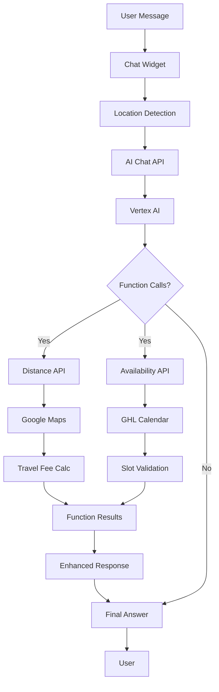

# AI Receptionist System Documentation

## Overview

The AI Receptionist is a comprehensive customer service automation system that provides intelligent, context-aware responses to customer inquiries. It combines Google Cloud Vertex AI with real-time data integration to deliver personalized service experiences.

## Key Features

### 🤖 Intelligent Conversation
- **Context-aware responses** based on page location and user intent
- **Style guide enforcement** for consistent, professional communication
- **Proactive engagement** with page-specific welcome messages
- **Conversation history** for context continuity

### 📍 Location Intelligence
- **Automatic geolocation** detection via browser API
- **ZIP code reverse geocoding** for accurate distance calculations
- **Real-time travel fee computation** using Google Maps API
- **Service area validation** (within 50-mile radius)

### 📅 Calendar Integration
- **Live availability checking** via GoHighLevel calendar API
- **Real-time slot validation** for appointment requests
- **Alternative time suggestions** when requested slots are unavailable
- **Multi-service calendar support** (Standard, Extended Hours, Loan Signing)

### 🔧 Function Calling System
- **Dynamic data retrieval** through internal API calls
- **Automatic function execution** based on user intent
- **Error handling and fallback responses**
- **Multi-function coordination** for complex queries

## Architecture

### System Flow



### Components

#### 1. Chat Widget (`components/ai/AIChatWidget.tsx`)
- **Location Context Capture**: Automatically detects user location
- **Intent Recognition**: Identifies scheduling and location-related queries
- **Proactive Engagement**: Context-specific welcome messages
- **Mobile Optimization**: Responsive design for all devices

#### 2. AI Chat API (`app/api/ai/chat/route.ts`)
- **Context Processing**: Enhances user messages with location and page context
- **Function Coordination**: Manages AI function calls and responses
- **Error Handling**: Graceful degradation for service failures

#### 3. Vertex AI Service (`lib/vertex.ts`)
- **Function Tool Definitions**: Declares available functions to AI
- **Streaming Processing**: Handles real-time response generation
- **Style Guide Enforcement**: Ensures consistent response formatting

#### 4. Helper APIs
- **Distance API** (`/api/_ai/get-distance`): Calculates travel distance and fees
- **Availability API** (`/api/_ai/get-availability`): Checks calendar availability

## Configuration

### Environment Variables

```env
# Vertex AI Configuration
VERTEX_CHAT_PROMPT_ID=projects/your-project/locations/us-central1/promptTemplates/123
VERTEX_RAG_CORPUS=projects/your-project/locations/us-central1/ragCorpora/456
VERTEX_MODEL_ID=gemini-2.5-flash
GOOGLE_PROJECT_ID=your-project-id
GOOGLE_REGION=us-central1

# Service Account Authentication
GOOGLE_SERVICE_ACCOUNT_JSON={"type":"service_account",...}

# Google Maps API
GOOGLE_MAPS_API_KEY=your-maps-api-key

# GoHighLevel Integration
GHL_API_KEY=your-ghl-api-key
GHL_LOCATION_ID=your-location-id
```

### Calendar Configuration

```typescript
// Calendar ID mapping for different services
const CALENDAR_IDS = {
  'STANDARD_NOTARY': 'calendar-id-1',
  'EXTENDED_HOURS': 'calendar-id-2',
  'LOAN_SIGNING': 'calendar-id-3'
};
```

## Usage Examples

### Basic Pricing Query
```
User: "How much for a notary?"
AI: "Our standard mobile notary service is $75, which includes up to 3 documents and travel within 20 miles. Would you like to book an appointment or get a personalized quote?"
```

### Location-Specific Query
```
User: "Can you come to 77008?"
AI: "Yes! I can service 77008, which is 15 miles from our location with no additional travel fee. Our standard mobile service is $75. Would you like to check availability or book now?"
```

### Scheduling Query
```
User: "Are you available tomorrow at 3pm?"
AI: "Let me check availability for tomorrow at 3:00 PM... Yes, I have that slot available! Our standard service is $75. Would you like to book this appointment?"
```

### Complex Query (Distance + Availability)
```
User: "Can you come to 77008 tomorrow at 3pm and how much will it cost?"
AI: "Perfect! I can come to 77008 tomorrow at 3:00 PM. That's 15 miles away with no travel fee, so the total would be $75 for standard mobile notary service. Shall I book this appointment for you?"
```

## Function Calling Reference

### get_distance Function

**Purpose**: Calculate travel distance and fees for a given location

**Parameters**:
- `zip` (string): ZIP code or postal code
- `address` (string): Full street address
- `serviceType` (string): Type of service (affects calendar selection)

**Returns**:
```json
{
  "success": true,
  "miles": 15.5,
  "travelFee": 0,
  "duration": 25,
  "withinServiceArea": true
}
```

### get_availability Function

**Purpose**: Check calendar availability for a specific datetime

**Parameters**:
- `datetime` (string): ISO datetime string
- `serviceType` (string): Type of service for calendar selection

**Returns**:
```json
{
  "success": true,
  "available": true,
  "requestedTime": "2025-01-17T15:00:00.000Z",
  "nextAvailableSlot": null
}
```

## Error Handling

### Common Error Scenarios

1. **Location Detection Failure**
   - Fallback: Prompt user for ZIP code
   - Response: "I couldn't detect your location. What's your ZIP code so I can calculate travel fees?"

2. **Calendar Service Unavailable**
   - Fallback: Provide phone number for booking
   - Response: "I'm having trouble checking availability right now. Please call (832) 617-4285 to book directly."

3. **Invalid Location**
   - Fallback: Request valid address
   - Response: "I couldn't find that location. Could you provide a valid ZIP code or address?"

4. **Outside Service Area**
   - Fallback: Explain limitations
   - Response: "That location is outside our 50-mile service area. We serve the greater Houston area within 50 miles of Texas City."

## Testing

### Running Tests

```bash
# Unit tests
npm test tests/unit/ai-distance-api.test.ts
npm test tests/unit/ai-availability-api.test.ts

# Integration tests
npm test tests/integration/ai-function-calling.test.ts

# All AI tests
npm test -- --testPathPattern="ai"
```

### Test Coverage

- **Distance API**: ZIP code validation, travel fee calculation, error handling
- **Availability API**: Datetime validation, calendar integration, slot checking
- **Function Calling**: End-to-end flow, error scenarios, context passing

## Troubleshooting

### Common Issues

#### 1. "AI service unavailable" Error
**Cause**: Vertex AI API issues or authentication problems
**Solution**: 
- Check `GOOGLE_SERVICE_ACCOUNT_JSON` configuration
- Verify project ID and region settings
- Check Google Cloud API quotas

#### 2. Distance calculations returning incorrect values
**Cause**: Google Maps API issues or incorrect base location
**Solution**:
- Verify `GOOGLE_MAPS_API_KEY` is valid
- Check base location coordinates in `lib/config/maps.ts`
- Ensure API has proper permissions

#### 3. Calendar availability always returns false
**Cause**: GoHighLevel API issues or calendar configuration
**Solution**:
- Verify `GHL_API_KEY` and `GHL_LOCATION_ID`
- Check calendar ID mappings
- Test GHL API connectivity

#### 4. Location detection not working
**Cause**: Browser permissions or HTTPS requirements
**Solution**:
- Ensure site is served over HTTPS
- Check browser geolocation permissions
- Implement fallback ZIP code prompt

### Debug Tools

#### Enable Verbose Logging
```typescript
// In lib/vertex.ts
const DEBUG_MODE = process.env.NODE_ENV === 'development';
if (DEBUG_MODE) {
  console.log('Function call:', functionCall);
  console.log('API response:', response);
}
```

#### Test Function Calls Directly
```bash
# Test distance API
curl "http://localhost:3000/api/_ai/get-distance?zip=77008"

# Test availability API
curl "http://localhost:3000/api/_ai/get-availability?datetime=2025-01-17T15:00:00.000Z"
```

## Maintenance

### Regular Tasks

1. **Monitor API Usage**
   - Google Cloud Vertex AI quotas
   - Google Maps API usage
   - GoHighLevel API limits

2. **Update RAG Corpus**
   - Add new service information
   - Update pricing data
   - Refresh policy documents

3. **Review Response Quality**
   - Check conversation logs
   - Update style guide as needed
   - Refine function call parameters

### Performance Optimization

1. **Caching Strategy**
   - Cache distance calculations in Redis
   - Store frequently accessed calendar data
   - Implement response caching for common queries

2. **Rate Limiting**
   - Implement per-user rate limits
   - Add API call throttling
   - Monitor and alert on unusual usage

## Security Considerations

### Data Privacy
- Location data is not permanently stored
- Conversation logs are anonymized
- API keys are properly secured

### API Security
- Internal APIs use authentication
- Rate limiting prevents abuse
- Input validation on all endpoints

### Error Information
- Avoid exposing internal errors to users
- Log detailed errors for debugging
- Provide helpful but generic error messages

## Future Enhancements

### Planned Features
1. **Booking Integration**: Direct appointment booking through chat
2. **Payment Processing**: Quote generation with payment links
3. **Document Upload**: File handling for notarization prep
4. **Multi-language Support**: Spanish language support
5. **Voice Integration**: Voice-to-text and text-to-speech

### Performance Improvements
1. **Edge Caching**: CDN-based response caching
2. **Streaming Responses**: Real-time response generation
3. **Predictive Loading**: Pre-load common responses
4. **Mobile Optimization**: PWA features for mobile users

---

## Support

For technical issues or questions:
- **Email**: support@houstonmobilenotarypros.com
- **Phone**: (832) 617-4285
- **Documentation**: This file and `/docs` directory
- **Issues**: GitHub Issues for bug reports 